# **Sprawozdanie z labolatorium nr1**

## 1. Zainstaluj klienta Git i obsługę kluczy SSH
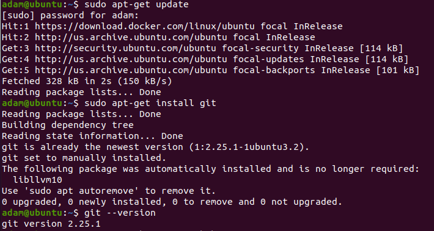

 Polecenia do wykonania:
	$ sudo apt-get-install git
	$ git --version
    
## 2. Sklonuj repozytorium https://github.com/InzynieriaOprogramowaniaAGH/MDO2022 za pomocą HTTPS
 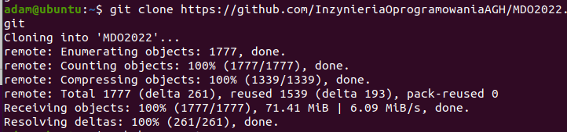
 
 Polecenia do wykonania:
 	$ git clone https://github.com/InzynieriaOprogramowaniaAGH/MDO2022
    
## 3. Upewnij się w kwestii dostępu do repozytorium jako uczestnik i sklonuj je za pomocą utworzonego klucza SSH

### - Utwórz dwa klucze SSH, inne niż RSA, w tym co najmniej jeden zabezpieczony hasłem
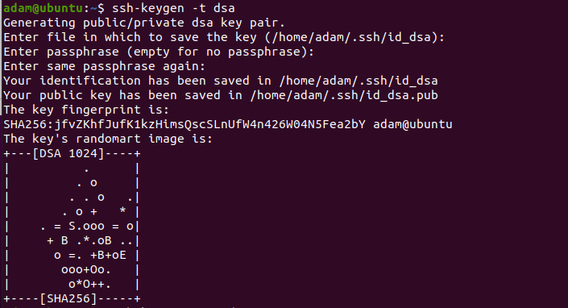
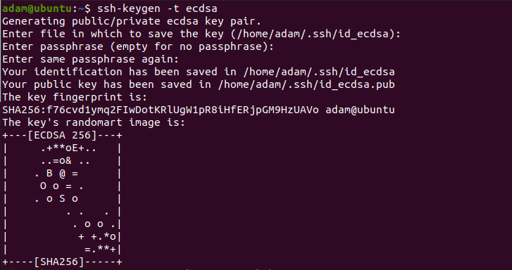
 
 Do utworzenia kluczy ssh innych niz rsa:
 	$ ssh-keygen -t dsa
 	$ ssh-keygen -t ecdsa
 Po wpisaniu komendy jesteśmy proszeni o podanie, gdzie ma znajdować się wygenerowany klucz, jeśli nie podamy ścieżki, zostanie wybrana domyślna, podana w nawiasie. Opcjonalnie możemy podać hasło	
        
### - Skonfiguruj klucz SSH jako metodę dostępu
        
W celu konfiguracji kluczy SSH dla danego konta należy udać się pod adres **https://github.com/settings/keys**.

Po kliknięciu **New SSH Key**:
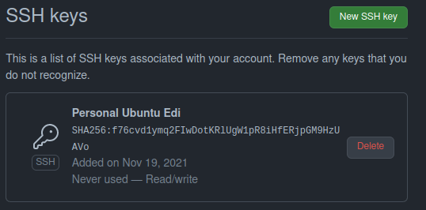

### - Sklonuj repozytorium z wykorzystaniem protokołu SSH
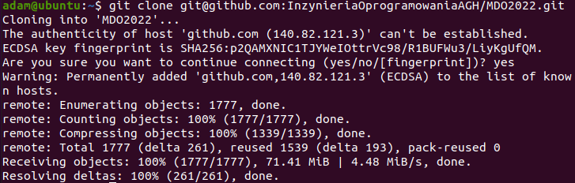

 Aby sklonowac repo z pmoca ssh postepujemy podobnie jak w kroku drugim:
 	$ git clone git@github.com:InzynieriaOprogramowaniaAGH/MDO2022

## 4. Przełącz się na gałąź swojej grupy
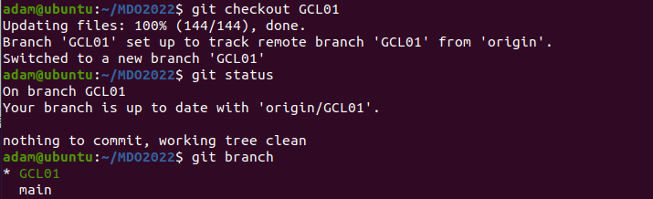
    
 Do przeczania sie pomiedzy galeziami uzywamy:
  	$ git checkout GCL01 -> gdzie 'GCL01'= nazwa galezi
  	
## 5. Utwórz gałąź o nazwie "inicjały & nr indeksu" np. KD232144
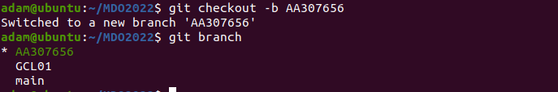

 Aby utworzy brancha i od razu do niego sie przeniesc:
 	$ git checkout -b AA307656 -> gdzie 'AA*' to nazwa tworzeonej  galezi
    
## 6. Rozpocznij pracę na nowej gałęzi

###    - W katalogu właściwym dla grupy utwórz nowy katalog, także o nazwie "inicjały & nr indeksu" np. KD232144
###    -  W nowym katalogu dodaj plik ze sprawozdaniem
###    -  Dodaj zrzuty ekranu
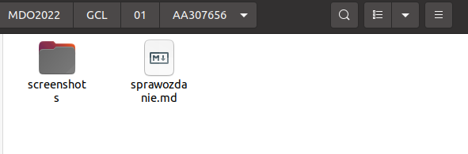
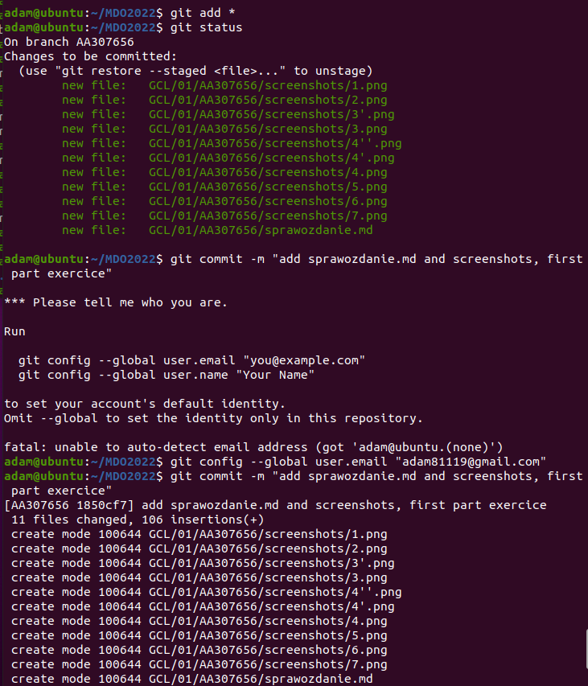

 Do stworzenia commita potrzebujemy:
 	Dodac dla gita wszystkie zmiany
 	$ git add *
 	Dodac jako commit wraz z wiadomoscia oznajmiajaca co zamierzamy zmieniac
 	$ git commit -m "add sprawozdanie.md and screenshots, first part exercice"

###    -  Wyślij zmiany do zdalnego źródła
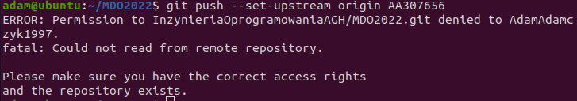

 Aby wyslac commit na zdalne repo uzywamy:
 	$ git push
 	
 Z uwagi na nie posiadanie jeszcze uprawnien do commitowania na repo gdyz nie bylo mnie na ostatnich zajeciach nie udalo sie wykonac tego kroku.

###    -  Spróbuj wciągnąć swoją gałąź do gałęzi grupowej
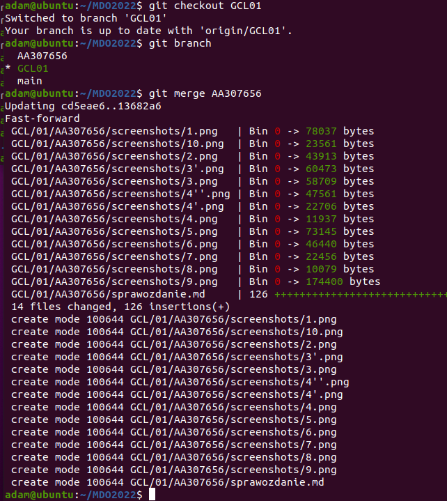

 Do wciaf=gniecia galezi:
	$ git merge 'nazwa_brancha'
	
###    -  Zaktualizuj sprawozdanie i zrzuty o ten krok i wyślij aktualizację do zdalnego źródła (na swojej gałęzi)

###    -  Oznacz tagiem ostatni commit i wypchnij go na zdalną gałąź

###    -  Ustal hook, który będzie sprawdzał, czy wiadomość z commitem zawiera nazwę przedmiotu
###    -  W jaki sposób stworzyć hook, który będzie ustawiał prefiks wiadomości commitu tak, by miał nazwę przedmiotu?

## 7. Wystaw Pull Request do gałęzi grupowej
    
## Wylistowana hisstoria polecen:
Listing history:
  384  git --version
  385  sudo apt git update
  386  git update
  387  git --help
  388  apt update
  389  sudo apt update
  390  sudo apt upgrade
  391  ~
  392  cd ~
  393  ls
  394  ls -a
  395  git --version
  396  sudo apt-get update
  397  sudo apt-get install git
  398  git --version
  399  git clone https://github.com/InzynieriaOprogramowaniaAGH/MDO2022.git
  400  ssh-keygen -t rsa
  401  ssh-copy-id adam@ubuntu
  402  ssh-keygen -t dsa
  403  ssh-keygen -t ecdsa
  404  git ls-remote https://github.com/InzynieriaOprogramowaniaAGH/MDO2022.git
  405  git remote -v
  406  git remote https://github.com/InzynieriaOprogramowaniaAGH/MDO2022.git
  407  ssh-add ~/.ssh/id_dsa
  408  ~/.ssh/id_dsa
  409  sudo ~/.ssh/id_dsa
  410  ssh-copy-id
  411  sudo ~/.ssh/id_ecdsa
  412  ssh-add ~/.ssh/id_ecdsa
  413  git clone git@github.com:InzynieriaOprogramowaniaAGH/MDO2022.git
  414  git checkout GCL01
  415  ls
  416  cd MDO2022
  417  git checkout GCL01
  418  git status
  419  git branch
  420  git checkout -b AA307656
  421  git branch
  422  history
       

