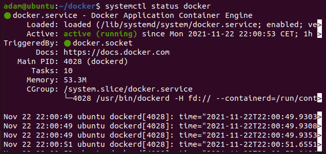
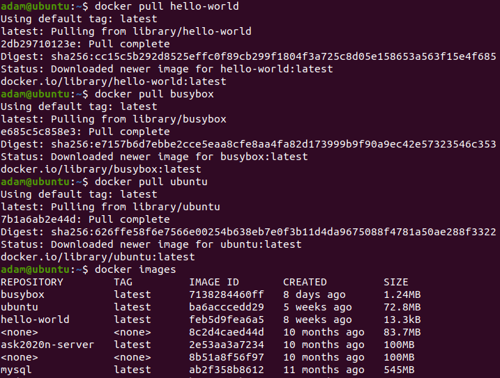
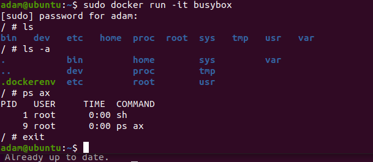
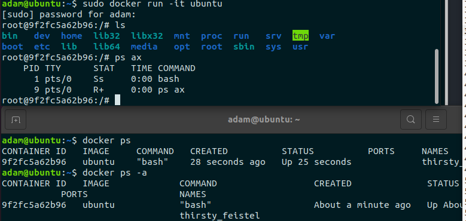
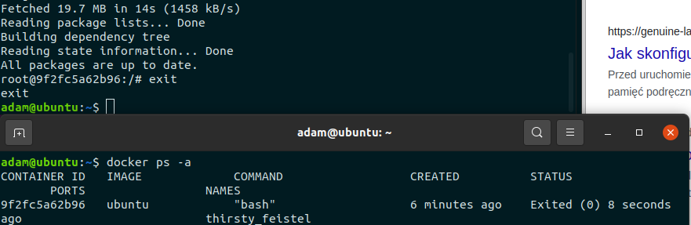
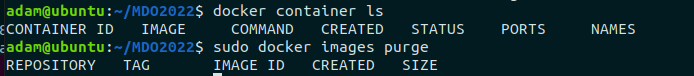
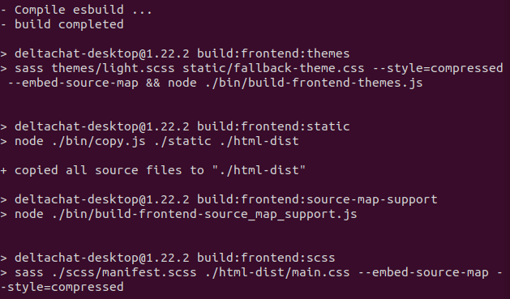
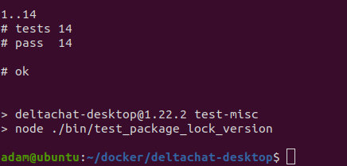
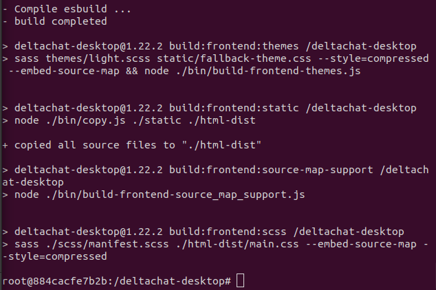
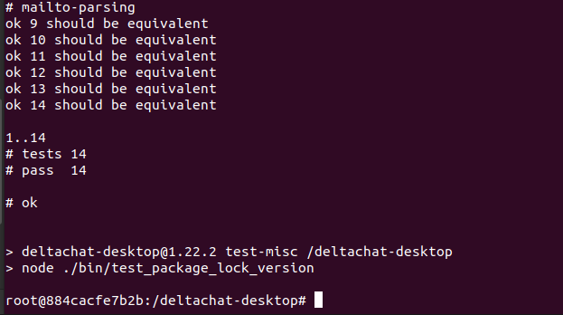

# **Sprawozdanie z LAB2**

	Wprowadzenie do kontenerów

# Zestawienie środowiska

## 1. Zainstaluj Docker w systemie linuksowym

	 $ sudo apt-get update

	 $ sudo apt-get install \
	    ca-certificates \
	    curl \
	    gnupg \
	    lsb-release
	 $  curl -fsSL https://download.docker.com/linux/ubuntu/gpg | sudo gpg --dearmor -o /usr/share/keyrings/docker-archive-keyring.gpg
	 $ sudo apt-get install docker-ce docker-ce-cli containerd.io
	 $ sudo apt docker --version
	apt 2.0.6 (amd64)
	 $ sudo chmod 666 /var/run/docker.sock // aby uzyskać dostęp dla wielu funkcji dockera
	 $ sudo systemctl start docker //aby uruchomić docker demon

## 2. Zarejestruj się w Docker Hub i zapoznaj z sugerowanymi obrazami
## 3. Pobierz hello-world, busybox, ubuntu lub fedorę, mysql

	Aby pobrac images od docker wystarczy:
	$ docker pull 'nazwa'

## 4. Uruchom busybox
        Pokaż efekt uruchomienia kontenera
        Podłącz się do kontenera interaktywnie i wywołaj numer wersji
    	 $ sudo docker run -it busybox

        
## 5. Uruchom "system w kontenerze"
        Zaprezentuj PID1 w kontenerze i procesy dockera na hoście
  	 # ps ax
  	 $ docker ps

        Zaktualizuj pakiety
   	 # apt update
   	 # exit
        Wyjdź
  
       
## 6. Pokaż uruchomione ( != "działające" ) kontenery, wyczyść je.
    Wyczyść obrazy
    $ docker container ls
    $ sudo docker images purge

Na moje nieszczęście maszyna wirtualna mi się wysypała z powodu zbyt malego miejsca przydzielonego na dysku. Dawno nie commitowałem. Byłem już po uruchamianiu aplikacji w kontenerze ale musiałem stawiać środowisko od nowa.

# Budowanie programu

## 1. Znajdź projekt umożliwiający łatwe wywołanie testów jednostkowych
	Wybrałem aplikacje deltachat.
	$ git clone https://github.com/deltachat/deltachat-desktop.git

## 2. Przeprowadź budowę/konfigurację środowiska
	$ cd deltachat-desktop
	$ sudo apt install nodejs
	$ node -v
	$ sudo apt install npm
	$ npm install
	
	Z powodu błędów byłem zmuszony sobie poradzić:
	$ curl --proto '=https' --tlsv1.2 -sSf https://sh.rustup.rs | sh
	$ source $HOME/.cargo/env
	curl -fsSL https://deb.nodesource.com/setup_current.x | sudo -E bash -
	$ sudo apt-get install -y nodejs
	$ npm install
	$ npm audit fix
	$ npm run build
	
	
## 3. Uruchom testy

	$ npm run test

## 4. Ponów ten proces w kontenerze
        Wybierz i uruchom platformę
     	 $ sudo docker run -it ubuntu
        Zaopatrz ją w odpowiednie oprogramowanie wstępne
     	 # apt update
     	 # apt install git
        Sklonuj aplikację
      	 # git clone https://github.com/deltachat/deltachat-desktop.git
        Skonfiguruj środowisko i uruchom build
     	 # apt install nodejs
     	 - > Geaographic area: 8
     	 -> Time zone: 60
     	 Aplikacja wymaga od nas nowszego nodejs niż mamy dostępny więc:
     	 # apt install curl
     	 # apt install sudo
     	 # curl -sL https://deb.nodesource.com/setup_14.x | sudo -E bash -
     	 # sudo apt-get install -y nodejs
     	 # sudo apt install npm
     	 # npm intstall
     	 # npm audit fix
     	 # npm run build

  	 
        Uruchom testy
    	 # npm run test

## 5. Stwórz Dockerfile, który ma to osiągnąć
        Na bazie platformowego obrazu...
        ...doinstaluj wymagania wstępne...
        ...sklonuj repozytorium...
        ...zbuduj kod
## 6. Zaprezentuj Dockerfile i jego zbudowanie
## 7. Na bazie obrazu utworzonego poprzednim dockerfilem stwórz kolejny, który będzie uruchamiał testy

# Runda bonusowa: kompozycja

    Zdefiniuj kompozycję, która stworzy dwie usługi
        Pierwszą na bazie dockerfile'a budującego
        Drugą na bazie pierwszej
    Wdróż :)

