# Część pierwsza - czas do końća weekendu

## 1 . Łączność i woluminy na podstawie "złych" praktyk

   - Pobierz obraz Ubuntu
   - Podłącz wolumin do kontenera
   
    $ docker volume create pendrive
    $ docker volume inspect pendrive

        "CreatedAt": "2021-12-04T15:51:48+01:00",
        "Driver": "local",
        "Labels": {},
        "Mountpoint": "/var/lib/docker/volumes/pendrive/_data",
        "Name": "pendrive",
        "Options": {},
        "Scope": "local"
    

    $ sudo docker run -iteractive --tty --mount source=pendrive,destination=/store ubuntu

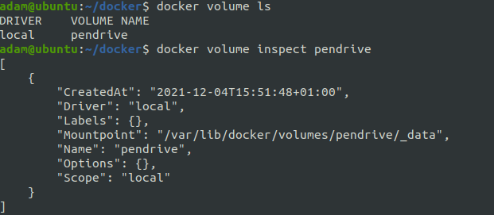
  
   - Skopiuj plik do katalogu woluminu, pokaż w kontenerze
    $ sudo cp sprawozdanie /var/lib/docker/volumes/pendrive/_data

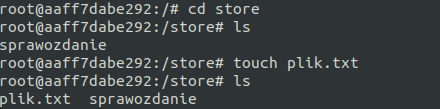	
    
   - Utwórz plik w kontenerze, na obszarze woluminu, pokaż na hoście
   
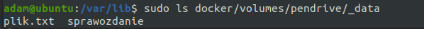	

## 2 . "Kiepski pomysł": SSH

   - Uruchom i wyeksponuj wybrany port w kontenerze
   
    $ sudo docker run --interactive --tty --mount source=pendrive,destination=/store --publish 2345:22 ubuntu
  
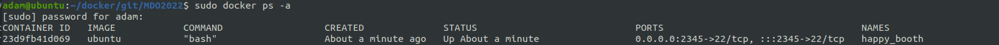
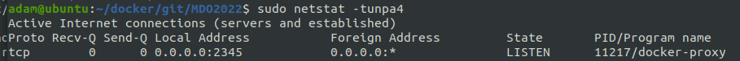

    $ sudo docker ps -a
    $ sudo docker container inspect "id"

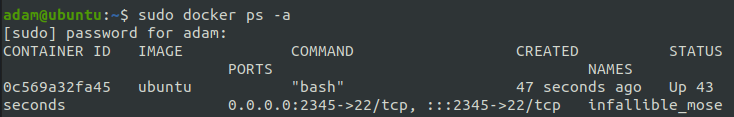

   - Zainstaluj w kontenerze serwer ssh
   
   	# apt update
   	# apt install ssh
   	# apt-get -y install openssh-server
   	# apt-get install net-tools
   	# mkdir /run/sshd
	# /usr/sbin/sshd -D &

   - zmień port na wybrany port >1024
   
   $ sudo docker inspect 23d9fb41d069
   
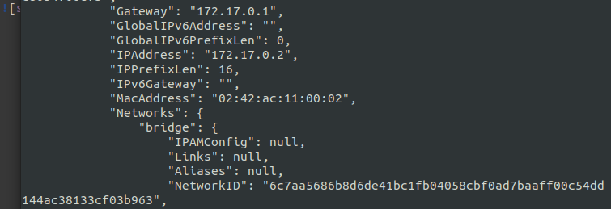
   

   - zezwól na logowanie root
   - umieść klucz publiczny w woluminie, skopiuj go do pliku zaufanych w kontenerze
    # ls -la /store
    # cp /store/id_ed25519.pub /root/.ssh/authorized_keys
      
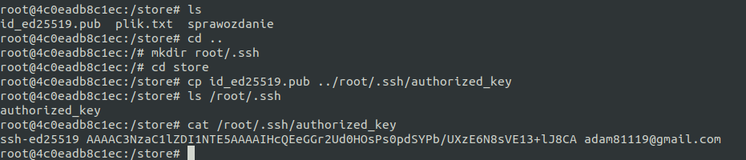
 
   - odnajdź adres IP kontenera w wewnętrznej sieci
   - uruchom usługę, połącz się z kontenerem
   
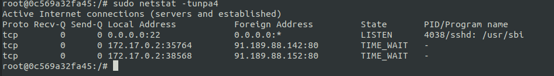
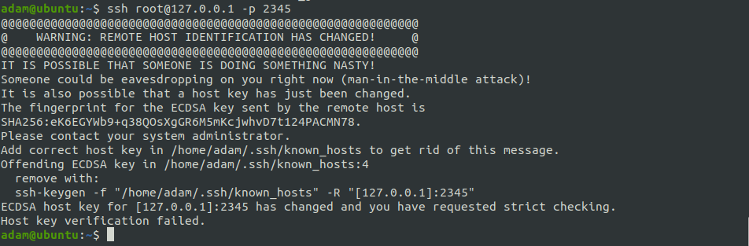
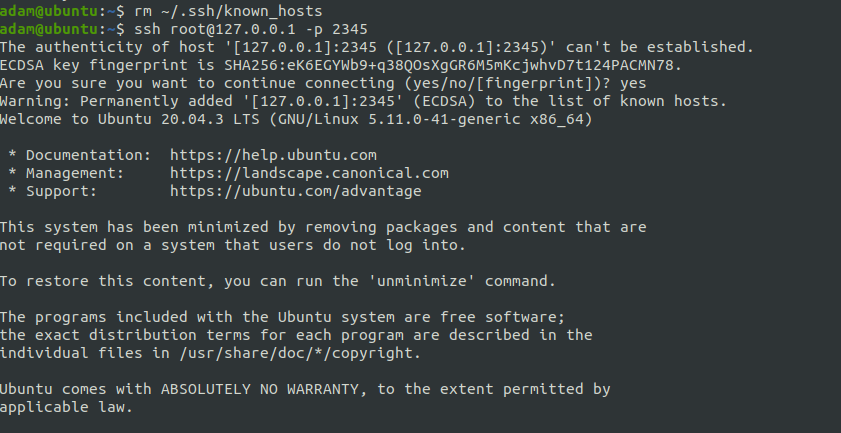

Skonteneryzowany Jenkins stosujący Dockera
Przygotowanie

    Upewnij się, że Dockerfiles i Docker Compose z poprzednich zajęć są w repozytorium
    Zapoznaj się z instrukcją https://www.jenkins.io/doc/book/installing/docker/
        Uruchom obraz Dockera który eksponuje środowisko zagnieżdżone
        Przygotuj obraz blueocean na podstawie obrazu jenkinsa
        Uruchom blueocean
        Zaloguj się i skonfiguruj Jenkins
        
    Korzystając z instrukcji na oficjalnej stronie Jenkinsa pobieramy i instalujemy jenkins docker na naszym dockerze.
    https://www.jenkins.io/doc/book/installing/docker/
    
    Następnie przy pomocy Dockerfila polecanego na stronie tworzymy jego obraz.
    
 FROM jenkins/jenkins:2.319.1-jdk11
 USER root
 RUN apt-get update && apt-get install -y lsb-release
 RUN curl -fsSLo /usr/share/keyrings/docker-archive-keyring.asc \
  https://download.docker.com/linux/debian/gpg
 RUN echo "deb [arch=$(dpkg --print-architecture) \
  signed-by=/usr/share/keyrings/docker-archive-keyring.asc] \
  https://download.docker.com/linux/debian \
  $(lsb_release -cs) stable" > /etc/apt/sources.list.d/docker.list
 RUN apt-get update && apt-get install -y docker-ce-cli
 USER jenkins
 RUN jenkins-plugin-cli --plugins "blueocean:1.25.2 docker-workflow:1.26"

   Zbudowanie obrazu:
   $ sudo docker build -t myjenkins-blueocean:1.1 . -f Dockerfile-jenkins
   Uruchomienie jenkins-blueocean:
   $ docker run \
  --name jenkins-blueocean \
  --rm \
  --detach \
  --network jenkins \
  --env DOCKER_HOST=tcp://docker:2376 \
  --env DOCKER_CERT_PATH=/certs/client \
  --env DOCKER_TLS_VERIFY=1 \
  --publish 8080:8080 \
  --publish 50000:50000 \
  --volume jenkins-data:/var/jenkins_home \
  --volume jenkins-docker-certs:/certs/client:ro \
  myjenkins-blueocean:1.1 
   
 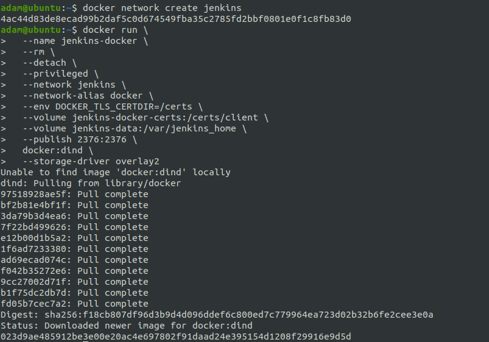
 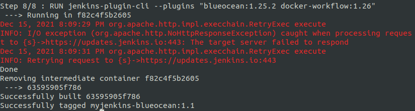
 
  Little problem:
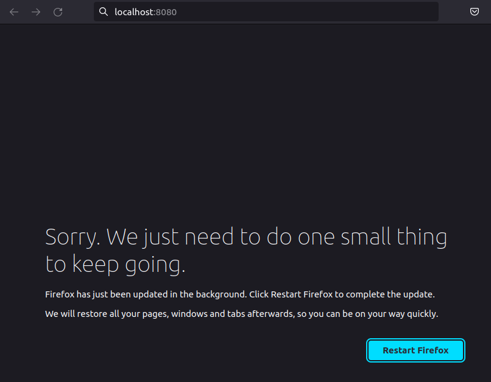

  Odblokowanie i dopracowanie Jenkinsa:
 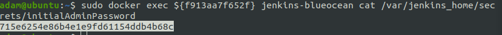
 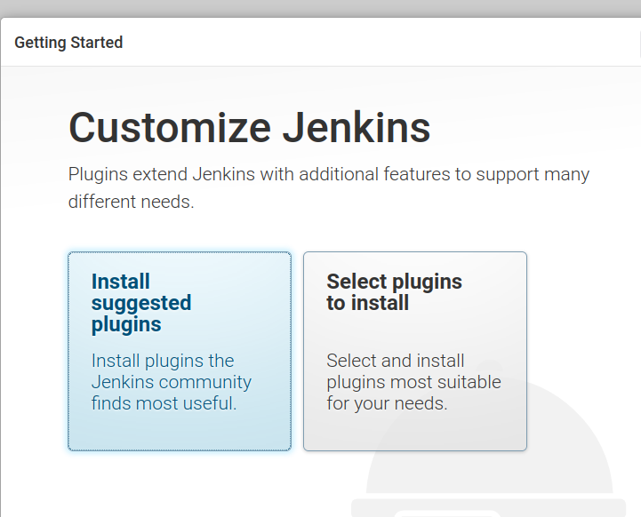
 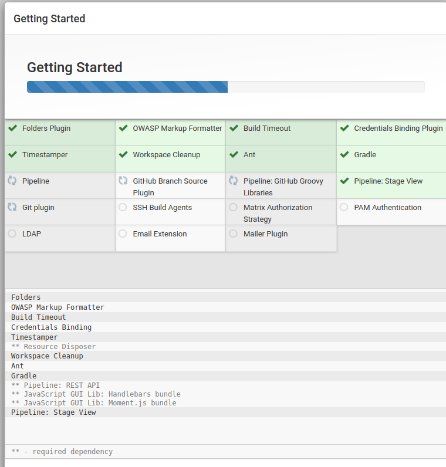
 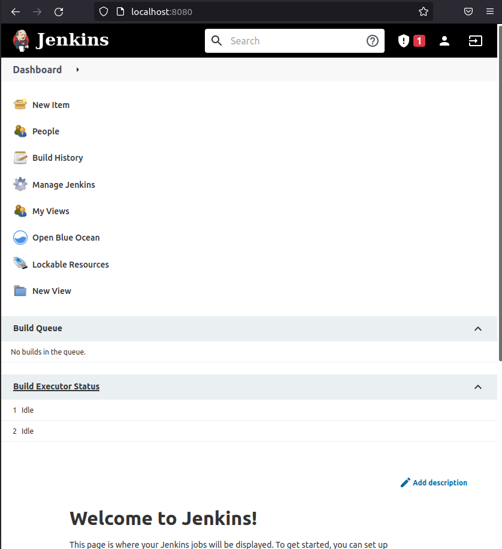
  
 
Mikro-projekt Jenkins

    Utwórz projekt, który wyświetla uname
    Utwórz projekt, który zwraca błąd, gdy... godzina jest nieparzysta
    Utwórz "prawdziwy" projekt, który:
        klonuje nasze repozytorium
        przechodzi na osobistą gałąź
        buduje obrazy z dockerfiles i/lub komponuje via docker-compose

Sprawozdanie

    Opracuj dokument z diagramami UML, opisującymi proces CI. Opisz:
        Wymagania wstępne środowiska
        Diagram aktywności, pokazujący kolejne etapy (collect, build, test, report)
        Diagram wdrożeniowy, opisujący relacje między składnikami, zasobami i artefaktami

