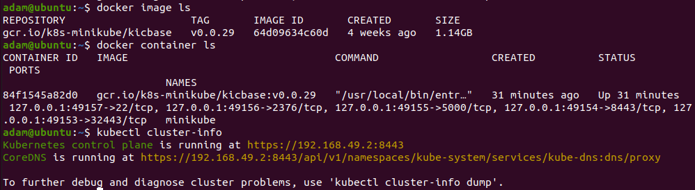

# Zajęcia 05

### Zestawienie platformy Kubernetes

* Upewnij się, że kontener jest dostępny
* Zainstaluj wymagania wstępne dla środowiska Minikube
* Zainstaluj minikube i kubectl
* Przedstaw uruchomione oprogramowanie wstępne (i usługi)
  * Platforma konteneryzacji
  * Otwarte porty
  * Stan Dockera
  
 Niestety na mojej maszynie wirtualnej zabrakło miejsca usuwanie plików nic nie dało także będę zmuszony w tygodniu postawić ją na nowo. 
 Teraz niestety nie mam na to czasu proszę wybaczyć że nie uruchomię dzisiaj minikuba.

   
   
   
   Po ponownym postawieniu środowiska udało się rozpocząć pracę nad Minikube i Kubernetesem
   $ curl -LO "https://dl.k8s.io/release/$(curl -L -s https://dl.k8s.io/release/stable.txt)/bin/linux/amd64/kubectl"
   $ sudo install -o root -g root -m 0755 kubectl /usr/local/bin/kubectl
   $ kubectl version --client
   $ minikube start
   
    
   
   
   $ kubectl get po -A
   $ minikube kubectl -- get po -A
   
      
   
### Stan Minikube
* Uruchom Minikube Dashboard
* Wyświetl działające usługi (k8s) i wdrożenia
* Wyświetl dostępne wdrożenia (stan "przed") 

   $ minikube dashboard

   

### Wdrożenie kontenera via k8s
* Wdróż przykładowy deployment "hello k8s": ```k8s.gcr.io/echoserver```
* Użyj ```kubectl run <ctr> --image=<DOCKER_ID>/ --port=<port> --labels app=ctr```
* Przekieruj porty
* Wykaż że wdrożenie nastąpiło
* W przypadku "niemożliwych" wdrożeń, opisz napotkane ograniczenia

   $ kubectl create deployment hello-minikube --image=k8s.gcr.io/echoserver:1.4
   $ kubectl expose deployment hello-minikube --type=NodePort --port=8080
   $ kubectl get services hello-minikube
   
   
   
   $ kubectl get pods
   $ kubectl get deployments
   
   
   
   
   Niestety nie udało się utworzyć serwisu prawidłowo, obraz 

### Deployment
* Utwórz plik YAML z "deploymentem" k8s
* Zestaw 4 repliki, opisz zalety i wady takiej liczby
* Zaaplikuj wdrożenie via ```kubectl apply -f plik.yml```

  Niestety ponownie źle określiłem czas wykonania a czas poświęcony i znów nie udało mi się dokończyć instrukcji. Bardzo mi przykro z tego powodu ale czas w tym miesiącu leci swoim trybe. Pozdrawiam to były naprawdę zajęcia bardzo fajnie wprowadzające w tematyke zagadnień.


* Wykaż przeprowadzony deployment
