# Zestawienie środowiska
1. Zainstaluj Docker w systemie linuksowym - screen z wersji docker na maszynie

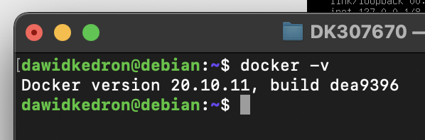

2. Zarejestruj się w Docker Hub i zapoznaj z sugerowanymi obrazami

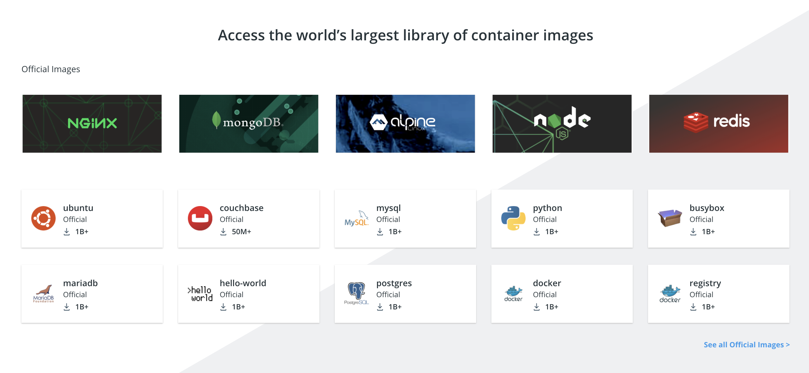

3. Pobierz hello-world, busybox, ubuntu lub fedorę, mysql

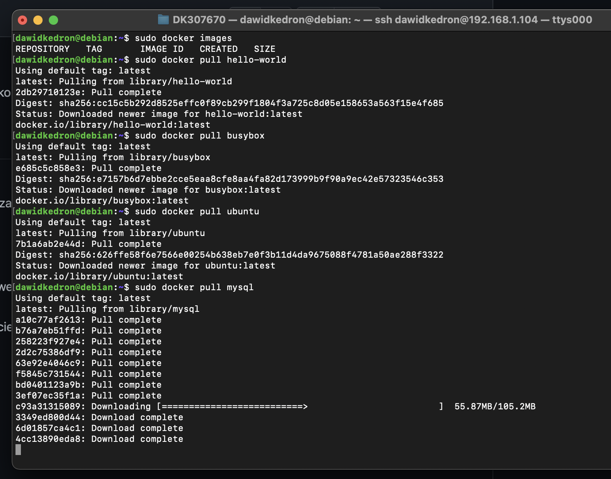

Listing pobranych obrazow (bez mysql)

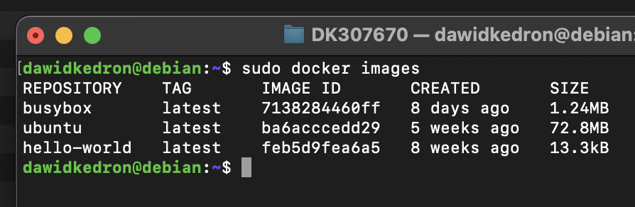

4. Uruchom busybox
   - Pokaż efekt uruchomienia kontenera - kontener od razu sie wylacza, nie wydano polecen do sh
   
   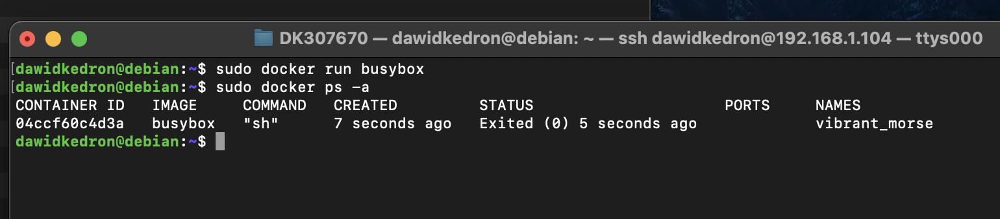
   
   - Podłącz się do kontenera interaktywnie i wywołaj numer wersji
   
   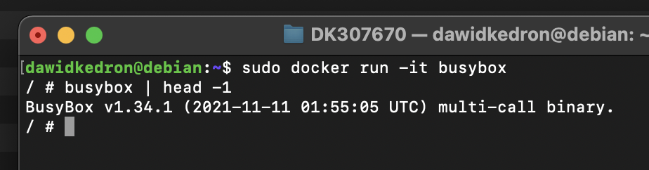
   
5. Uruchom "system w kontenerze"
   - Zaprezentuj PID1 w kontenerze i procesy dockera na hoście
   - Zaktualizuj pakiety
   - Wyjdź
   
   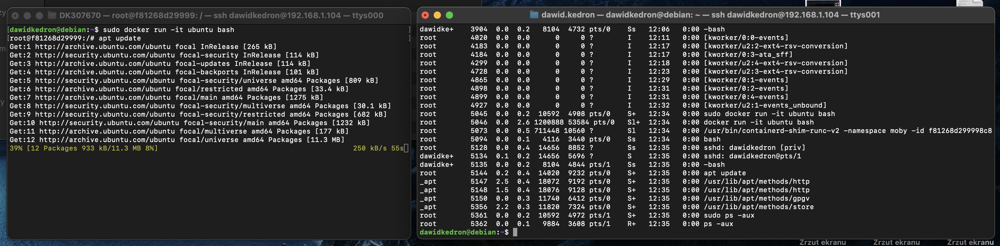
   
   Po lewej jestesmy w kontenerze, po prawej na hoscie. Polecenie ps -aux na hoscie zostalo wykonane w trakcie trwania komendy apt-get update na kontenerze.
   
6. Pokaż uruchomione ( != "działające" ) kontenery, wyczyść je.

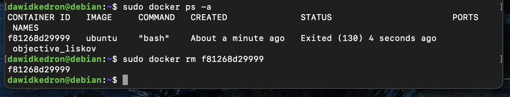

7. Wyczyść obrazy

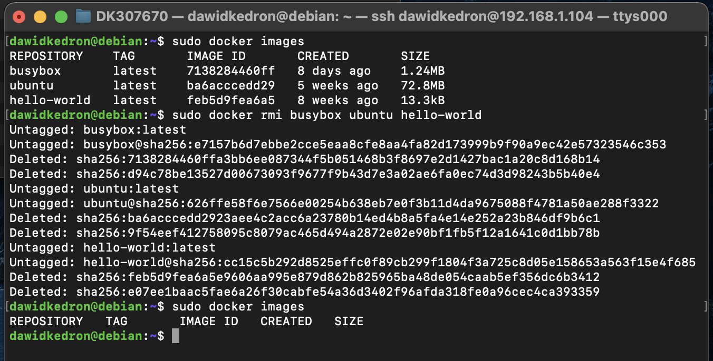

# Budowanie programu

Za przyklad wybralem aplikacje reactowa. W zasadzie sam jej szkielet, ktory mozna uzyskac za pomoca polecenia: 

```npx create-react-app my-app```

Nie jestem programista react, ale jestem swiadomy, ze mozna przyspieszyc budowanie pierwszego obrazu np.: generujac szkielet na maszynie, kopiujac do kontenera package.json i pobierajac zaleznosci. 

Jestem rowniez swiadomy, ze jest to swego rodzaju pojdzie na skroty - tak naprawde za kazdym razem budujemy ten sam szablon aplikacji i go testujemy. 
Miedzy innymi dlatego nie mozna uzywac tych dockerfilow do budowania i testowania dowolnej aplikacji z githuba po zmianach na origin:main (nalezy przebudowac Dockerfile-build).

Jesli taki byl zamysl na to cwiczenia i bedzie to potrzebne w dalszych cwiczeniach, prosze o stosowany komentarz :)

Dockerfile do budowania aplikacji i budowanie obrazu dockerowego:

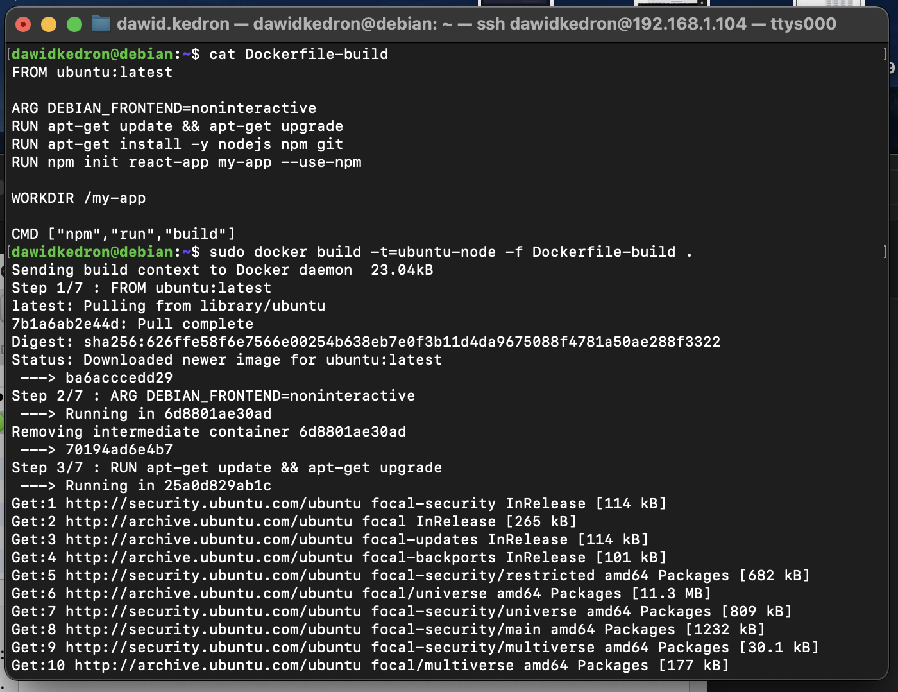

Dockerfile do testowania aplikacji i budowanie obrazu dockerowego:

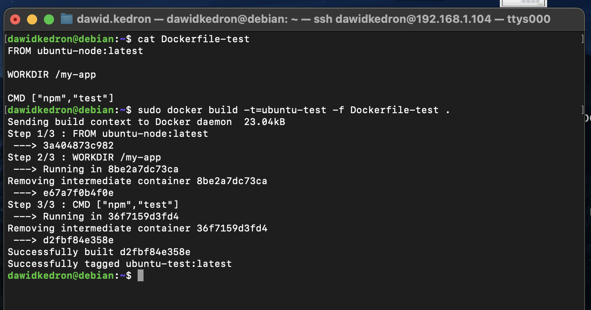

Utworzone obrazy oraz obraz bazowy:

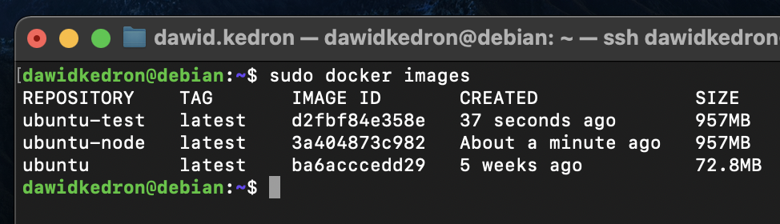

Uruchomienie obrazow dockerowych w tle i podglad tego co sie w nich stalo:

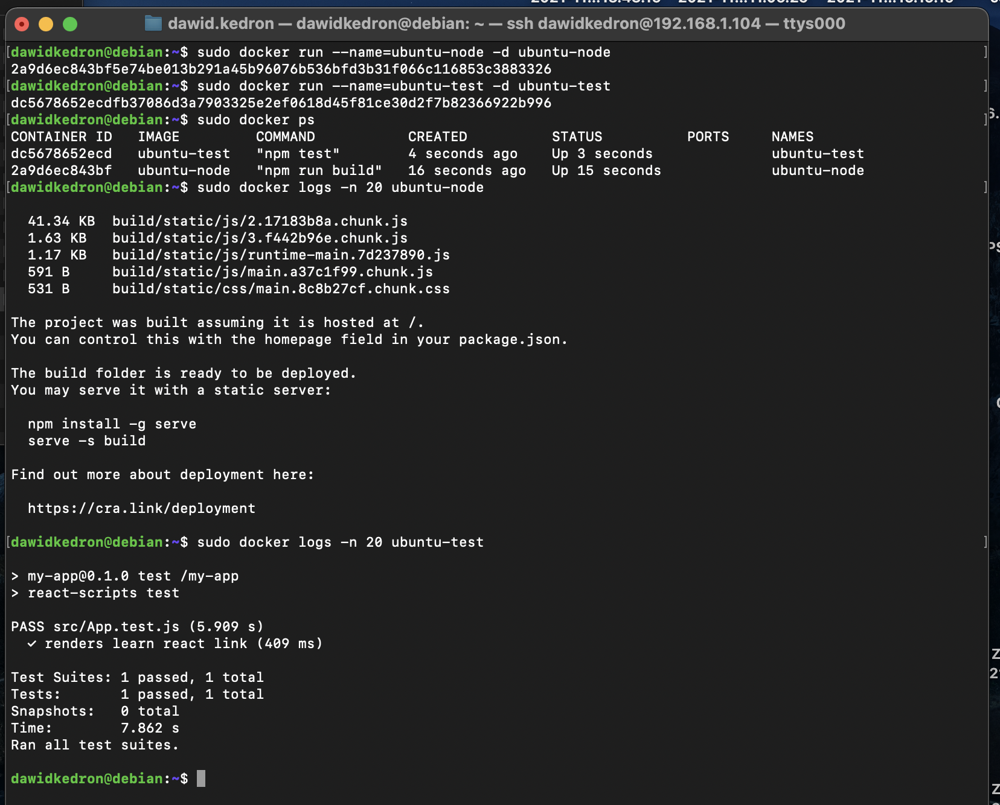

# Runda bonusowa: kompozycja

docker-compose.yml bonusowy + wywolanie go:

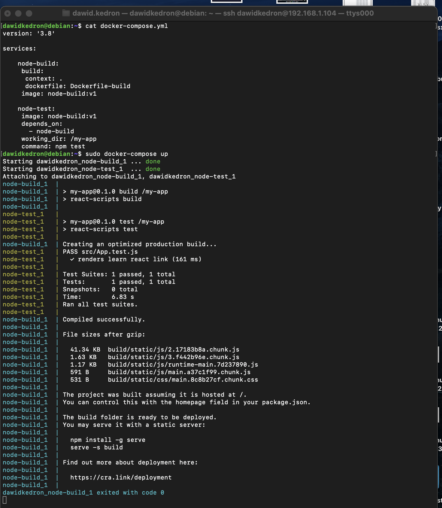
