# Zajęcia 03

#### Łączność i woluminy na podstawie złych praktyk

* Pobierz obraz Ubuntu

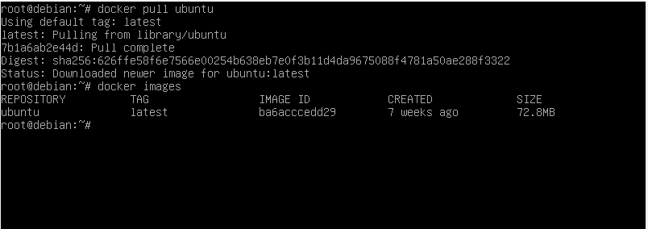

* Podłącz wolumin do kontenera
* Skopiuj plik do katalogu woluminu, pokaż w kontenerze
* Utwórz plik w kontenerze, na obszarze woluminu, pokaż na hoście

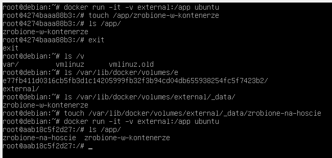

#### Kiepski pomysł: SSH
* Uruchom i wyeksponuj wybrany port w kontenerze
* Zainstaluj w kontenerze serwer ssh
* zmień port na wybrany port >1024
* zezwól na logowanie root
* umieść klucz publiczny w woluminie, skopiuj go do pliku zaufanych w kontenerze
* odnajdź adres IP kontenera w wewnętrznej sieci
* uruchom usługę, połącz się z kontenerem

Zamiast tego uruchomiono nginx. Serwer HTTP nasłuchuje w kontenerze na porcie 80, natomiast host zapytania z portu 1234 kieruje na ten port w kontenerze.

Sprawdzamy działanie poprzez polecenie curl
* dla hosta witryna dostępna jest pod adresem -> localhost:1234
* w kontenerze witryna dostępna jest pod adresem -> localhost:80

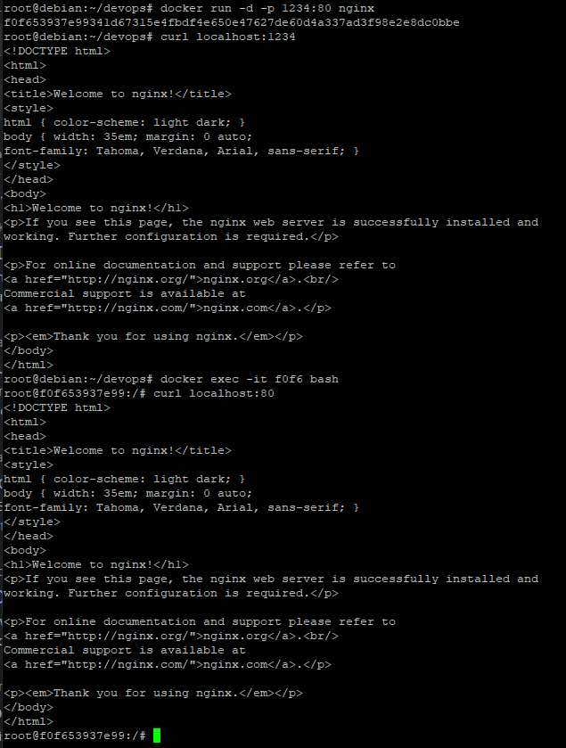

#### Skonteneryzowany Jenkins stosujący Dockera

#### Przygotowanie
* Upewnij się, że Dockerfiles i Docker Compose z poprzednich zajęć są w repozytorium

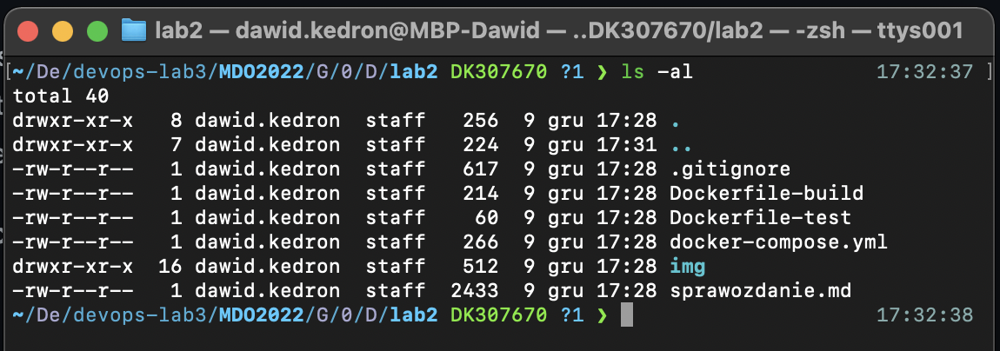

* Zapoznaj się z instrukcją https://www.jenkins.io/doc/book/installing/docker/
  * Uruchom obraz Dockera który eksponuje środowisko zagnieżdżone
  
  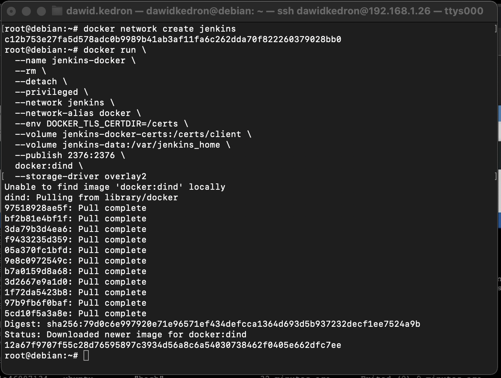
  
  * Przygotuj obraz blueocean na podstawie obrazu jenkinsa
  
  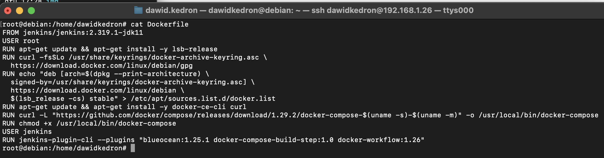
  
  * Uruchom blueocean
  
  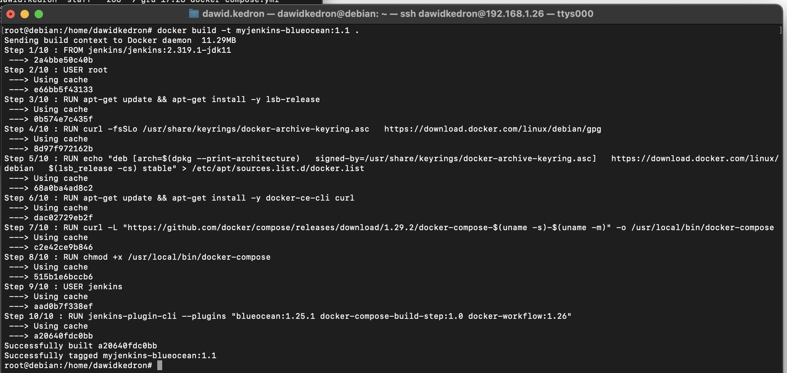
  
  
  
  * Zaloguj się i skonfiguruj Jenkins
  
  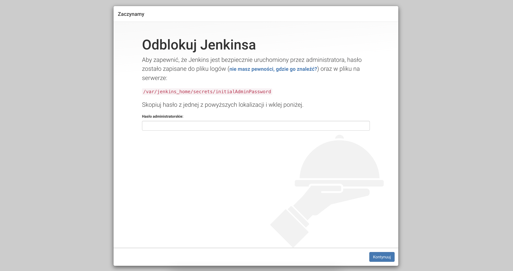
  
  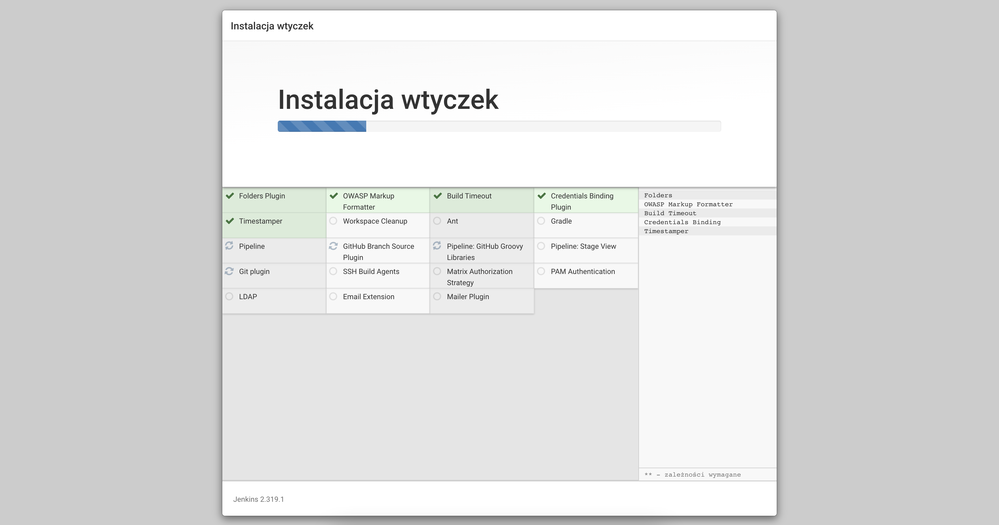
  
  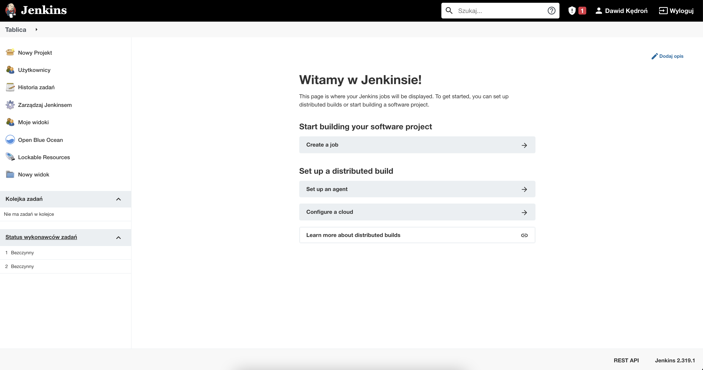
  
#### Mikro-projekt Jenkins
* Utwórz projekt, który wyświetla uname

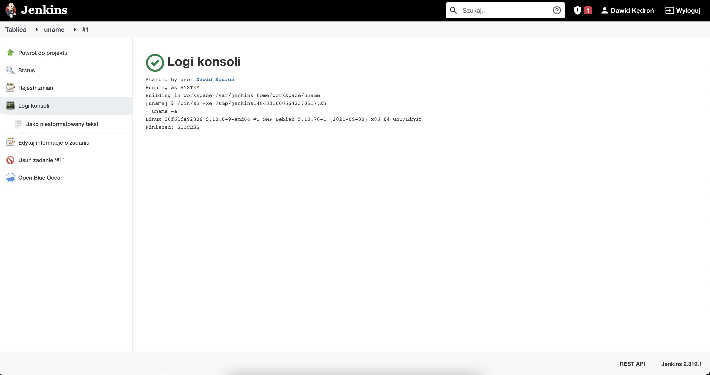

* Utwórz projekt, który zwraca błąd, gdy... godzina jest nieparzysta 

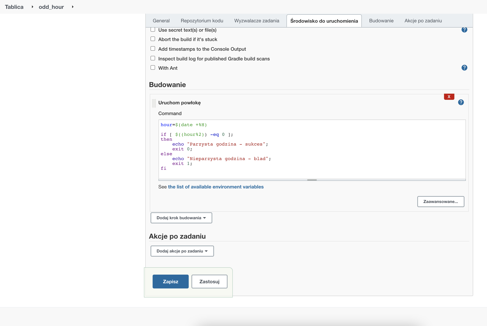

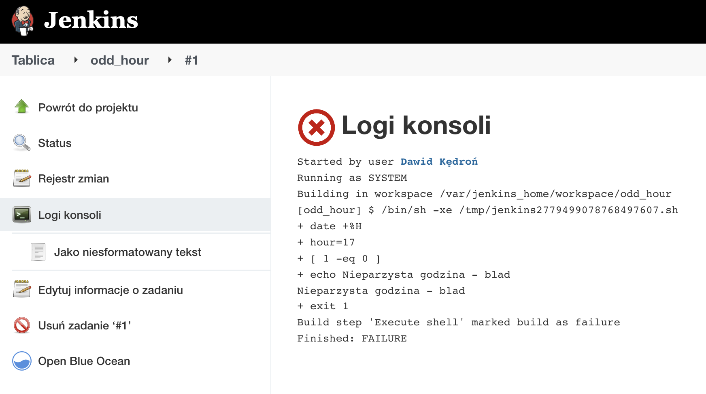

* Utwórz prawdziwy projekt, który:
  * klonuje nasze repozytorium
  * przechodzi na osobistą gałąź
  * buduje obrazy z dockerfiles i/lub komponuje via docker-compose
  
Nowy projekt typu Multi-configuration

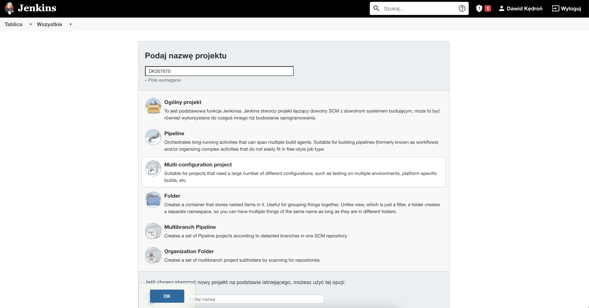

Konfiguracja projektu

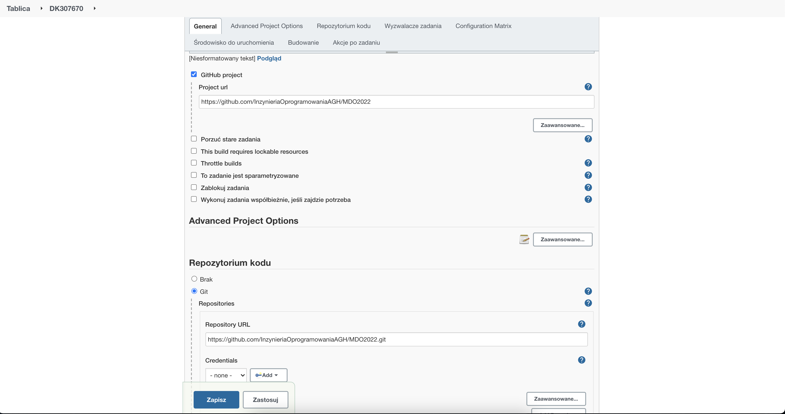
 
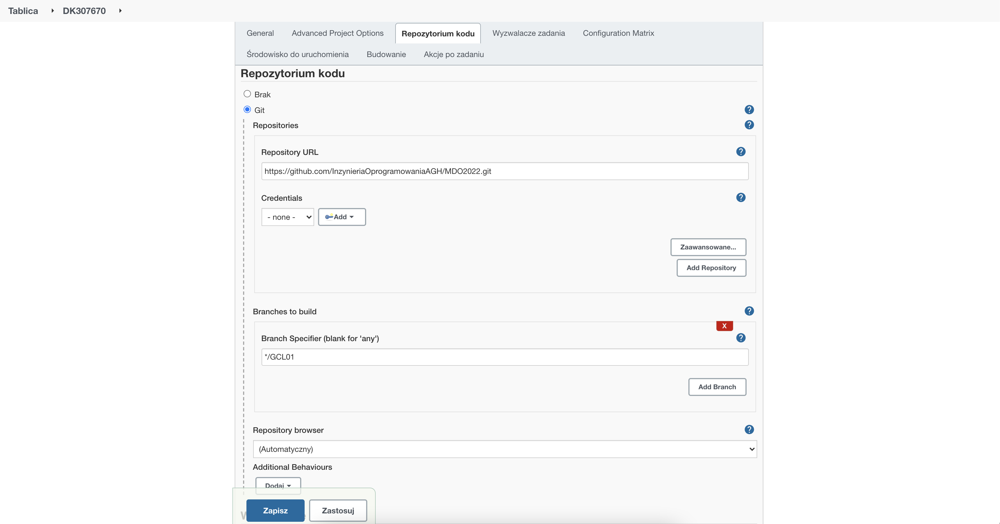

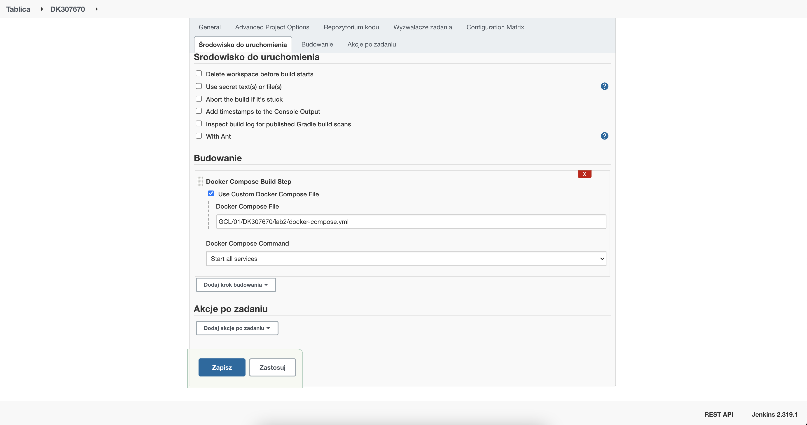 

Budowanie projektu

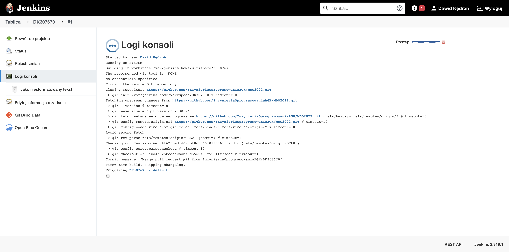

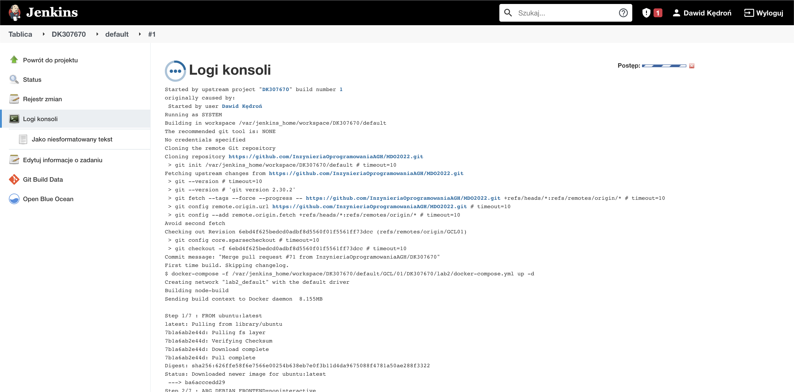

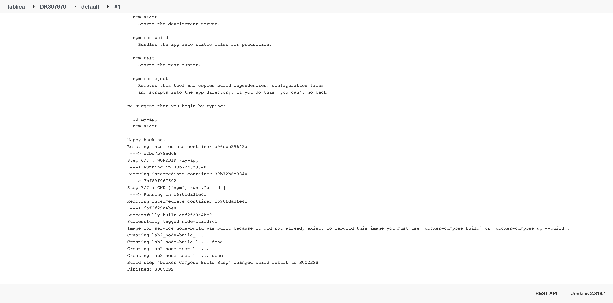

#### Sprawozdanie
* Opracuj dokument z diagramami UML, opisującymi proces CI. Opisz:
  * Wymagania wstępne środowiska
  * Diagram aktywności, pokazujący kolejne etapy (collect, build, test, report)
  * Diagram wdrożeniowy, opisujący relacje między składnikami, zasobami i artefaktami
