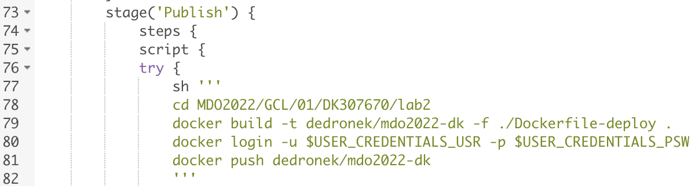
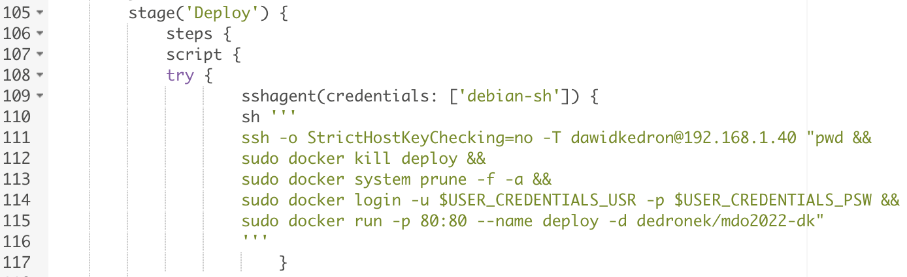
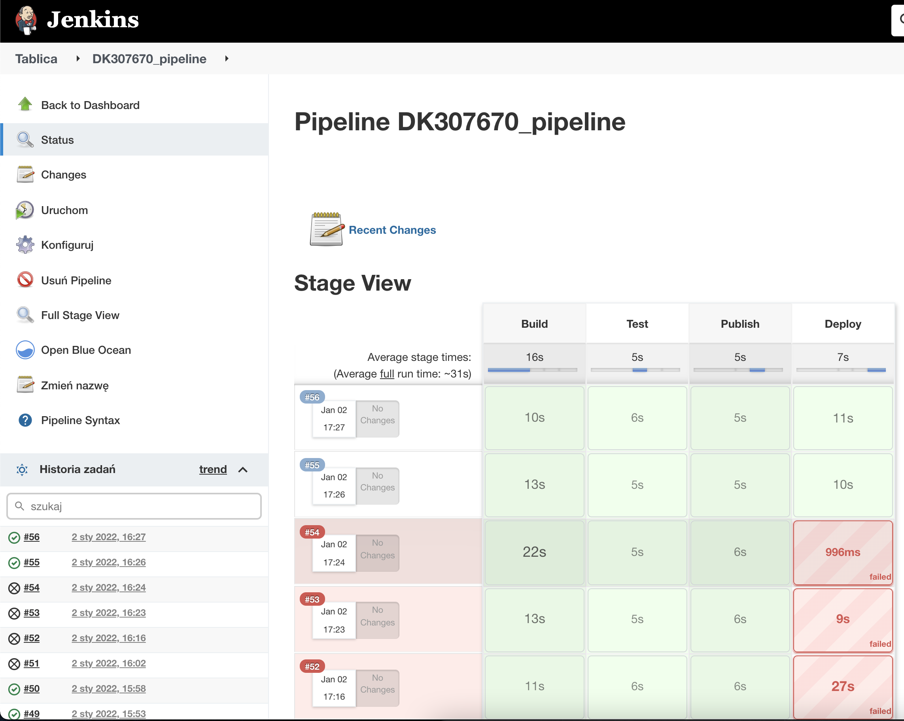
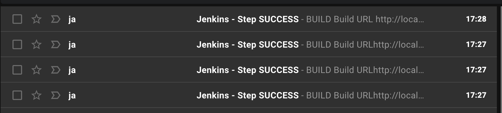
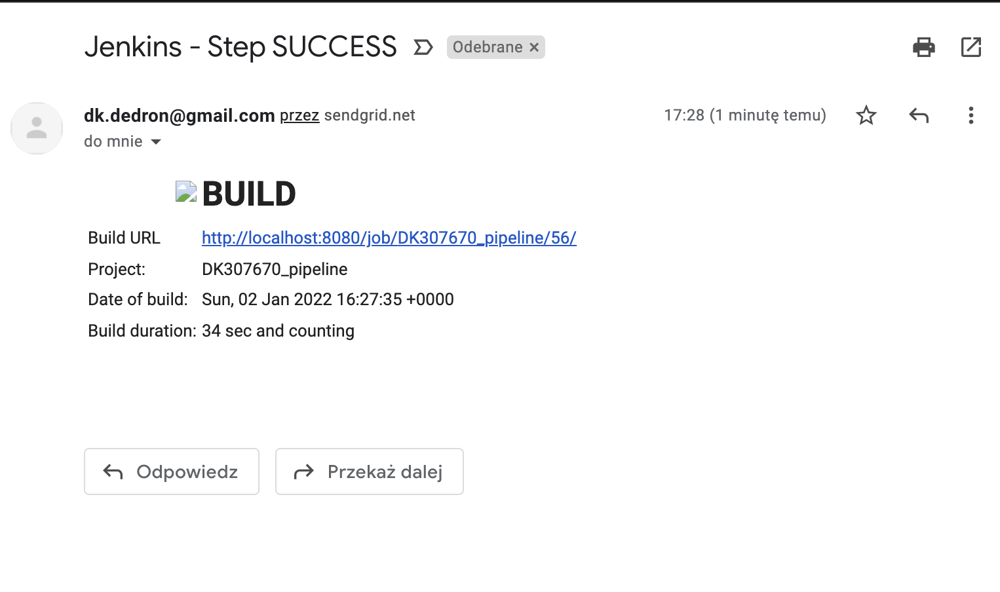
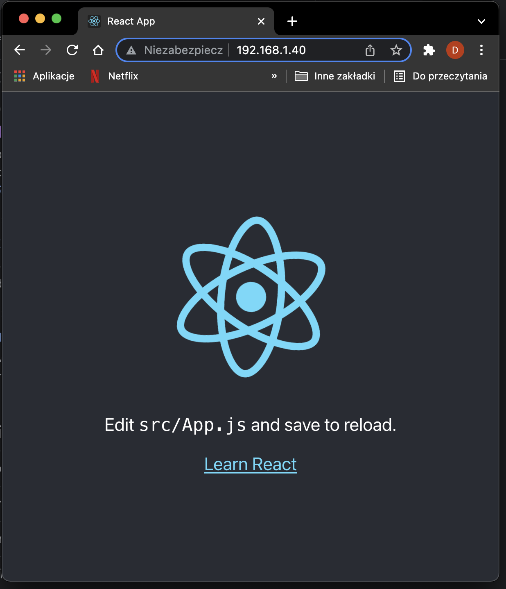

### Jenkinsfile: przebieg
https://www.jenkins.io/doc/book/pipeline/jenkinsfile/

Poczatkowe kroki to build i test.

Build - budujemy obraz z Dockerfile.
Test - budujemy obraz z Dockerfile i go testujemy.
    

Nastepne kroki do publish i deploy.

Publish - budujemy obraz z Dockerfile (wyciaganie artefaktow z obrazu 'build') oraz wrzucamy go do dockerhuba.
Deploy - ssh do maszyny zdalnej, pobranie obrazu z kroku 'publish', uruchomienie obrazu.
    

Pipeline CI/CD po poprawnym zbudowaniu

### Jenkinsfile: powiadomienia
  * Sekcja "post" dla każdego stage'a, informująca mailem o rezultacie
  
W Jenkinsfile zastosowano strukture try catch aby wiadomosci byly wysylane rowniez gdy stage zakonczy sie niepowodzeniem  

  
  
### Jenkinsfile: deploy

Zastosowana strategia zaklada wypchniecie obrazu do rejestru (dockerhub) a nastepnie w kroku deploy ssh na zdalnej maszyny, pobranie swiezego obrazu z dockerhub i uruchomienie go.

Szczegoly w Jenkinsfile. Zrzut ekranu z udanego deploya:

