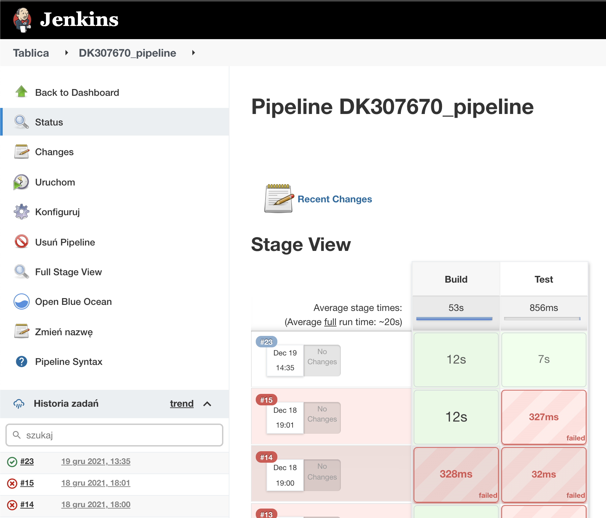
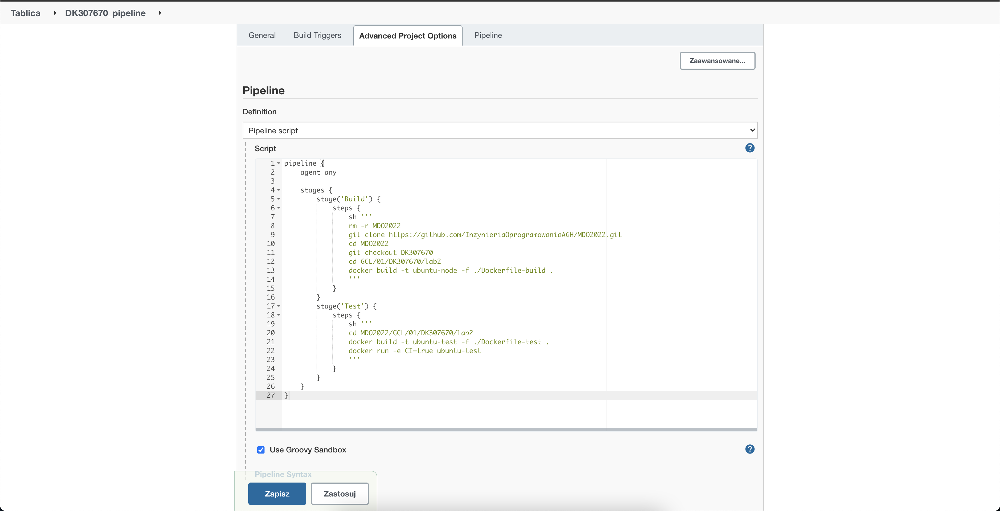

### Jenkinsfile: przebieg
https://www.jenkins.io/doc/book/pipeline/jenkinsfile/
* Przykładowe zbiory czynności w Jenkinsfile:
Jednokrokowy pipeline (Build i test), pobierający narzędzie docker-compose i uruchamiajacy docker compose up na kompozycji z poprzednich zajęć
  * build + test
    * download docker-compose
    * compose up
    
  * build
    * git pull
    * npm install
    * npm build
  * test
    * npm test
    

    
### Jenkinsfile: powiadomienia
  * Sekcja "post" dla każdego stage'a, informująca mailem o rezultacie
  
### Jenkinsfile: deploy
 * W razie sukcesu, build ma zostać wypromowany jako kandydat do wydania
 * Różne podejścia są możliwe:
   * Build i test wykonywane "na zewnątrz" i jeżeli się powiodą, odpalany docker build, który tworzy kontener 
   * Odpalane są kontenery budujący, testujący i końcowy
     * końcowy to budujący, ale z odpaloną aplikacją na końcu
     * końcowy to np. ubuntu z posłanym artefaktem z budującego