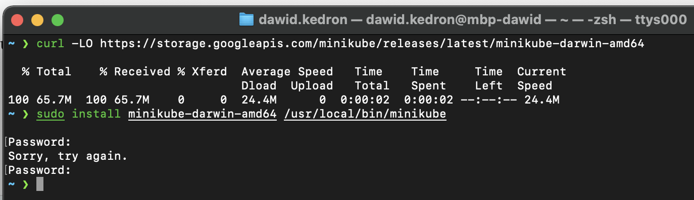
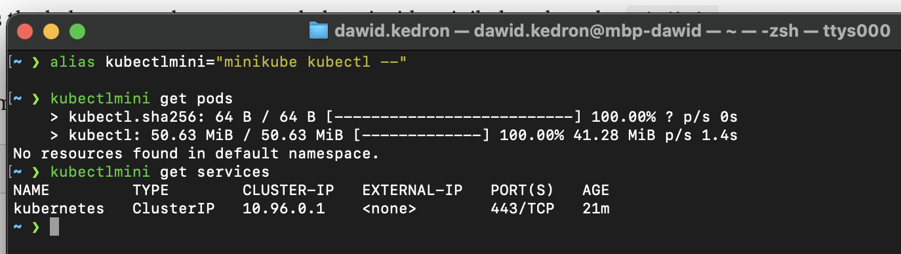
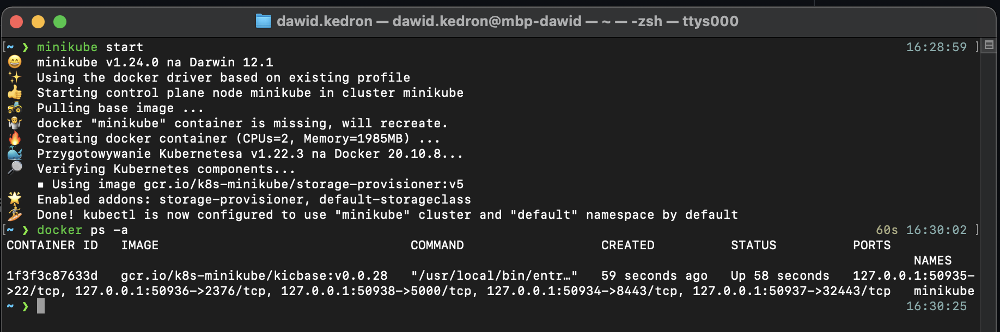
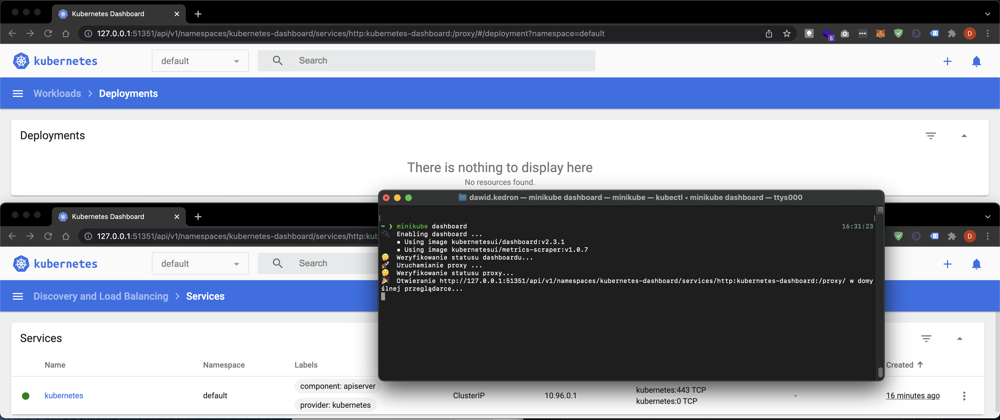
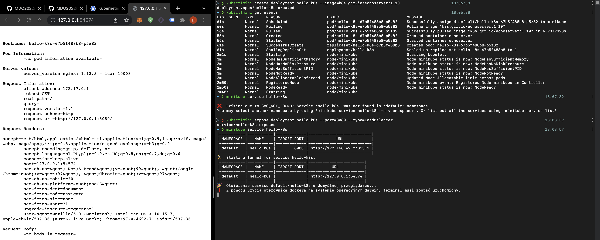
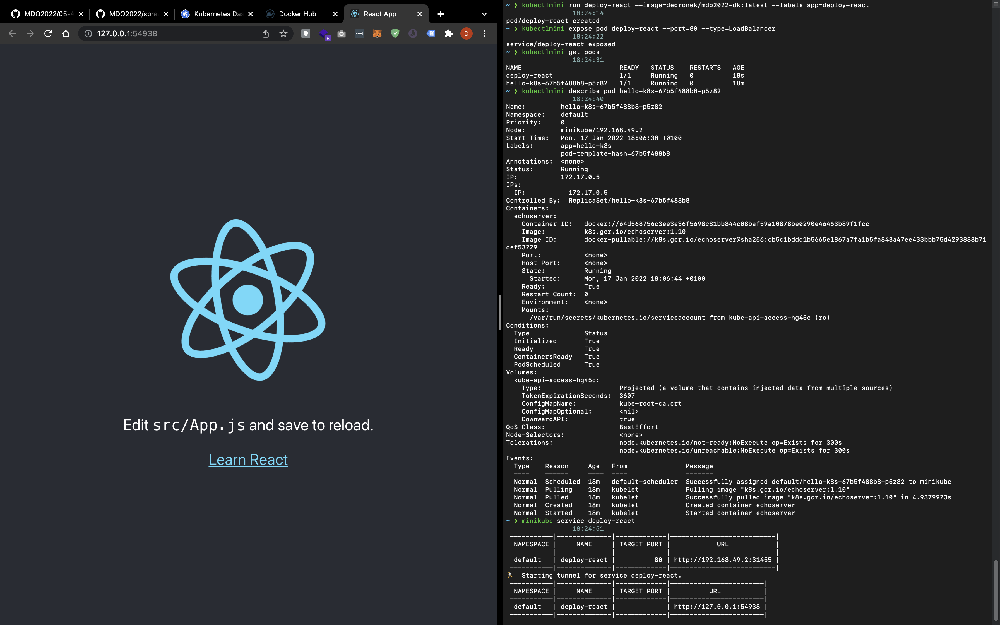
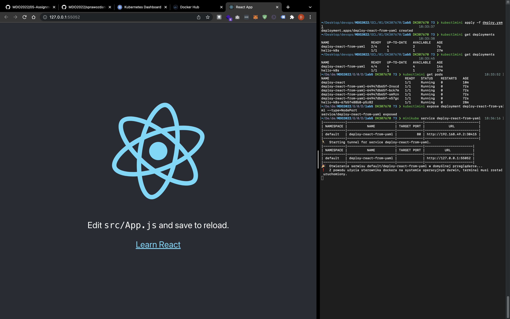

# Zajęcia 05

### Zestawienie platformy Kubernetes

* Upewnij się, że kontener jest dostępny
* Zainstaluj wymagania wstępne dla środowiska Minikube
* Zainstaluj minikube i kubectl




Aliasuje kubectl na kubectlmini poniewaz na maszynie mam juz skonfigurowane kubectl do celow produkcyjnych.

* Przedstaw uruchomione oprogramowanie wstępne (i usługi)
  * Platforma konteneryzacji
  * Otwarte porty
  * Stan Dockera
 


### Stan Minikube
* Uruchom Minikube Dashboard
* Wyświetl działające usługi (k8s) i wdrożenia
* Wyświetl dostępne wdrożenia (stan "przed")



### Wdrożenie kontenera via k8s
* Wdróż przykładowy deployment "hello k8s": ```k8s.gcr.io/echoserver```



* Użyj ```kubectl run <ctr> --image=<DOCKER_ID>/ --port=<port> --labels app=ctr```
* Przekieruj porty
* Wykaż że wdrożenie nastąpiło
* W przypadku "niemożliwych" wdrożeń, opisz napotkane ograniczenia



### Deployment
* Utwórz plik YAML z "deploymentem" k8s
* Zestaw 4 repliki, opisz zalety i wady takiej liczby
* Zaaplikuj wdrożenie via ```kubectl apply -f deploy.yml```
* Wykaż przeprowadzony deployment



W przypadku mojego obrazu - aplikacji WWW - 4 repliki to dobry pomysł, ale podczas dużego ruchu. Nalezaloby skonfigurowac loadbalancer tak aby skalowal deployment horyzontalnie podczas zwiekszonego ruchu.

Zalety:
- wysoka dostepnosc aplikacji (w przypadku wdrozenia chmurowego przy 3 podach na 3 roznych AZ otrzymujemy HA)
- aplikacja przyjmuje wieksze obciazenie

Wady:
- duze koszty (warto utrzymywac conajmniej 2 pody w razie rolling restart, mozna zatem obciac koszty o polowe)


