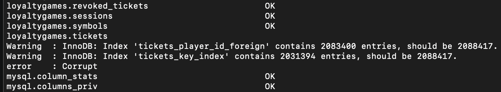
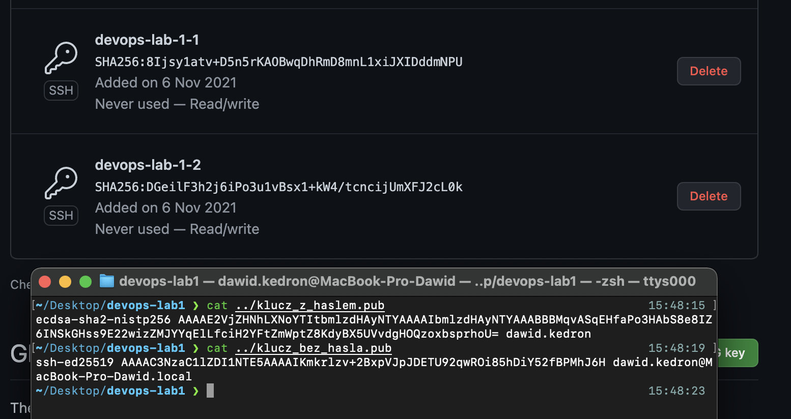
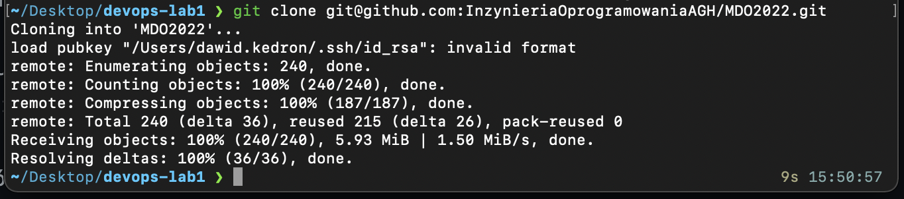
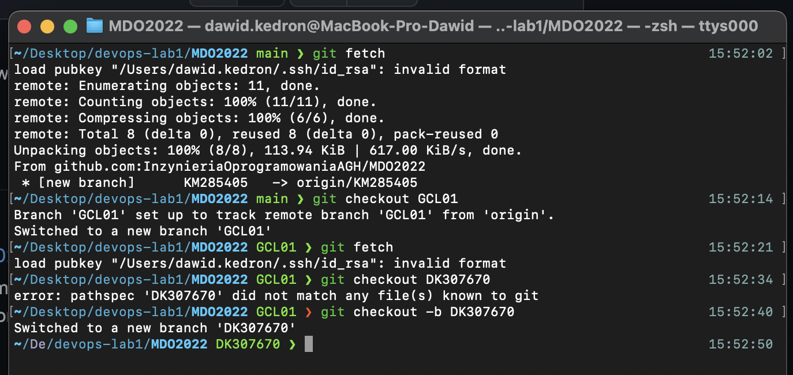
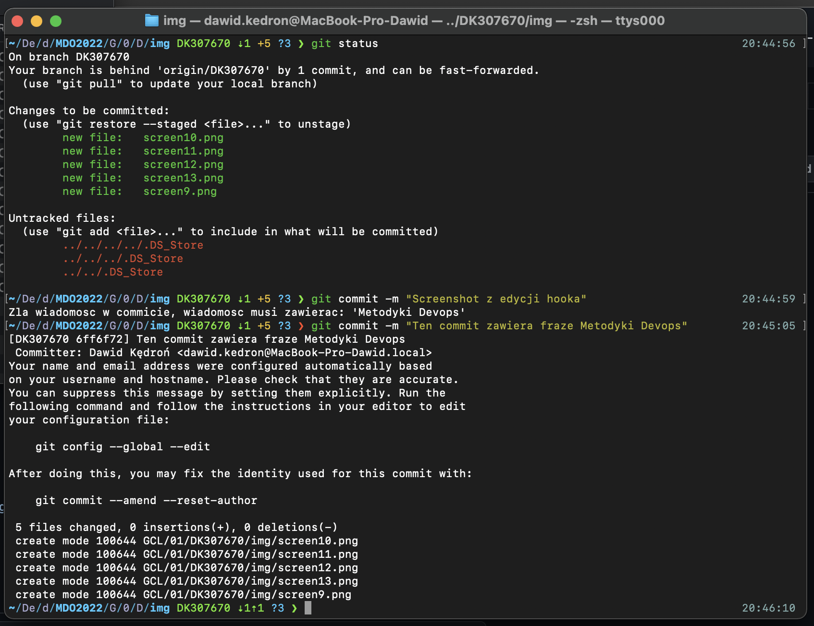

## Zadania do wykonania
1. Zainstaluj klienta Git i obsługę kluczy SSH
    
    git i ssh znajdowaly sie juz na sprzecie z ktorego korzystam
2. Sklonuj repozytorium https://github.com/InzynieriaOprogramowaniaAGH/MDO2022 za pomocą HTTPS
     
3. Upewnij się w kwestii dostępu do repozytorium jako uczestnik i sklonuj je za pomocą utworzonego klucza SSH
   - Utwórz dwa klucze SSH, inne niż RSA, w tym co najmniej jeden zabezpieczony hasłem
    
    
   - Skonfiguruj klucz SSH jako metodę dostępu
    
    
   - Sklonuj repozytorium z wykorzystaniem protokołu SSH
     
4. Przełącz się na gałąź swojej grupy
5. Utwórz gałąź o nazwie "inicjały & nr indeksu" np. ```KD232144```
    
6. Rozpocznij pracę na nowej gałęzi
   - W katalogu właściwym dla grupy utwórz nowy katalog, także o nazwie "inicjały & nr indeksu" np. ```KD232144```
   - W nowym katalogu dodaj plik ze sprawozdaniem
   - Dodaj zrzuty ekranu
    
   - Wyślij zmiany do zdalnego źródła
    
   - Spróbuj wciągnąć swoją gałąź do gałęzi grupowej
    
   - Zaktualizuj sprawozdanie i zrzuty o ten krok i wyślij aktualizację do zdalnego źródła (na swojej gałęzi)
     
   - Oznacz tagiem ostatni commit i wypchnij go na zdalną gałąź
   - Ustal hook, który będzie sprawdzał, czy wiadomość z commitem zawiera nazwę przedmiotu
    
    
   - W jaki sposób stworzyć hook, który będzie *ustawiał* prefiks wiadomości commitu tak, by miał nazwę przedmiotu?
    
1. Wystaw Pull Request do gałęzi grupowej
2. Zgłoś zadanie (Teams assignment)