# Metodyki DevOps - lab01

## Środowisko

Ćwiczenia labolatoryjne zostały wykonane na laptopie z macOS Big Sur 11.6

## Instalacja klienta Git

Git został uprzednio zainstalowany, można go znaleźć w katalogu:

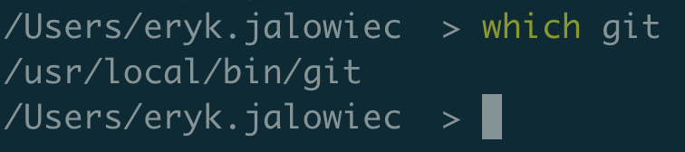

Być może został on zainstalowany przeze mnie przy użyciu **brew install git**, ale nie pamiętam tego.

## Obsługa kluczy SSH

Na urządzeniu, z którego korzystam klient SSH był również zainstalowany, można go znaleźć w katalogu:

## Klonowanie repozytorium za pomocą HTTPS

Klonowanie repozytorium odbywa się za pomocą komendy **git clone**. Po komendzie należy umieścić adres repozytorium, który znajdziemy wchodząc w to repozytorium i klikając poniższe:

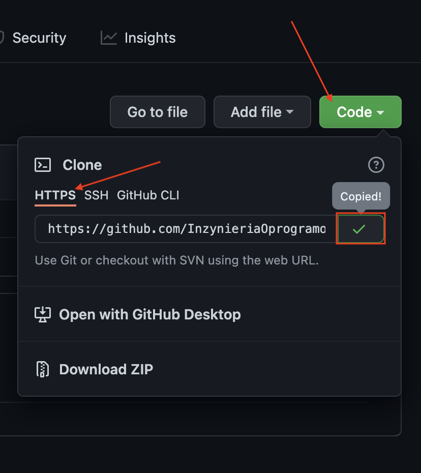

Po sklonowaniu, pliki zapiszą się w folderze, który aktualnie był wybrany:

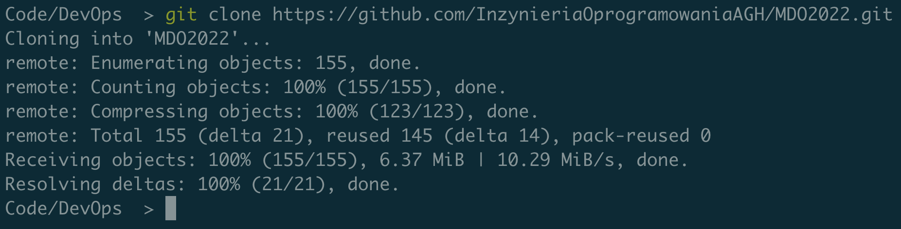

## Klonowanie repozytorium za pomocą klucza SSH

### Generowanie kluczy SSH

W celu zaoszczędzenia kilku godzin, na wstępie warto wspomnieć, że w przypadku wybrania innej nazwy kluczy niż defaultowa, należy umieścić poniższe linijki w pliku **~/.ssh/config**:

Host github.com
    HostName github.com
    IdentityFile ~/.ssh/id_rsa_github

 W przypadku braku powyższego autentykacja się nie powiedzie.

Generowanie kluczy SSH odbywa się przy użyciu komendy **ssh-keygen**.

Pierwszy klucz jest generowany z pomocą algorytmu ECDSA przy użyciu komendy **ssh-keygen -t ecdsa-sha2-nistp256**. 
Po wpisaniu komendy jesteśmy proszeni o podanie, gdzie ma znajdować się wygenerowany klucz, jeśli nie podamy ścieżki, zostanie wybrana domyślna, podana w nawiasie. Opcjonalnie możemy podać hasło

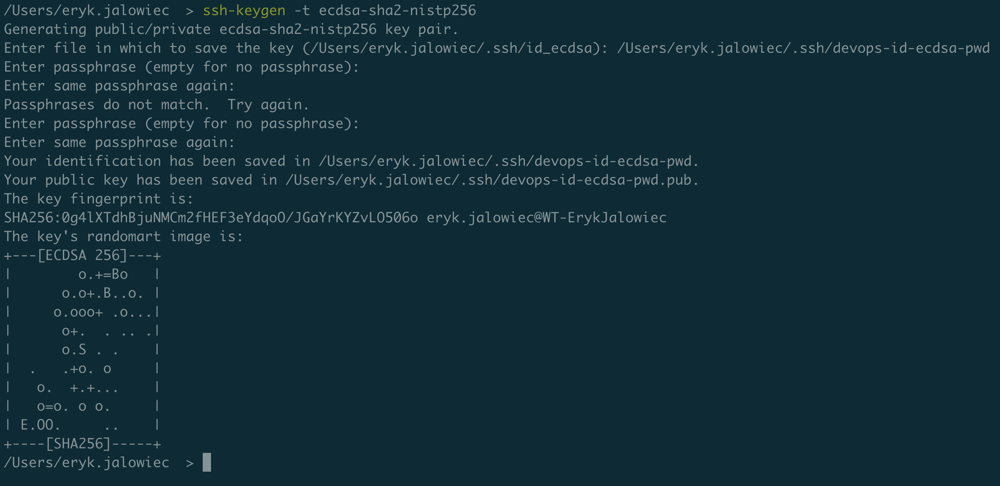

Drugi klucz generujemy z pomocą algorytmu ED25519 przy użyciu komendy **ssh-keygen -t ed25519**

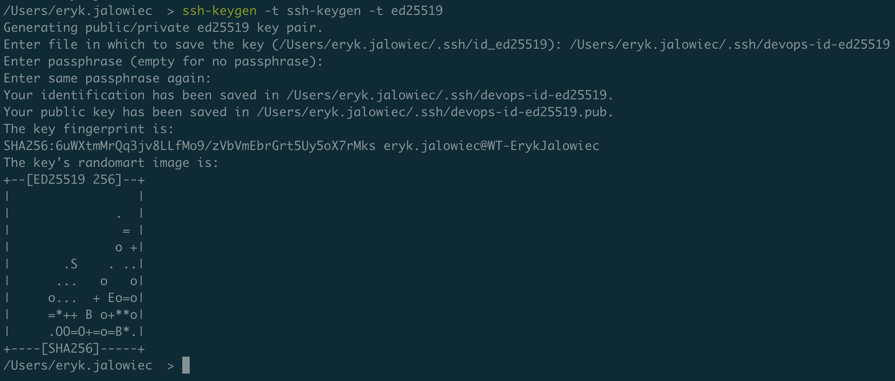

U mnie klucze znajdują się pod ścieżką **/Users/eryk.jalowiec/.ssh/**:

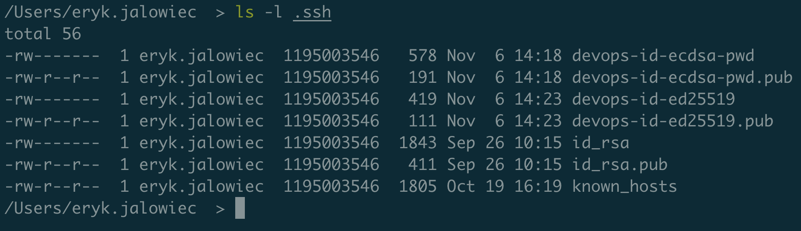

### Konfiguracja kluczy SSH na koncie Github

W celu konfiguracji kluczy SSH dla danego konta należy udać się pod adres **https://github.com/settings/keys**.

Po kliknięciu **New SSH Key**:

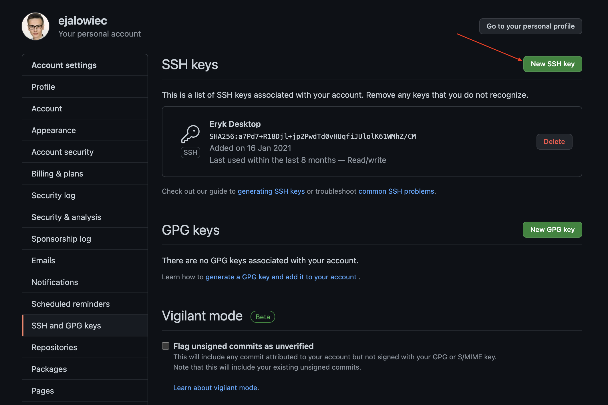

 Zostaniemy przeniesieni do strony, gdzie będziemy mogli dodać nasze wygenerowane klucze publiczne:

W taki sam sposób dodajemy drugi klucz:

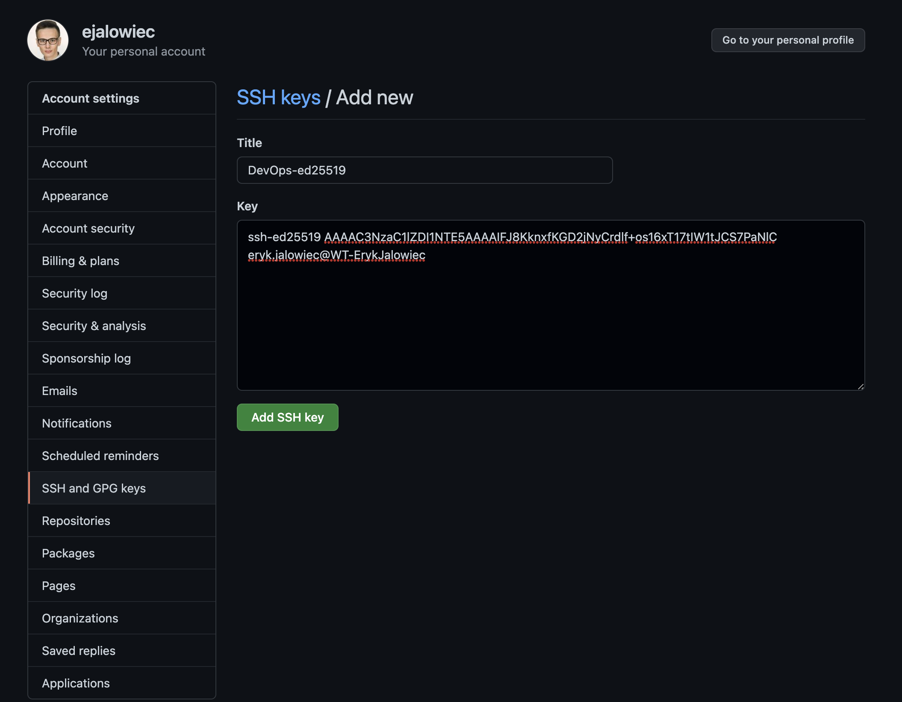

### Klonowanie repozytorium za pomocą SSH

Tak samo jak poprzednio, udajemy się na stronę z repozytorium, a następnie wybieramy metodę SSH, zamiast HTTPS:

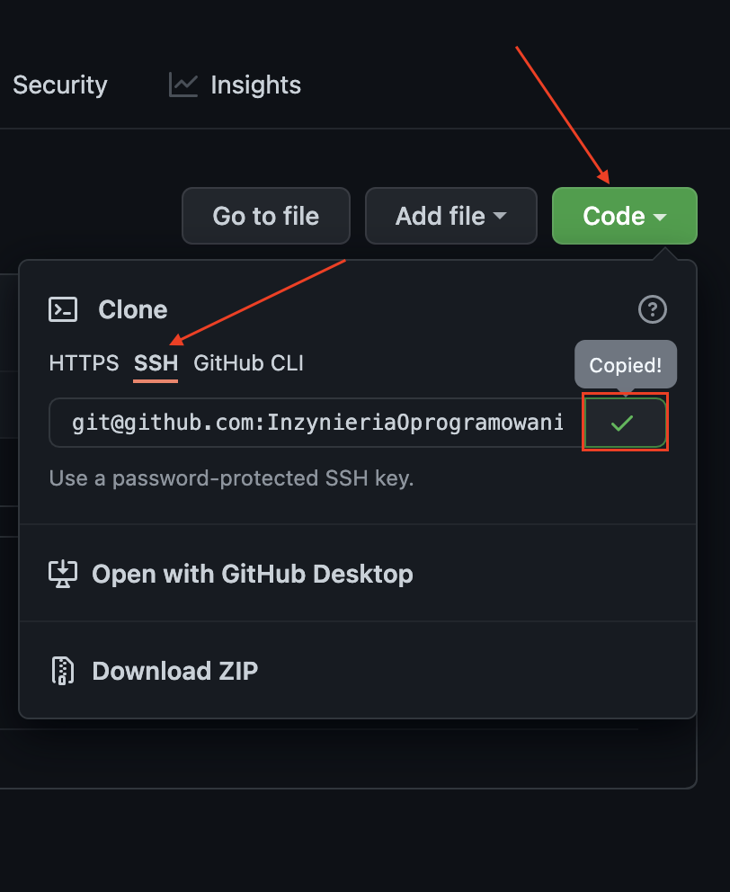

Jeżeli do wygenerowanego klucza SSH było podane hasło, trzeba będzie je podać przy klonowaniu.

Po sklonowaniu, pliki zapiszą się w folderze, który aktualnie był wybrany, tak samo jak w przypadku klonowania przez HTTPS:
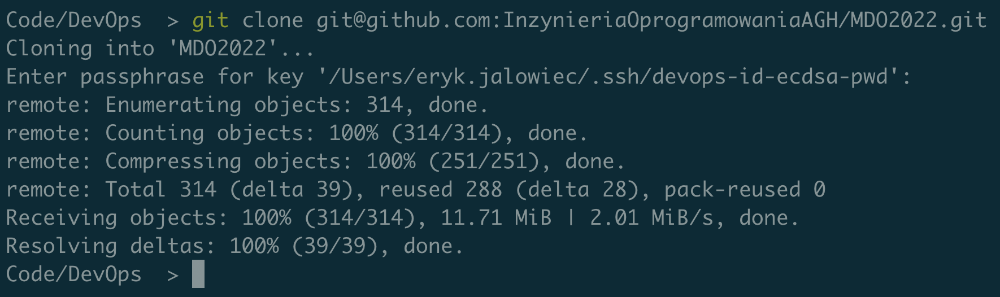

## Przełączam się na gałąź mojej grupy

Zmieniać gałęzie możemy dzięki poleceniu **git checkout**

Przełączam się na gałąź mojej grupy:
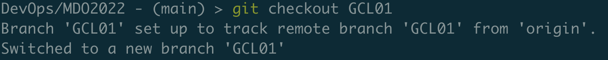

## Tworzenie nowej gałęzi

Nową gałąź tworzymy przy pomocy polecenia **git branch <nazwa_galezi>**, ale wtedy nie zostaniemy przeniesieni na nią, co jest bez sensu, gdyż tworząc nową gałąź, w zwyczaju mamy od razu na niej pracować. W związku z tym stosujemy polecenie **git checkout -b <nazwa_galezi>**

