# Metodyki DevOps - lab02

## Środowisko

Ćwiczenia labolatoryjne zostały wykonane na laptopie z macOS Big Sur 11.6

## Zestawienie środowiska

### Instalacja Dockera

Dockera zainstalowano przy użyciu missing package managera *brew* i komendy **brew install docker**, jednak wtedy
wyświetlał się komunikat, że docker daemon nie działa. Po znalezieniu rozwiązania w Google, zainstalowano Docker Desktop i wtedy można było przejść do pracy.
Warto zauważyć, że polecenia dockerowe możemy wykonywać z dowolnego miejsca w systemie.

Wersja Dockera poniżej:

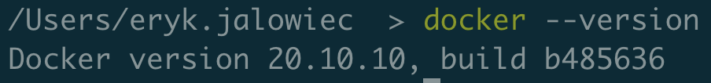

### Rejestracja na Docker Hub

Konto na Docker Hub zostało założone już jakiś czas temu podczas robienia kursów z Dockerem:

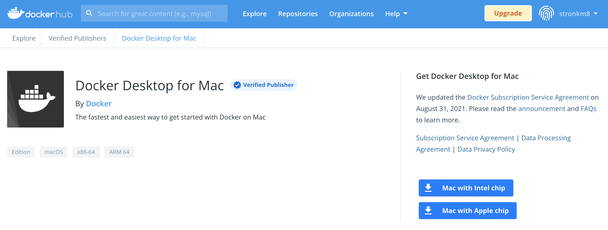

### Pobranie obrazów dockerowych

Z repozytorium pobrano obrazy przy użyciu komendy **docker pull:

- hello-world

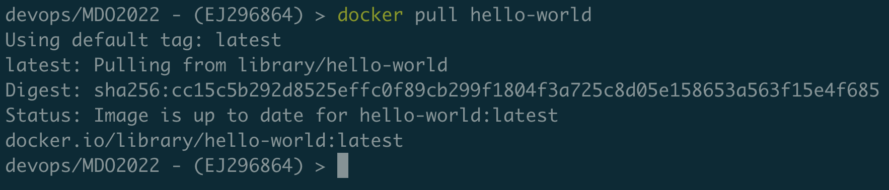

- busybox

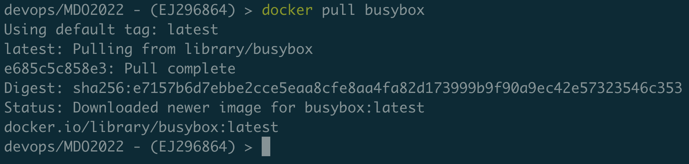

- ubuntu:20.04

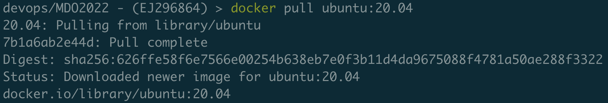

- mysql

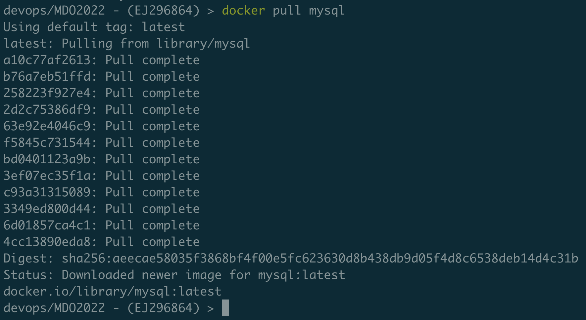

### Uruchomienie kontenera z busybox
#### Podejście zwykłe

Do uruchomienia kontenera użyto komendy **docker run <image_name>**.\
Należy pamiętać, że sama w sobie komenda uruchamia kontener na podstawie podanego obrazu, ale bez dodatkowych parametrów runtime nie wie co dalej począć, więc zatrzymuje kontener.\
Listę wszystkich naszych kontenerów otrzymano przy użyciu komendy **docker ps -a**. Można też użyć **docker container list -a** jak ktoś lubi:

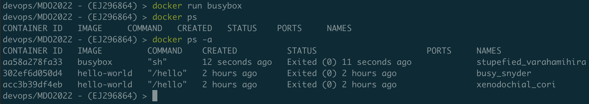

#### Podejście interaktywne

Aby uruchomić kontener w trybie interaktywnym, używamy przełączników **-ti**. Dzięki temu runtime, po wystartowaniu kontenera jako pierwszą komendę uruchamia shella:

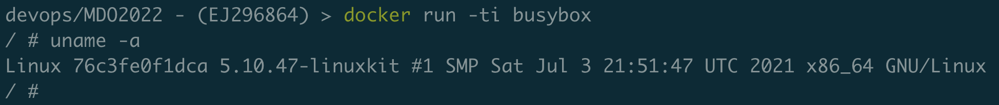

Przy użyciu komendy **busybox** będąc na kontenerze, możemy sprawdzić numer wersji:

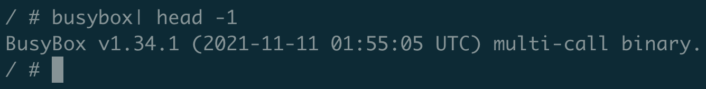

### Uruchomienie systemu w kontenerze

Podobnie jak w przypadku *busybox*, tym razem uruchomiono Ubuntu 20.04, od razu w trybie interaktywnym:

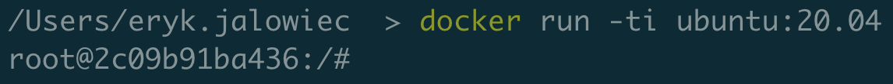

#### Prezentacja PID1 w kontenerze

Będąc na kontenerze, przy użyciu komendy **ps aux** jesteśmy w stanie sprawdzić procesy tego kontenera:

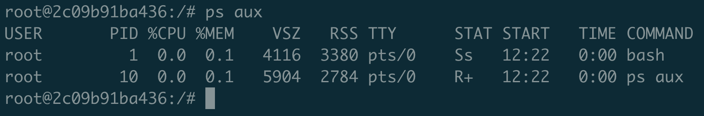

#### Prezentacja procesów Dockera na hoście

Mając uruchomione kontenery busybox i ubuntu:20.04 odpalam w trzecim oknie terminala znaną już komendę **ps aux** i,
po pipe'ie grepuję z przełącznikiem **-i** (ignore case, insensitive matching) po słowie "docker". 

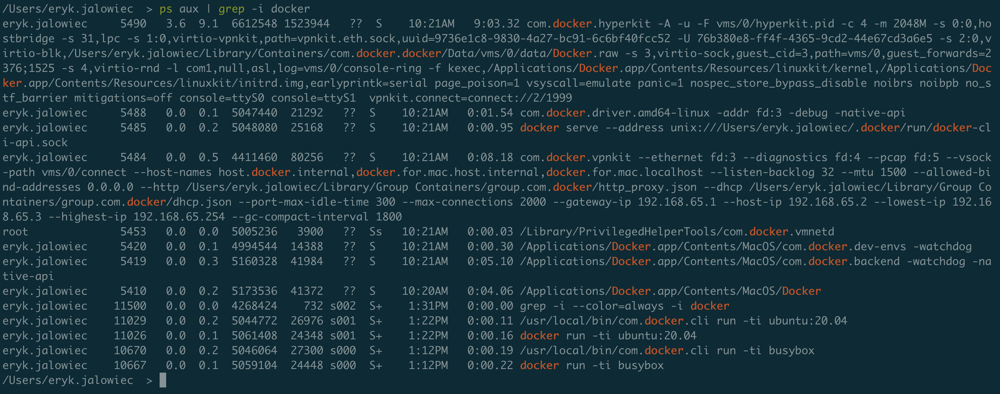

Myślę, że powinny nas interesować konretnie procesy 10000 < ID < 11500, które odpowiadają za runtime aktualnie odpalonych kontenerów.

#### Aktualizacja pakietów

Na Ubuntu znajduje się package manager o nazwie APT (Advanced Packaging Tool). Używając poleceń **apt update**
i **apt upgrade** aktualizujemy paczki (można było wykonać polecenia łącząc je dwoma ampersandami):

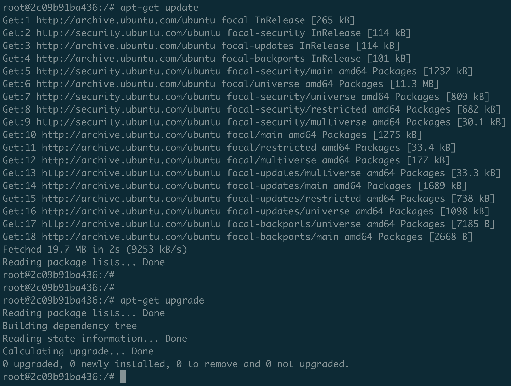

#### Wyjście z kontenera

Z kontenera wychodzimy tak jak z każdego shella, czyli komendą **exit**:

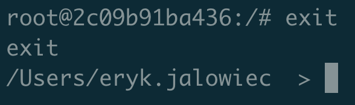

### Pokazanie aktualnych kontenerów:

Przy użyciu znanej już komendy **docker container list -a** otrzymujemy aktualnie uruchomione kontenery, z czegoo tylko jeden o imieniu "**pedantic_haibt"** działa:

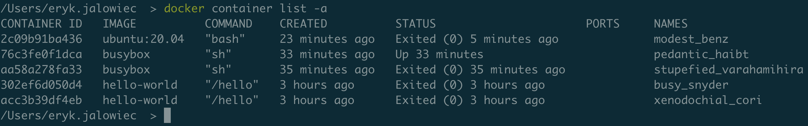

### Wyczyszczenie obrazów

Przed wyczyszczeniem obrazów, najpierw je listuję przy użyciu **docker image ls**:

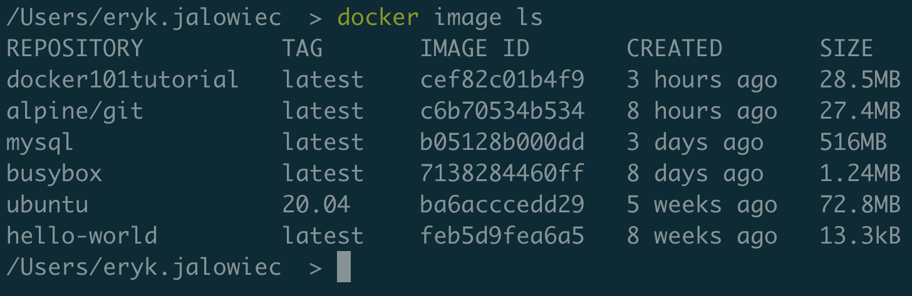

Następnie je usuwam komendą **docker image rm <image_name>, <image_name2>**:

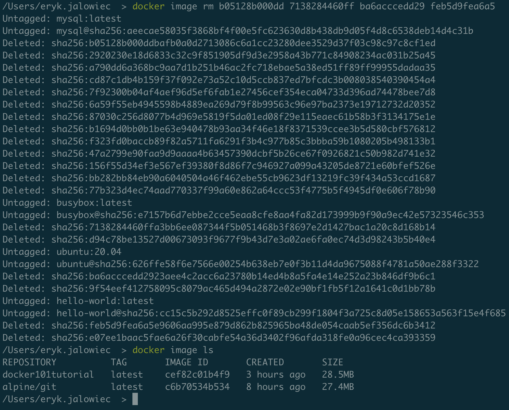

## Budowanie programu

### Znalezienie odpowiedniego projektu

Jako projekt wybrano Create React App (https://create-react-app.dev/). Posługiwano się także guidem: https://create-react-app.dev/docs/getting-started/

### Przeprowadzenie budowy i konfiguracji środowiska
#### Konfiguracja środowiska

Zanim ściągniemy aplikację, musimy posiadać zainstalowany pakiet NodeJS.
Na systemie operacyjnym macOS, można to zrobić za pomocą komendy **brew install node**:

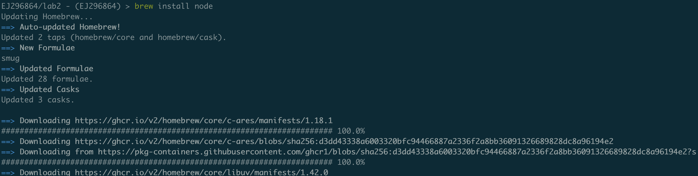
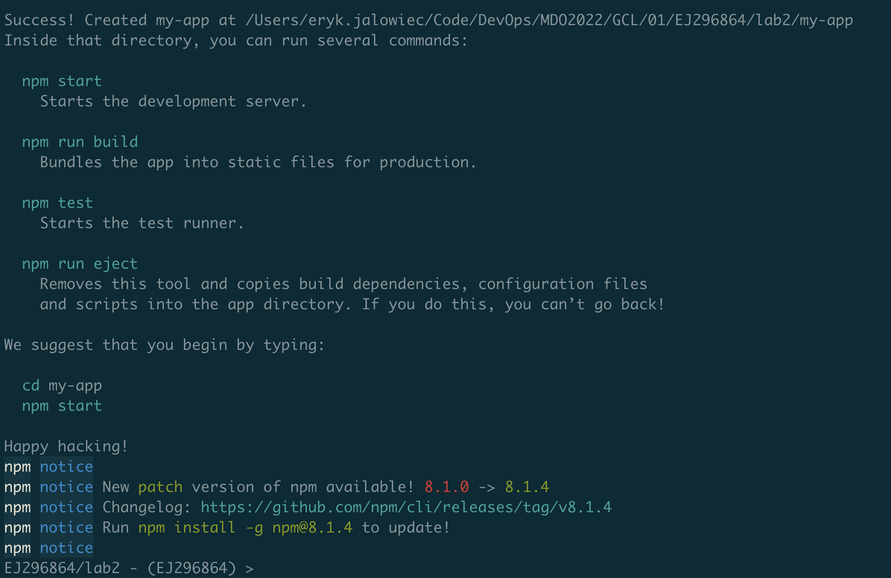

Po instalacji sprawdzam wersję pakietu Node:

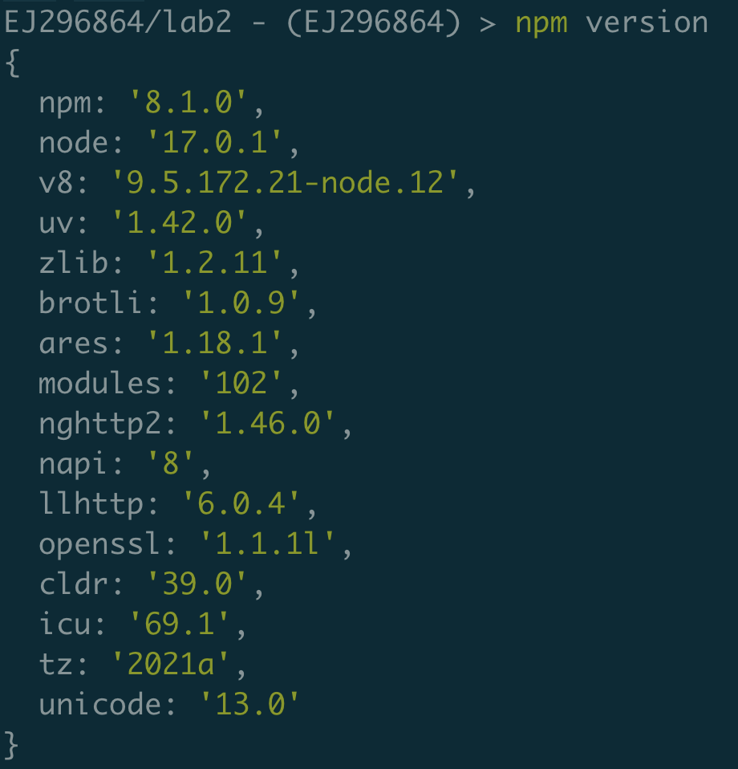

#### Instalacja aplikacji

Aplikację ściągamy przy użyciu komendy **npx create-react-app <nazwa_aplikacji>**:

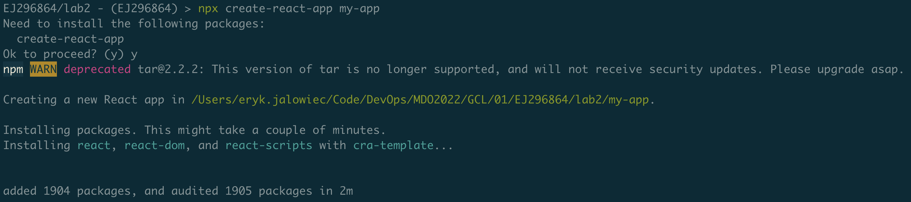

#### Budowanie aplikacji 

Po instalacji przechodzę do folderu z aplikacją używając **cd my-app** i budujemy aplikację używając **npm run build**:

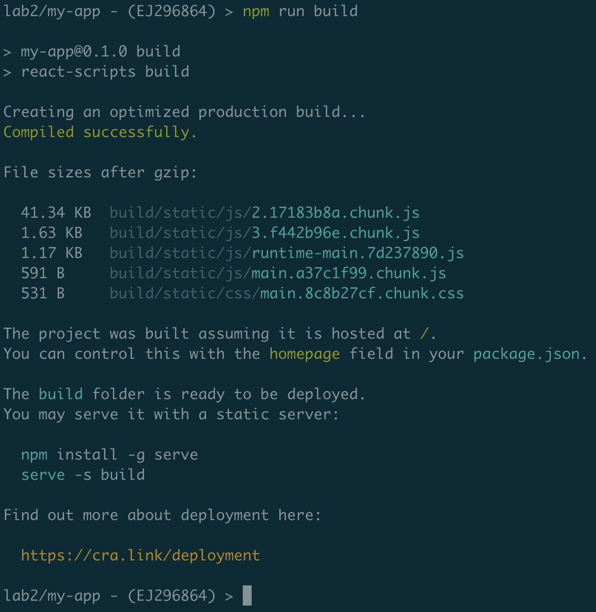

#### Uruchomienie testów

Zgodnie z instrukcją, testy uruchamiane są przy użyciu komendy **npm test**:

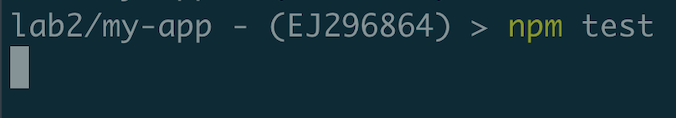

Poprowadzi nas to później do interaktywnego okna z testami:

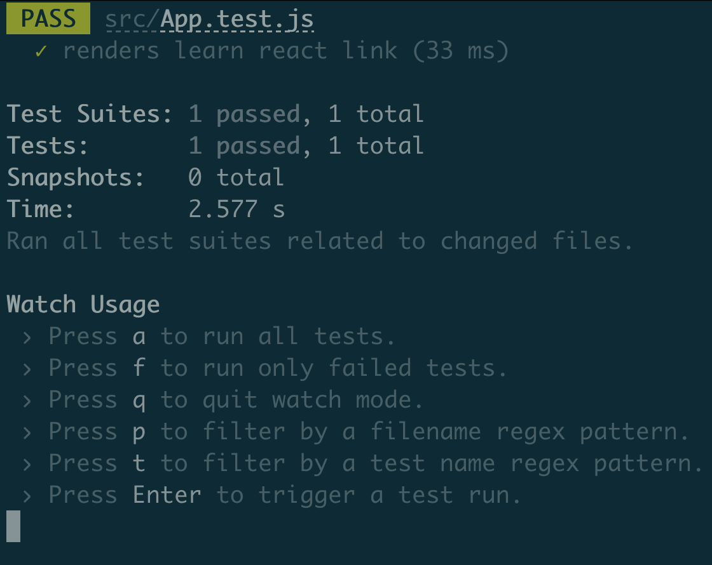

### Ponowienie procesu na kontenerze
#### Wybranie i uruchomienie platformy

Na początek odpalam nowy kontener z Ubuntu. Obraz nie jest znaleziony, został usunięty,
więc jest zaciągany nowy z repozytorium Dockera:

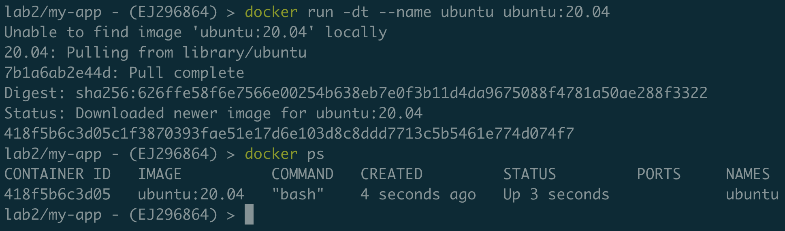

Warto zwrócić uwage na flagę **-d** (**--detached**), która odpowiada za działanie kontenera w tle

#### Zaopatrzenie platformy w odpowiednie oprogramowanie

Gdy kontener już działa, wchodzę na niego, wykonując na nim komendę **bash**, przy użyciu **docker exec -ti <nazwa_kontenera>**

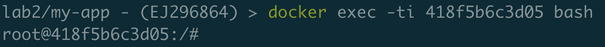

Następnie zaopatruję go w odpowiednie oprogramowanie:

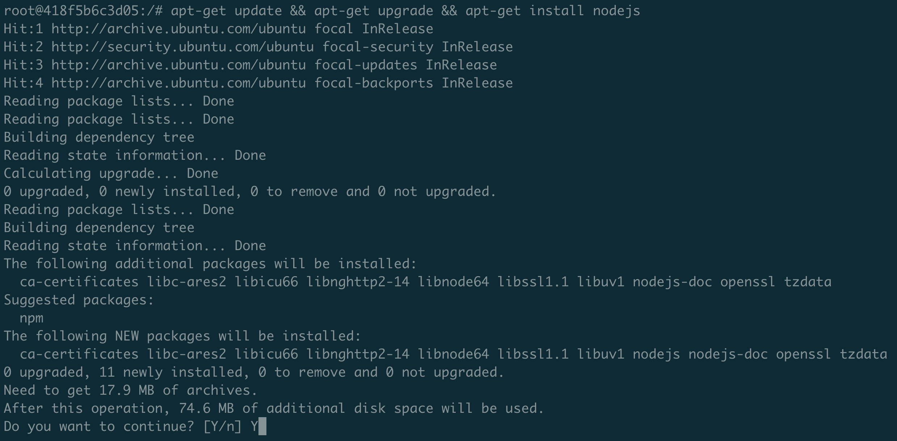

Doinstalowuję npm, gdyż okazało się, że nie ma go pakiecie nodejs:

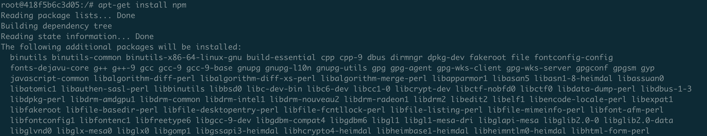

Wersja npm na kontenerze z Ubuntu:

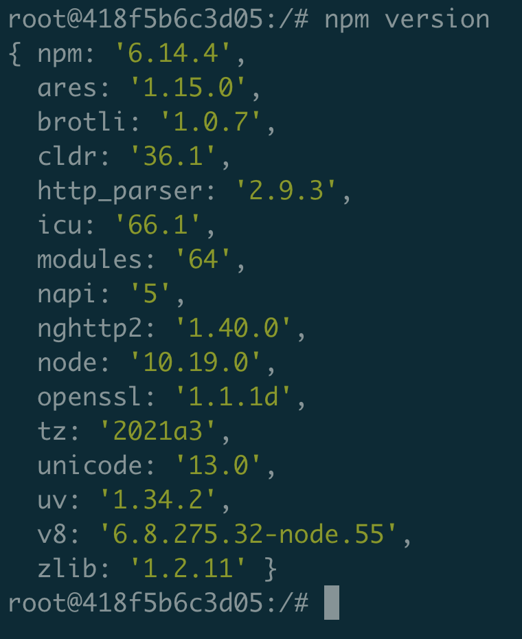

To jest ciekawe, że na Ubuntu jest inna wersja npm i node niż na lokalnym macOS. Paczki były zauktualizowane do najnowszych w obu przypadkach.

