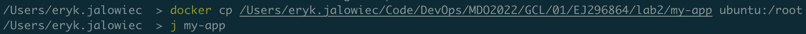
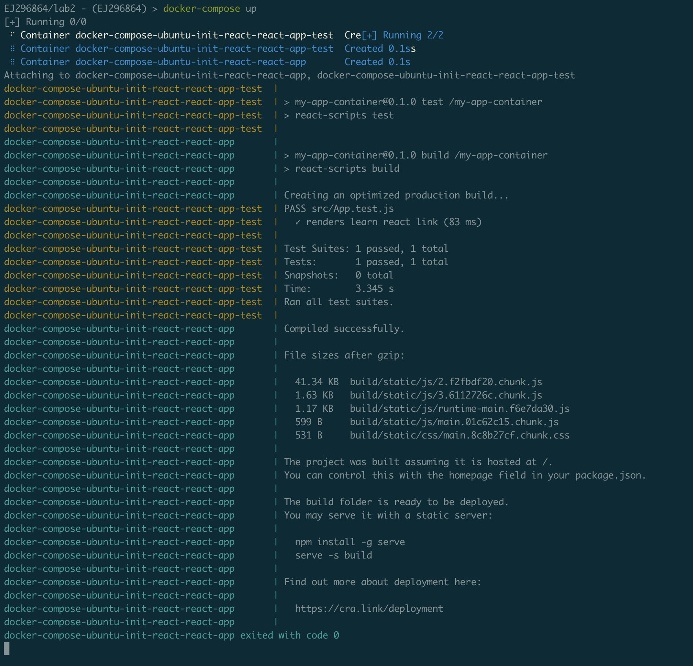

# Metodyki DevOps - lab02

## Środowisko

Ćwiczenia labolatoryjne zostały wykonane na laptopie z macOS Big Sur 11.6

## Zestawienie środowiska

### Instalacja Dockera

Dockera zainstalowano przy użyciu missing package managera *brew* i komendy **brew install docker**, jednak wtedy
wyświetlał się komunikat, że docker daemon nie działa. Po znalezieniu rozwiązania w Google, zainstalowano Docker Desktop i wtedy można było przejść do pracy.
Warto zauważyć, że polecenia dockerowe możemy wykonywać z dowolnego miejsca w systemie.

Wersja Dockera poniżej:

### Rejestracja na Docker Hub

Konto na Docker Hub zostało założone już jakiś czas temu podczas robienia kursów z Dockerem:

### Pobranie obrazów dockerowych

Z repozytorium pobrano obrazy przy użyciu komendy **docker pull:

- hello-world

- busybox

- ubuntu:20.04

- mysql

### Uruchomienie kontenera z busybox
#### Podejście zwykłe

Do uruchomienia kontenera użyto komendy **docker run <image_name>**.\
Należy pamiętać, że sama w sobie komenda uruchamia kontener na podstawie podanego obrazu, ale bez dodatkowych parametrów runtime nie wie co dalej począć, więc zatrzymuje kontener.\
Listę wszystkich naszych kontenerów otrzymano przy użyciu komendy **docker ps -a**. Można też użyć **docker container list -a** jak ktoś lubi:

#### Podejście interaktywne

Aby uruchomić kontener w trybie interaktywnym, używamy przełączników **-ti**. Dzięki temu runtime, po wystartowaniu kontenera jako pierwszą komendę uruchamia shella:

Przy użyciu komendy **busybox** będąc na kontenerze, możemy sprawdzić numer wersji:

### Uruchomienie systemu w kontenerze

Podobnie jak w przypadku *busybox*, tym razem uruchomiono Ubuntu 20.04, od razu w trybie interaktywnym:

#### Prezentacja PID1 w kontenerze

Będąc na kontenerze, przy użyciu komendy **ps aux** jesteśmy w stanie sprawdzić procesy tego kontenera:

#### Prezentacja procesów Dockera na hoście

Mając uruchomione kontenery busybox i ubuntu:20.04 odpalam w trzecim oknie terminala znaną już komendę **ps aux** i,
po pipe'ie grepuję z przełącznikiem **-i** (ignore case, insensitive matching) po słowie "docker". 

Myślę, że powinny nas interesować konretnie procesy 10000 < ID < 11500, które odpowiadają za runtime aktualnie odpalonych kontenerów.

#### Aktualizacja pakietów

Na Ubuntu znajduje się package manager o nazwie APT (Advanced Packaging Tool). Używając poleceń **apt update**
i **apt upgrade** aktualizujemy paczki (można było wykonać polecenia łącząc je dwoma ampersandami):

#### Wyjście z kontenera

Z kontenera wychodzimy tak jak z każdego shella, czyli komendą **exit**:

### Pokazanie aktualnych kontenerów:

Przy użyciu znanej już komendy **docker container list -a** otrzymujemy aktualnie uruchomione kontenery, z czegoo tylko jeden o imieniu "**pedantic_haibt"** działa:

### Wyczyszczenie obrazów

Przed wyczyszczeniem obrazów, najpierw je listuję przy użyciu **docker image ls**:

Następnie je usuwam komendą **docker image rm <image_name>, <image_name2>**:

## Budowanie programu

### Znalezienie odpowiedniego projektu

Jako projekt wybrano Create React App (https://create-react-app.dev/). Posługiwano się także guidem: https://create-react-app.dev/docs/getting-started/

### Przeprowadzenie budowy i konfiguracji środowiska
#### Konfiguracja środowiska

Zanim ściągniemy aplikację, musimy posiadać zainstalowany pakiet NodeJS.
Na systemie operacyjnym macOS, można to zrobić za pomocą komendy **brew install node**:

Po instalacji sprawdzam wersję pakietu Node:

#### Instalacja aplikacji

Aplikację ściągamy przy użyciu komendy **npx create-react-app <nazwa_aplikacji>**:

#### Budowanie aplikacji 

Po instalacji przechodzę do folderu z aplikacją używając **cd my-app** i budujemy aplikację używając **npm run build**:

#### Uruchomienie testów

Zgodnie z instrukcją, testy uruchamiane są przy użyciu komendy **npm test**:

Poprowadzi nas to później do interaktywnego okna z testami:

### Ponowienie procesu na kontenerze
#### Wybranie i uruchomienie platformy

Na początek odpalam nowy kontener z Ubuntu. Obraz nie jest znaleziony, został usunięty,
więc jest zaciągany nowy z repozytorium Dockera (dobrą praktyką jest wyspecyfikowanie konkretnej wersji, ponieważ w innym 
przypadku ściągana jest zawsze *latest*, co może prowadzić do różnych rezultatów):

Warto zwrócić uwage na flagę **-d** (**--detached**), która odpowiada za działanie kontenera w tle

#### Zaopatrzenie platformy w odpowiednie oprogramowanie

Gdy kontener już działa, wchodzę na niego, wykonując na nim komendę **bash**, przy użyciu **docker exec -ti <nazwa_kontenera>**

Następnie zaopatruję go w odpowiednie oprogramowanie:

Doinstalowuję npm, gdyż okazało się, że nie ma go pakiecie nodejs:

Wersja npm na kontenerze z Ubuntu:

To jest ciekawe, że na Ubuntu jest inna wersja npm i node niż na lokalnym macOS. Paczki były zauktualizowane do najnowszych w obu przypadkach.

#### Klonowanie aplikacji

Do sklonowania aplikacji użyto komendy **docker cp <source> <container>:<path>** 

Następnie na kontenerze patrzę, czy faktycznie aplikacja została sklonowana:

#### Konfiguracja środowiska i uruchomienie testów

Środowisko zostało już wyposażone w odpowiednie oprogramowanie, teraz czas uruchomić build, przy pomocy już nam znanej komendy **npm run build**:

Następnie uruchamiono testy przy pomocy **npm test** 

Tak jak w poprzednim przypadku, po uruchomieniu testów, pojawia się menu z testem interaktywnym: 

### Prezentacja Dockerfile i jego zbudowanie

Dockerfile wygląda jak poniżej:

Warto zaznaczyć, że ARG DEBIAN_FRONTEND został ustawiony na *noninteractive*, ponieważ podczas
instalacji pakietu *npm*, potrzebna była interakcja w sprawie wyboru regionu użytkownika, która blokowała instalację.

Zbudowanie obrazu następuje dzięki komendzie **docker build -t <nazwa_obrazu> \<path>** oraz dostępne obrazy zostały pokazane na poniższym zdjęciu:

Jak widać, proces budowania przebiegł pomyślnie.

Po odpaleniu kontenera i sprawdzeniu logów, przy użyciu **docker logs <container_name>**, można zobaczyć, że aplikacja została zbudowana:

Sprawdzenie jego logów:

### Tworzenie obrazu, który uruchamia testy, na bazie poprzedniego obrazu

Dockerfile dla obrazu, który uruchamia testy:

Budowanie obrazu odbywa się za pomocą tej samej komendy, co poprzednio, z małym wyjątkiem,
że z przełącznikiem **-f** dodajemy ścieżkę do Dockerfile, przy pomocy którego obraz ma zostać zbudowany.
Domyślnie nie trzeba jej podawać, gdyż ten plik nazywa się Dockerfile.

Uruchomienie kontenera, który uruchamia testy:

Sprawdzenie logów dla tego kontenera:

Na koniec z własnej woli sprawdzam uruchomione kontenery. Interesują nas obrazy o nazwie zaczynającej się od *ubuntu-init*.
Widać wyraźnie, że po zakończonej pracy, kontener odpowiedzialny za buildowanie aplikacji *ubuntu-init-react-react-app*
zostaje wyłączony. Kontener odpowiedzialny za testowanie aplikacji *ubuntu-init-react-react-app-test* działa w tle i wydaje mi się,
że jest to spowodowane tym, że podczas uruchamiania testów osobiście, wchodziliśmy w interaktywne okno, z którego później trzeba było wyjść:

## Runda bonusowa: kompozycja

Tworzę plik o nazwie *docker-compose.yml* przy użyciu *touch*:

Jeżeli plik się nie nazywa "docker-compose.yml", to musimy wskazać jego nazwę przez *-f*.

### Niepoprawne wykonanie zadania, po skończeniu tej części zorientowałem się, że nie o to chodziło 

Do stworzenia pliku docker-compose'a używam narzędzia *composerize* - https://github.com/magicmark/composerize
Dzięki temu narzędziu zostanie wygenerowany kod, który przekleimy do *docker-compose.yml*
Można je prosto zainstalować używając npm'a:

Tworzę kompozycję najpierw dla obrazu do budowania aplikacji:

Następnie dla obrazu z uruchamianiem testowania aplikacji:

Na sam koniec sklejam wygenerowane kody w jedną całość do pliku *docker-compose.yml*:

Jedyne co nam teraz pozostaje to wywołanie komendy **docker-compose up**.

Kontenery będą zachowywać się tak samo jak uruchamialiśmy je osobno, ten odpowiedzialny za build aplikacji, po zrobieniu tego zostanie wyłączony,
a drugi, odpowiedzialny za testowanie, prze to, że jest to interaktywne testowanie, cały czas trzyma sesję w terminalu.

### Poprawne wykonanie zadania

Niestety dopiero teraz zorientowałem się, że trzeba było użyć kompozycję na bazie Dockerfile.
Poprawna kompozycja została przedstawiona poniżej:

Po uruchomieniu **docker-compose up** otrzymujemy nasz porządany widok:

