# Metodyki DevOps - lab03

## Środowisko

Ćwiczenia labolatoryjne zostały wykonane na laptopie z macOS Big Sur 11.6

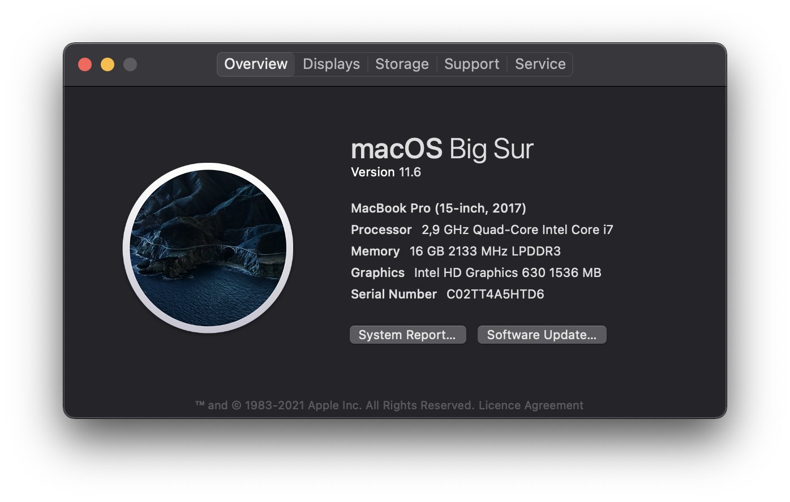

Potem postawiłem Ubuntu na Paralellsach, gdyż Docker for Mac na macOS nie działa tak jak powinien, więcej poniżej:

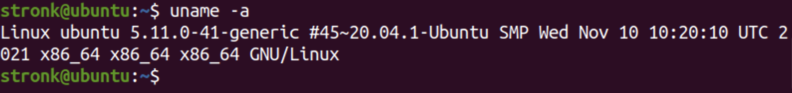

## Łączność i woluminy na podstawie "złych" praktyk

### Pobranie obrazu Ubuntu

Obraz Ubuntu był już pobrany na poprzednich labolatoriach. Pobrana została konkretna wersja 20.04.

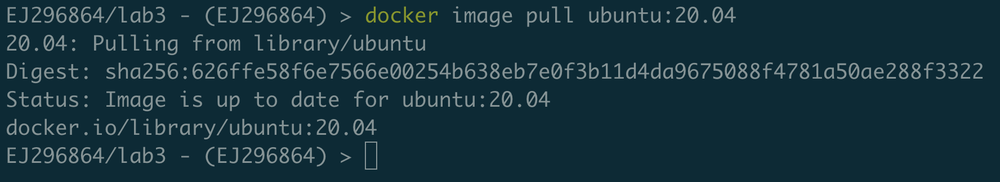

W przeciwnym razie pobrana zostałaby wersja najnowsza, co nie jest zalecane, ponieważ jeśli mielibyśmy system oparty na obrazie *latest*, w razie wypuszczenia nowej wersji, nie wiedzielibyśmy, jak ona się zachowa.

### Podłączenie woluminu do kontenera

Na początku stworzyłem wolumin. 

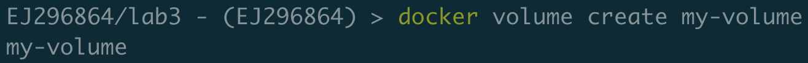

Jest to po prostu pewien katalog na dysku w katalogu roboczym dockera, który zacznie być widoczny w kontenerze, jeśli my go do niego podepniemy, u mnie na znajduje się on pod ścieżką:

**"/var/lib/docker/volumes/my-volume/_data"**

Następnie listuję wolumen:

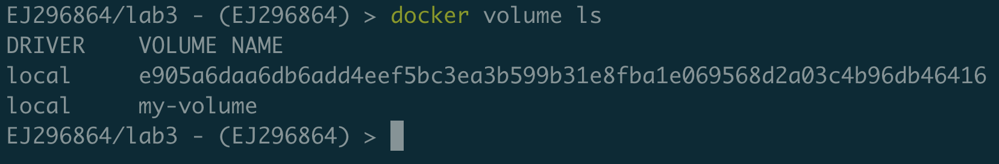

Sprawdzam, gdzie znajduje się mój nowoutworzony wolumin:

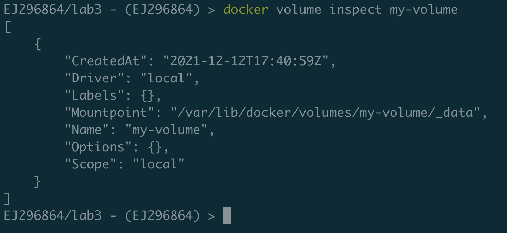

Podłączam wolumin do kontenera:

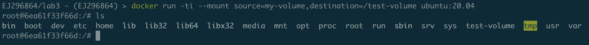

W tym momencie niestety okazuje się, że ścieżka */var/lib/docker* nie istnieje na mojej lokalnej maszynie, ponieważ w Docker for Mac kontenery są przechowywane na wirtualnej maszynie.
Więcej można przeczytać tutaj: https://stackoverflow.com/questions/38532483/where-is-var-lib-docker-on-mac-os-x/65645462#65645462

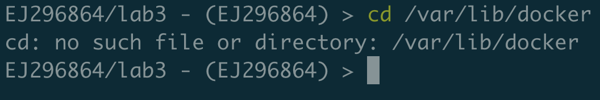

Również, żadne z przedstawionych rozwiązań nie pomogło, oprócz *docker run* z przełącznikiem *-v*:

### Kopiowanie pliku do katalogu woluminu i pokazanie go w kontenerze

Tworzę plik, który kopiuję do folderu **~/volume-host**:

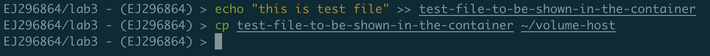

Sprawdzam przekopiowany plik na kontenerze w folderze **/store**:

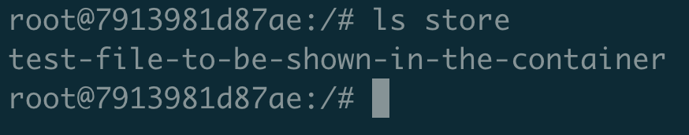

Jak widać, plik istnieje.

### Utworzenie pliku w kontenerze i pokazanie go na hoście

Tworzę plik na kontenerze:

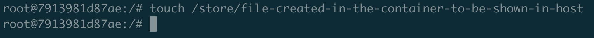

Plik pokazuje się w folderze z woluminem na hoście:

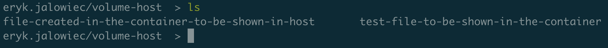

## "Kiepski pomysł": SSH

### Uruchomienie i wyeksportowanie wybranego portu w kontenerze

Uruchamiam kontener z wybranem portem 7312:

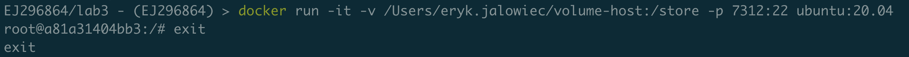

Przekierowuję port 7312 hosta na port 22 wewnątrz kontenera. 

### Instalacja serwera SSH w kontenerze

Instalacja serwera SSH obywa się przy użyciu komendy: **apt-get install openssh-server**.

Po wykonaniu tej komendy sprawdzam wersję serwera SSH:

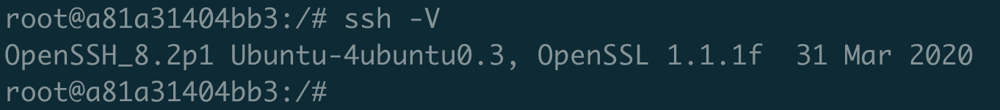

### Zmiana portu na wybrany port > 1024 oraz zezwolenie na logowanie root'a

W celu zmiany portu edytuję plik **sshd_config**, znajdujący się w */etc/ssh/* oraz dodaję linijkę **PermitRootLogin yes**, gdyż nie było jest standardowo:

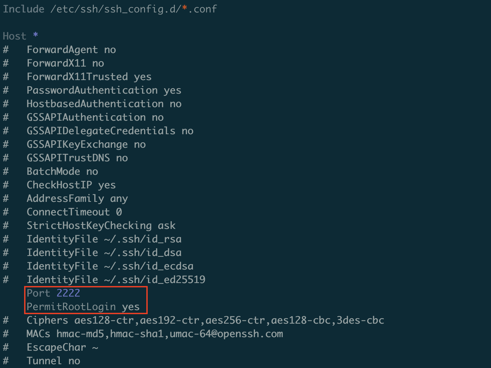

### Umieszczenie klucza publicznego w woluminie

Kopiuję klucz publiczny hosta do woluminu:

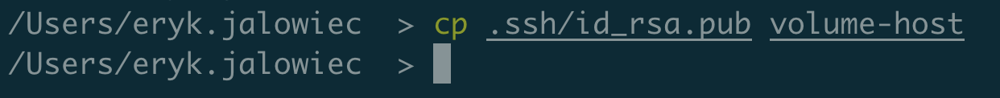

### Kopiuję klucz publiczzny do zaufanych w kontenerze

Na początku tworzę folder **.ssh** w kontenerze:

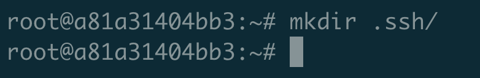

Kopiuję klucz publiczny z woluminu do pliku zaufanych znajdującego się w folderze *~/.ssh/* w kontenerze pod nazwą **authrozed_keys**:

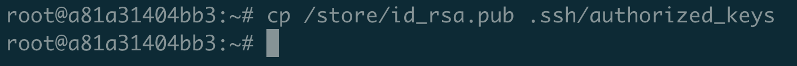

### Odnalezienie adresu IP kontenera w wewnętrznej sieci

Adres kontenera możemy uzyskać poleceniem **docker container inspect <container_id>**:

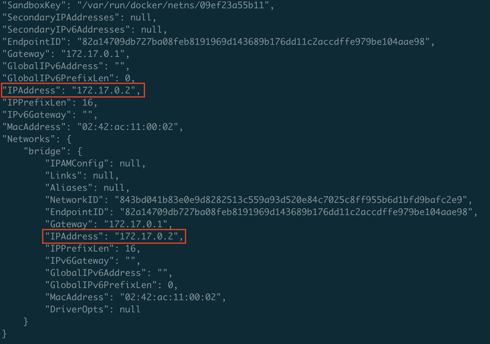

### Uruchomienie usługi

Aby SSH działało, potrzebne jest uruchomienie serwisu **sshd -D &**, znajdującego się w */usr/sbin/*, oraz utworzenie folderów **/run/sshd**:

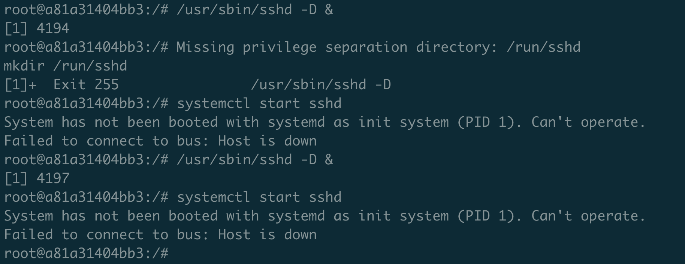

Sprawdzam status połączeń sieciowych przy użyciu *netstat*:

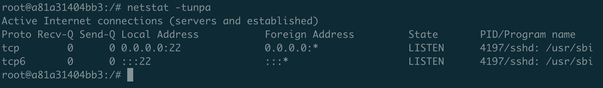

Widać, że usługa SSH działa na kontenerze na porcie 22.

### Połączenie się z kontenerem

Niestety z tego samego powodu, dla którego nie mogłem znaleźć ścieżki */var/lib/docker* (https://docs.docker.com/desktop/mac/networking/):

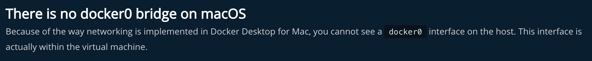

Nie ma też wirtualnego interfejsu *docker0* :(

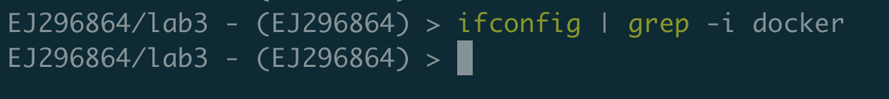

To jest ten moment, żeby zmienić sprzęt.

#### Few moments later - Postawienie Ubuntu na Paralellsach

Powtórzyłem wszystkie powyższe kroki na nowo postawionym hoście Ubuntu 20.04 LTS.

Finalnie, udało się połączyć, użyłem portu 4200, zamiast 2222, który był na screenie.

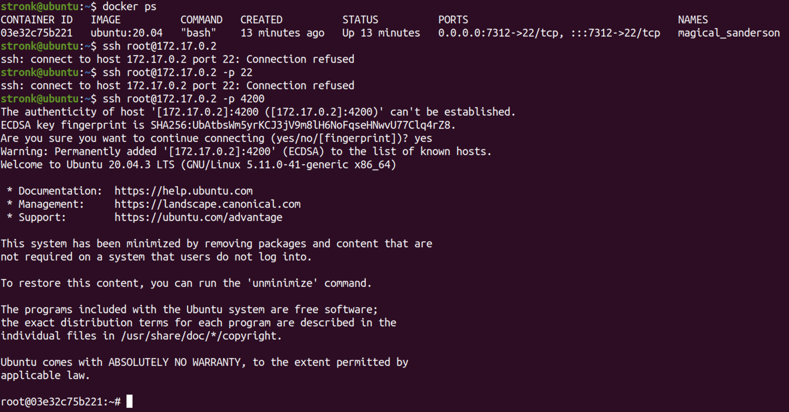

