# Metodyki DevOps - lab03

## Środowisko

Ćwiczenia labolatoryjne zostały wykonane na laptopie z macOS Big Sur 11.6


Potem postawiłem Ubuntu na Paralellsach, gdyż Docker for Mac na macOS nie działa tak jak powinien, więcej poniżej:


## Łączność i woluminy na podstawie "złych" praktyk

### Pobranie obrazu Ubuntu

Obraz Ubuntu był już pobrany na poprzednich labolatoriach. Pobrana została konkretna wersja 20.04.


W przeciwnym razie pobrana zostałaby wersja najnowsza, co nie jest zalecane, ponieważ jeśli mielibyśmy system oparty na obrazie *latest*, w razie wypuszczenia nowej wersji, nie wiedzielibyśmy, jak ona się zachowa.

### Podłączenie woluminu do kontenera

Na początku stworzyłem wolumin. 


Jest to po prostu pewien katalog na dysku w katalogu roboczym dockera, który zacznie być widoczny w kontenerze, jeśli my go do niego podepniemy, u mnie na znajduje się on pod ścieżką:

**"/var/lib/docker/volumes/my-volume/_data"**

Następnie listuję wolumen:


Sprawdzam, gdzie znajduje się mój nowoutworzony wolumin:


Podłączam wolumin do kontenera:


W tym momencie niestety okazuje się, że ścieżka */var/lib/docker* nie istnieje na mojej lokalnej maszynie, ponieważ w Docker for Mac kontenery są przechowywane na wirtualnej maszynie.
Więcej można przeczytać tutaj: https://stackoverflow.com/questions/38532483/where-is-var-lib-docker-on-mac-os-x/65645462#65645462


Również, żadne z przedstawionych rozwiązań nie pomogło, oprócz *docker run* z przełącznikiem *-v*:


### Kopiowanie pliku do katalogu woluminu i pokazanie go w kontenerze

Tworzę plik, który kopiuję do folderu **~/volume-host**:


Sprawdzam przekopiowany plik na kontenerze w folderze **/store**:


Jak widać, plik istnieje.

### Utworzenie pliku w kontenerze i pokazanie go na hoście

Tworzę plik na kontenerze:


Plik pokazuje się w folderze z woluminem na hoście:


## "Kiepski pomysł": SSH

### Uruchomienie i wyeksportowanie wybranego portu w kontenerze

Uruchamiam kontener z wybranem portem 7312:


Przekierowuję port 7312 hosta na port 22 wewnątrz kontenera. 

### Instalacja serwera SSH w kontenerze

Instalacja serwera SSH obywa się przy użyciu komendy: **apt-get install openssh-server**.

Po wykonaniu tej komendy sprawdzam wersję serwera SSH:


### Zmiana portu na wybrany port > 1024 oraz zezwolenie na logowanie root'a

W celu zmiany portu edytuję plik **sshd_config**, znajdujący się w */etc/ssh/* oraz dodaję linijkę **PermitRootLogin yes**, gdyż nie było jest standardowo:


### Umieszczenie klucza publicznego w woluminie

Kopiuję klucz publiczny hosta do woluminu:


### Kopiuję klucz publiczzny do zaufanych w kontenerze

Na początku tworzę folder **.ssh** w kontenerze:


Kopiuję klucz publiczny z woluminu do pliku zaufanych znajdującego się w folderze *~/.ssh/* w kontenerze pod nazwą **authrozed_keys**:


### Odnalezienie adresu IP kontenera w wewnętrznej sieci

Adres kontenera możemy uzyskać poleceniem **docker container inspect <container_id>**:


### Uruchomienie usługi

Aby SSH działało, potrzebne jest uruchomienie serwisu **sshd -D &**, znajdującego się w */usr/sbin/*, oraz utworzenie folderów **/run/sshd**:


Sprawdzam status połączeń sieciowych przy użyciu *netstat*:


Widać, że usługa SSH działa na kontenerze na porcie 22.

### Połączenie się z kontenerem

Niestety z tego samego powodu, dla którego nie mogłem znaleźć ścieżki */var/lib/docker* (https://docs.docker.com/desktop/mac/networking/):


Nie ma też wirtualnego interfejsu *docker0* :(


To jest ten moment, żeby zmienić sprzęt.

#### Few moments later - Postawienie Ubuntu na Paralellsach

Powtórzyłem wszystkie powyższe kroki na nowo postawionym hoście Ubuntu 20.04 LTS.

Finalnie, udało się połączyć, w pliku */etc/ssh/sshd_config* użyłem portu 4200, zamiast 2222, który był na powyżej, gdy zmieniałem go będąc na kontenerze postawionym na natywnym macOS.

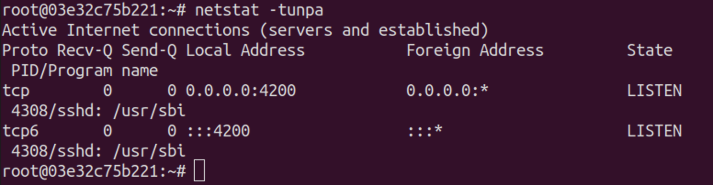


Wniosek z tego taki, że mimo iż mapujemy dane porty host:kontener, ostateczny port kontenera zostanie wzięty z pliku *sshd_config* i zrestartowaniu serwisu sshd.

## Skonteneryzowany Jenkins stosujący Dockera

#### Przygotowanie

### Upewnienie się, że Dockerfiles i Docker Compose z poprzednich zajęć są w repozytorium

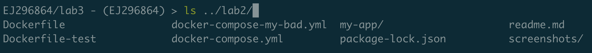

### Zapoznanie się z instrukcją

Zapoznałem się z instrukcją postawienia kontenera jenkinsowego:
*https://www.jenkins.io/doc/book/installing/docker/*

### Uruchomienie obrazu Dockera, który eksponuje środowisko zagnieżdżone

Uruchamia, obraz dockera ze środowiskiem zagnieżdżonym:

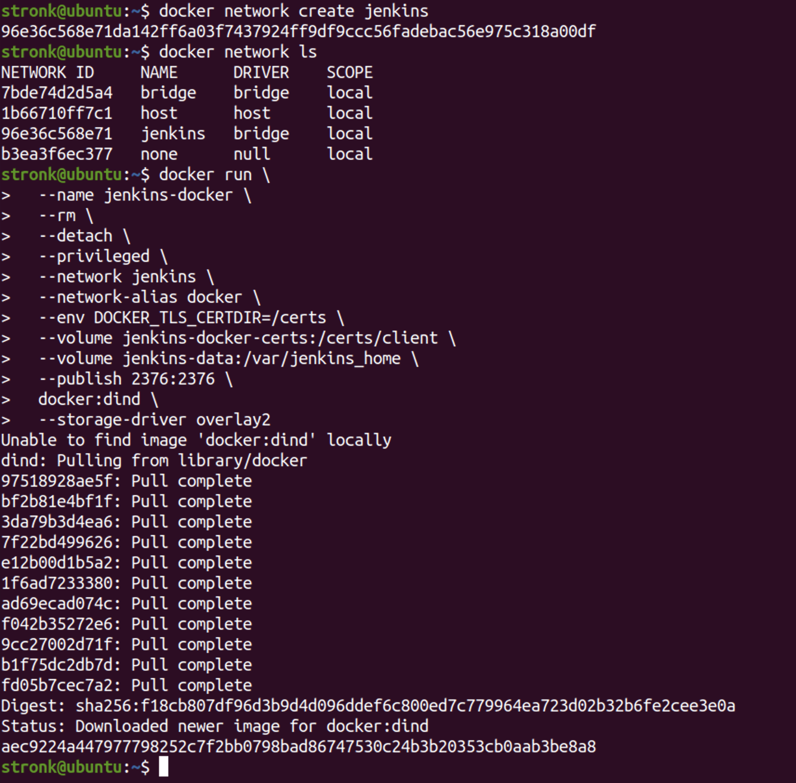

### Przygotowanie obrazu Blue Ocean na podstawie obrazu Jenkinsa

Przygotowałem obraz Blue Ocean na podstawie obrazu Jenkinsa

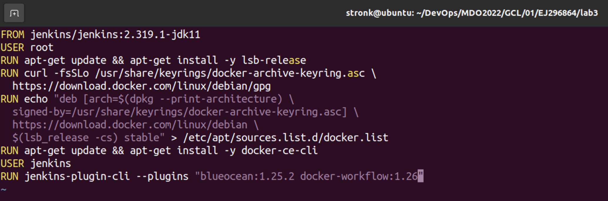

### Uruchomienie Blue Ocean

Na początku buduję obraz Blue Ocean:

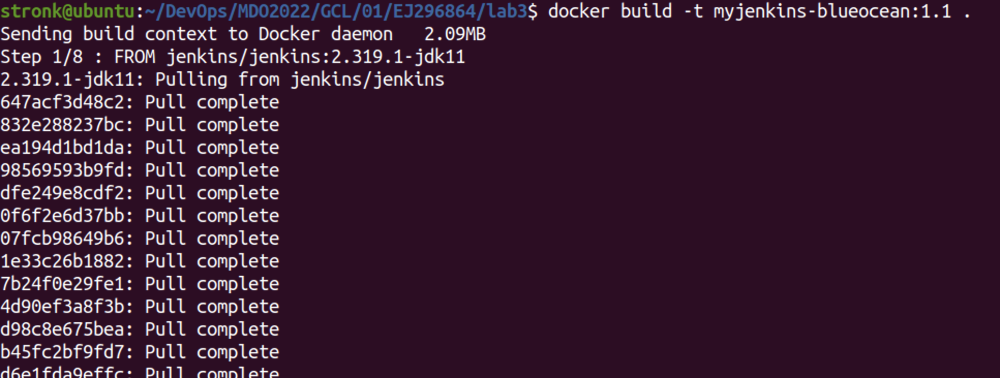
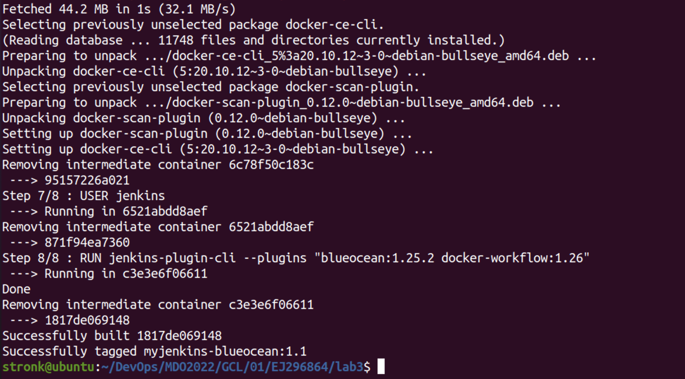

Następnie uruchamiam kontener z Blue Ocean:

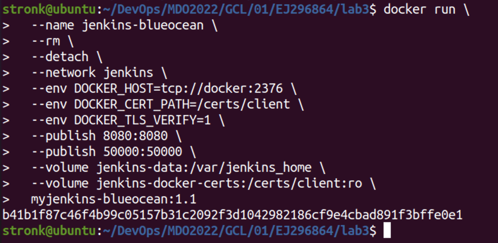

### Loguję się i konfiguruję Jenkins

Odblokowuję Jenkinsa sprawdzając hasło admina używając **docker logs <container_id>**:

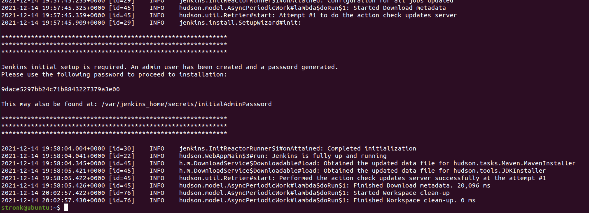

Następnie odblokowuje Jenkinsa podanym hasłem:

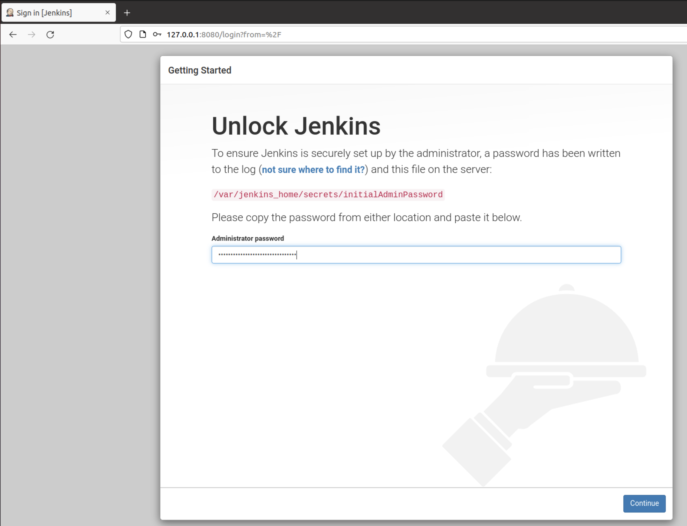

Po zalogowaniu się mogę korzystać z serwisu:

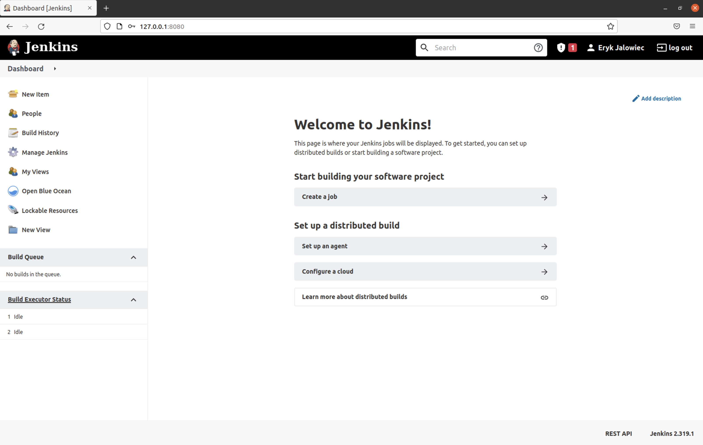

#### Mikro-projekt Jenkins

### Utworzenie projektu, który wyświetla uname

Tworzę nowy projekt - na dashboardzie klikam **New item**, następnie podaję nazwę projektu i wybieram **Freestyle projekt**. Następnie w sekcji **Build** podaję skrypt bashowy do wykonania:

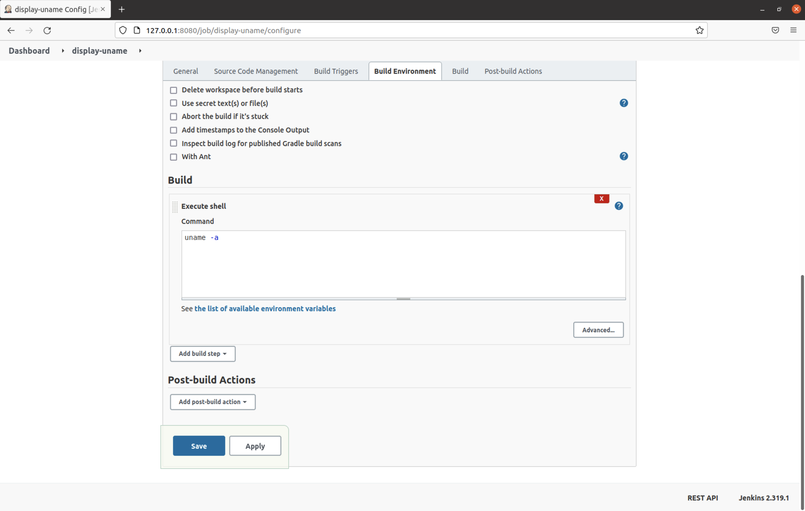

Sprawdzam output konsolowy:

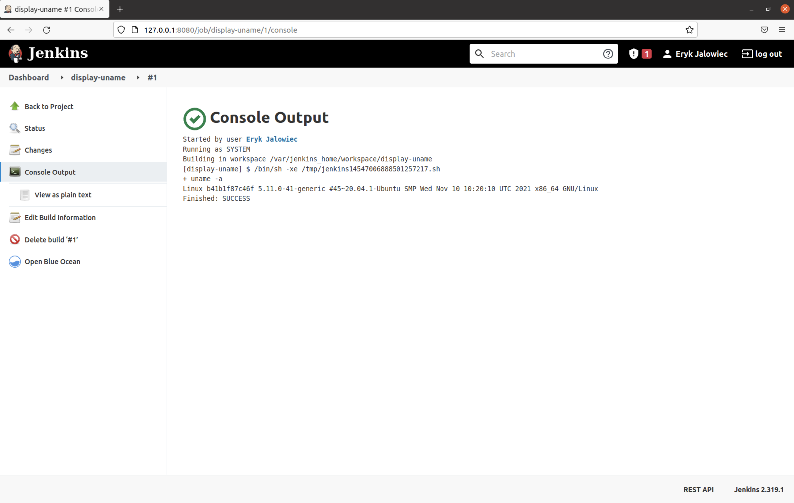

### Utwórz projekt, który zwraca błąd, gdy godzina jest nieparzysta

Projekt jest tworzony w taki sam sposób, zmienia się jedynie skrypt:

```shell
hour=$(date '+%H')
if [ $((hour  % 2 )) -eq 0 ];
then
    echo "is even";
    exit 0;
else
    echo "is odd";
    exit 1;
fi
```


Logi konsolowe:

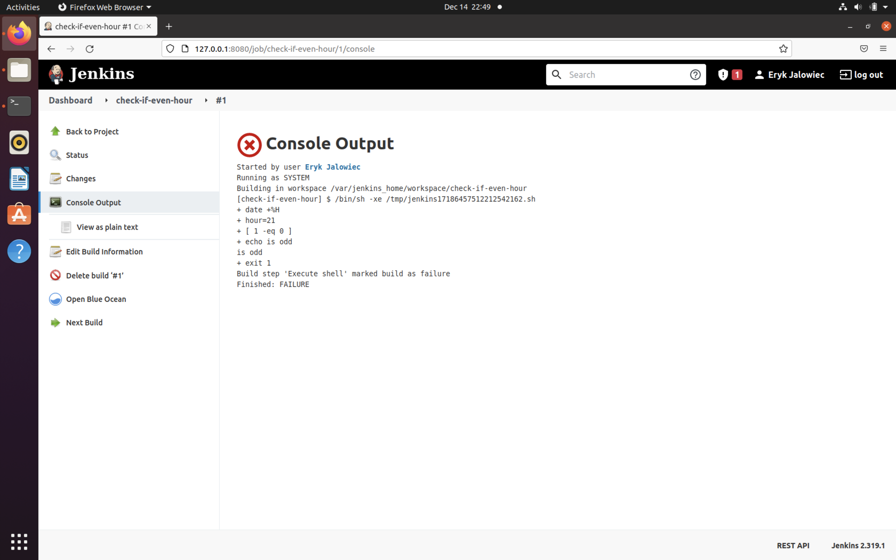

Godzina była w formacie UTC, a czas na mojej maszynie jest CET (UTC + 1), aktualnie 22:51, więc wg czasu UTC, jest to godzina nieparzysta, więc projekt nie zostanie zbudowany.

### Utworzenie "prawdziwego" projektu, który klonuje nasze repozytorium, przechodzi na osobistą gałąź, buduje obrazy z dockerfiles i/lub komponuje via docker-compose

Na początek instaluję wtyczkę **Docker Compose Build Step** wchodząc w **Manage Jenkins** -> **Plugin Manager**:

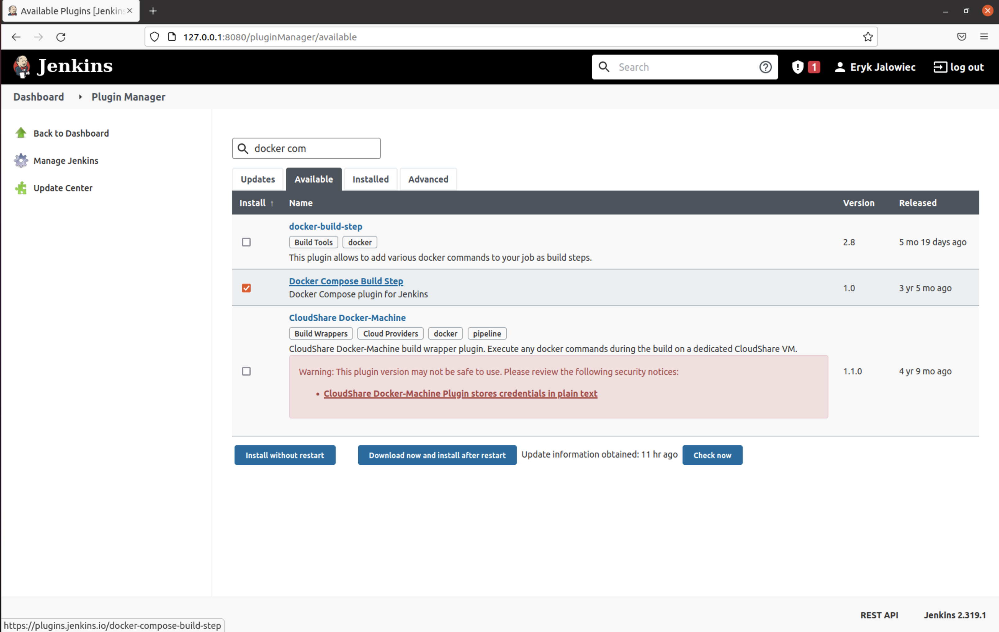

Tworzę nowy projekt **Multi-configuration project**

Następnie wybieram poniższe ustawienia:

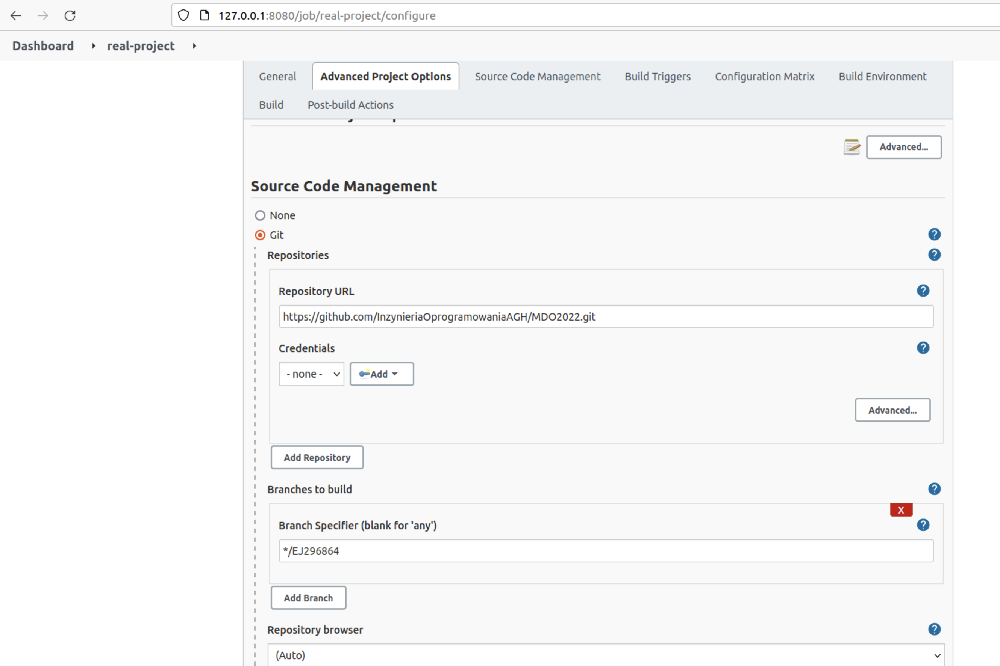

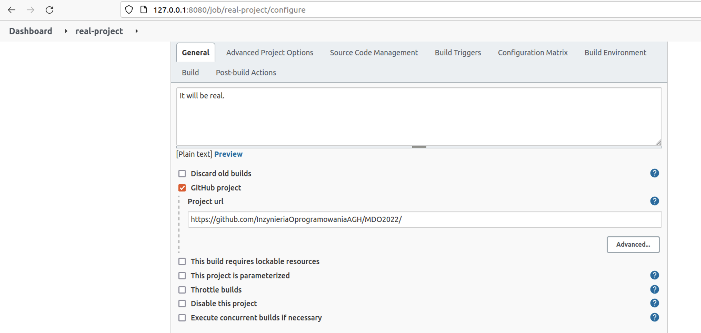

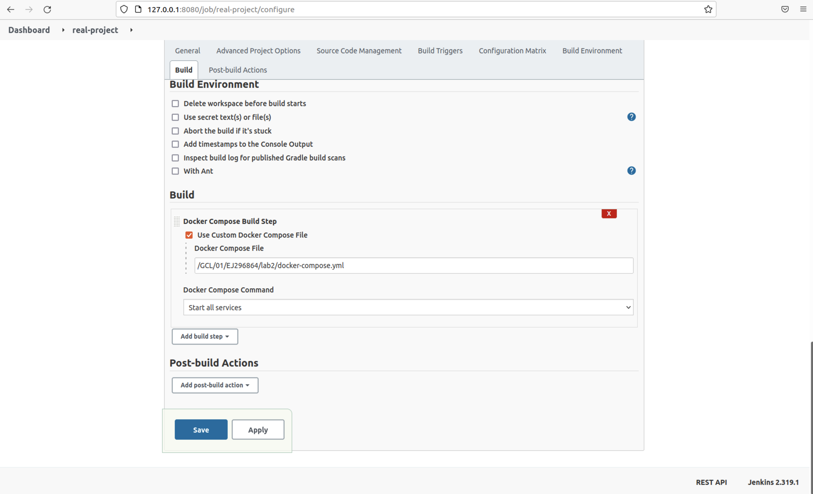

Niestety budowanie nie jest zakończone sukcesem i nie jestem w stanie się dowiedzieć dlaczego, gdyż z logów nic nie wynika:

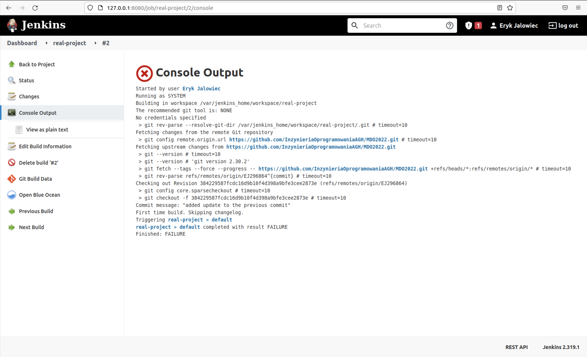