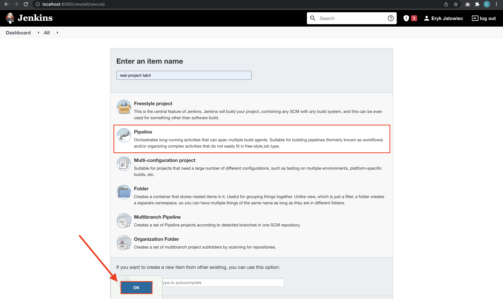
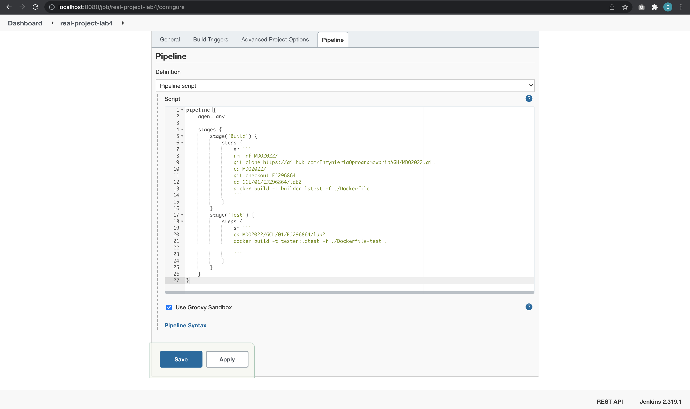
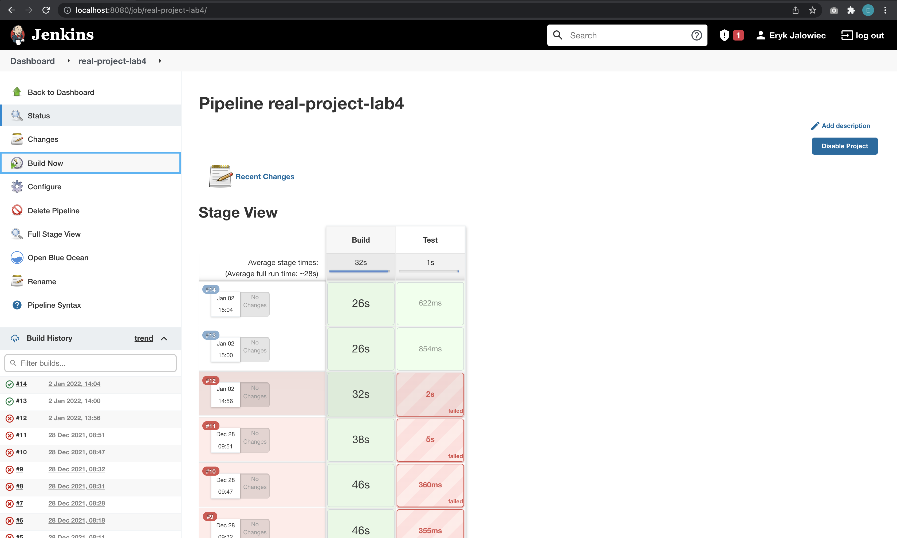

# Metodyki DevOps - lab04

## Środowisko

Ćwiczenia labolatoryjne zostały wykonane na laptopie z macOS Big Sur 11.6

## Zapewnienie dostępności plików w gałęzi

Zapewniono dostęp do Dockerfile, docker-compose, Jenkinsfile.

## Stworzenie Jenkinsfile: opis

### Utworzono nowy pipeline budujący wybraną aplikację, oparty o Jenkinsfile

Utworzono pipeline:

#### Może, ale nie musi, budować się na dedykowanym DIND, ale może się to dziać od razu na kontenerze CI. Należy udokumentować funkcjonalną różnicę między niniejszymi podejściami

#### Wklejanie Jenkinsfile, czyli pipeline zawiera treść Jenkinsfile'a:

Przygotowano Jenkinsfile, wykorzystano obrazy z lab2:

Pipeline, po kilkunastu próbach, finalnie przechodzi:

## Jenkinsfile: przebieg

## Jenkinsfile: powiadomienia

## Jenkinsfile: deploy