# Metodyki DevOps - lab05

## Środowisko

Ćwiczenia labolatoryjne zostały wykonane na laptopie z macOS Big Sur 11.6


## Zestawienie platformy Kubernetes

### Instalacja wymagań wstępnych dla środowiska Minikube

Minikube został zainstalowany na natywnym systemie macOS, zatem nie trzeba było instalować żadnych wymagań wstępnych, typu 2 CPU dla maszyny wirtualnej.

### Instalacja minikube 
https://minikube.sigs.k8s.io/docs/start/

Zainstalowano Minikube według zaleceń dla poniższych ustawień platformy:

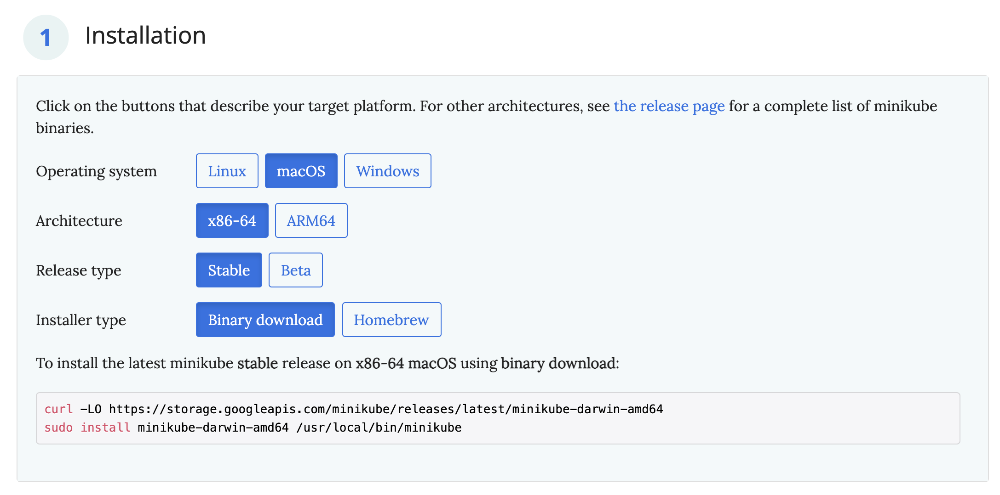

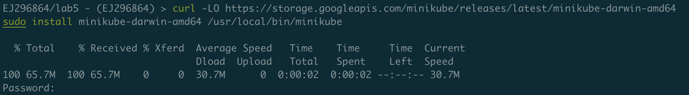

Oprócz tego dodaję alias `alias minikubectl="minikube kubectl --"` do pliku `~/.zshrc`. Jest to trochę inny alias niż sugeruje instrukcja, ponieważ mam zrobiony config pod środowisko produkcyjne w mojej pracy i wolałbym nie zepsuć niczego przypadkowo.

### Instalacja kubectl
https://kubernetes.io/docs/tasks/tools/install-kubectl-macos/

Mogłem zrobić to prostym poleceniem `brew install kubectl` lub `brew install kubernetes-cli`, ale poszedłem zgodnie z guidem, gdzie najpierw była pokazana binarna instalacja, a dopiero potem zobaczyłem Homebrew.

Instalacja kubectl:

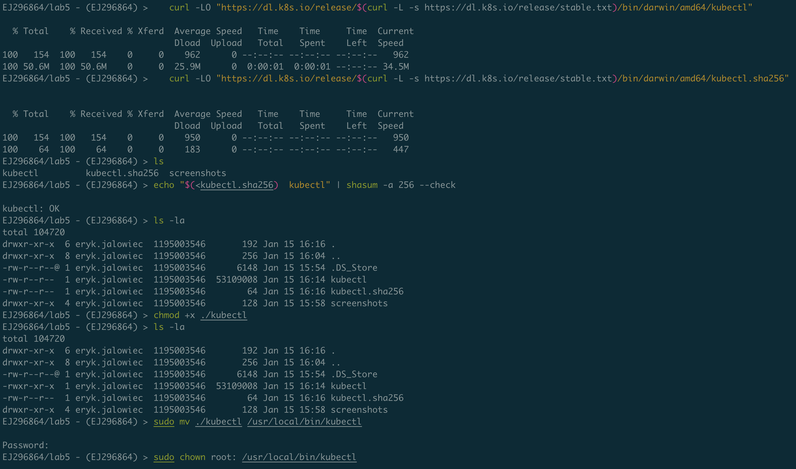

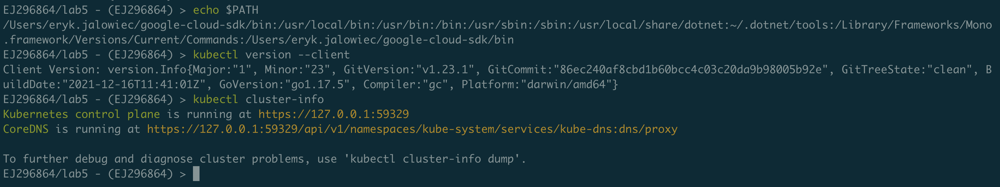

### Przedstawienie uruchomionego oprogramowania wstępnego (i usługi)
#### Platforma konteneryzacji
Uruchamiam Minikube, tak jak zalecono w guidzie:

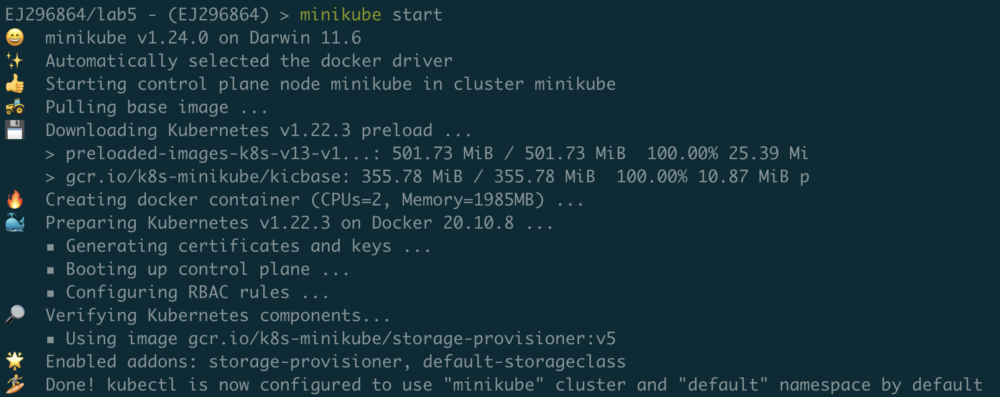

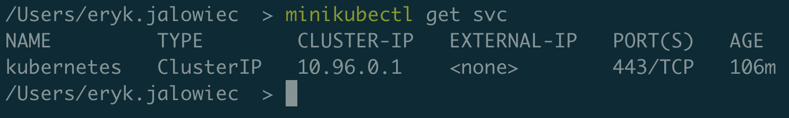

#### Stan Dockera i otwarte porty
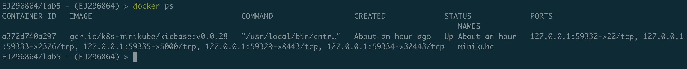

## Stan Minikube
### Uruchomienie Minikube Dashboard

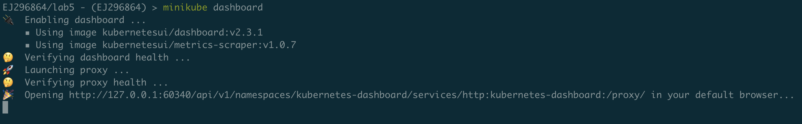

### Wyświetlenie działających usług (k8s) i wdrożeń (stan "przed")

W panelu po lewej wchodzę do zakładki **Services** i wyświetlam działające usługi: 

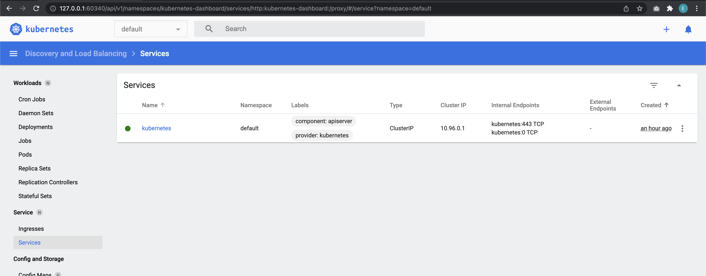

oraz zakładki **Deployments**, i wyświetlam wdrożenia:

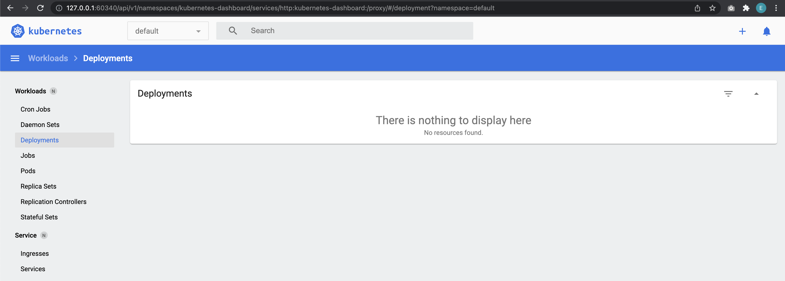

## Wdrożenie kontenera via k8s
### Wdrożenie przykładowego deploymentu "hello k8s": ```k8s.gcr.io/echoserver```
Wdrażam deployment "hello k8s":

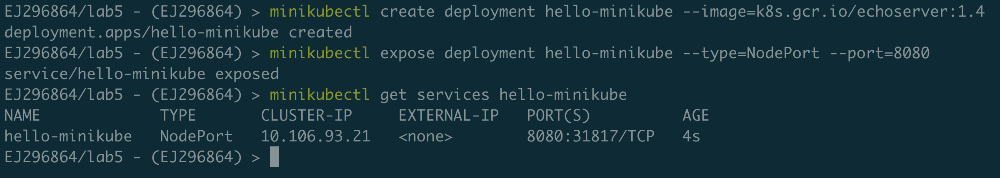

Dostęp do serwisu minikube otrzymujemy poprzez uruchomienie przeglądarki stosując:

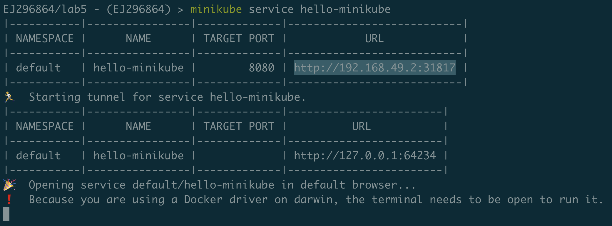

Jak widać, działa:

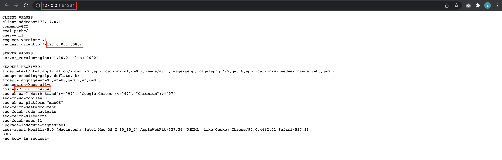
### Użycie ```kubectl run <ctr> --image=<DOCKER_ID>/ --port=<port> --labels app=ctr```
### Przekierowanie portów

Przekierowuje porty:

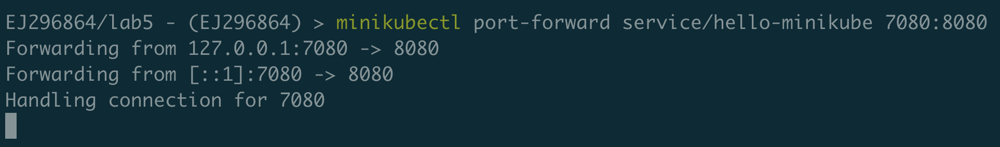

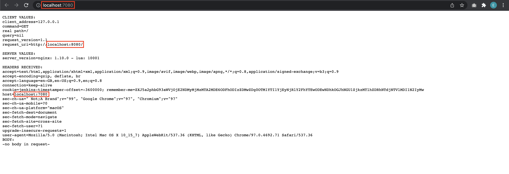

### Wykazanie, że wdrożenie nastąpiło

Nastąpiło wdrożenie:

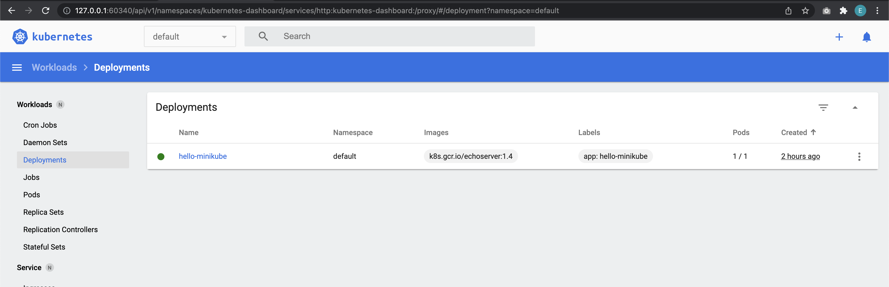

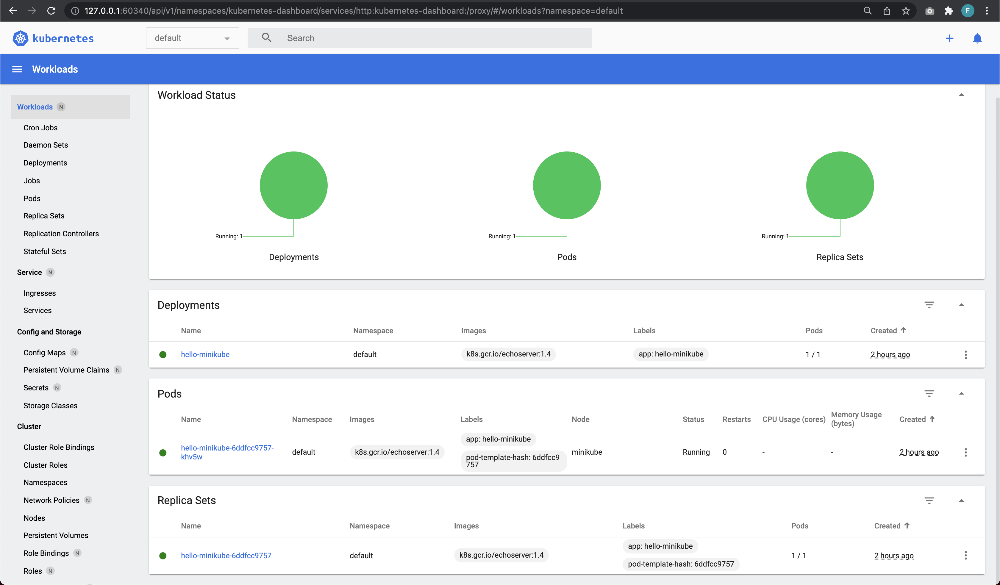

### Opisanie napotkanych ograniczeń, W przypadku "niemożliwych" wdrożeń 
