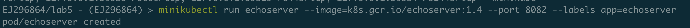
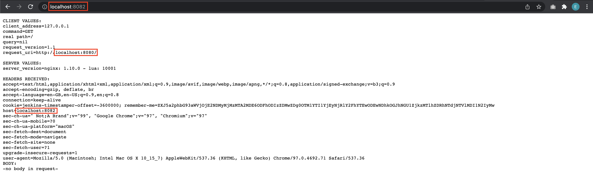
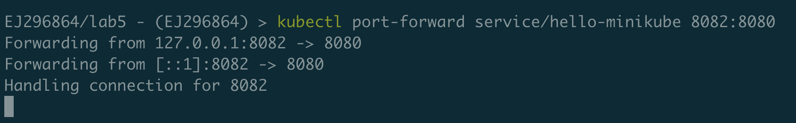
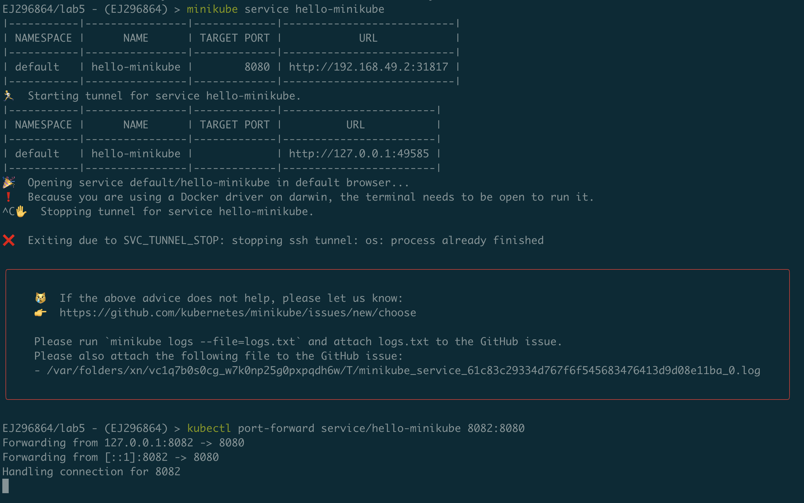
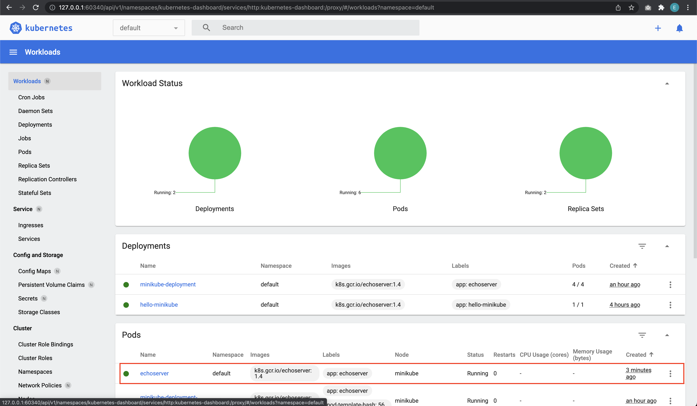
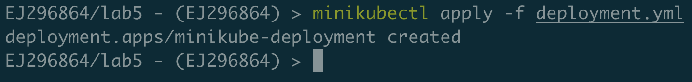
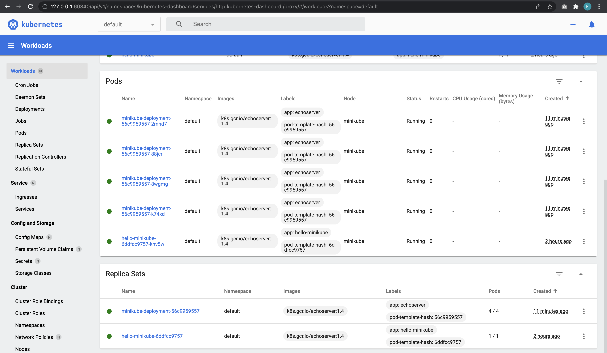

# Metodyki DevOps - lab05

## Środowisko

Ćwiczenia labolatoryjne zostały wykonane na laptopie z macOS Big Sur 11.6


## Zestawienie platformy Kubernetes

### Instalacja wymagań wstępnych dla środowiska Minikube

Minikube został zainstalowany na natywnym systemie macOS, zatem nie trzeba było instalować żadnych wymagań wstępnych, typu 2 CPU dla maszyny wirtualnej.

### Instalacja minikube 
https://minikube.sigs.k8s.io/docs/start/

Zainstalowano Minikube według zaleceń dla poniższych ustawień platformy:


Oprócz tego dodaję alias `alias minikubectl="minikube kubectl --"` do pliku `~/.zshrc`. Jest to trochę inny alias niż sugeruje instrukcja, ponieważ mam zrobiony config pod środowisko produkcyjne w mojej pracy i wolałbym nie zepsuć niczego przypadkowo.

### Instalacja kubectl
https://kubernetes.io/docs/tasks/tools/install-kubectl-macos/

Mogłem zrobić to prostym poleceniem `brew install kubectl` lub `brew install kubernetes-cli`, ale poszedłem zgodnie z guidem, gdzie najpierw była pokazana binarna instalacja, a dopiero potem zobaczyłem Homebrew.

Instalacja kubectl:


### Przedstawienie uruchomionego oprogramowania wstępnego (i usługi)
#### Platforma konteneryzacji
Uruchamiam Minikube, tak jak zalecono w guidzie:


#### Stan Dockera i otwarte porty


## Stan Minikube
### Uruchomienie Minikube Dashboard


### Wyświetlenie działających usług (k8s) i wdrożeń (stan "przed")

W panelu po lewej wchodzę do zakładki **Services** i wyświetlam działające usługi: 


oraz zakładki **Deployments**, i wyświetlam wdrożenia:


## Wdrożenie kontenera via k8s
### Wdrożenie przykładowego deploymentu "hello k8s": ```k8s.gcr.io/echoserver```
Wdrażam deployment "hello k8s":


Dostęp do serwisu minikube otrzymujemy poprzez uruchomienie przeglądarki stosując:


Jak widać, działa:


### Użycie ```kubectl run <ctr> --image=<DOCKER_ID>/ --port=<port> --labels app=ctr```

Użyłem dokładnie tej komendy `minikubectl run echoserver --image=k8s.gcr.io/echoserver:1.4 --port 8082 --labels app=echoserver`:



### Przekierowanie portów

Przekierowuje porty:





### Wykazanie, że wdrożenie nastąpiło

Jak widać na poniższym zrzucie, muszę wyjść z tunnelowania ręcznie, gdyż używam driver Dockera na macOS i jest problem. Poza tym nastąpiło wdrożenie:





## Deployment
### Utworzenie pliku YAML z "deploymentem" k8s

https://kubernetes.io/docs/concepts/workloads/controllers/deployment/

Plik YAML został utworzony:

```yaml
apiVersion: apps/v1
kind: Deployment
metadata:
  name: minikube-deployment
  labels:
    app: echoserver
spec:
  replicas: 4
  selector:
    matchLabels:
      app: echoserver
  template:
    metadata:
      labels:
        app: echoserver
    spec:
      containers:
        - name: hello-minikube
          image: k8s.gcr.io/echoserver:1.4
          ports:
            - containerPort: 8081
```


### Zestawienie 4 replik, opisanie zalet i wad takiej liczby
#### Zalety

* Awaria jednej z replik spowoduje przekierowanie ruchu na kolejne.
* Uszkodzona replika powinna się zrestartować, ponieważ control-plane będzie chciał utrzymać stan 4 replik.
* Więcej niż jedej ReplicaSet chroni przed downtime.

#### Wady

* Raczej jest mało prawdopodobne, żeby tak duża liczba replik była potrzebna do takiej prostego Deploymentu, jeśli by to było coś ważnego, to w porządku.
* Raczej rzadko pada więcej niż jedna replika na raz.
* Zapłacimy więcej, chyba, że firma stawia to ok.

### Zaaplikowanie wdrożenia via ```kubectl apply -f plik.yml``

Wdrożono deployment komendą `minikubectl apply -f deployment.yml` (w moim przypadku):



### Wykazanie przeprowadzonego deploymentu



