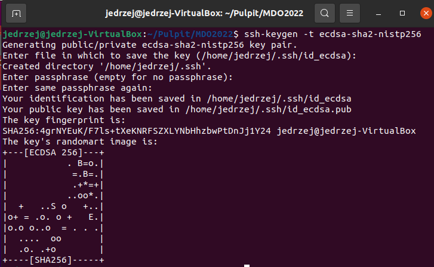
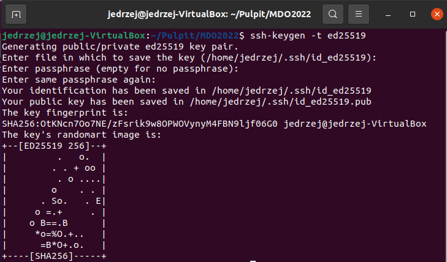
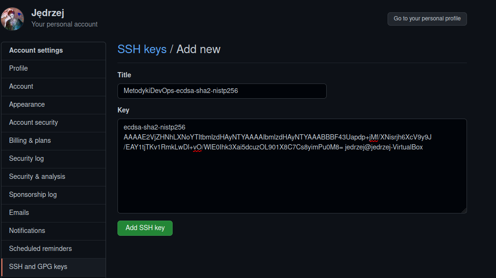
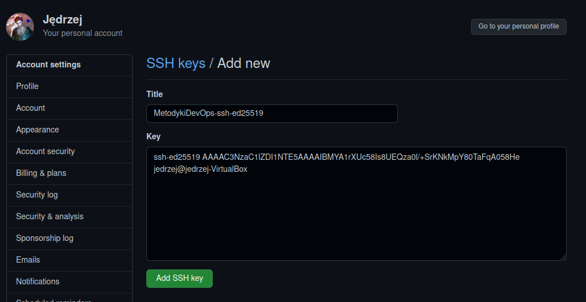
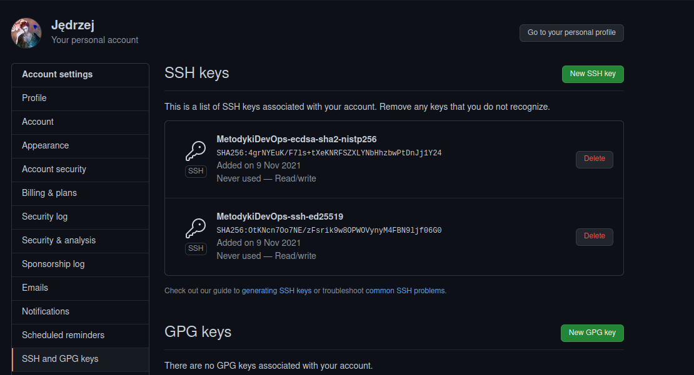
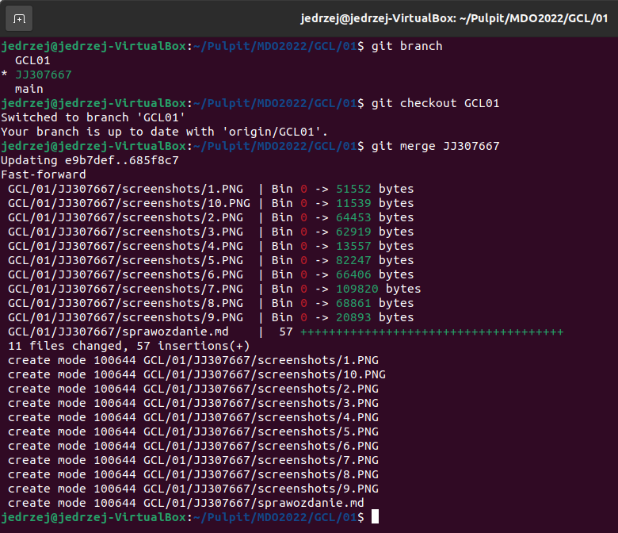
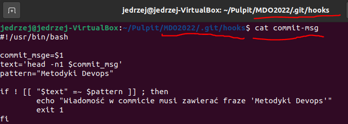
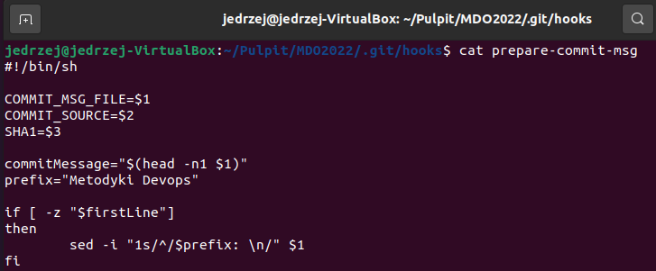
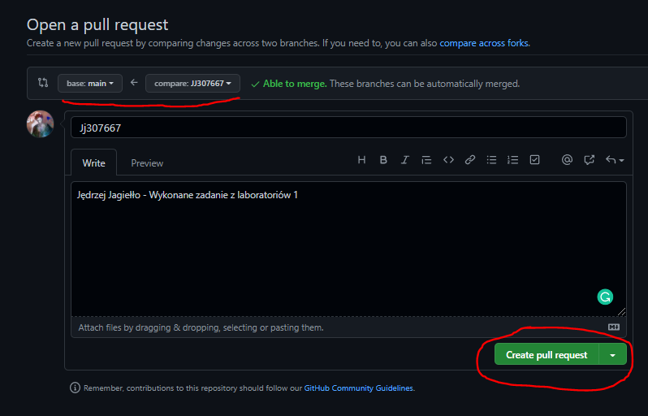

# Metodyki DevOps - Labolatoria 1

### Ściągamy niezbędne narzędzia (github, ssh)
Komendy:
sudo apt-get install git
sudo apt-get install ssh

Następnie należy również skonfigurować githuba:
git config --global user.name “NASZNICK”
git config --global user.email “naszemail@gmail.com”

### Klonujemy repozytorium za pomocą HTTPS

Wykorzystujemy do tego komendę **git clone**

### Klonujemy repozytorium za pomocą klucza SSH

Pierwszy klucz generujemy z pomocą komendy **ssh-keygen -t ecdsa-sha2-nistp256**. Po wpisaniu komendy możemy podać ścieżkę gdzie chcemy wygenerować klucz (jeśli tego nie zrobimy zostanie wybrana ta z nawiasu) + podajemy hasło:

Drugi klucz generujemy z pomocą komendy **ssh-keygen -t ed25519**:

Klucze znajdują się w podanej wcześniej w nawiasach lokalizacji:

W następnym kroku musimy dodać stworzone klucze do naszego konta Github:

W tym po wejściu na stronę Githuba **klikamy w prawym górnym rogu nasz awatar -> Settings -> SSH and GPG keys -> New SSH key** i dodajemy nasze klucze:

Tak to powinno wyglądać po dodaniu:

Po dodaniu kluczy, mamy możliwość sklonowania repozytorium za pomocą SSH:

### Przełączamy się na gałąź naszej grupy
Wykorzystamy do tego polecenie **git checkout**

### Tworzymy nową gałąź według podanego wzorca (inicjały & nr indeksu)

Tworzymy nową gałąź **JJ307667** za pomocą komendy **git checkout -b** - dzięki fladze '-b' odrazu przerzucamy się na nowo stworzoną gałąź.

### Wysyłanie zmian do zdalnego źródła

W tym celu wykorzystamy trzy komendy:
**git add .** - Dodawanie wszystkich plików do staga
**git commit -m 'Wiadomość commita'** - Zrobienie commita z plików znajdujących się na stagu
**git push --set-upstream origin *nazwa gałęzi* ** - Wysłanie zmian na wskazaną gałąź

### Wciągnięcie naszej gałęzi (JJ307667) do gałęzi grupowej (GCL01)

Aby móc wciągnąć naszą gałąź do gałęzi grupowej, najpierw musimy przenieść się na gałąź do której chcemy zmergować inną gałąź. W tym przypadku to GCL01 - robimy to poleceniem **git checkout GCL01**.

Mergowanie naszej dotychczasowej gałęzi JJ307667 wykonujemy za pomocą polecenia **git merge JJ307667**.

Lokalnie odbywa się to bez problemu:

Niestety nie jesteśmy w stanie wysłać naszych zmian do zdalnego repozytorium ponieważ ma ono zablokowaną taką opcję:

### Oznaczanie tagiem ostatniego commita i wypchniecie go

Po zrobieniu commita który chcemy otagować, wykonujemy następujące polecenie:
**git tag V1.JJ -a -m 'Tag wersji V1 - Jędrzej Jagiełło'** - Tworzymy tag o nazwie V1.JJ, z dodanymi informacjami o użytwkoniku (flaga -a) i wiadomością (flaga -m)

Następnie pushujemy zmiany wraz z tagami za pomocą polecenia **git push --tags**

### Ustalanie hooka, który będzie sprawdzał, czy wiadomość z commita zawiera frazę "Metodyki Devops"

W tym celu należy wejść do głównego folderu naszego repozytorium, następnie do folderu .git -> hooks i stworzyć plik o nazwie **commit-msg** (bez żadnego rozszerzenia!). Następnie należy napisać odpowiedni skrypt:

Przy następnej próbie wgrania commita bez frazy "Metodyki Devops", otrzymujemy wiadomość:

### Ustawienie hooka tak, aby ustawiał prefiks wiadomości commitu w ten sposób, aby dodawał do niego nazwę przedmiotu

Należy udać się do tej samej ścieżki co w poprzednim punkcie i stworzyć plik **prepare-commit-msg** (bez żadnego rozszerzenia!). Następnie należy wzbogacić go o ten skrypt:

Jak widać, działa poprawnie:

### Wystawienie pull request do gałęzi grupowej

Aby to zrobić, należy wejść w nasze repozytorium, klikąć **pull request** i następnie nacisnąć **New pull request**

Następnie kilkamy **Create pull request**, wpisujemy nasz komentarz i potwierdzamy klikając **Create pull request**

