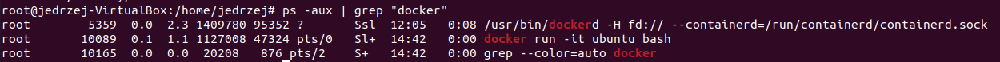

# Metodyki DevOps - Labolatoria 2

## Zestawienie środowiska

### Instalacja Dockera w systemie linux

**Komendy:**
- sudo apt-get install docker-cd docker-cd-cli containerd.io

### Pobieramy obrazy hello-world, busybox, ubuntu

**Komendy:**
- docker pull [nazwa obrazu]

### Uruchamiamy busybox
**Efekt uruchominia kontenera: **
**Komendy:**
- docker run [nazwa obrazu]
- docker ps -a

**Podłączenie się do kontenera interaktywnie i wywołanie numeru wersji**
**Komendy:**
- docker run -it [nazwa obrazu]
- busybox | head -1

### Uruchomić "system w kontenerze"

**Procesy wykonane przy połączeniu interaktywnym z systemem ubuntu**:

**Komendy:**
- docker run -it [nazwa obrazu systemu] bash
- ps ax

**Procesy dockera na hoście (wywołane na w osobnym oknie)**:

**Komendy:**
- ps -aux | grep "docker"

### Pokazać uruchomione kontenery (nie działające) i je wyczyścić:

**Komendy:**
- docker ps -a
- docker rm $(docker ps -a -q)

### Czyszczenie obrazów

**Komendy:**
- docker image
- docker rmi $(docker images -q)

Przed usunięciem wszystkich obrazów, trzeba było wcześniej zastopować kontener z ubuntu komendą **docker stop [id kontenera]**.

## Budowanie programu

### Znalezienie projektu który łatwo umożliwia wywołanie testów jednostkowych

Naszy repozytorium będzie **node-js-getting-started**
https://github.com/lyhd/reactjs

### Przeprowadzić budowę/konfigurację środowiska

W tym przypadku mamy bardzo mocno uproszczoną sprawę. Należy ściągnąć projekt za pomocą komendy **git clone**, wejść do ściągniętego repozytorium w terminalu i wpisać komendę **npm install** (po upczednim zainstalowaniu samego npm). Po ściągnięciu wszystkiego, wystarczy wpisać **npm start**, wejść w przeglądarkę i wyszukać **localhost:5000**.

### Uruchomić testy

### Stworzenie dockerfile (build + test)+ tworzenie obrazu + run

**Komendy:**
- docker build -t=[nazwa_obrazu_po_stworzeniu] -f [nazwa dockerfile] .

**Build:**
Zbudowano dwa następujące pliki dockerowe + stworzone obraz:

Jak widzimy, działa bez zarzutu:

**Test:**
W CMD trzeba było na końcu dodać "a", ponieważ testy zaimplementowane w pobranym projekcie mają osobny interface do testów w którym należy wybrać tryb testu jaki chcemy.

Również możemy zauważyć że działa bez zarzutu:

## Kompozycja

**Komendy:**
- docker docker-compose.yml up
- docker docker-compose.yml down

Stworzono następujący plik docker-compose:

Uruchamiamy nasz plik docker-compose.yml:

Na końcu po teście możemy wyłączyć nasz plik

