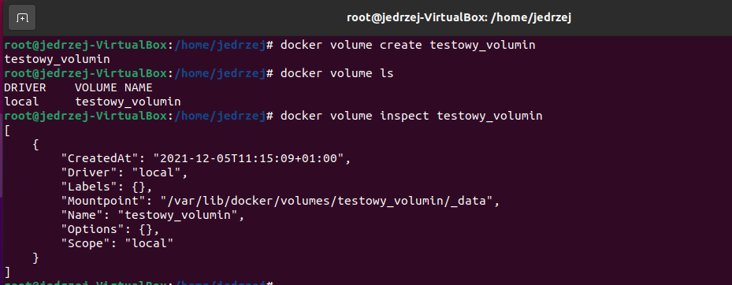
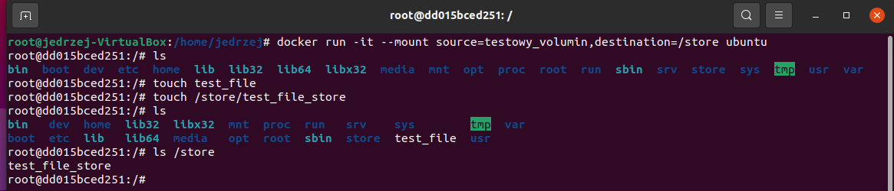
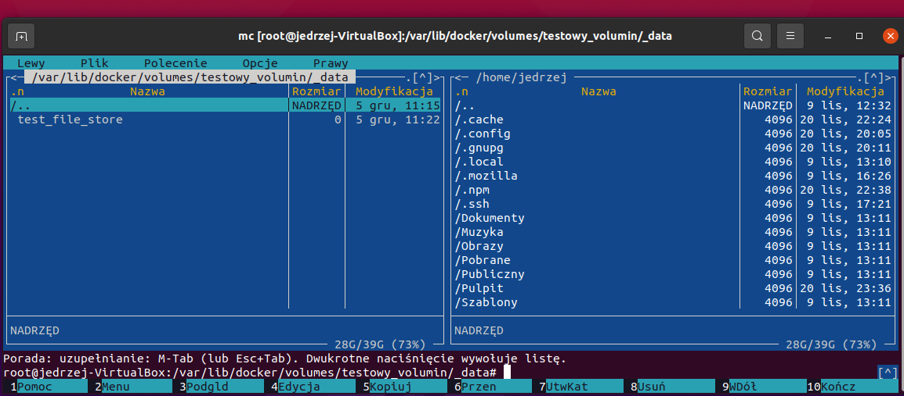
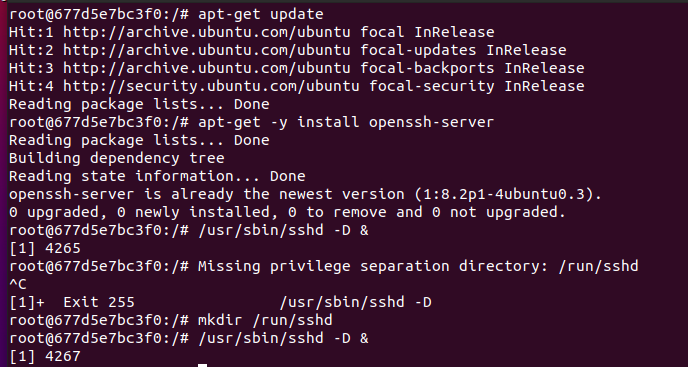
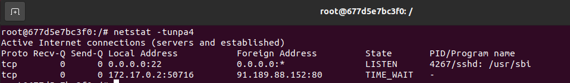
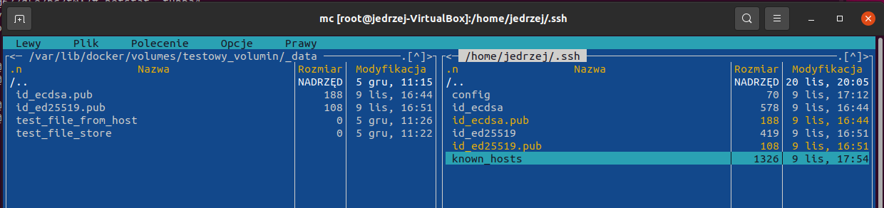
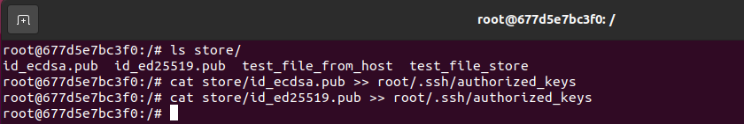
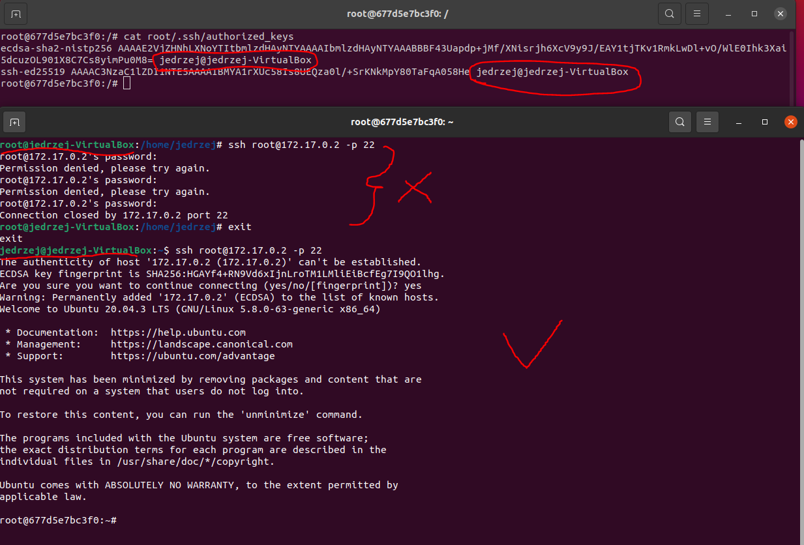

# Metodyki DevOps - Laboratoria

#### Łączność i woluminy na podstawie "złych" praktyk

* Pobierz obraz Ubuntu


* Podłącz wolumin do kontenera
* Skopiuj plik do katalogu woluminu, pokaż w kontenerze
* Utwórz plik w kontenerze, na obszarze woluminu, pokaż na hoście

Tworzenie woluminu

```sh
docker volume create [nazwa nowego woluminu]
docker volume ls
docker volume inspect [nazwa stworzonego woluminu]
```




Podłączanie woluminu do kontenera + tworzenie nowego pliku do wolumenu z poziomu kontenera

```sh
docker run -it --mount source=[nazwa woluminu],destination=/store [nazwa obrazu]
```


Stworzony plik widać na hoście:



Tworzenie pliku na hoście i wyświetlanie w kontenerze:


#### "Kiepski pomysł": SSH
* Uruchom i wyeksponuj wybrany port w kontenerze
* zmień port na wybrany port >1024

```sh
docker run -it --mount source=[nazwa woluminu],destination=/store --publish [port_na_hoście]:[port_kontenera] [nazwa obrazu]
```


* Zainstaluj w kontenerze serwer ssh

```sh
apt-get update
apt-get -y install openssh-server
```
**Należy pamiętać o stworzeniu folderu /run/sshd (komenda mkdir /run/sshd)**



* odnajdź adres IP kontenera w wewnętrznej sieci

**Należy najpierw zainstalować net-tools (komenda apt install net-tools)**




* umieść klucz publiczny w woluminie, skopiuj go do pliku zaufanych w kontenerze
* zezwól na logowanie root

```sh
mc /var/lib/docker/volumes/[nazwa woluminu]/_data
```
Miałem u siebie dwa klucze publiczne więc dla pewności skopiowałem oba



Skopiowanie zawartości obu kluczy publicznych z woluminu do root/.ssh/authorized_keys na kontenerze



* uruchom usługę, połącz się z kontenerem

Ponieważ w moim przypadku dostępy w kluczach publicznych były dla użytkownika jedrzej a nie root, na hoście musiałem wylogować się z roota aby się połączyć.




#### Skonteneryzowany Jenkins stosujący Dockera

#### Przygotowanie
* Upewnij się, że Dockerfiles i Docker Compose z poprzednich zajęć są w repozytorium
* Zapoznaj się z instrukcją https://www.jenkins.io/doc/book/installing/docker/
  * Uruchom obraz Dockera który eksponuje środowisko zagnieżdżone
  * Przygotuj obraz blueocean na podstawie obrazu jenkinsa
  * Uruchom blueocean
  * Zaloguj się i skonfiguruj Jenkins

#### Mikro-projekt Jenkins
* Utwórz projekt, który wyświetla uname
* Utwórz projekt, który zwraca błąd, gdy... godzina jest nieparzysta
* Utwórz "prawdziwy" projekt, który:
  * klonuje nasze repozytorium
  * przechodzi na osobistą gałąź
  * buduje obrazy z dockerfiles i/lub komponuje via docker-compose

#### Sprawozdanie
* Opracuj dokument z diagramami UML, opisującymi proces CI. Opisz:
  * Wymagania wstępne środowiska
  * Diagram aktywności, pokazujący kolejne etapy (collect, build, test, report)
  * Diagram wdrożeniowy, opisujący relacje między składnikami, zasobami i artefaktami
