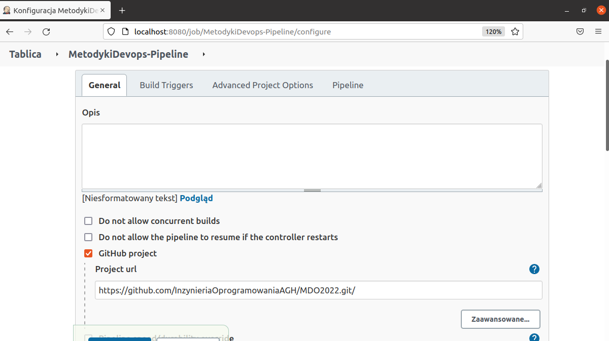
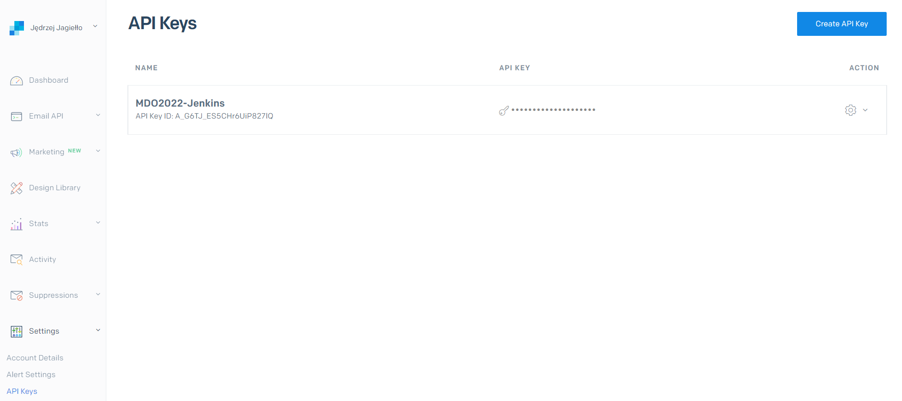
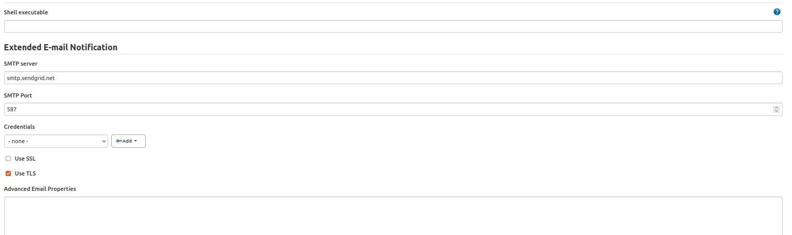
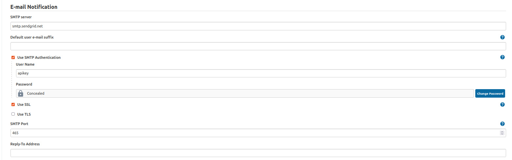
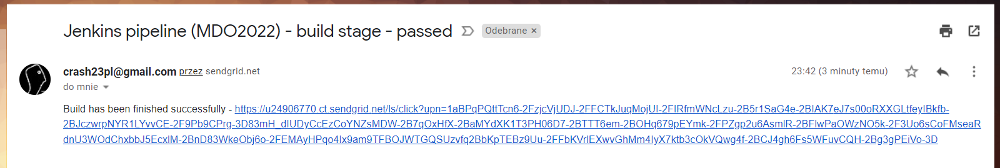
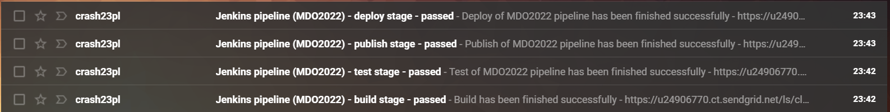
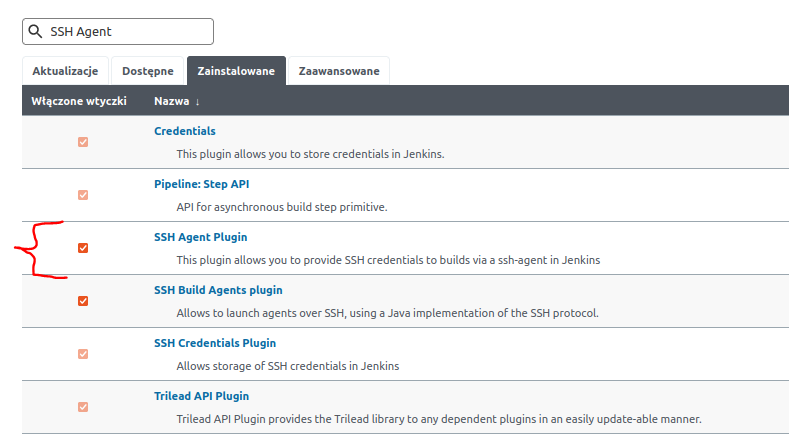
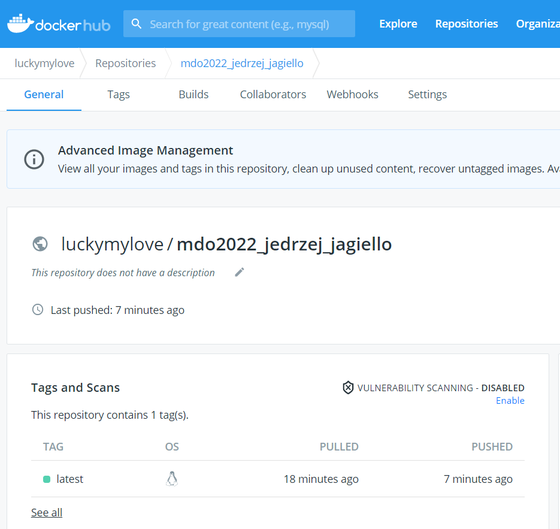
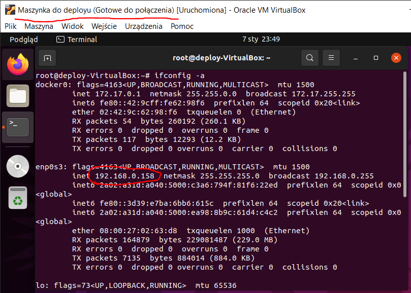

# Zajęcia 04

## Wprowadzenie

### Zapewnij dostępność plików w gałęzi
 * skrypty, Docker files, kompozycje (jeżeli są), Jenkinsfile
 * dostępne w odpowiedniej gałęzi i katalogu w MDO2022

### Stwórz Jenkinsfile: opis
 * Utwórz nowy pipeline budujący wybraną aplikację, oparty o Jenkinsfile
 * Docelowo, ma zawierać etapy "Build" i "Test"
 * Przejściowo, może zawierać jeden etap "Build + Test"
 * Może, ale nie musi, budować się na dedykowanym DIND, ale może się to dziać od razu na kontenerze CI. Należy udokumentować funkcjonalną różnicę między niniejszymi podejściami
 * Początkowo, Jenkinsfile może być albo "wklejony" albo dodany do repozytorium, które jest sforkowane, to znaczy:
  * albo pipeline zawiera treść Jenkinsfile'a
  * albo forkujemy repozytorium wybranej aplikacji i dodajemy Jenkinsfile do niego

#### Tworzymy pipeline

**Wynik uruchomienia**:

### Jenkinsfile: przebieg
https://www.jenkins.io/doc/book/pipeline/jenkinsfile/
* Przykładowe zbiory czynności w Jenkinsfile:
Jednokrokowy pipeline (Build i test), pobierający narzędzie docker-compose i uruchamiajacy docker compose up na kompozycji z poprzednich zajęć
  * build + test
    * download docker-compose
	* compose up

  * build
    * git pull
	* npm install
	* npm build
  * test
    * npm test

### Jenkinsfile: powiadomienia
  * Sekcja "post" dla każdego stage'a, informująca mailem o rezultacie

W naszym przypadku skorzystamy ze strony sendgrid.com jako serwer smtp. Po stworzeniu i skonfigurowaniu konta, tworzymy na stronie API Key który potem podamy w ustawieniach Jenkins:

Następnie w Jenkinsie uzupełniamy potrzebne dane:

Tutaj jako username wpisujemy "apikey" i jako hasło nasz klucz do API.

Po ukończeniu procesu deployowania, wszystko działa bez zarzutu:

### Jenkinsfile: deploy

Jako proces przyjąłem wypchnięcie naszego obrazu do Docker Hub, połączenie się zdalnie przez SSH ze specjalnie stworzoną do tego celu maszyną wirtualną, pobraniu i uruchomieniu go.

**Warto dodać, że w trakcie wykonywania tego ćwiczenia musiałem zaktualizować zawartość pliku Dockerfile-build z zadania 2 + dodać plik Dockerfile-deploy w tym samym folderze.**

Aby całość działała, należy:
* Stworzyć nową wirtualną maszynę z dostępem do sieci.
* Wejść do naszego kontenera Jenkinsa i wygenerować w nim klucze SSH.
* Dodać stworzony klucz prywatny w credencialach w ustawieniach na samym Jenkinsie.
* Przerzucić stworzony klucz publiczny na nowo stworzoną maszyne wirtualną do deployu.

Przed uruchomieniem skryptu, trzeba też zainstalować wtyczkę "SSH Agent":

Uruchamiamy skrypt i jak widać, całość przebiega pomyśline:

Obraz publishuje się na Docker Hub:

Strona się uruchamia z IP naszej nowo stworzonej maszyny wirtualnej:

