# Zajęcia 05

### Zestawienie platformy Kubernetes

* Upewnij się, że kontener jest dostępny
* Zainstaluj wymagania wstępne dla środowiska Minikube
* Zainstaluj minikube i kubectl

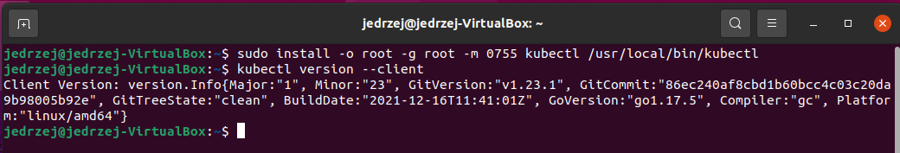
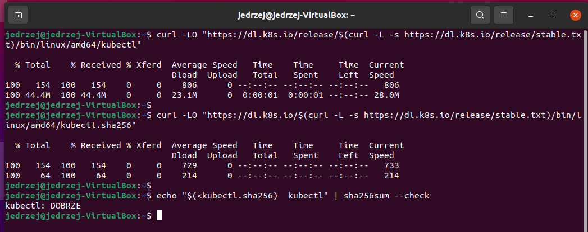
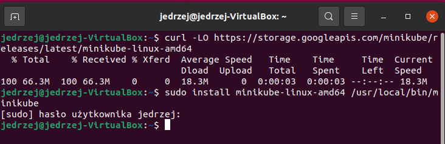

Tak jak poleca dokumentacja, dodajemy również alias:
```sh
alias kubectl="minikube kubectl --"
```


* Przedstaw uruchomione oprogramowanie wstępne (i usługi)
  * Platforma konteneryzacji
  * Otwarte porty
  * Stan Dockera

Możliwe jest, że przy uruchomieniu **minikube start** zwróci nam błąd o braku dostępów naszego użytkownika do usera (komendy tej nie można uruchamiać na roocie!). W takim wypadku możemy poradzić sobie wpisując te komendy:

```sh
sudo groupadd docker
sudo usermod -aG docker $USER
```

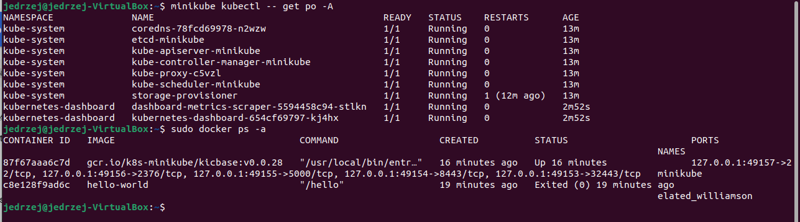


### Stan Minikube
* Uruchom Minikube Dashboard

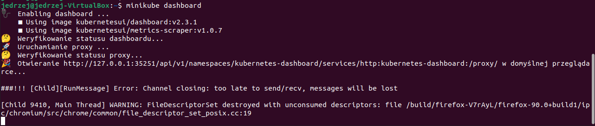

* Wyświetl działające usługi (k8s) i wdrożenia
* Wyświetl dostępne wdrożenia (stan "przed")

Workload:
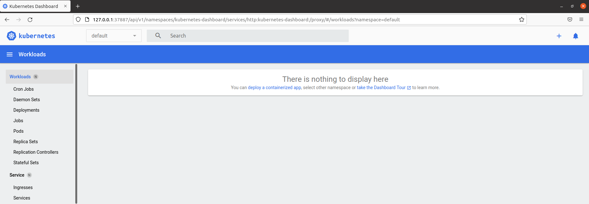

Services:
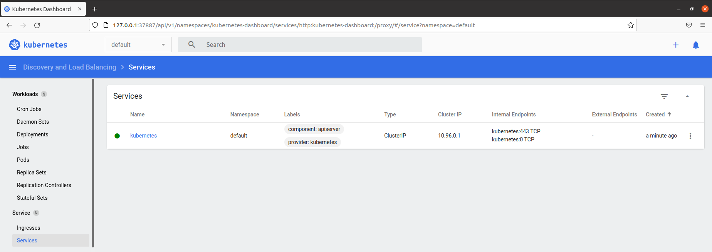


### Wdrożenie kontenera via k8s
* Wdróż przykładowy deployment "hello k8s": ```k8s.gcr.io/echoserver```

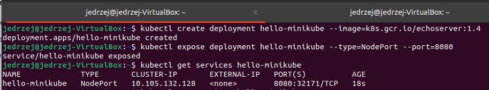

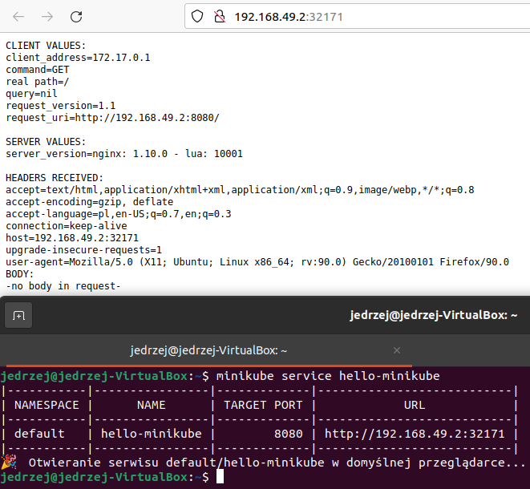


* Przekieruj porty

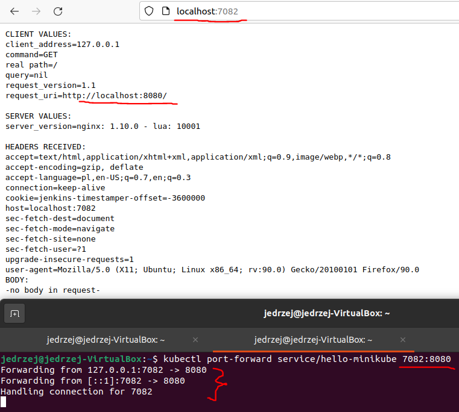


* Wykaż że wdrożenie nastąpiło

Workload:
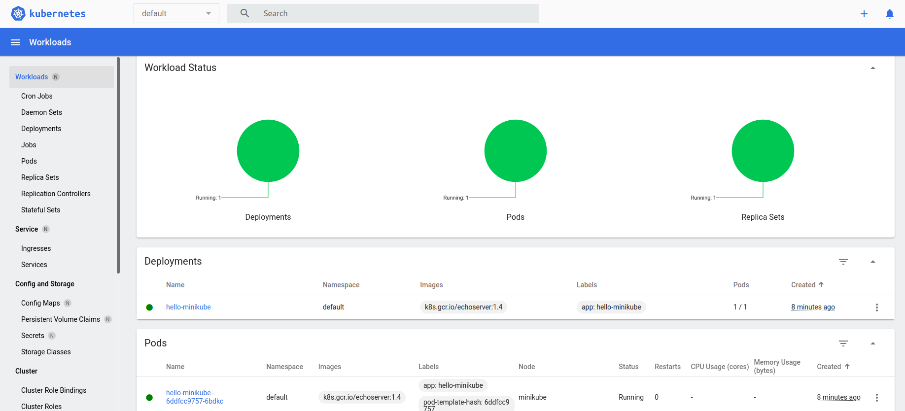

Services:
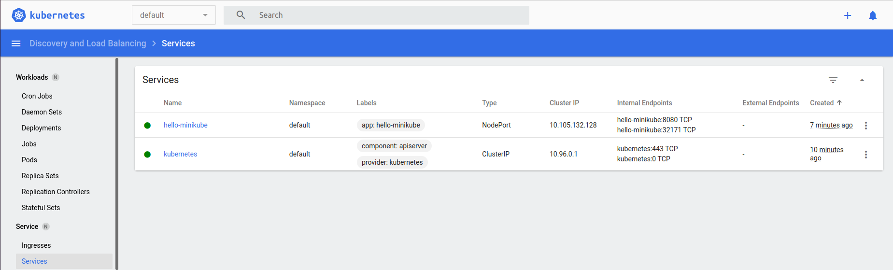


### Deployment
* Utwórz plik YAML z "deploymentem" k8s
* Zestaw 4 repliki, opisz zalety i wady takiej liczby
* Zaaplikuj wdrożenie via ```kubectl apply -f plik.yml```

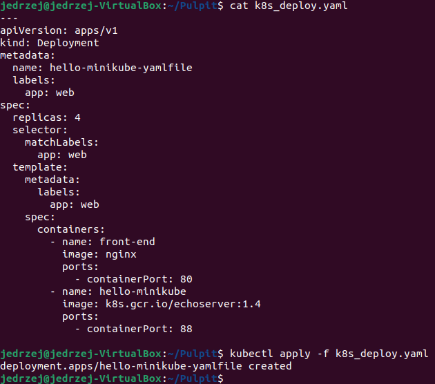

* Wykaż przeprowadzony deployment

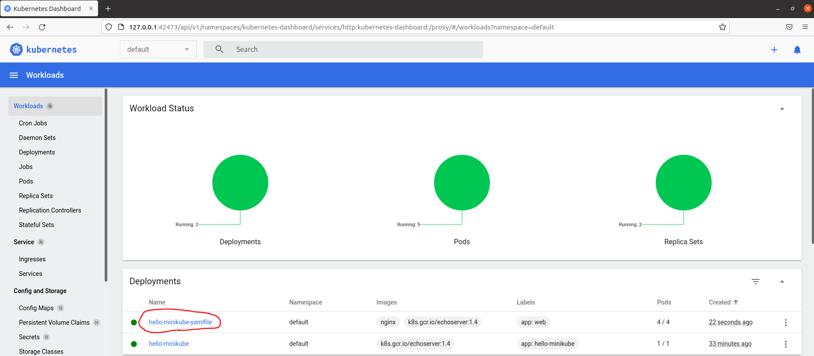
