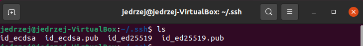

# Metodyki DevOps - Labolatoria 1

### Ściągamy niezbędne narzędzia (github, ssh)
Komendy:
sudo apt-get install git
sudo apt-get install ssh

Następnie należy również skonfigurować githuba:
git config --global user.name “NASZNICK”
git config --global user.email “naszemail@gmail.com”

### Klonujemy repozytorium za pomocą HTTPS

Wykorzystujemy do tego komendę **git clone**

### Klonujemy repozytorium za pomocą klucza SSH

Pierwszy klucz generujemy z pomocą komendy **ssh-keygen -t ecdsa-sha2-nistp256**. Po wpisaniu komendy możemy podać ścieżkę gdzie chcemy wygenerować klucz (jeśli tego nie zrobimy zostanie wybrana ta z nawiasu) + podajemy hasło:

Drugi klucz generujemy z pomocą komendy **ssh-keygen -t ed25519**:

Klucze znajdują się w podanej wcześniej w nawiasach lokalizacji:

W następnym kroku musimy dodać stworzone klucze do naszego konta Github:

W tym po wejściu na stronę Githuba **klikamy w prawym górnym rogu nasz awatar -> Settings -> SSH and GPG keys -> New SSH key** i dodajemy nasze klucze:

Tak to powinno wyglądać po dodaniu:

Po dodaniu kluczy, mamy możliwość sklonowania repozytorium za pomocą SSH:

### Przełączamy się na gałąź naszej grupy
Wykorzystamy do tego polecenie **git checkout**

### Tworzymy nową gałąź według podanego wzorca (inicjały & nr indeksu)

Tworzymy nową gałąź **JJ307667** za pomocą komendy **git checkout -b** - dzięki fladze '-b' odrazu przerzucamy się na nowo stworzoną gałąź.

