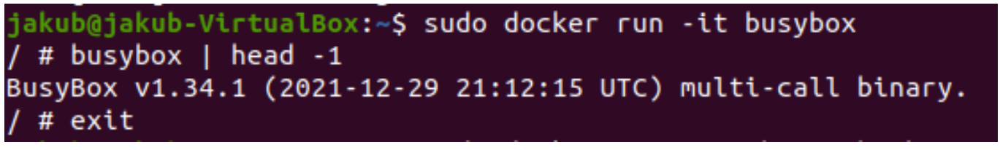

Metodyki DevOps - sprawozdanie 2

## Instalacja dockera

Aby zainstalować dockera z defaultowego repozytorium ubuntu wykonałem następujące
kroki:

1. Update lokalnego repozytorium: **sudo apt update**
2. Upewnienie się, że nie ma zainstalowanej żadnej wersji dockera, w razie czego
   odinstalowanie jej: **sudo apt-get remove docker docker-enginedocker.io**
3. Zainstalowanie dockera: **sudo apt install docker.io**

Fragment z terminala potwierdzający instalacje:

Sprawdzenie wersji po instalacji:

4. Wystartowanie dockera: **sudo systemctl start docker**
5. Umożliwienie uruchamiania go przy starcie: **sudo systemctlenable docker**
6. Sprawdzenie statusu: **sudo systemctl status docker**

Fragment z terminala potwierdzający aktywny status:

I choć w pewnym momencie przy instalacji dockera miałem problem typu:

**Could not get lock /var/lib/dpkg/lock’ Error in Ubuntu Linux**

Udało mi się go rozwiązać poprzez restart maszyny wirtualnej. Prawdopodobnie błąd ten był
spowodowany jakimś procesem, który działał w tle (np. sprawdza aktualizacje).

W następnym kroku pobieram hello-world, busybox, ubuntu oraz mysql.
Używam do tego komendy:

**sudo docker pull <nazwa>**

1. **sudo docker pull hello-world**

2. **sudo docker pull busybox**

3. **sudo docker pull ubuntu**

4. **sudo docker pull mysql**

Sprawdzam, czy na pewno są wszystkie używając: **sudodocker images**

Uruchamiam busybox: **sudo docker run busybox**
i pokazuję efekt uruchomienia: **sudo docker ps -a**

Podłączam się do kontenera interaktywnie i wywołuje numer wersji używając komend:

- **sudo docker run -it busybox**
- **busybox | head -1**

Uruchamiam "system w kontenerze" przy pomocy: **sudodocker run -it ubuntu bash**

Prezentuje PID1 w kontenerze i procesy dockera na hoście:

- **ps ax**
- **ps aux**
- **ls /proc**

- **ps aux | grep “docker”**

Aktualizuje pakiety:

- **apt update**
- **apt upgrade**
  i wychodzę: **exit**

Pokazuje uruchomione ( != "działające" ) kontenery: **sudo docker ps -a**

Czyszczę je używając: **sudo docker container prune**

## Budowanie programu

Znaleziony projekt:https://github.com/mdn/todo-react

### Przeprowadzam budowę/konfigurację środowiska

W tym celu sklonowałem repozytorium za pomocą komendy **git clone** , wszedłem do
ściągniętego repozytorium w terminalu i użyłem komendy **npm install** aby
zainstalować potrzebne paczki (node_modules). Wcześniej oczywiście należy
zainstalować samego npm.Po ściągnięciu wszystkiego użyłem komendy **npm start** ,
aby uruchomić projekt w przeglądarce na localhost:3000.
Komendy użyte do instalacji środowiska:

1. Instalacja node’a: **sudo apt install nodejs**
2. Instalacja npm: **sudo apt install npm**

Klonowanie repozytorium

Instalowanie paczek (node_modules):

Uruchomienie aplikacji:

Uruchomiona aplikacja w przeglądarce:

## Uruchomienie testów

Uruchamiam testy za pomocą komendy: **npm test**

Wynik:

Budowanie obrazu w kontenerze:
Uruchamiam kontener z czystym obrazem Ubuntu: **sudodocker run -it ubuntu**
Robię update: **apt-get update** , następnie **apt-get upgrade** ,
Instaluje wszystko co niezbędne do zbudowania i uruchomienia aplikacji:
curl:

- **apt-get install curl**
- **curl -sL https://deb.nodesource.com/setup_4.x | bash**
  node: **apt-get install nodejs**

Sprawdzam, czy node został poprawnie zainstalowany: **node -v**

npm: **apt-get install npm**
git: **apt install git**

Po zainstalowaniu wszystkiego klonuję repozytorium:

Przechodzę do kataloku: **cd todo-react** , a następnie powtarzam kroki potrzebne do
zbudowania i uruchomienia aplikacji (tj **npm install** , **npm start** )

## Tworzenie Dockerfile

Gdy już mamy komendy, które są nam potrzebne do zbudowania aplikacji na
czystym obrazie Ubuntu i wiemy, że wszystko działa, możemy przystąpić do
zbudowania pliku Dockerfile, który nam ten proces zautomatyzuje.

Uruchamiam komendą: **sudo docker build -t todo-react. -f ./dockerfile**

Wynik:

