# Metodyki DevOps - Projekt zaliczeniowy II

## Zadania do wykonania

1.  ### Znaleźć wśród repozytoriów GitHuba projekt zawierający mechanizm budowania (Automake, Meson, npm...) oraz testy jednostkowe:

       Wybrane zostało repozytorium https://github.com/jterkalski/react-app, które zawiera postawowy projekt utworzyny przez *create-react-app* - domyślny mechanizm buildowania i testy jednostkowe.  
       Projekt posiada licencję **GNU GPL wersji 3** pozwalającą na wykorzystanie w szerokim zakresie, w tym możliwość do forkowania i modyfikowania na własne potrzeby.
       
2.  ### Wykazać w środowisku Docker, że program jest możliwy do zbudowania, a testy przechodzą:
      
      Wymaganiami wstępnymi będzie pobranie obrazu jakiegoś systemu (w moim przypadku będzie to Ubuntu), następnie pobranie narzędzi, które pozwolą na pobranie i zbudowanie projektu, czyli gita oraz nodejs
      
      
      ## Build programu i wykonanie testów w kontenerze: 
      
      1. Pobieram obraz Ubuntu:  
       `docker pull ubuntu`  
       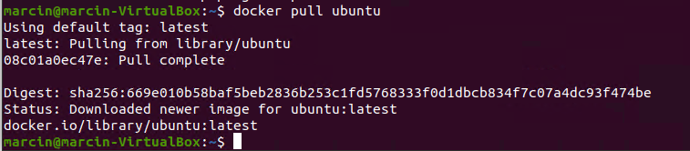  
      
      2. Tworzę kontener z tego obrazu (z flagą **-it**, żeby móc działać na jego konsoli):  
       `docker run -it ubuntu`  
       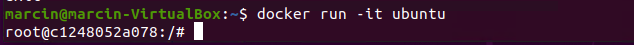  

       3. W kontenerze aktualizuję listę paczek apt-get:  
        `apt-get update`  
       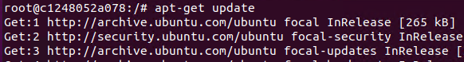  
       
       4. Do wybranego projektu potrzebujemy node.js w wersji 14+ (domyślnie pobiera się wersja 10), więc pobieram narzędzie **curl** i używam go do zaciągnięcia stosownej paczki:  
       `apt-get install curl -y`  
       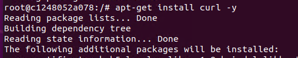  
       
       `curl -fsSl https://deb.nodesource.com/setup_current.x | bash -`  
       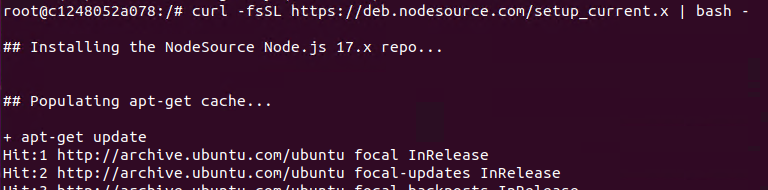  
       
       5. Następnie zaciągam do naszego kontenera **gita** i **nodejs** (przy okazji pobierze się npm, bez kroku 4 trzeba pobrać go oddzielnie):  
       `apt-get install git nodejs -y`  
       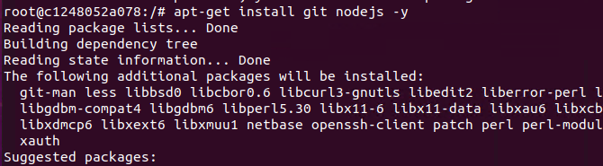
         
       Sprawdzam czy prawidłowo się pobrało:  
         
       
       6. Sklonowanie wybranego repozytorium z GitHuba:  
       `git clone https://github.com/jterkalski/react-app.git`  
       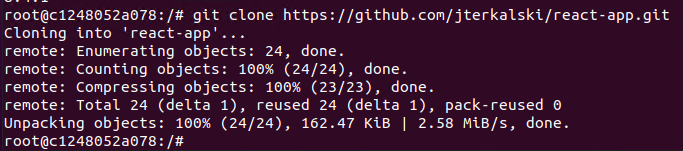  
       
       7. Przechodzę do katalogu głównego projektu i instaluję zależności:  
       `cd /react-app/`  
       `npm install`  
       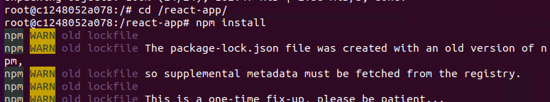  
       
       8. Buduję projekt przy użyciu komendy:  
       `npm run build`  
       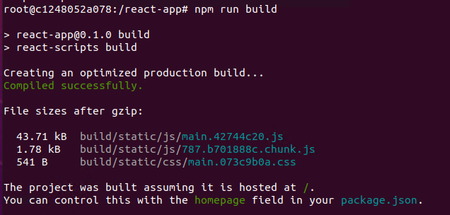  
       
       9. Wykonuję testy stworzone w projekcie (**a** powoduje wykonanie wszystkich testów. Po wywołaniu komendy wyniki wyświetlają się w odświeżonym ekranie):  
       `npm test a`  
       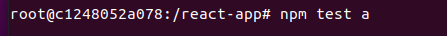  
       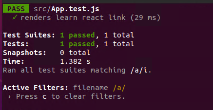  
       
       
       ## Dockerfile
       
       1. Dockerfile umożliwiający ponowienie buildu bez konieczności przygotowania środowiska:  
       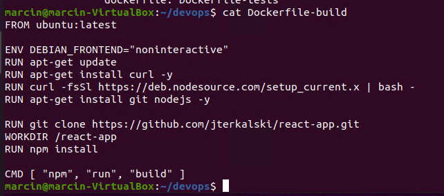  
       
       Dodanie **ENV DEBIAN_FRONTEND="noninteractive"** powoduje mniejszą ilość komunikatów.  
       
       Kolejny punkt, w którym trzeba było dostarczyć Dockerfile uruchamiający testy, oparty o poprzedni Dockerfile (dziedziczący po nim) można było rozumieć na kilka sposobów - czyli można stworzyć obraz z Dockerfile-build i użyć go w Dockerfile-tests, ale wykonałem to dosłownie - przepisałem poprzedniego dockerfile i rozszerzyłem stage'a o wykonanie testów.  
       
       2. Dockerfile rozszerzony o testy:  
       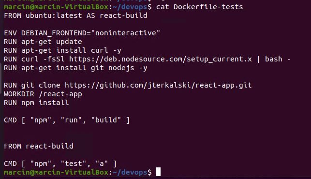  

       ## Docker-compose
       
       1. Aby móc używać docker-compose, na początku pobieram odpowiednie naczędzia (kierując się poradnikiem na stronie https://docs.docker.com/compose/install/):  
       `sudo curl -L "https://github.com/docker/compose/releases/download/1.29.2/docker-compose-$(uname -s)-$(uname -m)" -o /usr/local/bin/docker-compose`  
       `sudo chmod +x /usr/local/bin/docker-compose`  
       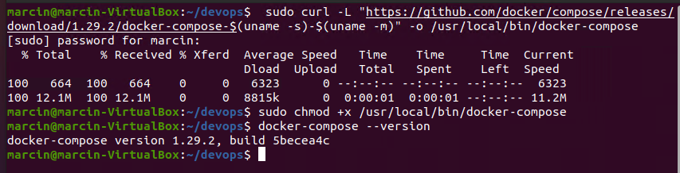  
       
       2. Kompozycja uruchamiająca dockerfile z poprzednich kroków:  
       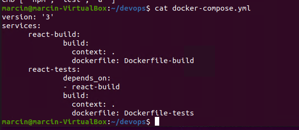  
       
       3. Uruchamiam kompozycję:  
       `docker-compose up --build`  
       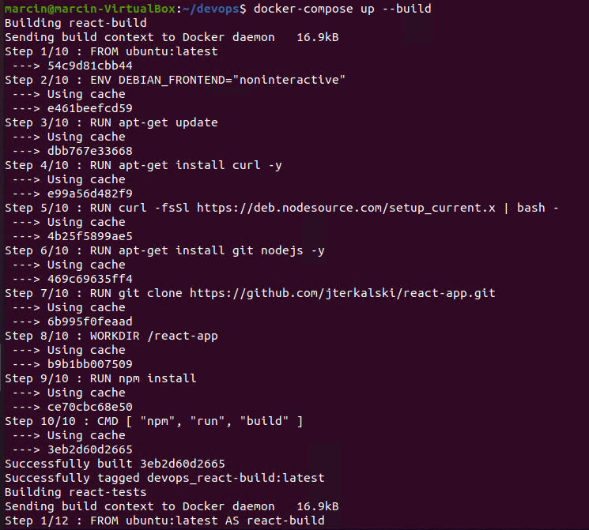  
       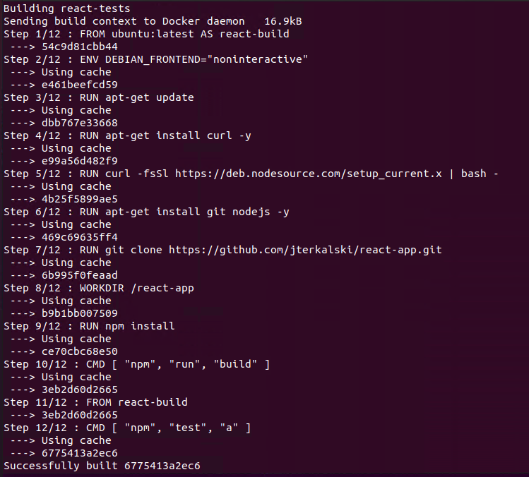  
       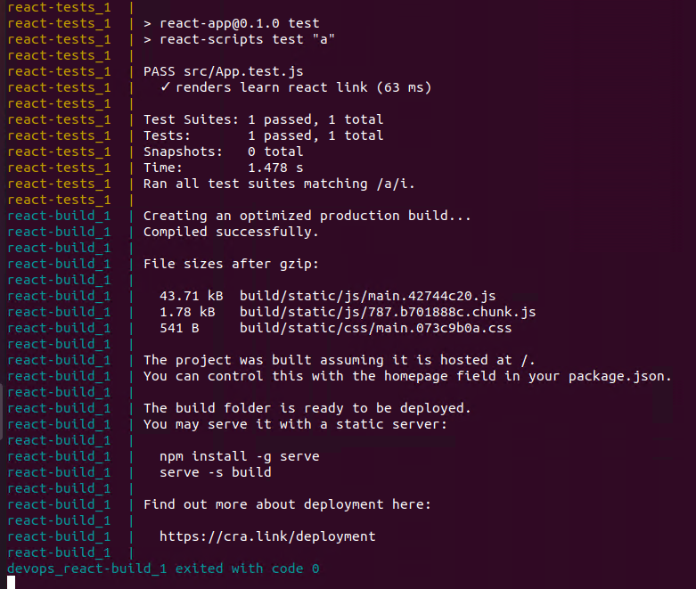  
       
       Nie było to pierwsze uruchomienie, więc większość została pobrana z cashe:) Możemy też zauważyć, że duplikacja kodu pierwszego dockerfile nie powodowała ponownego budowania - je też pobrało z cache'a.  
       Budowanie projektu oraz wykonanie testów przebiegło pomyślnie. 

3.  ### Wykazać, że zbudowany program można uruchomić i wykorzystać  
       
       W celu uruchomienia i wykorzystania programu, dodałem do Dockerfile-build komendę `npm start`, która uruchamia aplikację i zapisałem jako nowy Dockerfile-start i zbudowałem za pomocą komendy `docker build react-start -f Dockerfile-start .` :  
       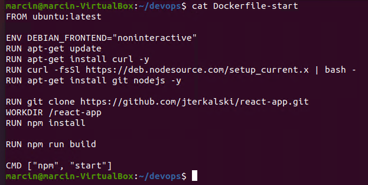  
       
       
       Wybrana aplikacja jest aplikacją webową, więc w celu sprawdzenia działania musimy uruchomić ją na zewnątrz kontenera. W tym celu tworzymy kontener z przekierowaniem portu 3000, na której działa aplikacja na port 3001 hosta.  
       `docker run -dp 3001:3000 react-start`  
       
       Przedstawienie działania aplikacji na **localhost:3001**:  
        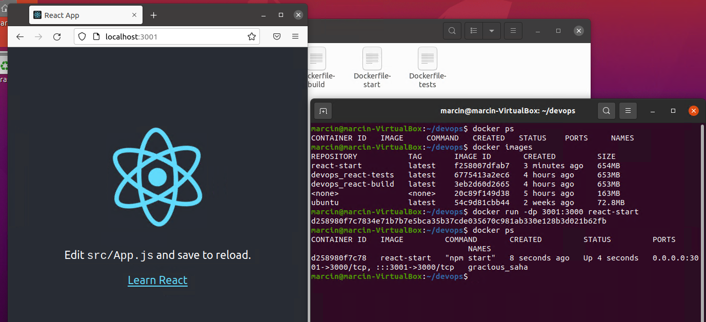

3.  ### Zainstalować w środowisku linuksowym, z wykorzystaniem Dockera, automatyzator Jenkins

       W celu instalacji Jenkinsa wykorzystano instrukcję znajdującą się na stronie: https://www.jenkins.io/doc/book/installing/docker/  
       
       1. Tworzę sieć **jenkins** oraz kontener ze składnikiem **DIND**:  
       `docker network create jenkins`  
        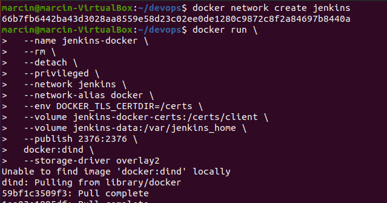
       
       
       2. Sprawdzam czy został utworzony:  
        `docker ps`  
        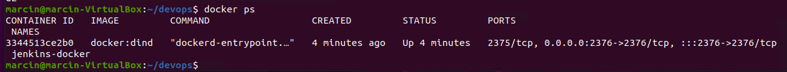  
       
       
       3. Następny krok to stworznie **Dockerfile-jenkins**, pozwalający stworzyć Blueocean. Obraz z dockerfil'a tworzymy używając komendy: `docker build myjenkins-blueocean - f Dockerfile-jenkins .`  
        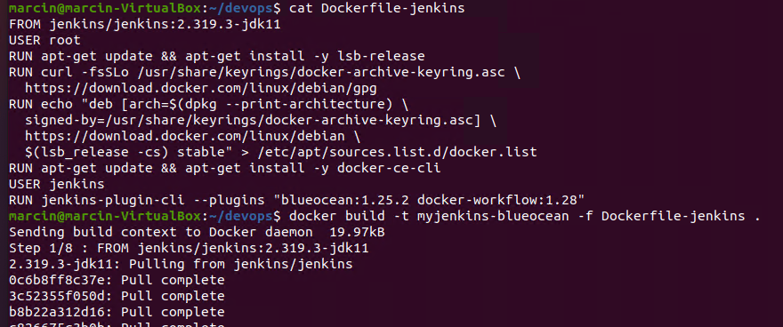  
       
       
       Tworzę kontener z **Blueocean**:  
        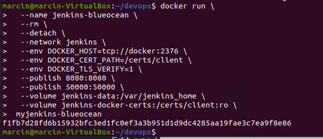  
       
       
       # Jenkins  
       
       W celu skonfigurawania **Jenkinsa** pobieram klucz wykorzystując komendę `sudo docker exec jenkins-blueocean cat /var/jenkins_home/secrets/initialAdminPassword`, następnie przechodzę na `localhost:8080` i wpisuję usyskane hasło:   
        
       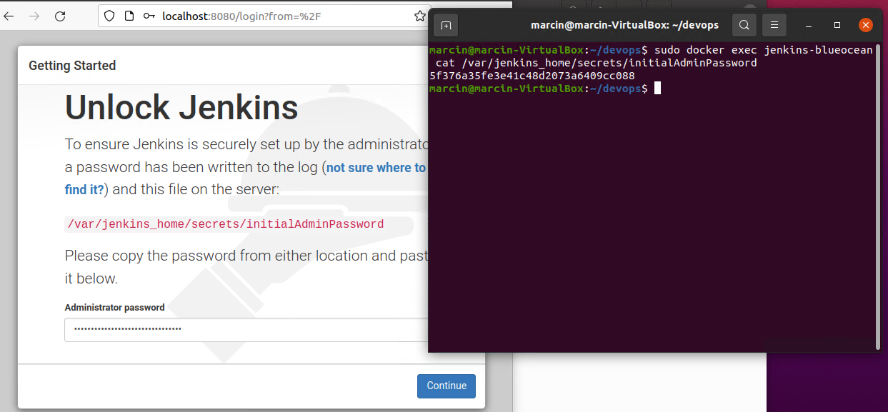  
       
       
       Następnie tworzę użytkownika i instaluję domyślne wtyczki:  
       
       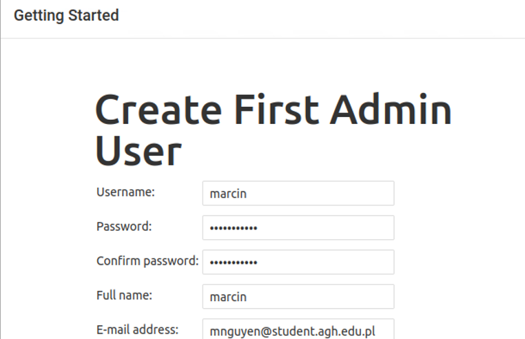   
       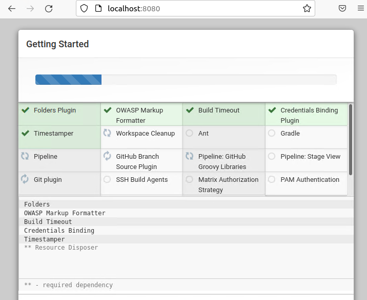   
        
        
       ## Uruchomienie kompozycji w Jenkinsie 
       
       ### 1. W celu wykorzystania docker-compose w Jenkinsie instaluję przechodzę do konsoli stworzonego kontenera wykorzystując komendę `docker exec -u root -it jenkins-blueocean /bin/bash` (używam flagi **-u** i przekazuję użytkownika **root**, aby mieć prawa zapisu wewnątrz kontenera, dzieki temu nie muszę pobierać sudo i tam dodawać użytkowników).

       Instaluję docker-compose:  
       `curl -L "https://github.com/docker/compose/releases/download/1.29.2/docker-compose-$(uname -s)-$(uname -m)" -o /usr/local/bin/docker-compose`  
       I nadaję prawa:  
       `chmod +x /usr/local/bin/docker-compose`
       
       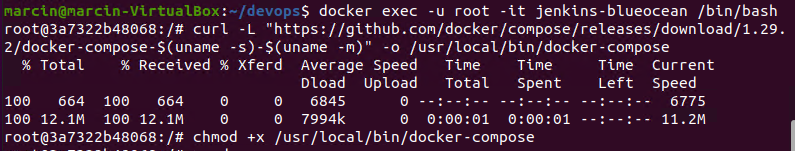  
       
       
       
       ### 2. Kolejnym warunkiem działania docker-compose w projekcie jest zainstalowanie odpowiedniej wtyczki.  
       Wracam do strony Jenkinsa, przechodzę o **Manage Jenkins**  >  **Manage Plugins**  i instaluję wtyczkę **Docker Compose Build Step**:  
        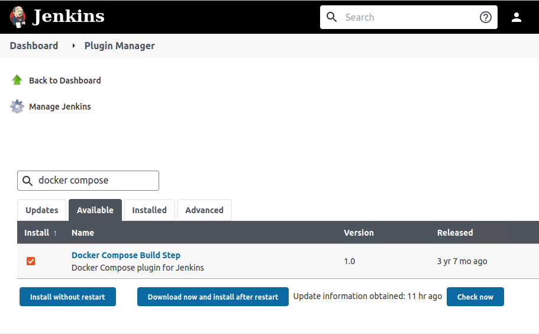   
        
       ### 3. Tworzenie joba
       
       Na stonie głównej wybieram **New Item**  >  **Multi-configuration project**  i nazywam go **devops-react**:  
       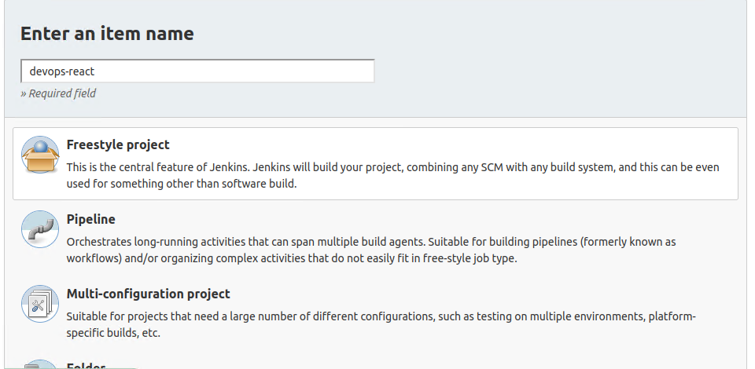   
        
       W **Source Code Management** wybieram Git, wpisuję adres grupowego repozytorium i nazwę swojej gałęzi:  
       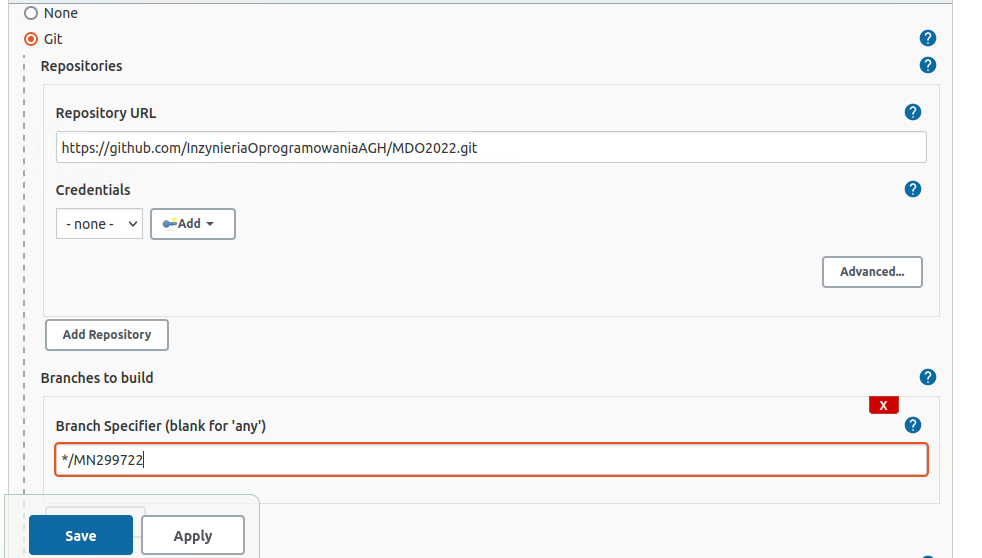   

       W sekcji **Build** wpisuję adres pliku kompozycji, a jako komendę ustawiam **Start all services**:  
       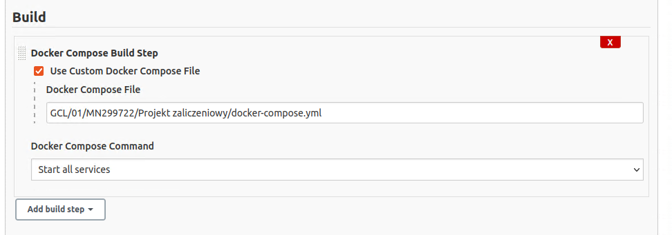   
       
       
       
       Po zapisaniu, po lewej stronie pojawi się menu, z którego wybieram opcję zbudowania. Na dole pojawia się nowy build:  
       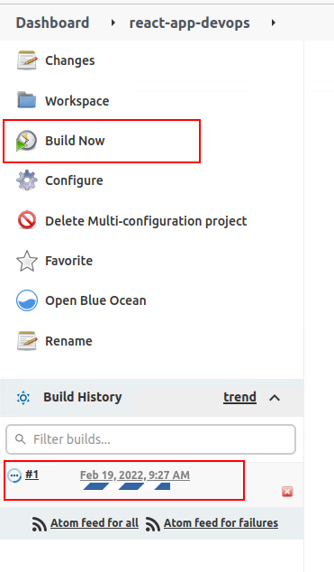   
       
       Build projektu zakończył się sukcesem - szczegóły wykonania znajdują się w **Console Output**:  
       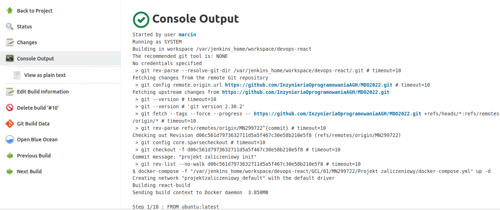   
       
       Logi wykonania znajdują się w pliku **jenkins_build.log**. Nie wiem czy dobrze zrozumiałem ten punkt, ale w celu sformatowania logów użyłem pluginu **Log File Filter Plugin**, którego następnie skonfigurowałem w **Manage Jenkins**  >  **Configure System**. Wtyczka pozwala na zastosowanie regexów na logach - poniższa konfiguracja usuwa wyjścia konsoli:  
       
       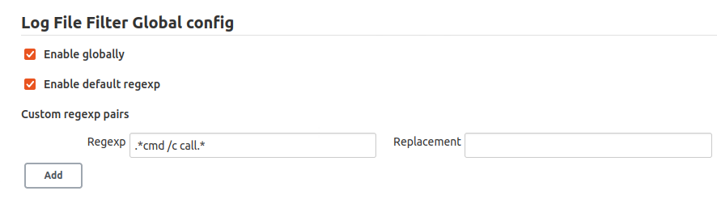   
       
