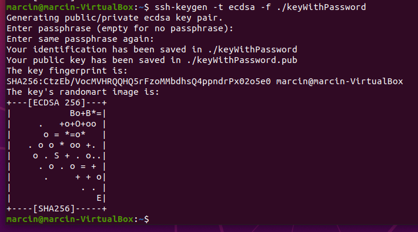
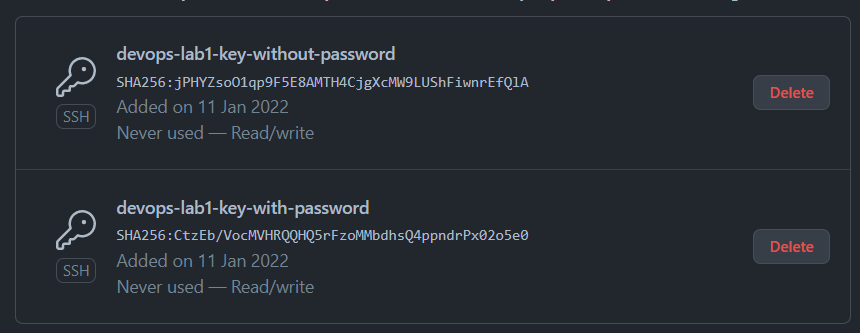
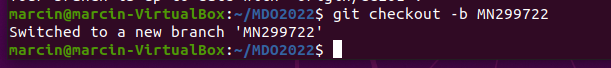

# Metodyki DevOps - Lab 1

## Zadania do wykonania
1. #### Zainstaluj klienta Git i obsługę kluczy SSH

    Otwieramy terminal i za pomocą komendy **sudo apt-get install git ssh** instalujemy paczki git oraz SSH:
    

    Następnie konfigurujemy globalną nazwę użytkownika oraz adres email, które będą używane przez gita:
    

2. #### Sklonuj repozytorium https://github.com/InzynieriaOprogramowaniaAGH/MDO2022 za pomocą HTTPS
    Do klonowania wykorzystujemy komendę **git clone**:
    
    
3. #### Upewnij się w kwestii dostępu do repozytorium jako uczestnik i sklonuj je za pomocą utworzonego klucza SSH
    - **Utwórz dwa klucze SSH, inne niż RSA, w tym co najmniej jeden zabezpieczony hasłem**
      
      Klucz bez hasła (metoda ed25519): 
      

      Klucz z hasłem (metoda ECDSA):
      

   - **Skonfiguruj klucz SSH jako metodę dostępu**
      
      Odczytujemy stworzone klucze i dodajemy je do konta na Github (Settings > SSH and GPG keys > New SSH key):
      
      
      
      Tworzenie nowego klucza:
      
      
      Dodane klucze - Github:
      
      
   - **Sklonuj repozytorium z wykorzystaniem protokołu SSH**
    
      Usunięcie wcześniejszego repozytorium i sklonowanie nowego przy użyciu SSH:
      
      
    
    
4. #### Przełącz się na gałąź swojej grupy

    
    
5.  #### Utwórz gałąź o nazwie "inicjały & nr indeksu" np. ```KD232144```
    
    
    
    
6. #### Rozpocznij pracę na nowej gałęzi
   - W katalogu właściwym dla grupy utwórz nowy katalog, także o nazwie "inicjały & nr indeksu" np. ```KD232144```
   - W nowym katalogu dodaj plik ze sprawozdaniem
   - Dodaj zrzuty ekranu
    
        

