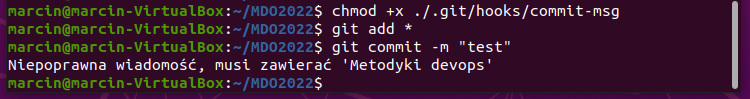
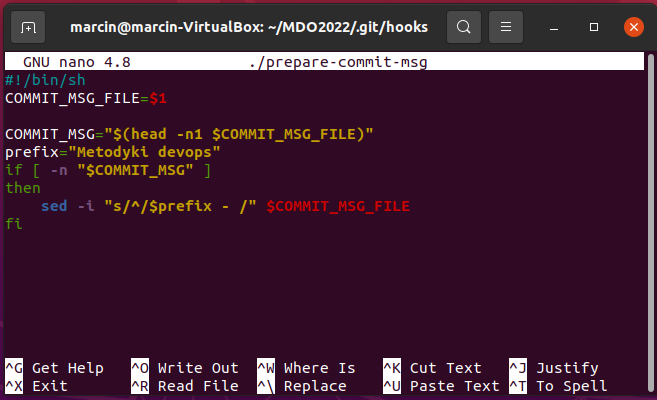
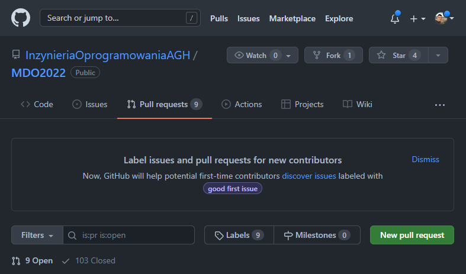

# Metodyki DevOps - Lab 1

## Zadania do wykonania
1. #### Zainstaluj klienta Git i obsługę kluczy SSH

    Otwieramy terminal i za pomocą komendy **sudo apt-get install git ssh** instalujemy paczki git oraz SSH:
    

    Następnie konfigurujemy globalną nazwę użytkownika oraz adres email, które będą używane przez gita:
    

2. #### Sklonuj repozytorium https://github.com/InzynieriaOprogramowaniaAGH/MDO2022 za pomocą HTTPS
    Do klonowania wykorzystujemy komendę **git clone**:
    
    
3. #### Upewnij się w kwestii dostępu do repozytorium jako uczestnik i sklonuj je za pomocą utworzonego klucza SSH
    - **Utwórz dwa klucze SSH, inne niż RSA, w tym co najmniej jeden zabezpieczony hasłem**
      
      Klucz bez hasła (metoda ed25519): 
      
      

      Klucz z hasłem (metoda ECDSA):
      
      

   - **Skonfiguruj klucz SSH jako metodę dostępu**
      
      Odczytujemy stworzone klucze i dodajemy je do konta na Github (Settings > SSH and GPG keys > New SSH key):
      
      
      
      Tworzenie nowego klucza:
      
      
      Dodane klucze - Github:
      
      
   - **Sklonuj repozytorium z wykorzystaniem protokołu SSH**
    
      Usunięcie wcześniejszego repozytorium i sklonowanie nowego przy użyciu SSH:
      
      
    
    
4. #### Przełącz się na gałąź swojej grupy

    
    
5.  #### Utwórz gałąź o nazwie "inicjały & nr indeksu" np. ```KD232144```
    
    
    
    
6. #### Rozpocznij pracę na nowej gałęzi
   - **W katalogu właściwym dla grupy utwórz nowy katalog, także o nazwie "inicjały & nr indeksu" np. ```KD232144```**
   - **W nowym katalogu dodaj plik ze sprawozdaniem**
   - **Dodaj zrzuty ekranu**
    
        
        
   - **Wyślij zmiany do zdalnego źródła**
   
        Dodajemy pliki do stage'a i tworzymy nowy commit:
        
        
        
        Następnie wypychamy zmiany na wskazaną gałąź
        
        
        
        
   - **Spróbuj wciągnąć swoją gałąź do gałęzi grupowej**
        
        
        
        O ile nie ma problemu z wciągnięciem swojej gałęzi do gałęzi grupowej lokalnie, to z powodu blokady nie jesteśmy w stanie wykonać pusha:
        
        

   - **Oznacz tagiem ostatni commit i wypchnij go na zdalną gałąź**
            
        Stworzenie opisanego taga przy użyciu komendy **git tag** i przypisanie go do ostatniego commita (używając jego sha):
        
          
        gdzie v0.0.1 to nazwa taga, a "tag created" to jego opis.

   - **Ustal hook, który będzie sprawdzał, czy wiadomość z commitem zawiera nazwę przedmiotu**
        
        Przechodzimy do folderu **.git/hooks** znajdującego się w głównym katalogu naszym repozytorium i tworzymy plik commit-msg (nazwa jest narzucona z góry; bez rozszerzeń).
        Zapisujemy w nim następujący skrypt w bashu:
        
          
        
        Próba wykonania commita z niewłaściwą wiadomością:
          
        (aby skrypt był wykonywalny, nadajemy mu prawa używając komendy **chmod +x**) 
        
        
   - **W jaki sposób stworzyć hook, który będzie *ustawiał* prefiks wiadomości commitu tak, by miał nazwę przedmiotu?**
        
        Aby stworzyć hook, ustawiający prefiks wiadomości commitu, możemy skorzystać z hooka **prepare-commit-msg** (w tym przypadku równie dobrze moglibyśmy skorzystać też z commit-msg lub pre-commit-msg, ale zadanie jest bardziej zgodne z przeznaczeniem prepare-commit-msg)
        
          
        
        Test hooka:  
          
        
1. Wystaw Pull Request do gałęzi grupowej
    
    Przechodzimy do głównego repozytorium grupy (https://github.com/InzynieriaOprogramowaniaAGH/MDO2022), wchodzimy w zakładkę **Pull requests** i klikamy **New pull request**.     
      
    
    Następnie wybieramy gałęzie z i do której chcemy wykonać pull request.  
      
    
        
