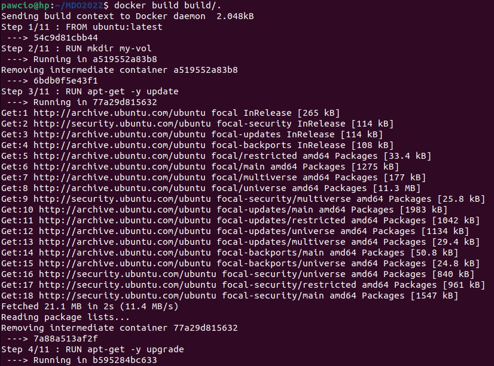
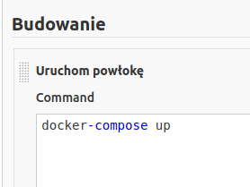

#### Projekt zaliczeniowy

* Znaleziono projekt _create-react-app_ wśród repozytoriów GitHub zawierający mechanizm budowania oraz testy jednostkowe

* Sklonowano projekt z GitHub za pomocą `git clone git@github.com:facebook/create-react-app.git`


* Pobrano obraz _ubuntu_ za pomocą `docker pull ubuntu`. Będzie to środowisko, w którym uruchomimy powyższy projekt.


* Utworzono _Dockerfile_ umożliwiający build bez konieczności przygotowania/konfiguracji środowiska


* Uruchomiono budowanie kontenera za pomocą powyższego _Dockerfile_, stosując `docker build build/.`




* Utworzono _Dockerfile_ uruchamiający testy (oparty na poprzednim _Dockerfile_), stosując `docker build test/.`


* Wynik testów


* Utworzono _docker-compose.yml_ uruchamiający powyższe pliki za pomocą `docker-compose up`


* Uruchomienie programu w kontenerze za pomocą `docker-compose run --rm my-ubuntu-build`, a następnie `cd my-app` oraz `npm start`


* Po otwarciu strony:


* Wprowadzenie zmian w kodzie pliku _src/App.js_ w celu wykazania, że funkcjonalność nie jest ograniczona konteneryzacją i uruchomienie ponowne


* Dystrybuowanie wybranego oprogramowania w postaci kontenera ma sens ponieważ można go aktualizować oraz zmieniać na różne potrzeby

* Wyciągnięcie artefaktu z kontenera przez skopiowanie projektu do volumenu za pomocą `cp -r my-app/ my-vol/`


* Uruchomienie projektu na zewnątrz kontenera za pomocą `npm start` jako _root_ (uprawnienia do uruchomienia ma _root_ ponieważ w kontenerze działaliśmy jako _root_)


* Najlepszym wyborem jest uruchomienie/aktualizacja projektu w kontenerze. Umotywowane jest to tym, że w łatwy sposób można zmieniać projekt, ew. wprowadzać nowe funkcjonalności.
W przypadku niepowodzeń można cofnąć się do działającego obrazu.

* Zainstalowano automatyzator Jenkins


* Przygotowano _Dockerfile_ tworzący _Blueocean_


* Użyto 

```
docker run --name jenkins-blueocean --rm \
  --network jenkins --env DOCKER_HOST=tcp://docker:2376 \
  --env DOCKER_CERT_PATH=/certs/client --env DOCKER_TLS_VERIFY=1 \
  --publish 8080:8080 --publish 50000:50000 \
  --volume jenkins-data:/var/jenkins_home \
  --volume jenkins-docker-certs:/certs/client:ro \
  myjenkins-blueocean:2.319.3-1
```

* W wyniku otrzymano


* W przeglądarce otwarto stronę o adresie _http://localhost:8080_, podano hasło otrzymane wcześniej i ukończono konfigurację


* Projekt umieszczono w prywatnym repozytorium


* Utworzono nowy projek w _Jenkins_


* Ustawiono repozytorium kodu


* Dodano _Credentials_ (wcześniejszy error znikł)


* Zmieniono nazwę branchy z _master_ na _main_


* Spróbowano uruchomić kompozycję _Docker Compose_ ale napotkano błąd

* Potrzebna była modyfikacja pliku _Dockerfile_ dla _Jenkinsa_ aby uruchomić kompozycję


* Uruchomiono kompozycję _Docker Compose_ przy użyciu projektu w _Jenkinsie_



* Załączono logi _jenkins.logs_

* Na tym kroku zakończono realizację dalszej części projektu

* Wykonano commit na dedykowanej gałęzi w repozytorium MDO2022


