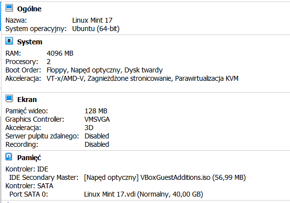
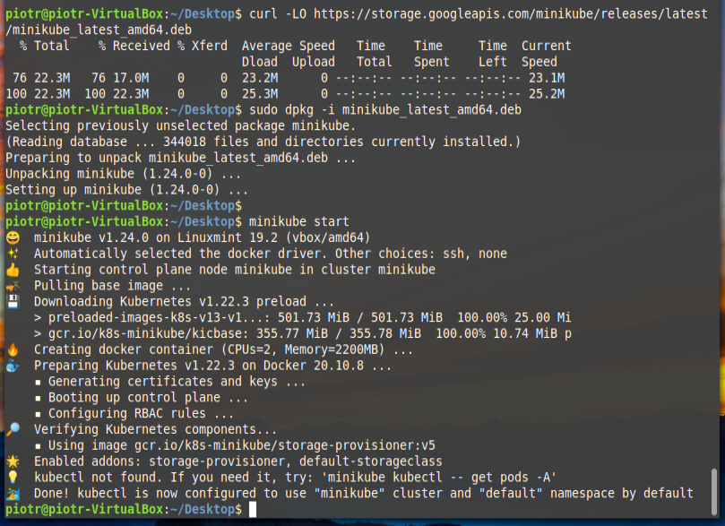
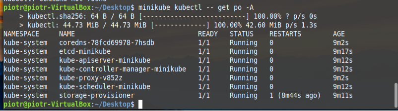
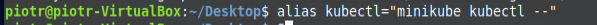
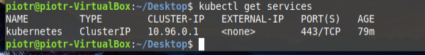
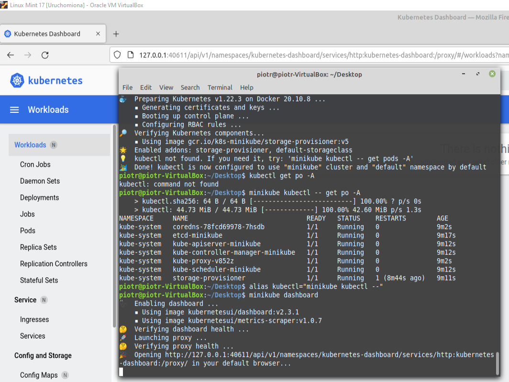
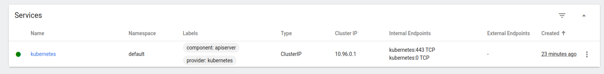

# Zajęcia 05

Zestawienie platformy Kubernetes

-   Zainstaluj wymagania wstępne dla środowiska Minikube
	Skonfigurowałem w maszynie wirtualnej drugi procesor, sprawdziłem dostępne miejsce na dysku i pamięć RAM oraz Dockera.
	

-   Zainstaluj minikube i kubectl

	``` minikube start ```
	
	
	
	Jeśli nie ma zainstalowanego:
	
    ```minikube kubectl -- get po -A```

	

- Dodanie aliasa do shell config

	``` alias kubectl="minikube kubectl --"  ```
	
	
	
-   Przedstaw uruchomione oprogramowanie wstępne (i usługi)
    -   Platforma konteneryzacji
    -   Otwarte porty
    -   Stan Dockera
    
    

### Stan Minikube

-   Uruchom Minikube Dashboard

-   Wyświetl działające usługi (k8s) i wdrożenia

-   Wyświetl dostępne wdrożenia (stan "przed")

### Wdrożenie kontenera via k8s

-   Wdróż przykładowy deployment "hello k8s":  `k8s.gcr.io/echoserver`
-   Użyj  `kubectl run <ctr> --image=<DOCKER_ID>/ --port=<port> --labels app=ctr`
-   Przekieruj porty
-   Wykaż że wdrożenie nastąpiło
-   W przypadku "niemożliwych" wdrożeń, opisz napotkane ograniczenia

### Deployment

-   Utwórz plik YAML z "deploymentem" k8s
-   Zestaw 4 repliki, opisz zalety i wady takiej liczby
-   Zaaplikuj wdrożenie via  `kubectl apply -f plik.yml`
-   Wykaż przeprowadzony deployment
