# Metodyki DevOps - sprawozdanie - zajęcia 01

## Środowisko

Środowiskiem, na którym wykonałem zadania przewidziane w zajęciach 01 był serwer domowy, na którym uruchomiony jest **Ubuntu 20.04.3 LTS**, do którego łączę się za pomocą narzędzia **kitty**.

## Instalacja **git** oraz **ssh-keygen**

W celu instalacji **git** na Ubuntu, należy wykonać w terminalu następującą komendę:

`sudo apt install git`

Jak wynika z powyższego zrzutu ekranu, na moim systemie aplikacja już była zainstalowana.

Możemy zwrócić numer wersji za pomocą komendy:

`git --version`

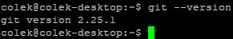

Do wygenerowania kluczy SSH potrzebne będzie nam narzędzie **ssh-keygen**, które dostępne jest w pakiecie **openssh-client**. Możemy zainstalować ten pakiet poniższą komendą:

`sudo apt install openssh-client`

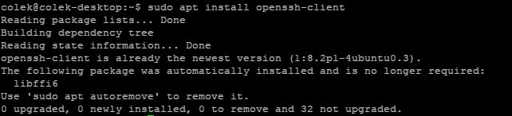

Ponownie - na moim systemie pakiet ten już był zainstalowany.

## Klonowanie repozytorium za pomocą HTTPS

Klonowanie repozytoriów za pomocą HTTPS z użyciem narzędzia **git** odbywa się za pomocą komendy:

`git clone <adres repozytorium>`

W naszym przypadku:

`git clone https://github.com/InzynieriaOprogramowaniaAGH/MDO2022.git`

Adres repozytorium możemy uzyskać po przejściu na stronę repozytorium w Githubie, wciśnięciu przycisku **Code** i przejściu do zakładki **HTTPS**.

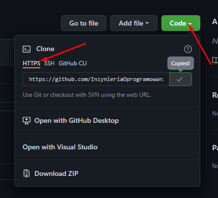

Po sklonowaniu repozytorium, będzie ono dostępne w aktualnym katalogu.

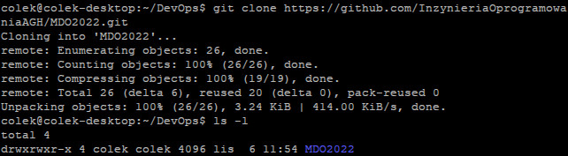

## Generowanie kluczy SSH

Za pomocą poniższej komendy, generujemy parę kluczy ED25519:

`ssh-keygen -t ed25519`

Aplikacja zapyta nas o ścieżkę, pod którą chcemy zapisać wygenerowane klucze, w przypadku wciśnięcia **Enter** bez wpisywania ścieżki, zostanie wybrana domyślna, zaproponowana, widoczna w nawiasie.

Dodatkowo, aplikacja zapyta nas o **passphrase** - hasło za pomocą, którego będziemy korzystali z klucza. Możemy zostawić je puste, bądź uzupełnić. Przy wpisywaniu hasła, nie będzie ono pokazywało się na oknie terminala.

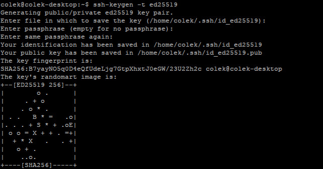

Generujemy drugi klucz za pomocą innego algorytmu - ECDSA:

`ssh-keygen -t ecdsa`

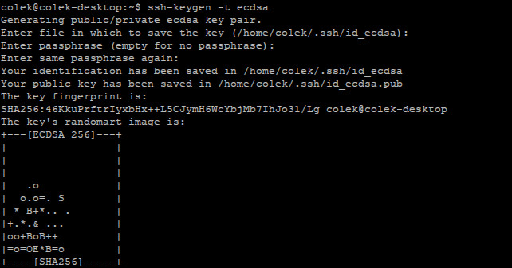

W moim przypadku, klucze wygenerowały się w ścieżce domowej w katalogu **.ssh**.

W plikach z rozszerzeniem **.pub** znajduje się klucz publiczny, który będziemy dodawać do naszego konta na Githubie. Możemy go wyświetlić poleceniem:

`cat id_ecdsa.pub`

`cat id_ed25519.pub`

## Dodawanie wygenerowanych kluczy do konta Github

Aby dodać wygenerowane przez nas klucze do konta Github, należy przejść do ustawień konta.

Na stronie ustawień, należy przejść do zakładki **SSH and GPG keys** i wcisnąć przycisk **New SSH key**.

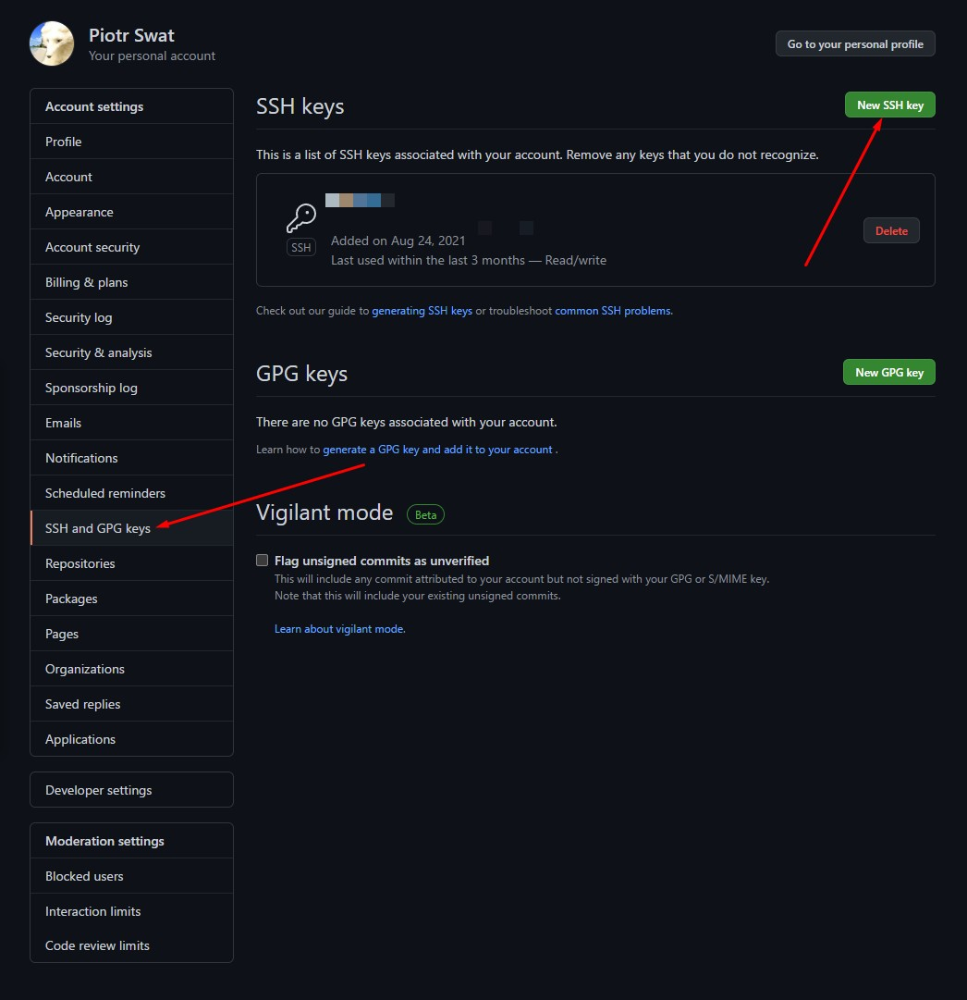

Na nowej stronie, podajemy w polu **Title** nazwę klucza, która pozwoli nam na jego prostą identyfikację, a w polu **Key** podajemy zawartość publicznego klucza i wciskamy przycisk **Add SSH key**.

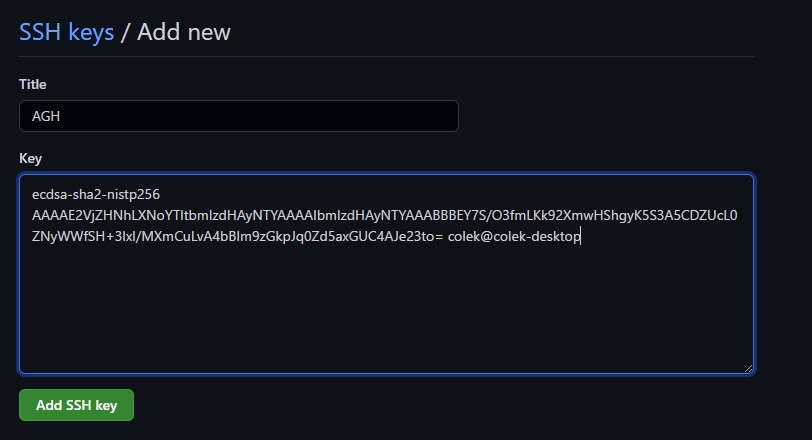

## Klonowanie repozytorium za pomocą SSH

Po wygenerowaniu kluczy SSH i dodaniu ich do Githuba, możemy teraz klonować repozytoria przez SSH. Pozwala to nam na między innymi dostęp do repozytoriów prywatnych, do których mamy dostęp.

Adres repozytorium możemy uzyskać po przejściu na stronę repozytorium w Githubie, wciśnięciu przycisku **Code** i przejściu do zakładki **SSH**.

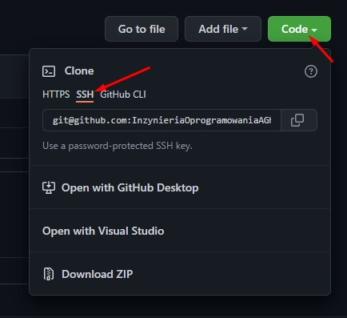

Następnie za pomocą poniższej komendy klonujemy repozytorium:

`git clone <adres repozytorium>`

W naszym przypadku:

`git clone git@github.com:InzynieriaOprogramowaniaAGH/MDO2022.git`

Jeżeli podaliśmy do wygenerowanego klucza SSH hasło, będziemy musieli je podać przed sklonowaniem repozytorium.

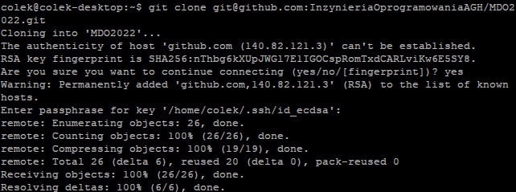

Po sklonowaniu repozytorium, będzie ono dostępne w aktualnym katalogu - tak samo jak w przypadku klonowania przez HTTPS.

## Gałęzie (Branch)

Po przejściu do katalogu, w którym jest sklonowane repozytorium, możemy przełączyć się na inną gałąź za pomocą komendy:

`git checkout <nazwa gałęzi>`

W naszym przypadku:

`git checkout GCL01`

Jeżeli chcemy utworzyć nową gałąź, korzystamy z komendy:

`git checkout -b <nazwa gałęzi>`

W naszym przypadku:

`git checkout -b PS293243`

## Pushowanie zmian

Komendą **cd** przechodzimy do katalogu **GCL**, następnie do katalogu **01** i tworzymy nowy katalog o nazwie **PS293243**.

Korzystając z narzędzia **WinSCP** przesyłam na serwer pliki sprawozdania.

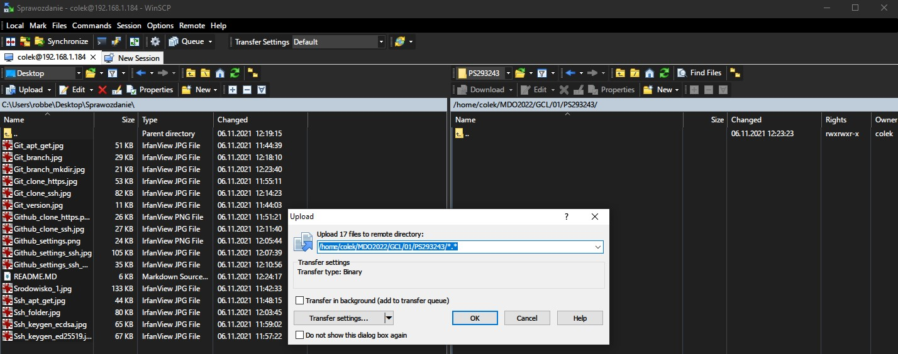

Dodane pliki musimy dodać teraz, aby były śledzone przez **git**. Robimy to za pomocą komendy:

`git add *.*`

Status wszystkich zmian od ostatniego commita, możemy sprawdzić komendą:

`git status`

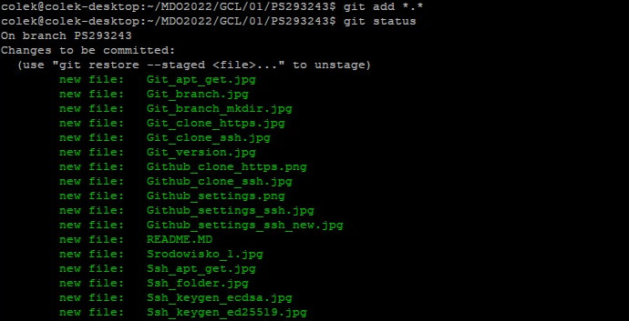

Po dodaniu nowych plików, możemy utworzyć nowego commita komendą:

`git commit -m <komentarz>`

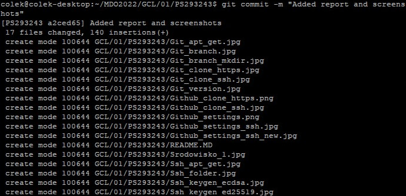

Po utworzeniu commita, możemy go teraz wypchnąć na zdalną gałąź komendą:

`git push --set-upstream origin PS293243`

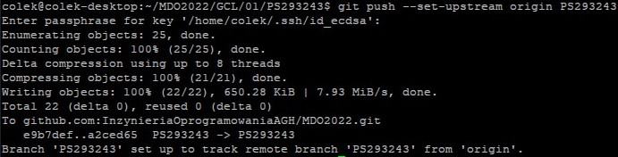

Nasze zmiany będą teraz widoczne w Githubie.

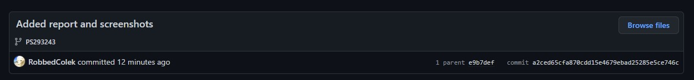