    ## Upewnij się, że Dockerfiles i Docker Compose z poprzednich zajęć są w repozytorium
     Sprawdziłem zawartość repozytorium.
    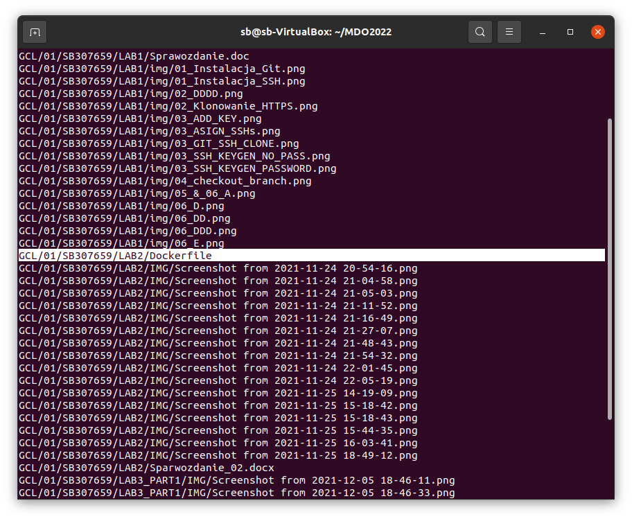
    ## Zapoznaj się z instrukcją https://www.jenkins.io/doc/book/installing/docker/
    Po zapoznaniu się z instrukcją, postępowałem step-by-step zaczynając od
    ```
    $sudo docker network create jenkins
    
    ```
    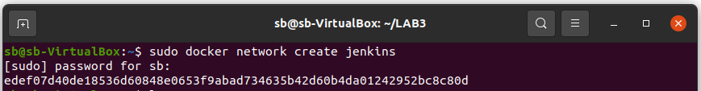
    ##Uruchom obraz Dockera który eksponuje środowisko zagnieżdżone
    Następnie pobrałem i uruchomiłem obraz Dockera:
    ```
    docker run \
  --name jenkins-docker \
  --rm \
  --detach \
  --privileged \
  --network jenkins \
  --network-alias docker \
  --env DOCKER_TLS_CERTDIR=/certs \
  --volume jenkins-docker-certs:/certs/client \
  --volume jenkins-data:/var/jenkins_home \
  --publish 2376:2376 \
  docker:dind \
  --storage-driver overlay2
  ```
    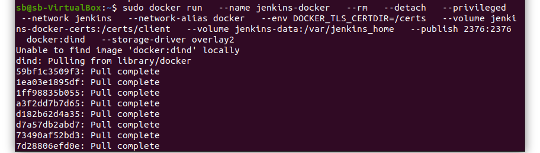
    Przygotuj obraz blueocean na podstawie obrazu jenkinsa
    Kolejnym krokiem było utworzenie dockerfile oraz zbudowanie obrazu:
    ```
    FROM jenkins/jenkins:2.319.2-jdk11
	USER root
	RUN apt-get update && apt-get install -y lsb-release
	RUN curl -fsSLo /usr/share/keyrings/docker-archive-keyring.asc \
	  https://download.docker.com/linux/debian/gpg
	RUN echo "deb [arch=$(dpkg --print-architecture) \
	  signed-by=/usr/share/keyrings/docker-archive-keyring.asc] \
	  https://download.docker.com/linux/debian \
	  $(lsb_release -cs) stable" > /etc/apt/sources.list.d/docker.list
	RUN apt-get update && apt-get install -y docker-ce-cli
	USER jenkins
	RUN jenkins-plugin-cli --plugins "blueocean:1.25.2 docker-workflow:1.26"
```
	```
	$ sudo docker build -t myjenkins-blueocean:1.1 .
	

	```
    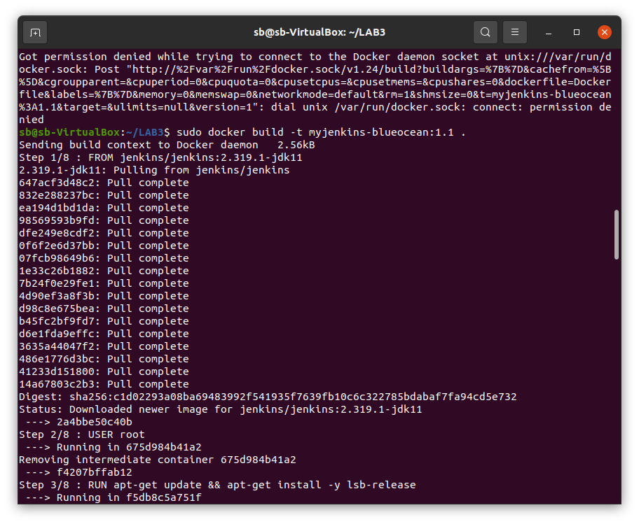
    ##Uruchom blueocean
    ```
    docker run \
  --name jenkins-blueocean \
  --rm \
  --detach \
  --network jenkins \
  --env DOCKER_HOST=tcp://docker:2376 \
  --env DOCKER_CERT_PATH=/certs/client \
  --env DOCKER_TLS_VERIFY=1 \
  --publish 8080:8080 \
  --publish 50000:50000 \
  --volume jenkins-data:/var/jenkins_home \
  --volume jenkins-docker-certs:/certs/client:ro \
  myjenkins-blueocean:1.1 
  ```
    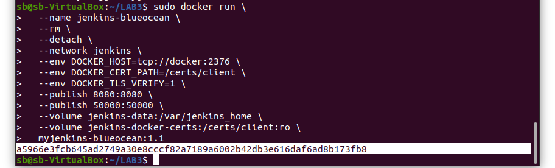
    ## Zaloguj się i skonfiguruj Jenkins
    Pozyskałem hasło do jenkinsa:
    ```
    $ sudo docker container exec -it jenkins-blueocean bash
    $ sudo cat /var/lib/jenkins/secrets/initialAdminPassword
    ```
    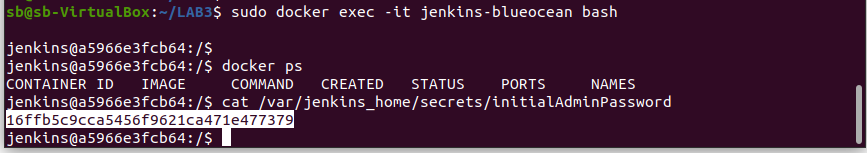
    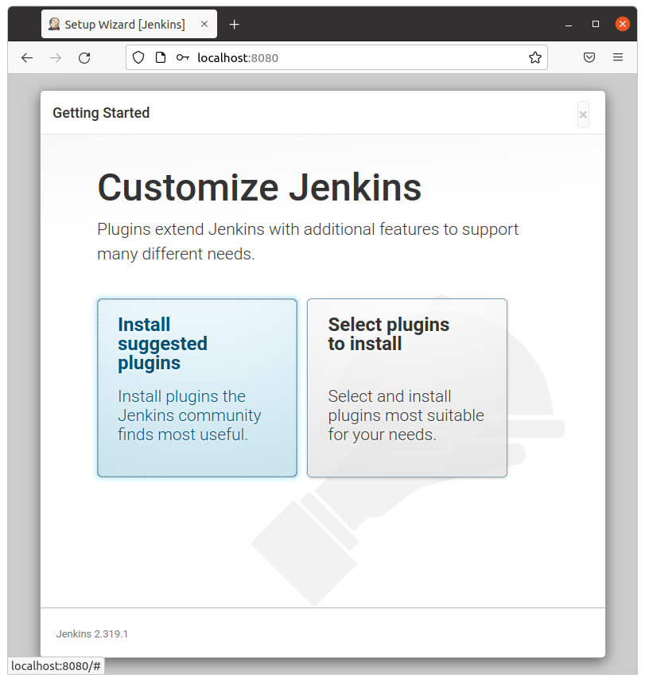

Mikro-projekt Jenkins

    Utwórz projekt, który wyświetla uname
    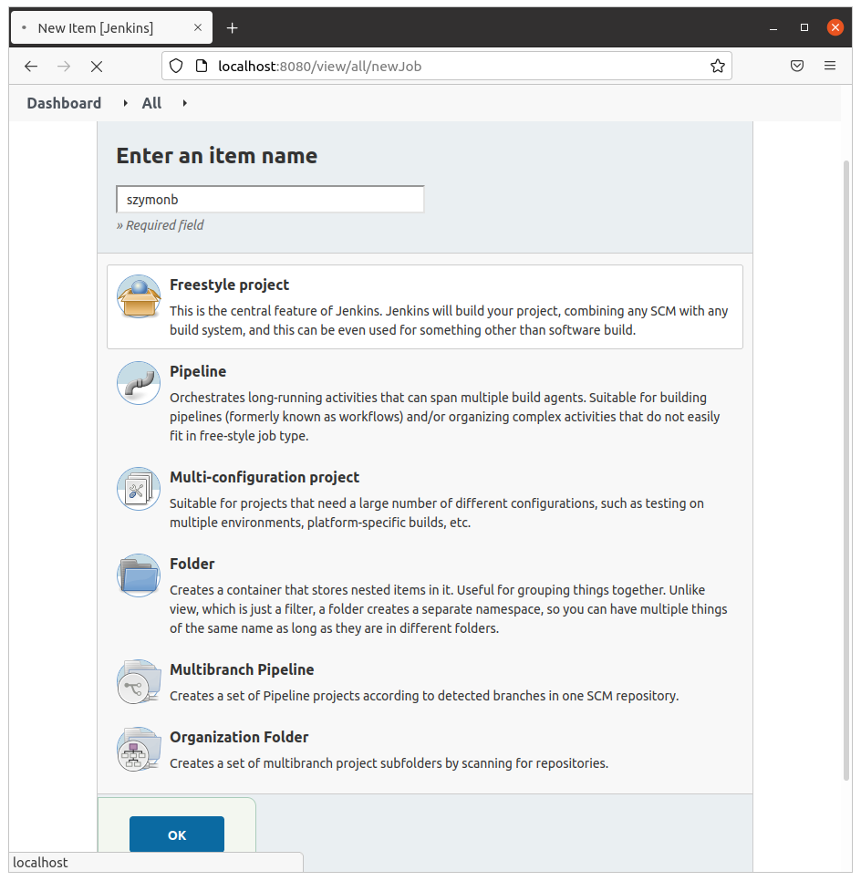
    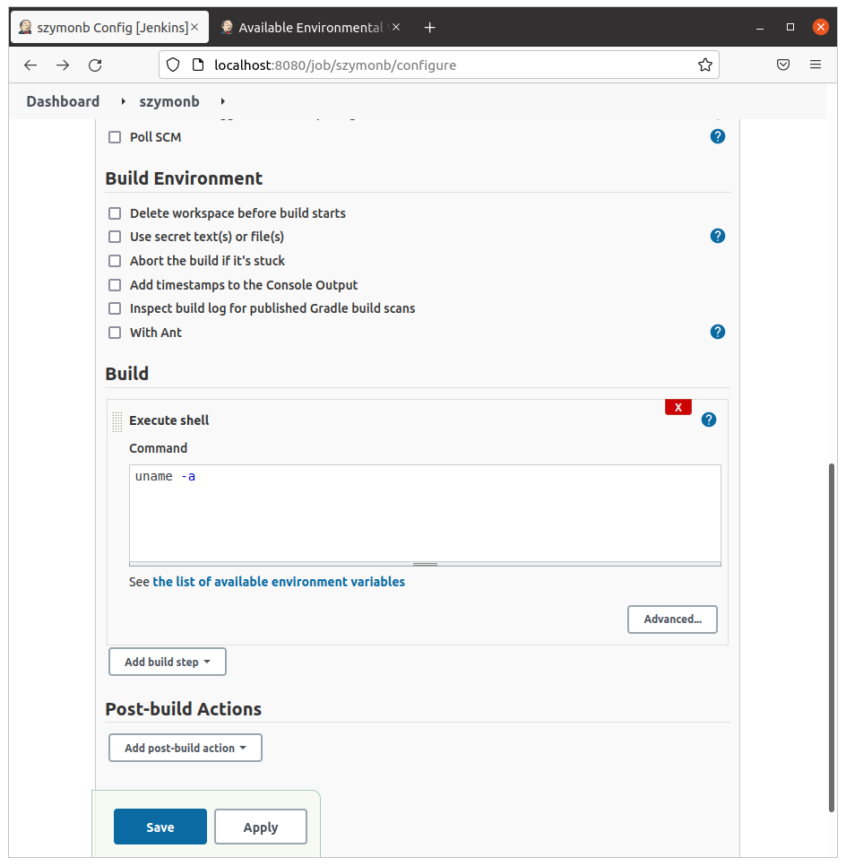
    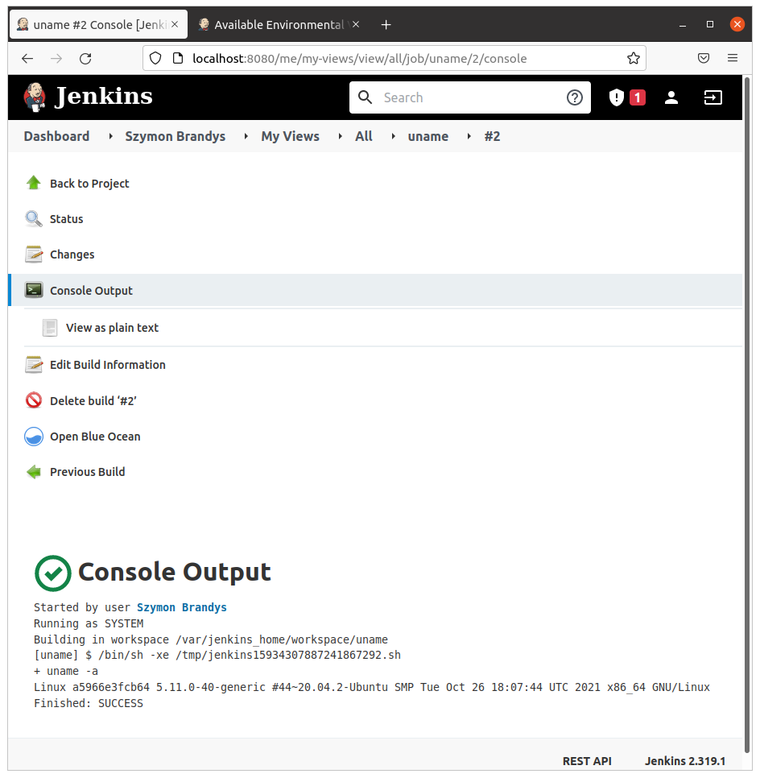
    Utwórz projekt, który zwraca błąd, gdy... godzina jest nieparzysta
    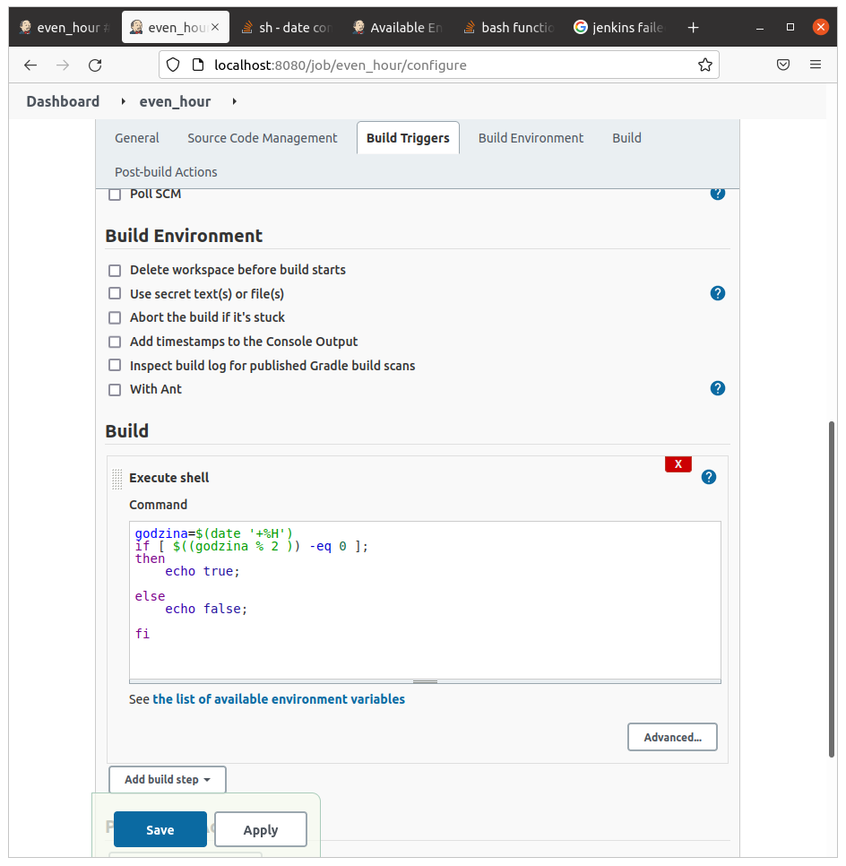
    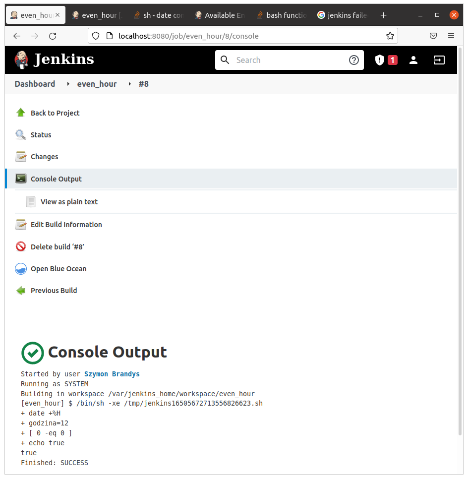
    Utwórz "prawdziwy" projekt, który:
        klonuje nasze repozytorium
        przechodzi na osobistą gałąź
        buduje obrazy z dockerfiles i/lub komponuje via docker-compose

