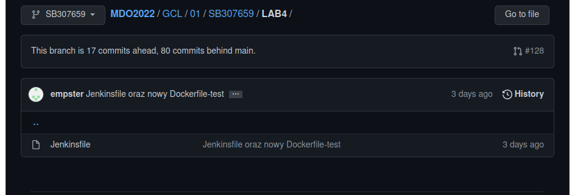
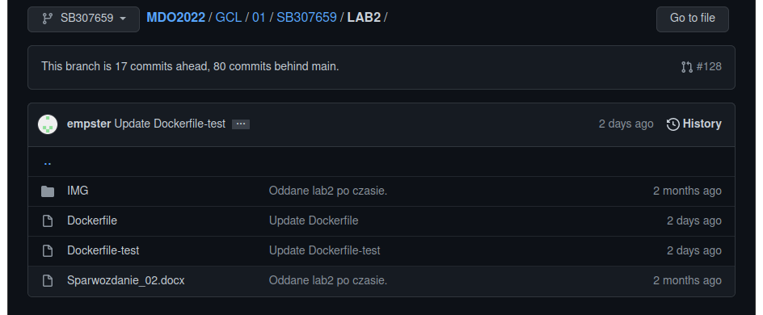
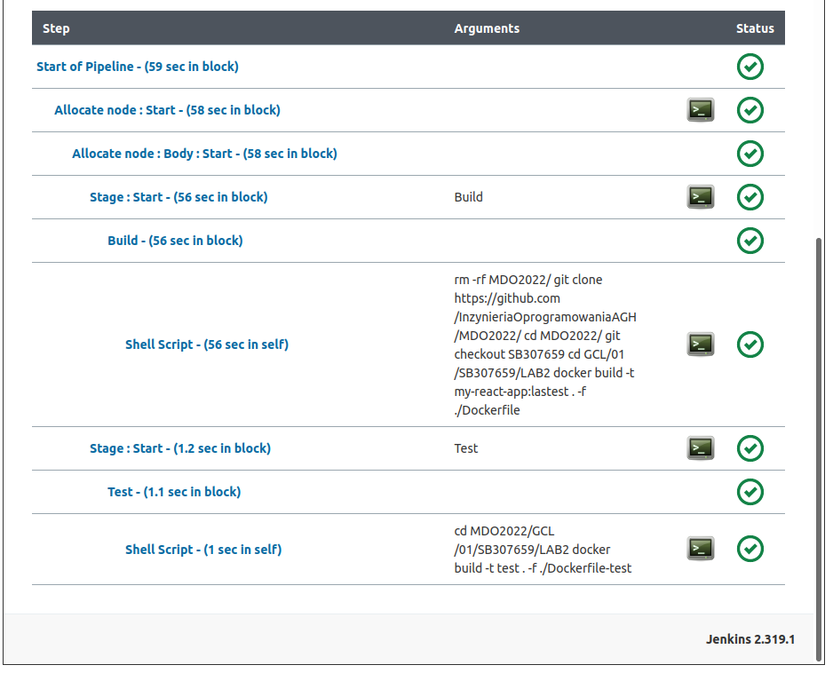
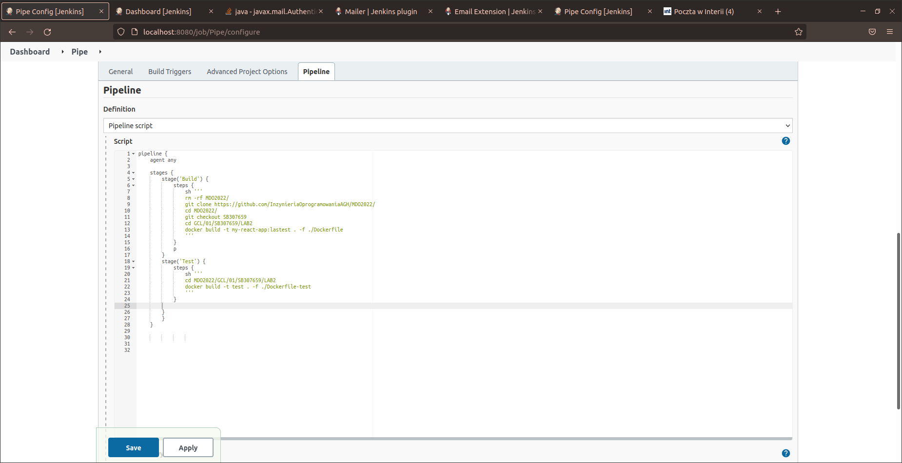
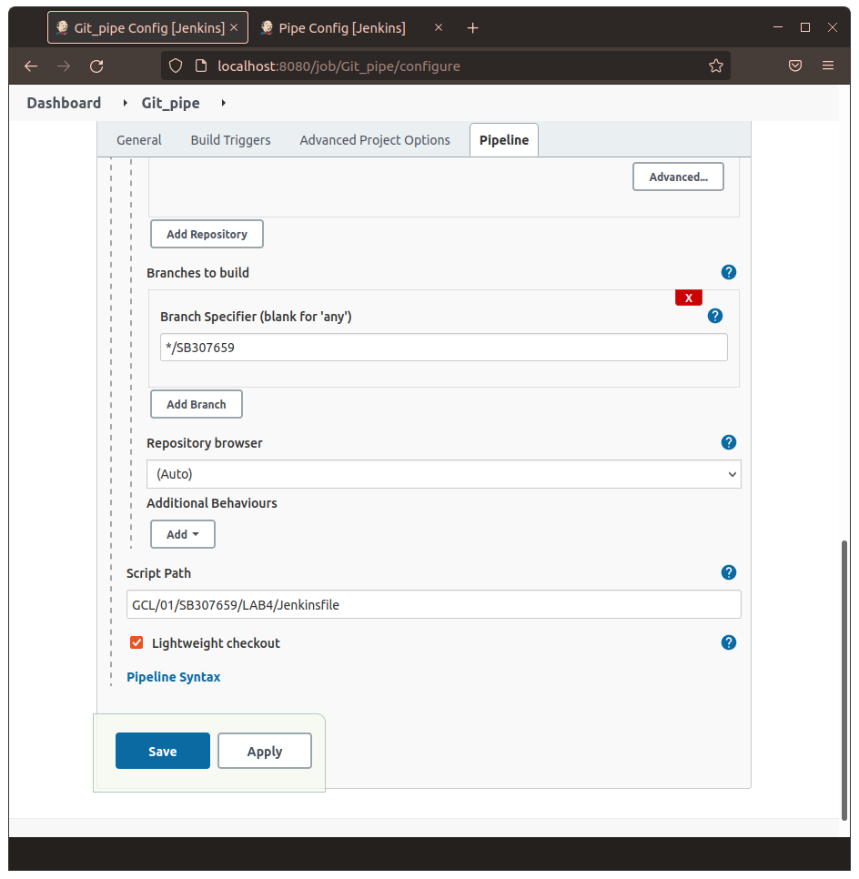
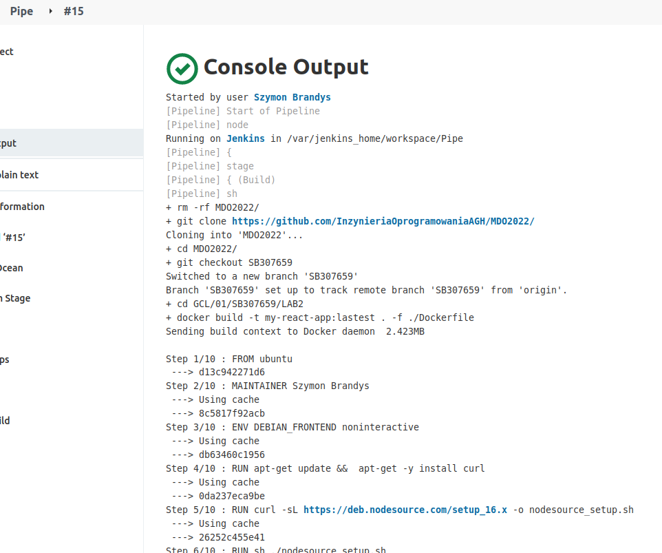
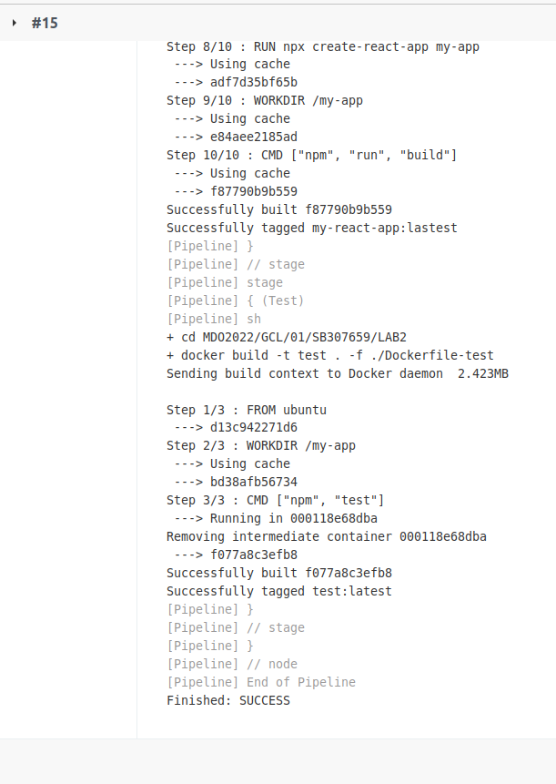
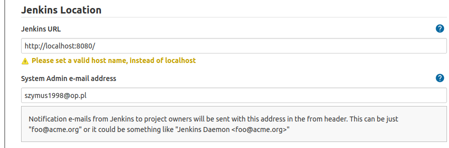
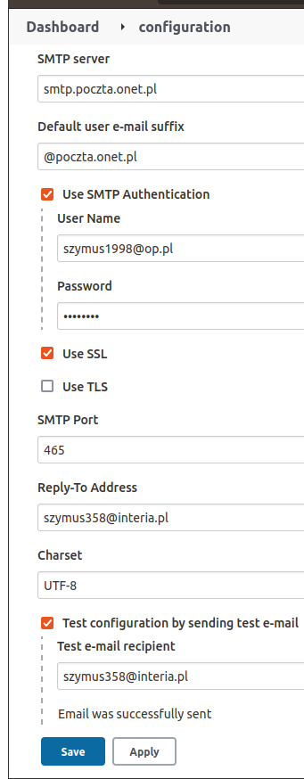
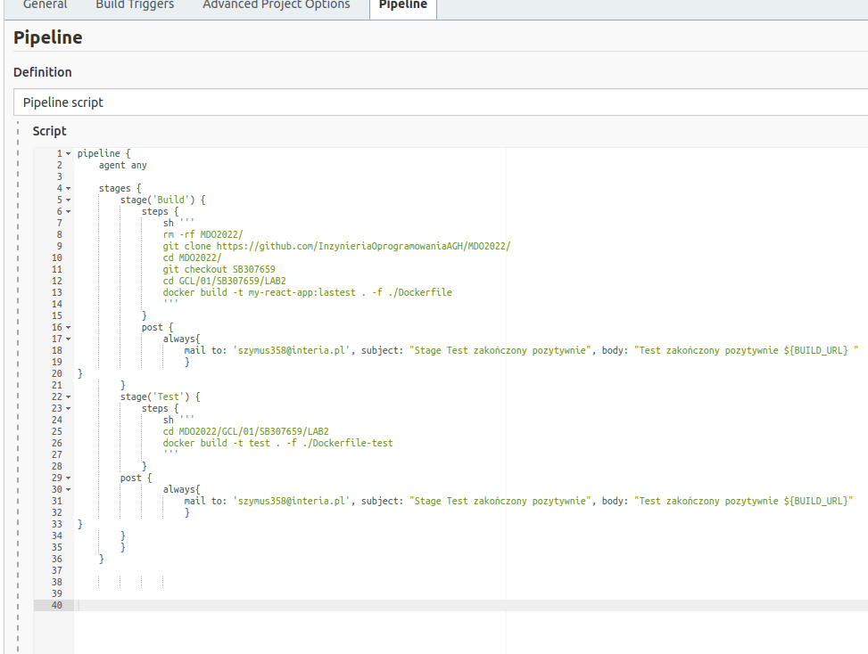

# Zajęcia 04

## Wprowadzenie 

### Zapewnij dostępność plików w gałęzi
 * skrypty, Docker files, kompozycje (jeżeli są), Jenkinsfile
 * dostępne w odpowiedniej gałęzi i katalogu w MDO2022

### Stwórz Jenkinsfile: opis
 * Utwórz nowy pipeline budujący wybraną aplikację, oparty o Jenkinsfile

 * Docelowo, ma zawierać etapy "Build" i "Test"
 * Przejściowo, może zawierać jeden etap "Build + Test"
 * Może, ale nie musi, budować się na dedykowanym DIND, ale może się to dziać od razu na kontenerze CI. Należy udokumentować funkcjonalną różnicę między niniejszymi podejściami
 * Początkowo, Jenkinsfile może być albo "wklejony" albo dodany do repozytorium, które jest sforkowane, to znaczy:
  * albo pipeline zawiera treść Jenkinsfile'a
  * albo forkujemy repozytorium wybranej aplikacji i dodajemy Jenkinsfile do niego 
  
  
 
 Początkowo narzędzie pobierało pipeline ze skryptu, był zapodany przez przeglądarkę. Następnie skonfigurowałem pobieranie pliku z repozytorium:

### Jenkinsfile: przebieg
https://www.jenkins.io/doc/book/pipeline/jenkinsfile/
* Przykładowe zbiory czynności w Jenkinsfile:
Jednokrokowy pipeline (Build i test), pobierający narzędzie docker-compose i uruchamiajacy docker compose up na kompozycji z poprzednich zajęć
  * build + test
    * download docker-compose
	* compose up
	
  * build
    * git pull
	* npm install
	* npm build
  * test
    * npm test
    

### Jenkinsfile: powiadomienia

  * Sekcja "post" dla każdego stage'a, informująca mailem o rezultacie

### Jenkinsfile: deploy
 * W razie sukcesu, build ma zostać wypromowany jako kandydat do wydania
 * Różne podejścia są możliwe:
   * Build i test wykonywane "na zewnątrz" i jeżeli się powiodą, odpalany docker build, który tworzy kontener 
   * Odpalane są kontenery budujący, testujący i końcowy
     * końcowy to budujący, ale z odpaloną aplikacją na końcu
	 * końcowy to np. ubuntu z posłanym artefaktem z budującego
	 
Po Nowym Roku, tydzień przed zajęciami, zrobimy sync zaawansowania prac i wybierzemy strategię.
