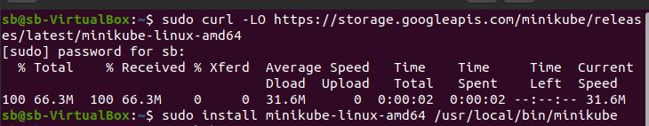
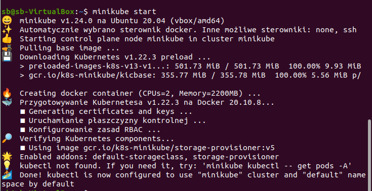
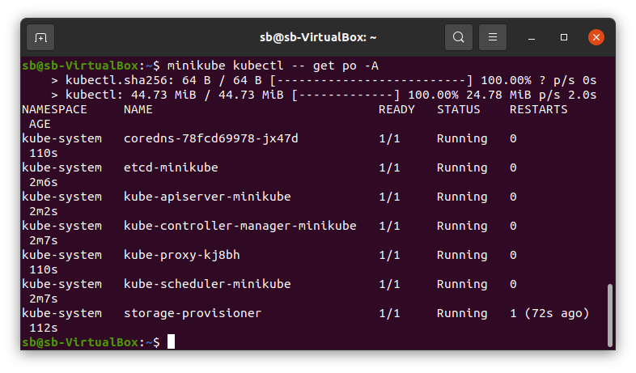
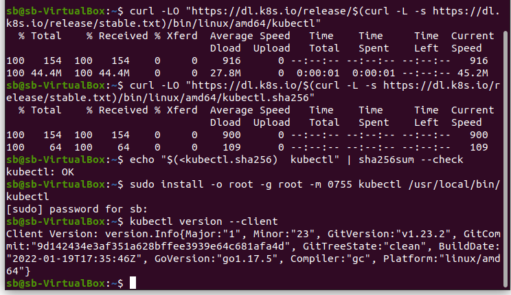
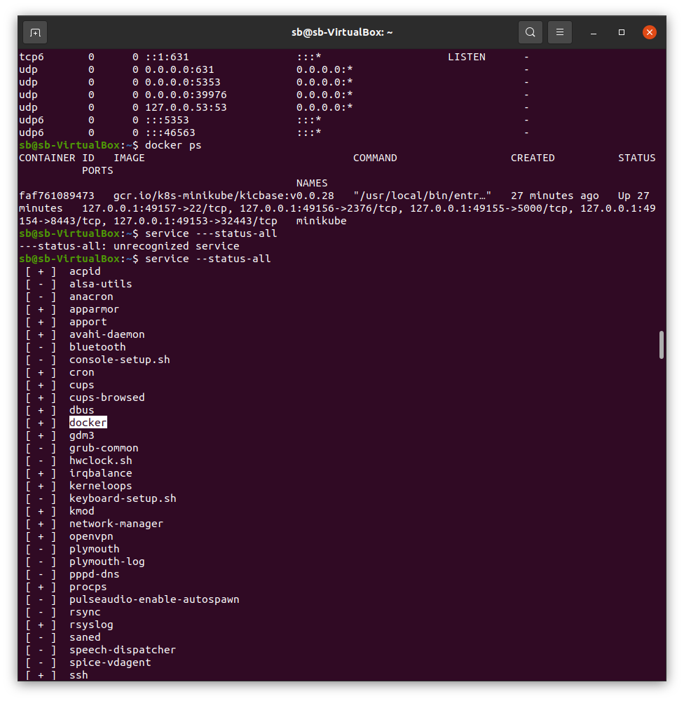
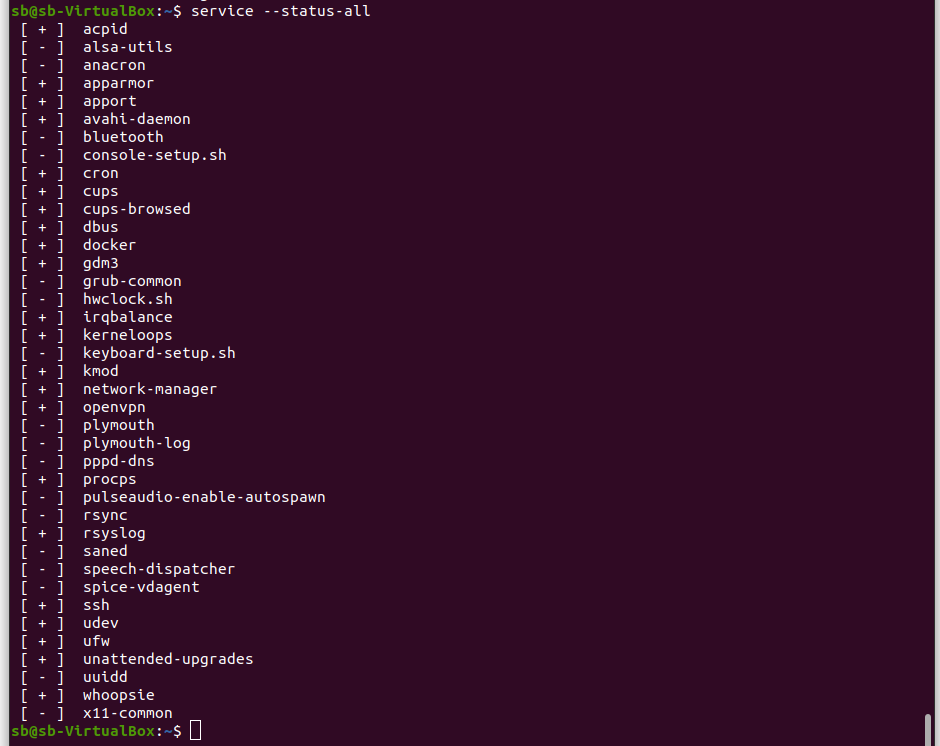
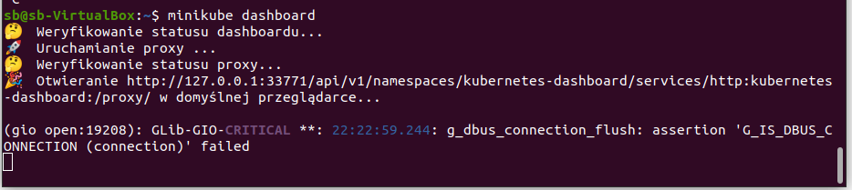
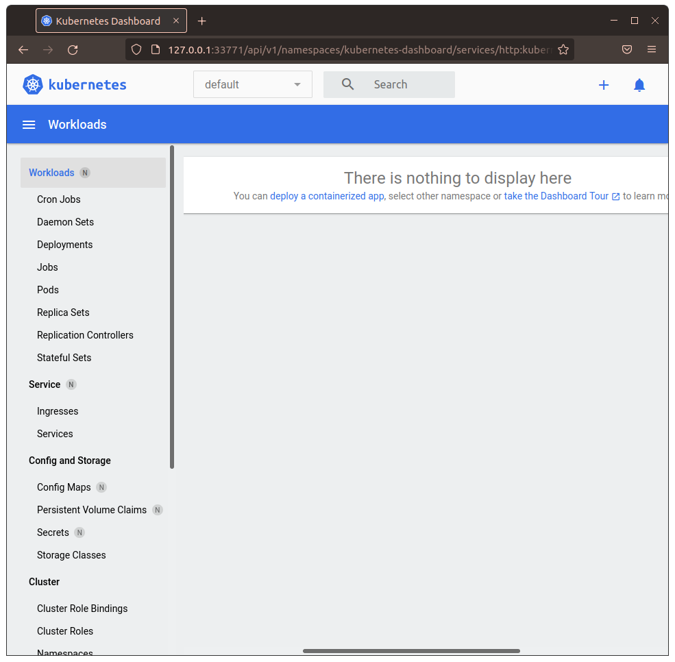
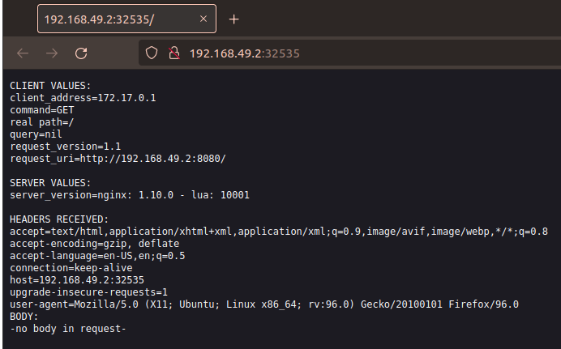
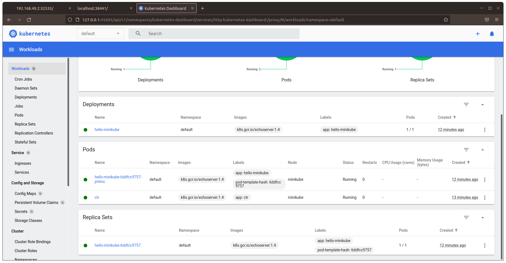

# Zajęcia 05

### Zestawienie platformy Kubernetes

* Upewnij się, że kontener jest dostępny
* Zainstaluj wymagania wstępne dla środowiska Minikube
* Zainstaluj minikube i kubectl
Instalujemy minicube zgodnie z poradnikiem 
```
 https://minikube.sigs.k8s.io/docs/start/
```
Pobieramy i uruchamiamy wydanie minikube używając plików binarnych:
```
curl -LO https://storage.googleapis.com/minikube/releases/latest/minikube-linux-amd64
sudo install minikube-linux-amd64 /usr/local/bin/minikube
```

Startujemy klaster:
```
minikube start
```

Dostęp do klastra mamy dzięki komendzie:
```
minikube kubectl -- get po -A
``` 

Pobranie kubectl:
```
curl -LO "https://dl.k8s.io/release/$(curl -L -s https://dl.k8s.io/release/stable.txt)/bin/linux/amd64/kubectl"
```
Veryfikacja plików binarnych:
```
 curl -LO "https://dl.k8s.io/$(curl -L -s https://dl.k8s.io/release/stable.txt)/bin/linux/amd64/kubectl.sha256"
 echo "$(<kubectl.sha256)  kubectl" | sha256sum --check
```

Instalacja kubectl:
```
sudo install -o root -g root -m 0755 kubectl /usr/local/bin/kubectl
```

* Przedstaw uruchomione oprogramowanie wstępne (i usługi)
  * Platforma konteneryzacji
  * Otwarte porty
  * Stan Dockera




### Stan Minikube
* Uruchom Minikube Dashboard
```
minikube dashboard
```

* Wyświetl działające usługi (k8s) i wdrożenia
* Wyświetl dostępne wdrożenia (stan "przed")

### Wdrożenie kontenera via k8s
* Wdróż przykładowy deployment "hello k8s": ```k8s.gcr.io/echoserver```
* Użyj ```kubectl run <ctr> --image=<DOCKER_ID>/ --port=<port> --labels app=ctr```
```kubectl run ctr --image=k8s.gcr.io/echoserver:1.4 --port=8000 --labels app=ctr
pod/ctr created```
* Przekieruj porty
```
kubectl expose deployment hello-minikube --type=NodePort --port=8080 service/hello-minikube exposed
```
* Wykaż że wdrożenie nastąpiło
```
kubectl get services hello-minikube
```
* W przypadku "niemożliwych" wdrożeń, opisz napotkane ograniczenia
```❌  Exiting due to GUEST_STATUS: state: unknown state "minikube": docker container inspect minikube --format=: exit status 1
stdout:

stderr:
Got permission denied while trying to connect to the Docker daemon socket at unix:///var/run/docker.sock: Get "http://%2Fvar%2Frun%2Fdocker.sock/v1.24/containers/minikube/json": dial unix /var/run/docker.sock: connect: permission denied
```


 Komenda ```minikube service hello-minikube``` nie zadziałała ze względu na brak uprawnień do pliku oraz brak użytkownika w grupie. Problem rozwiązujje zmiana uprawnien pliku docker.sock oraz dodanie usera do grupy.
 
 
### Deployment
* Utwórz plik YAML z "deploymentem" k8s
* Zestaw 4 repliki, opisz zalety i wady takiej liczby
* Zaaplikuj wdrożenie via ```kubectl apply -f plik.yml```
* Wykaż przeprowadzony deployment

## Zajęcia 06 : zależność ciągłej integracji od komponentów stron trzecich

### Inwentaryzacja
* Zdefiniuj w ramach stworzonego Dockerfile'a zależności platformowe
 * Oprogramowanie, które doinstalowujesz aby uruchomić program
 * W razie braku zależności (np. obraz ```node``` i aplikacje wymagająca tylko ```node```), "zależnością" jest sam obraz
* Określ okoliczności, w których uzasadnione jest przebudowywanie i aktualizacja obrazu po wydaniu nowej wersji którejś z zależności
 * Czy należy to robić "zawsze"?
 * Jakie są przesłanki (i jak je ustalić) wskazujące na konieczność aktualizacji
 * Jakie jest ryzyko aktualizowania/nieaktualizowania (im dokładniejszy przykład, tym lepiej)
* Pytanie pomocnicze: czy obraz Fedory/Ubuntu na dockerhubie jest aktualizowany dla każdej nowej wersji pakietu wchodzącego w jego skład? Dlaczego tak/nie?

### Wdrożenie
Alternatywnie do zadania wyżej: określenie zależności od dostawcy chmurowego
* Określ poziom zależności wdrożenia od środowiska chmurowego
* Zweryfikuj dostępność studenckiego konta Azure i **zapoznaj się z cennikiem**
* Przeprowadź próbne wdrożenie obrazu w ramach dostępnych kredytów
* Zatrzymaj i usuń kontener, i wstrzymaj storage space, aby nie generować rachunków na pustych przebiegach

