# Sprawozdanie Metodyki DevOps

## Środowisko wykonywania zadań

Środowiskiem na którym wykonywane są zadania jest system Fedora z rodziny Linux. 
**Fedora 35 Workstation**

## Instalacja git

Instalacja odbywa się wykonaniem następującej komendy w terminalu fedory:

`sudo yum install git`

aby upewnić się, że git został zainstalowany poprawnie oraz sprawdzić jego wersję można wykorzystać komendę:

`git --version`

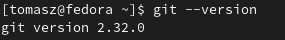

Do generowania kluczy ssh wykorzystam narzędzie **ssh-keygen** które jest juz dostępne w fedorze.

## Klonowanie repozytorium

Do sklonowania repozytorium użyłem komendy:

`git clone https://github.com/InzynieriaOprogramowaniaAGH/MDO2022.git`

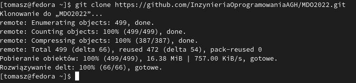

## Klucze SSH

Do wygenerowania kluczy SSH użyłem następujących poleceń:

`ssh-keygen -t ecdsa` 

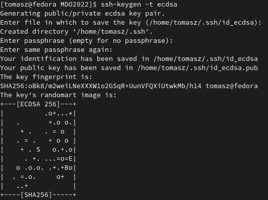

`ssh-keygen -t ed25519`

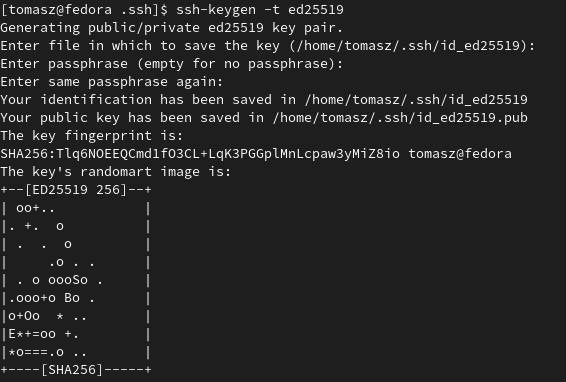

Podczas tworzenia klucza istnieje możliwość wskazania miejsca gdzie chcemy zapisać klucz oraz możliwość ustawienia hasła.

Aby odczytać klucz należy przejść do wskazanego katalogu i za pomocą edytora tekstu odczytać klucz.
Na stronie github w ustawieniach konta można dodać utworzone klucze.
W ustawieniach należy przejść do zakładki **SSH and GPG keys** a następnie buttonem **New SSH key** dodajemy klucz.

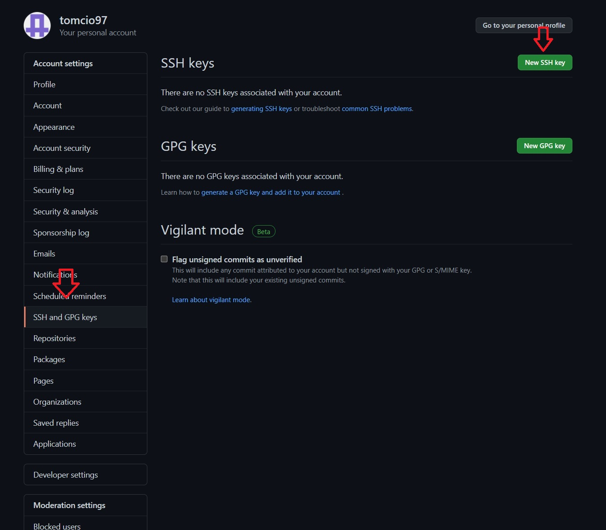

W polu title podaje się tytuł klucza, następnie w polu Key wprowadza się klucz SSH.

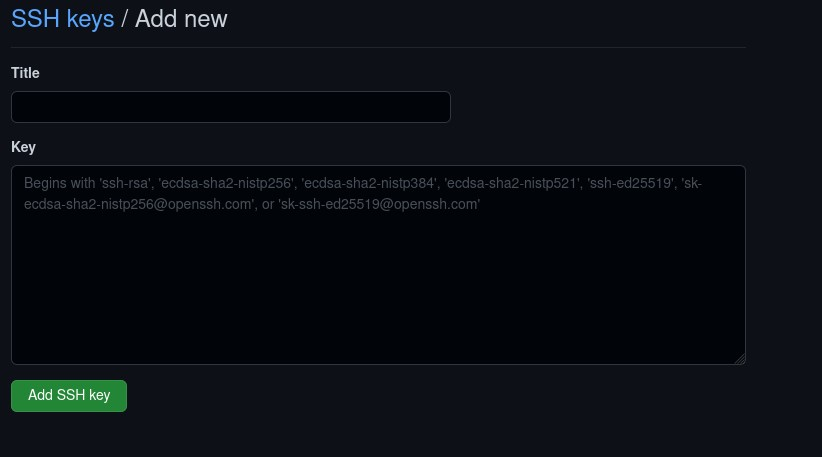

## Klonowanie repozytorum za pomocą SSH

Teraz mogę sklonować repozytorium za pomocą SSH.
Adres można uzyskać ze strony repozytorium

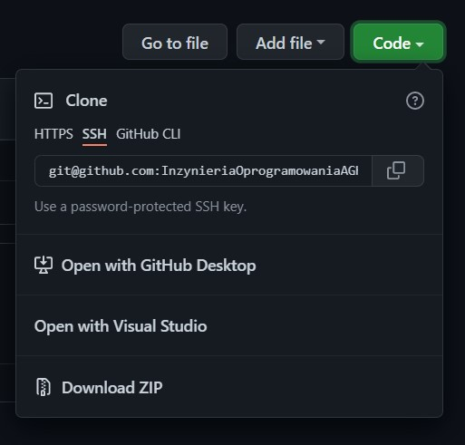

Klonowanie wykonałem za pomocą komendy:

`git clone git@github.com:InzynieriaOprogramowaniaAGH/MDO2022.git`

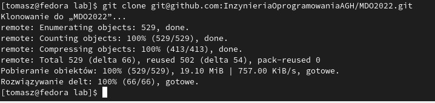

Podczas tworzenia na jednym z kluczy ustawiłem hasło, dlatego podczas klonowania zostałem poproszony o wpisanie hasła

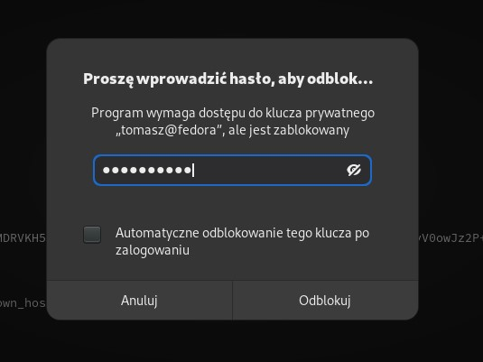

## Branche

Po wejściu w repozytorium przełączyłem się na branch swojej grupy komendą:

`git checkout GCL01`

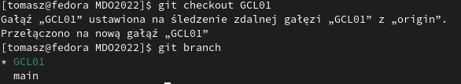

Tworząc nowy branch użyłem komendy: 

`git checkout -b TW301196`

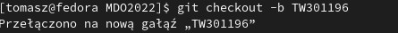

Polecenem `cd` przeszedłem do folderu GCL/01 i komendą `mkdir` utworzyłem tam nowy katalog

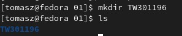

Poleceniem `touch` utworzyłem plik README.MD

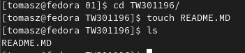

Przy pomocy eksploratora plików w fedorze przeniosłem screeny do folderu w repozytorium lokalnym

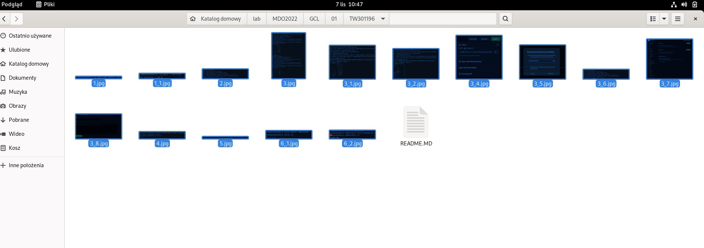

Następnie użyłem komend `git add *.*` aby git zaczął śledzić te wszystkie pliki oraz `git status` aby sprawdzić wszystkie zmiany

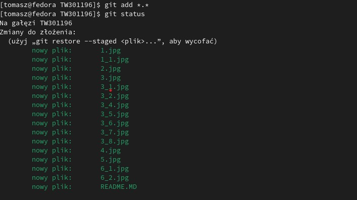

Aby dodać commit wykorzystałem komendę 
`git commit -m "Added readme.md file and screenshots"`

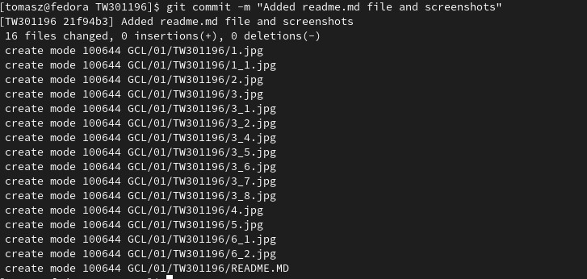

Do wypchnięcia zmian na zdalne repozytorium użyłem polecenia
`git push --set-upstream origin TW301196`

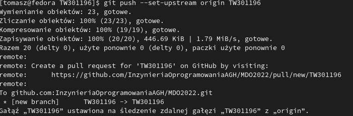

Po zakończeniu operacji wszystkie pliki są już na zdalnym repozytorium na GitHub

Podczas próby wciągania utworzonego przeze mnie brancha na branch grupowy komendą `git merge TW301196` otrzymałem następujący błąd:
 
 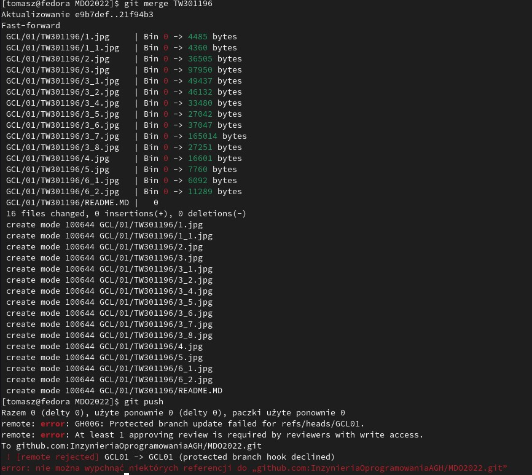
Jest to spowodowane tym, że wszystkie próby mergowania się z gałęzią grupową muszą być zatwierdzone, a więc w tym przypadku jedyną drogą mergowania jest wystawienie Pull Request'a.

Po dokonaniu zmian sprawdzam wszystko komendą `git status`

 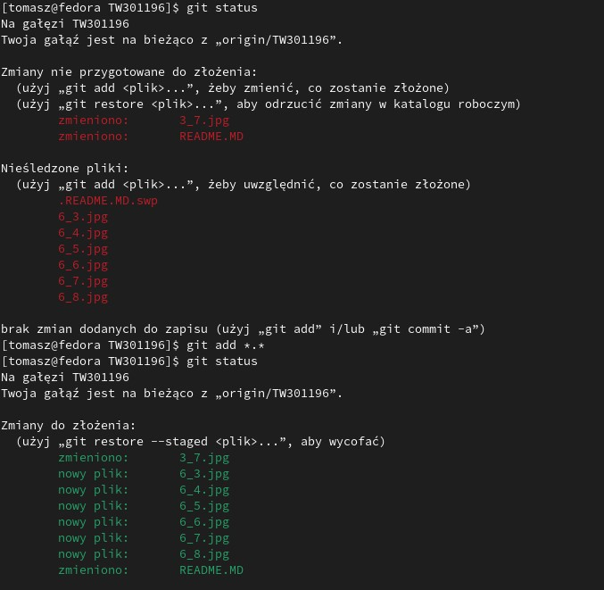

Następnie tworze nowego commita taką samą procedurą jak w przypadku pierwszego.

Do otagowania commita wykorzystałem komendę `git tag v2.1`

 

 Wysyłanie commita z tagiem na repozytorium zdalne odbywa się komendą `git push origin --tags`

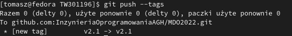

## Hooks

Aby utworzyć hook, który będzie sprawdzał czy wiadomość z commitem zawiera nazwę przedmiotu należy przejść w głownym folderze repozytorium do ukrytego katalogu **.git** a następnie do katalogu **hooks**.
Należy utworzyć plik o nazwie **commit-msg** i nadać mu uprawnienia do wykonywania.

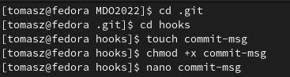

Następnie z użyciem edytora tekstu (w moim przypadku nano) należy napisać odpowiedni skrypt sprawdzający czy wiadomość zawiera odpowiedni ciąg znaków

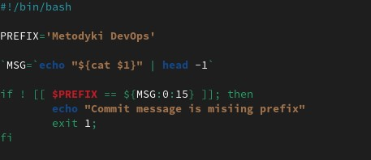

Po próbie stworzenia commitu dostaję wiadomość **Commit message is missing prefix**

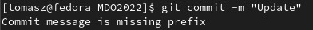

Aby stworzyć hook ustawiający prefiks wiadomości commitu można odpowiednio zmodyfikować napisany wcześniej skrypt:

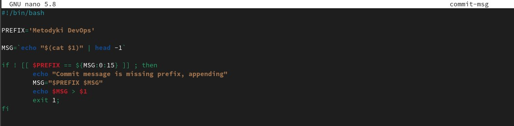

## Pull request

Aby stworzyć nowego pull request'a na stronie GitHub przechodzi się do zakładki **Pull request** a następnie klika się w button **Create pull request**.

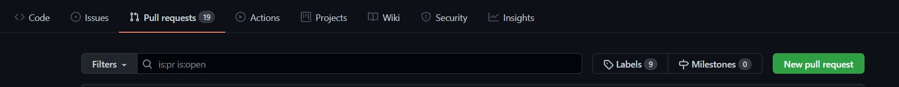

Kolejnym krokiem jest wybranie odpowiednich branchy i zatwierdzenie.

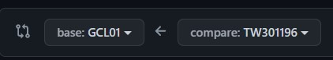