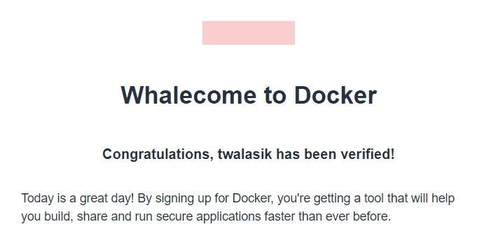
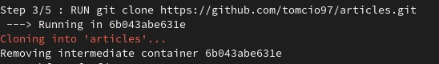

# Metodyki devops - lab2

## Środowisko wykonywania zadań

Środowiskiem na którym wykonywane są zadania jest system Fedora z rodziny linux. **Fedora 35 Workstation**

## Zestawienie środowiska

1. Zainstalowałem docker w moim systemie linuxowym następującymi komendami: 

`sudo dnf config-manager --add-repo https://download.docker.com/linux/fedora/docker-ce.repo`

`sudo dnf install docker-ce docker-ce-cli containerd.io`

a następnie włączyłem dockera komendą: 

`sudo systemctl start docker`

2. Utworzyłem konto na stronie https://hub.docker.com/. Zapoznałem się wstępnie z najpopularniejszymi dostępnymi tam obrazami. Potwierdzeniem założenia konta będzie fragment maila powitalnego:

3. Pobrałem obrazy: hello-world, busybox, fedore oraz mysql. Wszystkie te operacje odbywały się po kolei komendą:

`sudo docker pull <nazwa_obrazu>`

4. Uruchomiłem busybox komendą:

`sudo docker run busybox`

Uruchomiłem go również interaktywnie komendą: 

`sudo docker run -it --rm busybox`

a następnie wewnątrz kontenera użyłem polecenia: 

`sh --help` 

aby wywołać numer serii.

5. Uruchomiłem w kontenerze system fedora podobną komendą jak w przypadku interaktywnego busyboxa: 

`sudo docker run -it fedora bash`

Procesy dockera na hoście: 

Jak widać mimo, że na kontenerze są uruchamiane poszczególne operacje, nie są one wirtualizowane, tylko są normalnie widoczne na liście procesów hosta.

Wychodzenie z kontenera odbywa się komendą 

`exit`

6. Aby wyświetlić listę uruchomionych kontenerów można użyć polecenia

`sudo docker ps -a`

Tak prezentuje się lista kontenerów:

Aby wyczyścić kontenery można użyć komendy: 

`sudo docker container stop <id_kontenera>`

7. Do wyczyszczenia obrazów użyłem komendy: 

`sudo docker rmi <id_obrazu>`

## Budowanie programu

1. Do wykonania zadań wykorzystałem swój własny mały projekt, który zawiera kilka testów jednostkowych. Projekt został stworzony w technologii .NET Core.

**https://github.com/tomcio97/articles**

Pobranie repozytorium odbyło się poleceniem 

`git clone https://github.com/tomcio97/articles.git`

2. Do zbudowania projektu potrzebny był zestaw SDK platformy .NET 5. Zainstalowanie odbyło się poleceniem: 

`sudo dnf install dotnet-sdk-5.0`

3. Uruchomienie testów odbyło się komendą: 

`dotnet test articles`

Jak widać wszystkie testy Passed :)

4. Wykonanie tego samego procesu w kontenerze

 - Uruchomienie platformy fedora takim samym poleceniem jak wcześniej zaprezentowano.
 - Platforma została zaopatrzona w narzędzie git oraz zestaw SDK .NET 5.

- Sklonowanie repozytorium aplikacji identycznie jak w poprzednim ćwiczeniu.

- Budowanie aplikacji komendą: 

`dotnet build articles`

- Uruchomienie testów (jak w poprzednim ćwiczeniu)

5. Stworzyłem plik Dockerfile komendą 

`touch Dockerfile-build`

a następnie edytwałem edytorem tekstu **nano** 

Uruchomienie pliku za pomocą polecenia: 

`sudo docker build -t build:latest . -f ./Dockerfile-build`

Plik odpala się w 5 krokach:

- Pobranie odpowiedniego obrazu  

- Instalacja potrzebnych programów 

- Klonowanie repo

 - Przełączenie katalogu roboczego

- Zbudowanie projektu

6. Tak prezentuje się wyżej wymieniony plik Dockerfile-build:

- `FROM fedora:latest` - Został on stworzony na bazie obrazu 'fedora:latest' czyli najnowszej wersji systemu Fedora.

- `RUN yum -y install git dotnet-sdk-5.0` - Zainstalowanie git oraz .NET SDK.

- `WORKDIR articles` - ustawienie katalogu articles jako miejsca do wykonywania kolejnych poleceń.

- `RUN dotnet build` - zbudowanie projektu.

7. Plik dockerfile, uruchamiający testy do programu zbudowanego w poprzednim obrazie: 

Tutaj następuje w pierwszej linii wykorzystanie poprzednio utworzonego obrazu oraz druga komenda odpowiedzialana za uruchomienie testów.

Uruchomienie odbywa się podobnie jak poprzednio: 

`sudo docker build -t build:latest . -f ./Dockerfile-test`

