# Medytyki devops - lab3

## Łączność i woluminy na podstawie "złych" praktyk

1. Pobranie ubutu

    komenda: `docker pull ubuntu`

    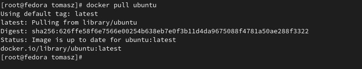
    
2. Podłączenie woluminu do kontenera

    komenda do utworzenia woluminu: `docker volume create data`

    data - nazwa woluminu

    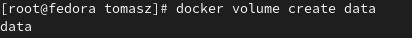

    komenda podłączająca kontener do woluminu:

    `docker run --interactive --tty --mount source=data,destination=/store ubuntu`

    `source=data` - nazwa woluminu

    `destination=/store` - miejsce w kontenerze

    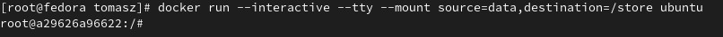

3. Skopiowanie pliku do katalogu woluminu

    komenda: 
    `docker cp plik.txt a29626a96622:/store/plik.txt`

    a29626a96622 - id kontenera 

    store/ - destination podane przy podłączaniu kontenera

    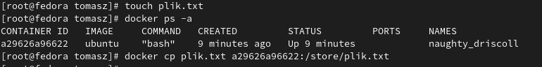

    na kontenerze komendą `cd store` przechodzę do katalogu store w którym znajduje się **plik.txt**

    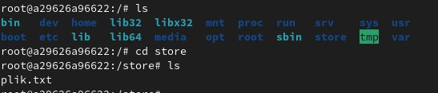

4.  Utworzenie pliku w kontenerze woluminu

    We wcześniej wymienionym katalogu store tworzę plik **plik2.txt**

    Jest on widoczny na hoście pod odpowiednią scieżką którą można podejrzeć komendą:
    
     `docker volume inspect data`

    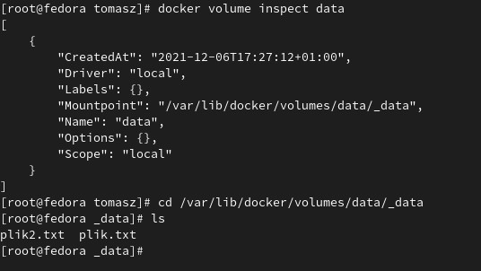

## "Kiepski pomysł": SSH

1. Uruchomienie i wyeksponowanie portu w kontenerze komendą:

`docker run --interactive --tty -p 2222:22 --mount source=data,destination=/store ubuntu`

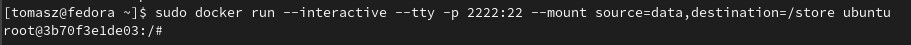

2. Instalacja serwera ssh w kontenerze: `apt-get -y install openssh-server`

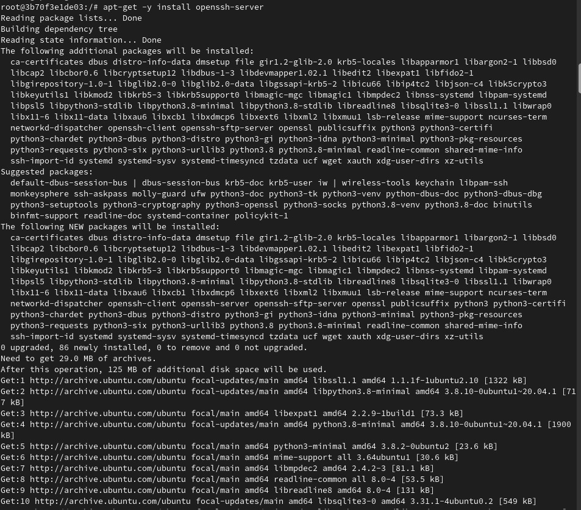

3. Zmiana portu

Otwieram plik **sshd_config** w edytorze tekstu, a następnie odpowiednio ustawiam port: 

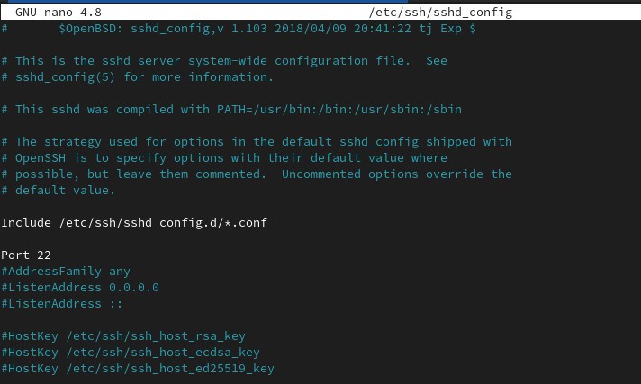

4. Zezwolenie na logowanie root odbywa się w tym samym pliku:

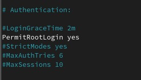

5. Na hoście kopiuję klucz publiczny do wolumenu.

A następnie w kontenerze tworzę folder dla plików zaufanych i tam wklejam klucz.

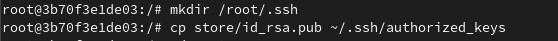

6. Uruchamiam usługę na kontenerze komendą: `service ssh start`

A następnie sprawdzam adres ip kontenera:

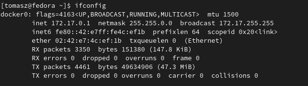

Łączę się z kontenerem komendą:

`ssh root@127.17.0.1 -p 2222`

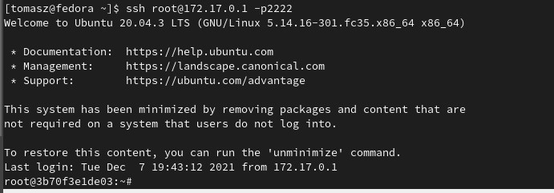

## Skonteneryzowany Jenkins Stsujący dockera

### Przygotowanie

1. Uruchomienie Dockera, który eksponuje środowisko zagnieżdzone:

`
docker run --name jenkins-docker --rm --detach \
  --privileged --network jenkins --network-alias docker \
  --env DOCKER_TLS_CERTDIR=/certs \
  --volume jenkins-docker-certs:/certs/client \
  --volume jenkins-data:/var/jenkins_home \
  --publish 2376:2376 docker:dind --storage-driver overlay2
`

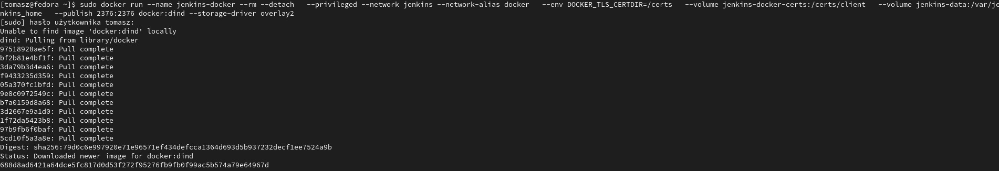

2. Przygotowanie obraz blueocean, który eksponuje środowisko zagnieżdzone:

Tworzę nowy plik **Dockerfile**, a następnie wklejam do niego treść z instrukcji

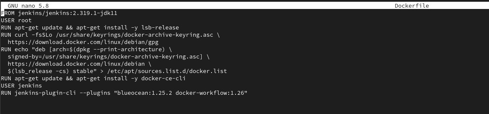

3. Uruchomienie blueocean:

komenda: 

`
docker run --name jenkins-blueocean --rm --detach \
  --network jenkins --env DOCKER_HOST=tcp://docker:2376 \
  --env DOCKER_CERT_PATH=/certs/client --env DOCKER_TLS_VERIFY=1 \
  --publish 8080:8080 --publish 50000:50000 \
  --volume jenkins-data:/var/jenkins_home \
  --volume jenkins-docker-certs:/certs/client:ro \
  myjenkins-blueocean:1.1
`

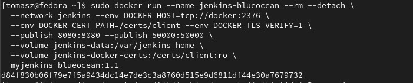

4. Logowanie się do jenkins:

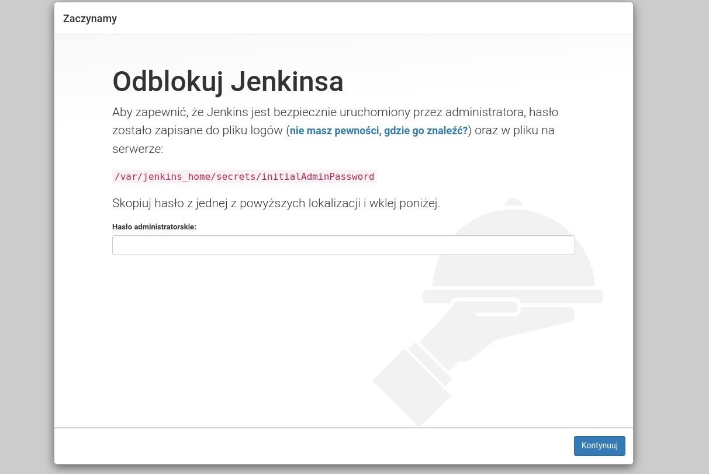

Aby zalogować się do jenkins musiałem odczytać hasło, które zostało zapisane w logach. Użyłem do tego komendy `sudo docker logs <id_kontenera>`

Wpisałem hasło, a następnie skonfigurowałem jenkinsa.

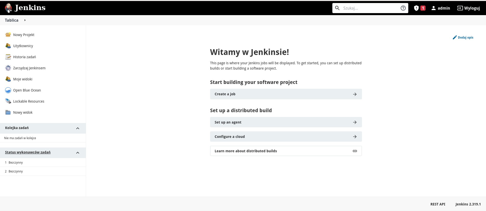