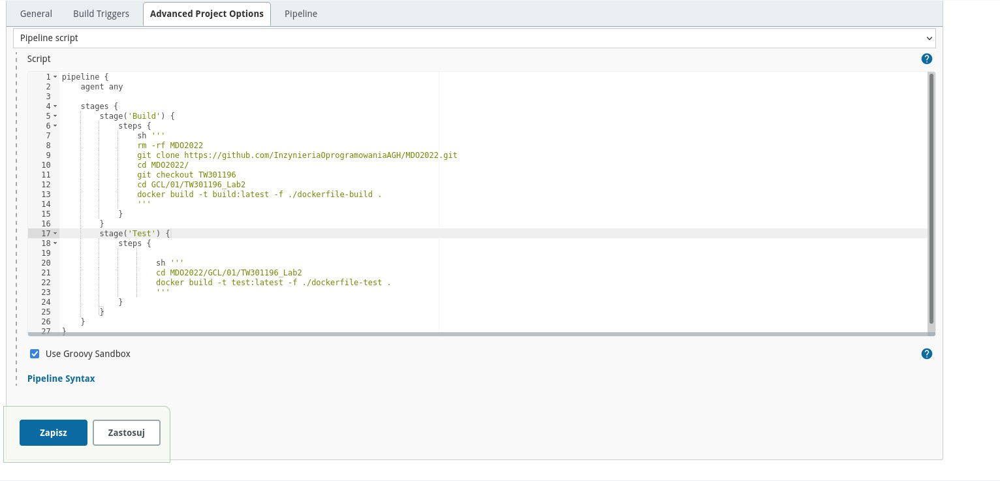
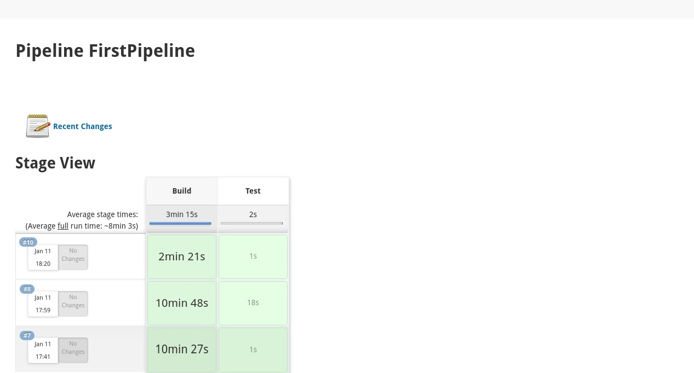
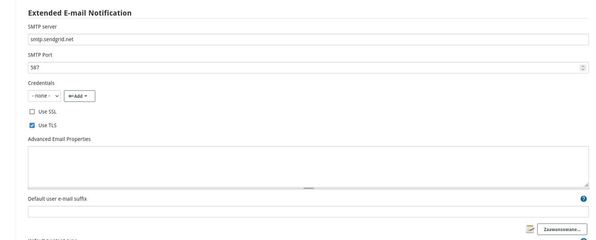
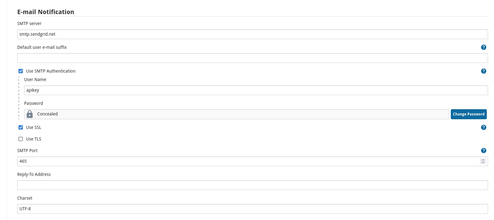
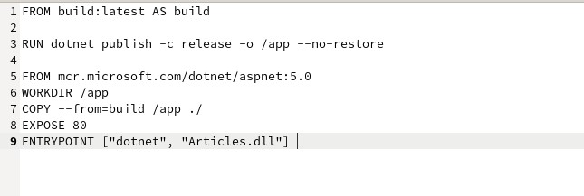
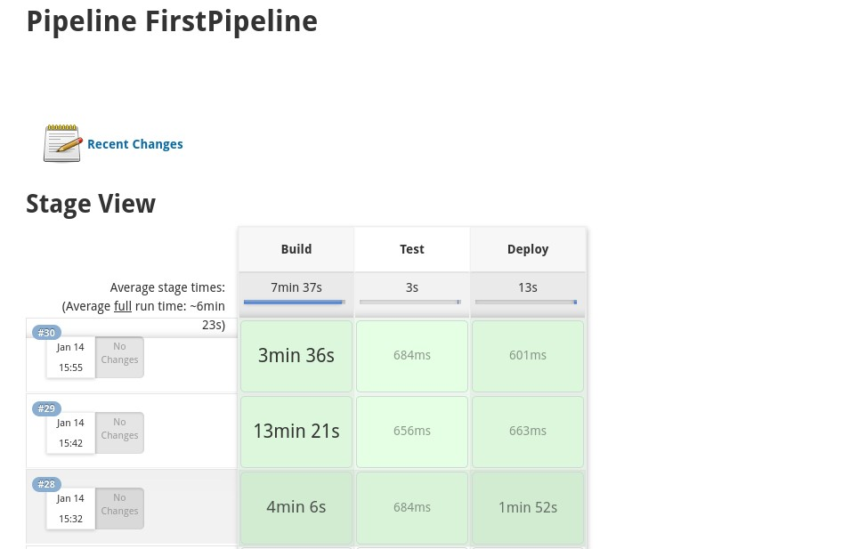

# Medytyki devops - lab4

Wszystkie pliki dockerfile wykorzystane w tym ćwiczeniu dostępne są w repozytorium w folderze z ćwiczeń nr. 2.

## Stworzenie Jenkinsfile

1. Po odpaleniu jenkins'a w przeglądarce przechodzę pod Nowy projekt -> Pipeline. Odpowiednio go nazywam, a następnie w sekcji Pipeline wklejam Jenkinsfile, który prezentuje się następująco:

    
    
    Jak można zauważyć mój jenkinsfile na ten moment zawiera dwa etapy: build i test.
    W etapie build następuje pobranie repozytorium z github'a, przełączenie się na odpowiedni branch, przejście do odpowiedniego folderu i zbudowanie projektu przy pomocy dockerfile.

    W etapie test również przy pomocy dockerfile odbywa się uruchomienie testów.

    Jenkinsfile buduje się na kontenerze CI. Podejście to jest szybkie i proste w implementacji. Zastosowanie DIND sprawiłoby, że mielibyśmy izolacje jenkins'a i jego agenta.

 Pipeline zbudował się prawidłowo:

2. Powiadomienia

Do powiadomień wykorzystałem EmailAPI od SendGrid.

Aby poprawnie dodać EmailAPI należy przejść do Zarządzania Jenkinsem -> Konfiguracja systemu.
Następnie odpowiednio uzupełnić sekcje **Extend E-mail notifiaction** oraz **E-mail notification**

Do pliku jenkinsfile po poprawnym przejściu testów dodałem kod odpowiedzialny za wysłanie powiadomienia o poprawnym zbudowaniu się projektu na mojego maila.

3. Deploy

Utworzyłem nowy plik dockerfile o nazwie **dockerfile-deploy**:

Jego zadaniem jest wykonanie publish aplikacji do katalogu oraz na odpowiednim obrazie udostępnionym przez microsoft odbywa się uruchomienie aplikacji na porcie 80.

Rozbudowałem jenkinsfile o etap **Deploy**

 
 Odbywa się tutaj tylko zbudowanie obrazu. Prawidłowo obraz ten powinien zostać umieszczony na dockerhub'ie oraz przy pomocy innej wirtualnej maszyny tam uruchomiony. Niestety nie udało mi się na ten moment tego zrealizować.

 