# Medytyki devops - lab5

## Zestawienie platformy Kubernetes

- Kontener na maszynie wirtualnej został zainstalowany już wcześniej.
- Instalacja minikube i kubectl:

 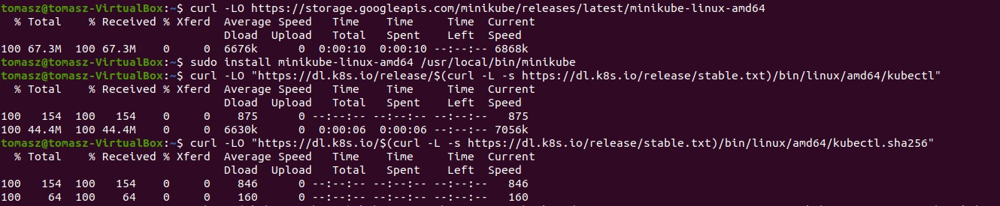

Następuje pobranie odpowiednich plików oraz ich instalacja.

  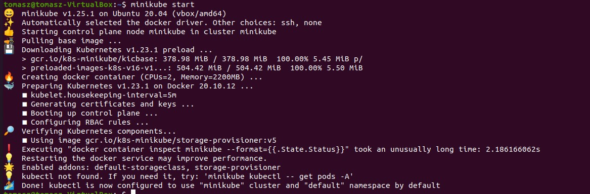

  Tutaj następuje uruchomienie minikube'a

- Otwarte porty: 

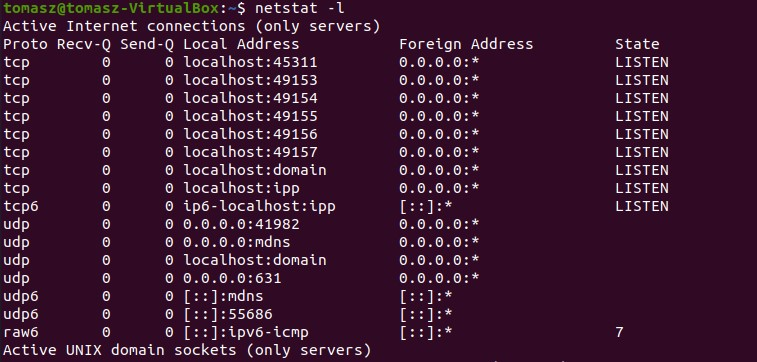

  - Stan dockera:

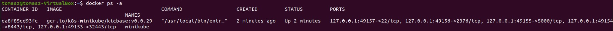

## Stan minikube

- Uruchomienie minikube Dashboard:

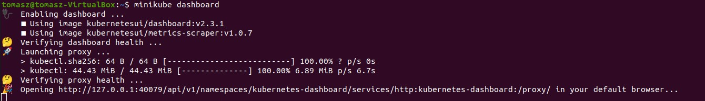

Tak prezentuje się efekt w przeglądarce:

- Działające usługi(k8s) i wdrożenia:

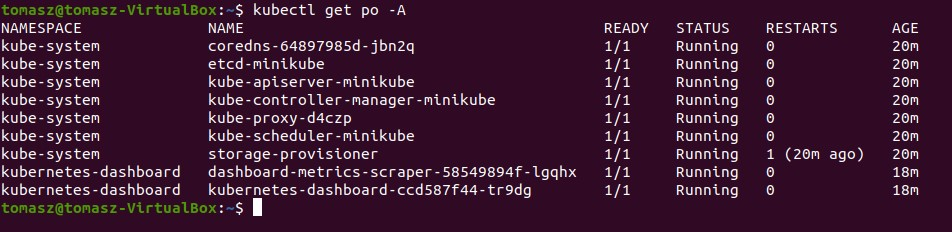

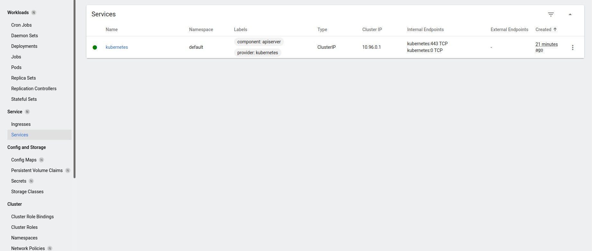

- Wdrożenia (stan "przed")

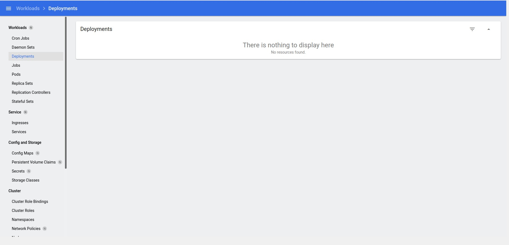

## Wdrożenie kontenera via k8s

- deployment "hello k8s": `k8s.gcr.io/echoserver`

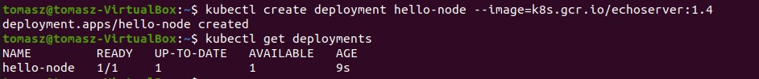

- przekierowanie portów:

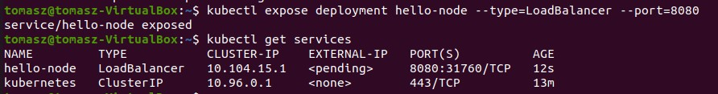

- Rezultat wdrożenia: 

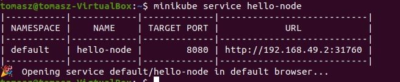

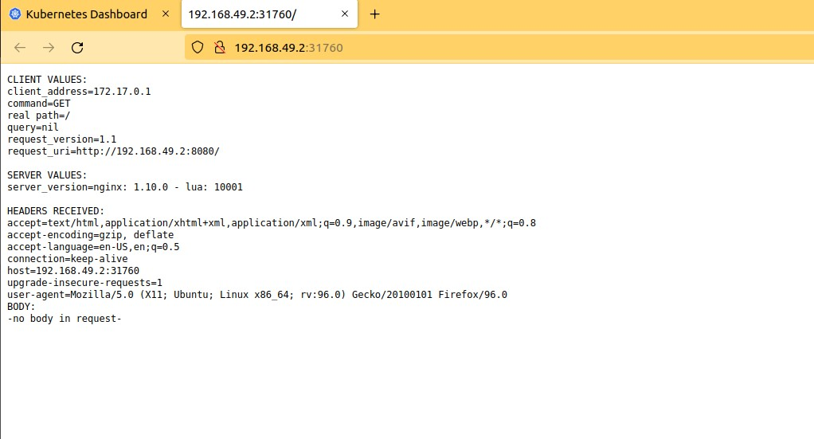

## Deployment 

- Plik yaml z deploymentem k8s

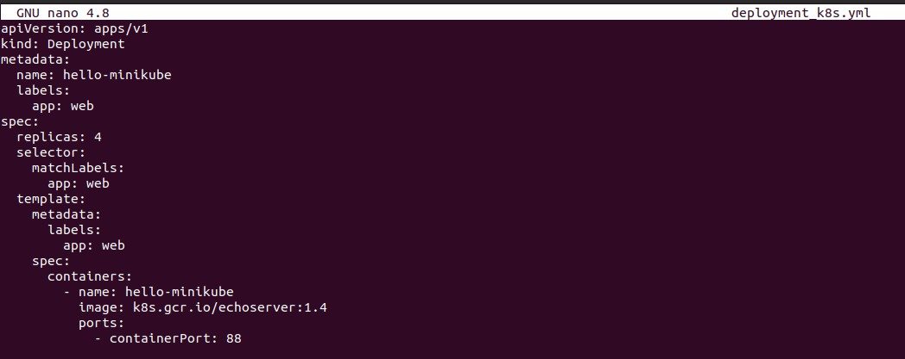

Jak można zauważyć w pliku mamy zdefiniowane 4 repliki dla danej aplikacji. Oznacza to, że tyle instancji tej samej aplikacji będzie działać w tym samym czasie. Wadą jest zajmowanie zasobów, natomiast zaletą jest to, że w momencie wysypania się jednej repliki nastąpi przekierowanie na drugą. Dla mniej wykorzystywanych aplikacji, gdzie ruch użytkowników jest niewielki zaleca się mniej replik.

- Aplikowanie wdrożenia:

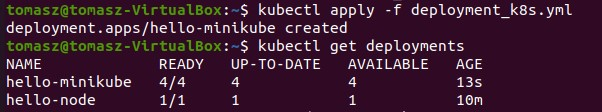

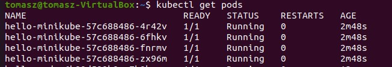

Jak można zauważyć powstały 4 pody.

- Rezultat wdrożenia

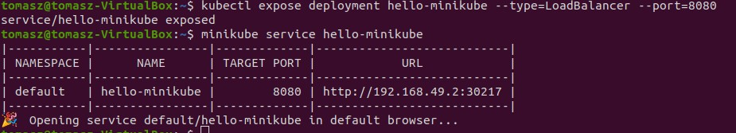

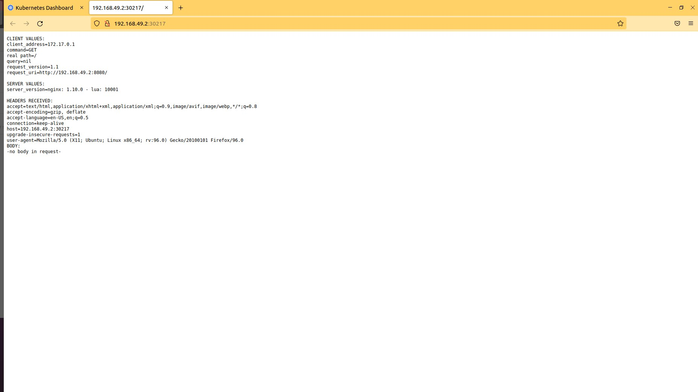
