ZESTAWIENIE ŚRODOWISKA

1.	Zainstalowanie Dockera na Ubuntu, działającego w maszynie wirtualnej w Vmware.
	> apt-get update

	> apt-get install docker-ce docker-ce-cli containerd.io

	
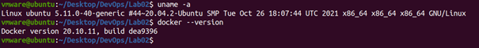

2.	Stworzenie konta w serwisie Docker Hub i przeglądnięcie popularnych obrazów jak np. busybox, mysql lub hello-world.

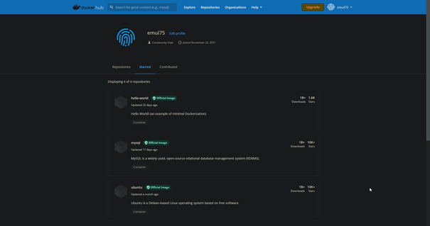

3.	Pobranie obrazów hello-world, busybox, ubuntu oraz mysql z DockerHuba.
	>	docker pull ubuntu

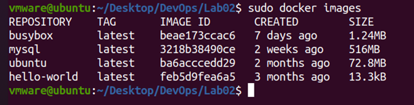

4.	Uruchomienie kontenera z pobranego obrazu busybox w trybie interaktywnym i wywołanie wewnątrz numeru wersji. 
	>	docker run -it busybox

	Po wyjściu z kontenera  i wyświetleniu listy uruchomionych kontenerów można zobaczyć, że ten kontener uruchomił się i zakończył pracę z kodem 0.sd

	>	docker ps -a

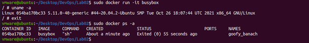

5.	Uruchomienie kontenera z „systemem” Ubuntu.
	>	docker run ubuntu

	Wyświetlenie listy procesów w kontenerze. Pierwszym procesem jest bash.

	>	ps aux
	
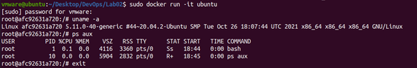

W hoscie, dla porównania, pierwszym procesem jest init, 

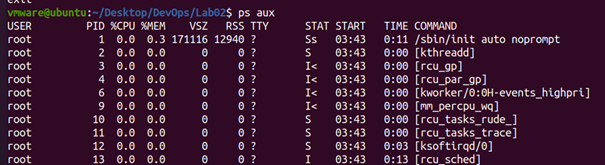

a bash posiada ID 5448. 

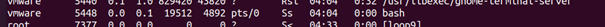

Zaktualizowanie listy pakietów w kontenerze. Po wyjściu i ponownym uruchomieniu kontenera będzie on miał znowu niezaktualizowaną listę, ponieważ te zmiany nie mają wpływu na obraz, z którego został utworzony. Kontenery są bezstanowe.

>	apt update

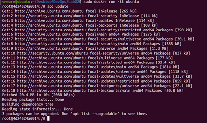


6.	Wyjście z kontenera i wyświetlenie listy uruchomionych kontenerów – Ubuntu zostało zakończone z kodem 0.
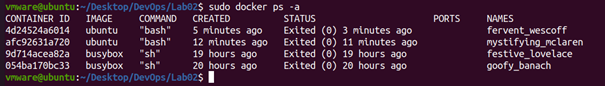

Usunięcie wszystkich kontenerów i obrazów.
>	docker system prune –volumes

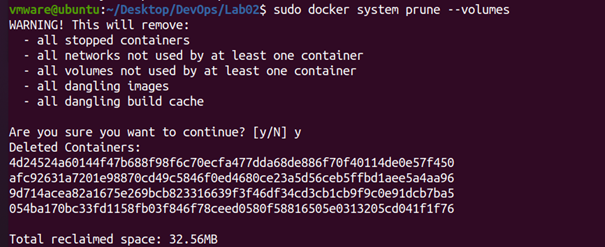

>	docker image prune -a

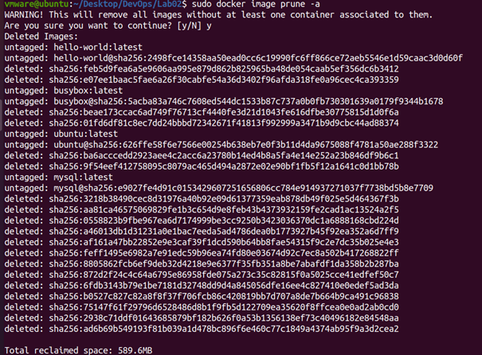

7.	Puste listy kontenerów i obrazów.

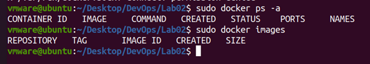


BUDOWANIE PROGRAMU

1.	Utworzenie pliku Dockerfile, który stworzy kontener ze zbudowaną aplikacją.
	```
	# pobieranie najnowszego obrazu Ubuntu
	FROM ubuntu:latest
	# aktualizacja listy pakietów
	RUN apt-get update
	# zapisanie liczb do pliku, potrzebnych do wybrania regionu podczas instalowania JDK
	RUN echo 8 > input
	RUN echo 60 >> input
	# pobieranie pakietu Java Development Kit
	RUN apt-get install -y default-jdk < input
	# pobieranie paczek git oraz maven
	RUN apt-get install -y git maven
	# klonowanie repozytorium aplikacji
	RUN git clone https://github.com/IntrowertyczneLosieIO/introwertyczne-losie.git
	# przejście do katalogu aplikacji
	WORKDIR introwertyczne-losie/backend
	# zbudowanie aplikacji, pomijając testy
	RUN mvn clean install -DskipTests
	```


2. Utworzenie drugiego pliku Dockerfile, który na podstawie obrazu stworzonego dzięki poprzedniemu Dockerfile'owi, uruchomi testy jednostkowe i w przypadku powodzenia utworzy nowy obraz. 
	```
	# poprzednio utworzony obraz ze zbudowaną aplikacją jako źródło
	FROM bldr:latest
	# uruchomienie testów jednostkowych
	RUN mvn test
	```


Uzycie komendy budującej nowy obraz „bldr” z tagiem „latest” przy wykorzystaniu Dockerfile’a „ubuntu-builder”
>	sudo docker build -t bldr:latest . -f ./ubuntu-builder

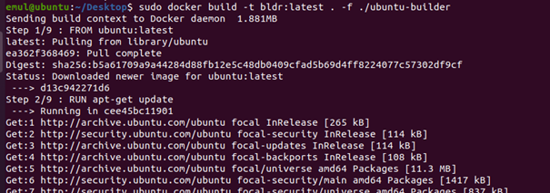

Po budowaniu zakończonym sukcesem zostaje użyta komenda, która na podstawie nowego obrazu i dockerfile’a uruchomi testy aplikacji
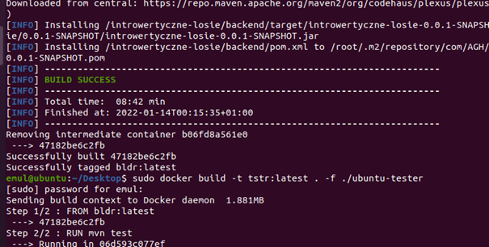

Testy zostały zakończone powodzeniem. Na liście widnieją utworzone obrazy bldr i tstr.
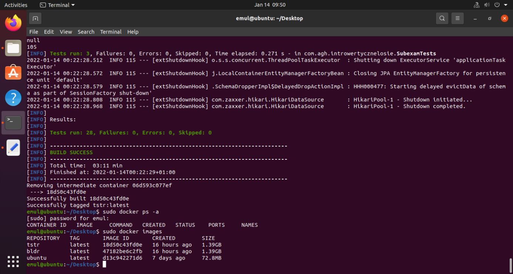


