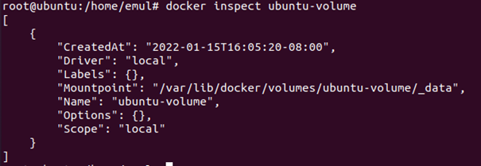
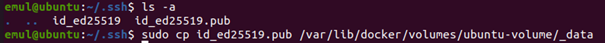

# Sprawozdanie - Lab03 - Emil Pastwa

## Łączność i woliminy na podstawie złych praktyk.

1. Pobranie obrazu ubuntu. Tutaj był już pobrany.
> docker pull ubuntu:latest

2. Utworzenie nowego woluminu ubuntu-volume oraz wyświetlenie listy woluminów.
> docker volume create <nazwa-woluminu>

3. Wyświetlenie listy woluminów.
> docker volume ls

4. Wyświetlenie szczegółów woluminu.
> docker volume inspect ubuntu-volume

5. Przejście do folderu z danymi tego woluminu.
> /var/lib/docker/volumes/<nazwa-woluminu> /_data

6. Podłączenie woluminu do kontenera i uruchomienie go w trybie interaktywnym
> docker run -it -v <nazwa_woluminu>:<nazwa_katalogu_w_kontenerze> <nazwa_obrazu>

7. Przejście do katalogu utworzonego woluminu, w którym widać znajdujący się tam wcześniej utworzony plik „test-file”.
> cd test-dir

8. Uworzenie w tym folderze nowego pliku.
> touch <nazwa_pliku>

9. Wyjście z kontenera i powrót do katalogu woluminu na hoście. Jak widać znajduje się tam plik, który utworzyliśmy wewnątrz kontenera.
> exit

## "Kiepski pomysł": SSH
1. Uruchomienie kontenera z wyeksponowanym portem, połączonego jak poprzednio z woluminem.
> docker run -it --tty -p <numer portu> --mount source=<nazwa_woluminu> target=<nazwa_katalogu_w_kontenerze> <nazwa_obrazu>

2. Aktualizacja listy pakietów w kontenerze, instalacja shh i edytora tekstowego vim
> apt update
> apt install openssh-server vim
3. Przejście do pliku sshd_config, który znajduje się w katalogu /etc/ ssh/ i otworzenie go edytorem vim.
> cd /etc/ ssh
> vim sshd_config
4. Naciskamy klawisz `i` aby przejsci w tryb edycji, odkomentowujemy pola Port oraz PermitRootLogin i nadajemy im wartości 77 oraz yes. Następnie klikamy klawisz Esc, wpisujemy `:w”` aby zapisać plik oraz `:q` aby wyjść. 

5. Wychodzimy z kontenera bez jego zamykania za pomocą sktótu klawiszowego `Ctrl + P + Q`.
6. Przechodzimy do katalogu `~/.ssh`.
> cd ~/.ssh
7. Generujemy nowy klucz, jeśli nie ma jeszcze istniejącego.
> ssh-keygen -t ed25519

8. Skopiowanie klucza publicznego do woluminu.
> cp id_ed25519.pub /var/lib/docker/volumes/ubuntu-volume/_data

9. Wracamy do naszego kontenera za pomocą komendy:
> docker exec -it <numer_kontenera> bash

10. Po czym okazuje się, że kluczy tam nie ma, ponieważ kopiowanie było z konta root, pownieważ zwykłe konto nie ma dostępu do katalogu docker. Ale klucze zostały wygenerowane na koncie użytkownika emul. W takim wypadku wygenerowałęm klucz jeszcze raz z ale konta root.
Aby przejść do konta root należy użyć komendy 
> sudo -s
a żeby wyjść używamy 
> exit

11. Kolejna próba kopiowania klucza do woluminu w kontenerze i ponowne wejście do kontenera.
> cp ~/.ssh/id_ed25519.pub /var/lib/docker/volumes/ubuntu-volume/_data
> docker exec -it 3665bb3c03ed bash
Klucza dalej tam nie było. Okazało się, że jakimś cudem istniały dwa katalogi o nazwie ubuntu-volume i coś źle się kopiowało. Po usunięciu jednego z folderów, klucz wreszcie można można było znaleźć w kontenerze.

12. Kopiujemy klucz w odpowniednie miejsce. Wcześniej trzeba było jeszcze utworzyć folder `.ssh/authorised_keys`, pownieważ nie został utworzeony automatycznie wcześniej.
> mkdir ~/.ssh/authorised_keys
> cp test-dir/id_ed25519.pub ~/.ssh/authorised_keys

13. Uruchomienie i sprawdzenie statusu ssh.
> service ssh start
> service ssh status

14. Sprawdzenie adresu ip kontenera.
> hostname -I

15. Wyjście z kontenera (bez zamykania) i próba połączenia się z kontenerem z hosta przez ssh.
> ssh root@172.17.0.2 -p 77
Ale coś oczywiście nie działa.

Po podmianie klucza na RSA z hasłem, dalej to samo. 
Po ustawieniu hasła do roota udało się połączyć, mimo że to nie jest p[paofdhg.vzdgzf

## Skonteneryzowany Jenkins stosujący Dockera
1. Utworzenie sieci mostkowanej w Dockerze.
> docker network create jenkins
2. W celu wykonania poleceń Dockera w Node’ach Jenkins’a, pobieramy i uruchamiamy obraz docker:dind używając poniższej komendy:
docker run --name jenkins-docker --rm --detach \
  --privileged --network jenkins --network-alias docker \
  --env DOCKER_TLS_CERTDIR=/certs \
  --volume jenkins-docker-certs:/certs/client \
  --volume jenkins-data:/var/jenkins_home \
  --publish 2376:2376 docker:dind --storage-driver overlay2

3. Tworzymy nowy plik dockerfile:
`
FROM jenkins/jenkins:2.319.2-jdk11
USER root
RUN apt-get update && apt-get install -y lsb-release
RUN curl -fsSLo /usr/share/keyrings/docker-archive-keyring.asc \
  https://download.docker.com/linux/debian/gpg
RUN echo "deb [arch=$(dpkg --print-architecture) \
  signed-by=/usr/share/keyrings/docker-archive-keyring.asc] \
  https://download.docker.com/linux/debian \
  $(lsb_release -cs) stable" > /etc/apt/sources.list.d/docker.list
RUN apt-get update && apt-get install -y docker-ce-cli
USER jenkins
RUN jenkins-plugin-cli --plugins "blueocean:1.25.2 docker-workflow:1.26"
`
4. Budujemy obraz z wykorzystaniem tego Dockerfile.
> docker build -t myjenkins-blueocean:1.1 .

Niestety pojawia się błąd powodujący brak połączenia do repozytoriom pakietów, z którym miałem już problemy wcześniej. Czasami pojawiał się tylko w kontenerze a innym razem nawet na systemie hosta. Jedyne co naprawiało ten błąd, choć nie zawsze, to restart maszyny wirtualnej.
(Przykład z internetu)

Po restarcie obraz został zbudowany.

5. Po udanym zbudowaniu obrazu uruchamiamy go w kontenerze.

`
docker run --name jenkins-blueocean --rm --detach \
  --network jenkins --env DOCKER_HOST=tcp://docker:2376 \
  --env DOCKER_CERT_PATH=/certs/client --env DOCKER_TLS_VERIFY=1 \
  --publish 8080:8080 --publish 50000:50000 \
  --volume jenkins-data:/var/jenkins_home \
  --volume jenkins-docker-certs:/certs/client:ro \
  myjenkins-blueocean:1.1
`

6. Wchodzimy przez przeglądarkę na podany adres, na którym poproszeni jesteśmy o hasło.
> localhost:8080

7. Aby zdobyć hasło znajdujemy ID kontenera z Jenkinsem i wyświetlamy logi tego kontenera podając jego ID.
> docker ps -a

> docker logs 10e238936075

8. Następnie w przeglądarce postępujemy wg poleceń instalatora. Wybieramy ‘Install suggested pluggins’.

Niestety coś poszło nie tak z kilkoma wtyczkami. Ponowne pobieranie pomogło.

9. Pomijamy tworzenie nowego użytkownika, kontynuujemy jako admin.

10. Przechodzimy dalej proces instalacji i na koniec pojawia się nam oanel sterowania Jenkins.

## Projekt wyświetlający uname.
11. Klikamy w new item, podajemy nazwę oraz typ projektu.

12. W następnym kroku w zakładce Build dodajemy polecenie w Execute shell wyświetlające informacje o systemie. Klikamy Save.
> uname -a

14. Wracamy na Dashboard wybieramy nasz projekt i klikamy po lewej Build now. 
Projekt został zbudowany i uruchomiony.

15. Klikając w symbol słońca, a potem po lewej Console Output możęmy zobaczyć konsole zbudowanego projektu.

## Projekt sprawdzający parzystość godziny.
16. Postępując podobnie jak w poprzednim projekcie, wpisujemy prosty kod wyrzucający błąd, gy godzina jest nieparzysta.

17. Wynik w konsoli po zbudowaniu projektu.

## Budowanie prawdziwego projektu
18. Przechodzimy na stronę tworzenia nowego projektu w Jenkinsie i podajemy linki do `GitHub project` i `Git Repositories`.

19. Poniżej wpisujemy nazwę naszego brancha

20. Następnie dodajemy polecenia, które przejdą do katalogu z plikami Dockerfile i zbudują obrazy.

21. Budowanie zakończyło się błędem przy pobieraniu obrazu ubuntu z pomocą dockerfilea’a.
Nie jestem w stanie znaleźć rozwiązania.

A w międzyczasie niestety znowu pojawił się błąd z dostępem do sieci na hoscie, co może mieć z tym związek z powyższym błędem.
