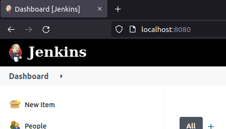
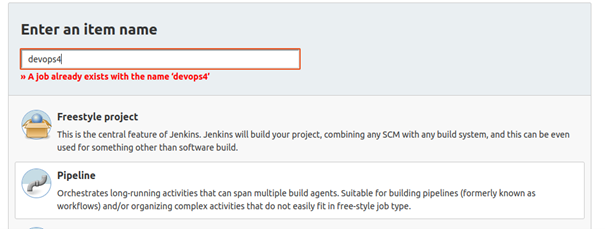
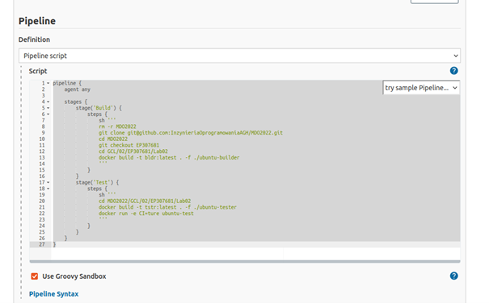
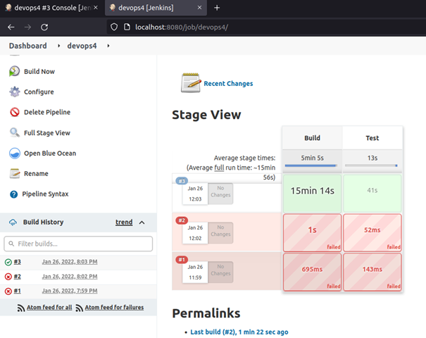
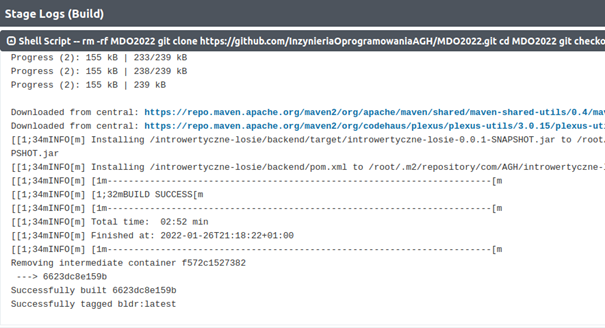
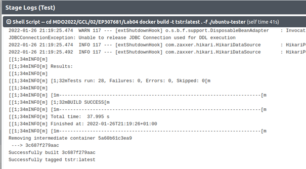
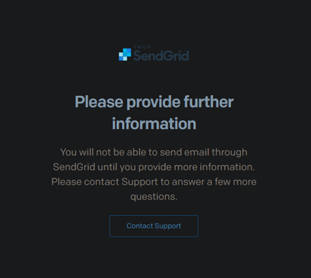
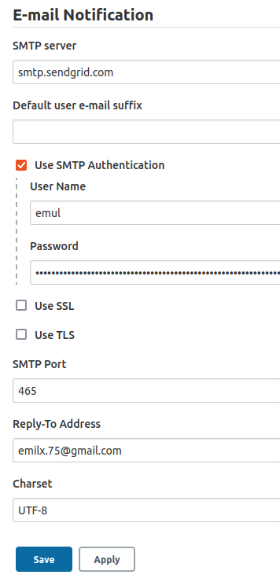

# DevOps4

1. Pobieramy i instalujemy Jenkinsa tak jak w lab03.

2. Przechodzimy do Panelu Jenkinsa w przeglądarce.



3. Klikamy utwórz nowy element i z listy wybieramy Pipeline.



4. W polu Script wklejamy odpowiedni kod:

```
pipeline {
    agent any
    
    stages {
        stage('Build') {
            steps {
                sh '''
                rm -rf MDO2022
                git clone https://github.com/InzynieriaOprogramowaniaAGH/MDO2022.git
                cd MDO2022
                git checkout EP307681
                cd GCL/02/EP307681/Lab04
                docker build -t bldr:latest . -f ./ubuntu-builder
                '''
            }
        }
        stage('Test') {
            steps {
                sh '''
                cd MDO2022/GCL/02/EP307681/Lab04
                docker build -t tstr:latest . -f ./ubuntu-tester
                '''
            }
        }
    }
}
```



5. Zapisujemy i uruchamiamy projekt przyciskiem Build Now.

6. Jenkins wykonuje wtedy polecenia zawarte w powyższym skrypcie, czyli klonuje repozytorium, przechodzi do odpowiedniej gałęzi, przechodzi do katalogu lab4 gdzie znajdują się pliki dockerfile i buduje obrazy dockerowe na ich podstawie.

7. Już za trzecim razem faza budowania i testów przebiegła pomyślnie, co możemy zauważyć w panelu.



8. Tak prezentują się logi poprawie zbudowanego programu.



9. A tak logi testów, które przebiegły pomyślnie.



10. Do Jenkinsfile można dodać również sekcję „post” do każdego stage’a, która wysyła powiadomienia na maila o ich powodzeniu lub niepowodzeniu. 

```
post {
        always {
            emailext body: 'lab4 - Build Success', recipientProviders: [[$class: 'DevelopersRecipientProvider'], [$class: 'RequesterRecipientProvider']], subject: 'Jenkins Build Success'
        }
    }
```

11. Niestety poległem przy zakładaniu konta na serwisie sendgrid.com, który miał służyć jako serwer smtp. Prawdopodobnie poprzez wpisanie fejkowych danych konto nie zostało utworzone i pozostaje kontakt z supportem. Pomijam więc ten krok.



12. Jeśli jednak udało mi się to zrobić, to w panelu Jenkinsa wszedł bym w Manage Jenkins, potem Configure System i na samym dole do zakładki E-mail Notification. 

13. A tam wypełniłbym odpowienie pola jak na poniższym zrzucie ekranu.


