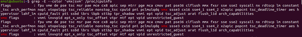
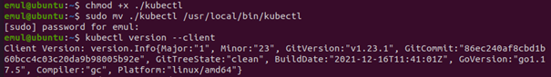
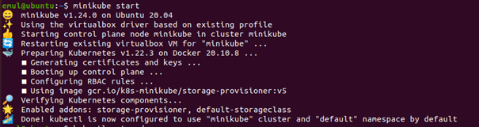

## Zestawienie paplatformy Kubernetes

1~11. Zainstalowanie Minicube, Kubectl oraz VirtualBoxa. 
12. Uruchomienie Minikube i stworzenie klastra.

13. Utworzenie prostego wdrożenia na tym klastrze
> kubectl create deployment hello-minikube --image=k8s.gcr.io/echoserver:1.10

14. Aby uzyskać dostęp do tego klastra, eksponujemy go jako serwis o nazwie hello-minikube na porcie 8080
> kubectl expose deployment hello-minikube --type=NodePort --port=8080

15. Teraz oczekujemy aż Pod się uruchomi, możemy to sprawdzić na liscie 
> kubectl get pod

16. Zdobywamy adres URL utworzonego serwisu.
>minikube service hello-minikube --url

17. Aby zobaczyć detale, wchodzimy na uzyskany adres za pomocą przeglądarki.
 

 
18. Na koniec usuwamy serwis, wdrożenie, zatrzymujemy  i usuwamy klaster.
> kubectl delete services hello-minikube
> kubectl delete deployment hello-minikube
> minikube stop
> minikube delete

