1. Sprawdzenie czy wirtualizacja jest dostępna na naszej wirtualnej maszynie z ubuntu.

> grep -E --color 'vmx|svm' /proc/cpuinfo

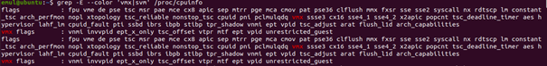

2. Zaktualizowanie pakietów systemowych.

> apt update

> apt upgrade

3. Zainstalowanie pakietu curl

> apt install curl

4. Pobranie najnowszej wersji kubectl

> curl -LO https://storage.googleapis.com/kubernetes-release/release/`curl -s https://storage.googleapis.com/kubernetes-release/release/stable.txt`/bin/linux/amd64/kubectl

5. Dodanie uprawnień do uruchamiania

> chmod +x ./kubectl

6. Dodanie kuble ctl do ścieżki - PATH

> sudo mv ./kubectl /usr/lucal/bin/kubectl

7. Sprawdzenie wersji 

> kubectl version --client

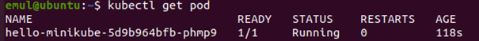

8. Zainstalowanie Virtualboxa

> sudo apt install virtualbox virtualbox-ext-pack

9. Bezpośrednie pobranie minicube przez curl.

> curl -Lo minikube https://storage.googleapis.com/minikube/releases/latest/minikube-linux-amd64 \ && chmod +x minikube

10. Dodawanie minicube do ścieżki systemowej

> sudo mkdir -p /usr/local/bin/

> sudo install minikube /usr/local/bin/

11. Uruchomienie Minikube i stworzenie klastra.

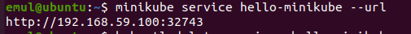

12. Utworzenie prostego wdrożenia na tym klastrze

> kubectl create deployment hello-minikube --image=k8s.gcr.io/echoserver:1.10

13. Aby uzyskać dostęp do tego klastra, eksponujemy go jako serwis o nazwie hello-minikube na porcie 8080

> kubectl expose deployment hello-minikube --type=NodePort --port=8080

14. Teraz oczekujemy aż Pod się uruchomi, możemy to sprawdzić na liscie 

> kubectl get pod

15. Zdobywamy adres URL utworzonego serwisu.

> minikube service hello-minikube --url

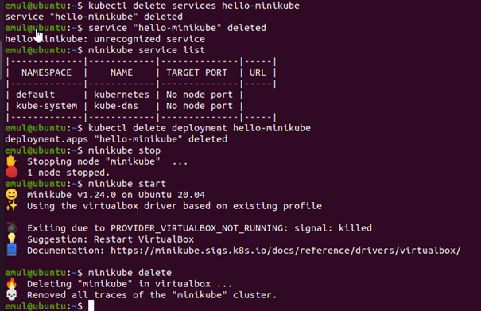

16. Aby zobaczyć detale, wchodzimy na uzyskany adres za pomocą przeglądarki.

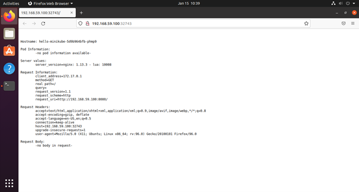

17. Na koniec usuwamy serwis, wdrożenie, zatrzymujemy  i usuwamy klaster.

> kubectl delete services hello-minikube

> kubectl delete deployment hello-minikube

> minikube stop

> minikube delete

18. Laptop z 6 GB RAMu jednak nie wyrabia. Na szczęście okazało się, że na komputerze stacjonarnym jednak działa wirtualizacja w wirtualnej maszynie (naprawiła się w pewnym momencie sama z siebie) więc wracam pracować na nim.

19. Zainstalowanie i uruchomienie minikube dashboard

> inikube kubectl -- get po -A

> minikube dashboard

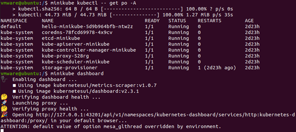

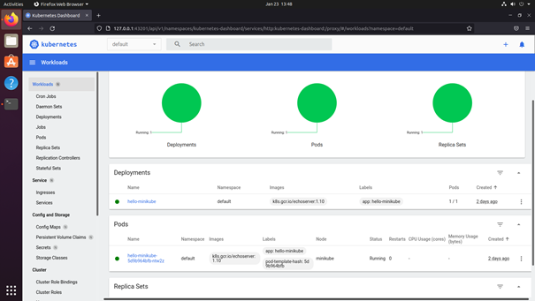

*Aby odzyskać władzę w konsoli po właczeniu minikube dashboard, należy wcisnąć Ctrl+C. Panel się wtedy wyłącza, więc aby do nie go wrócić należy ponownie użyć polecenia:

> minikube dashboard

20. Wyświetlenie działajacych usług i wdrożeń

> systemctl show docker

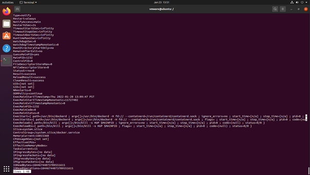

21. Wyświetlenie otwartych portów, z wcześniejszym pobraniem narzędzia do tego

> apt install net-tools

> netstat -l

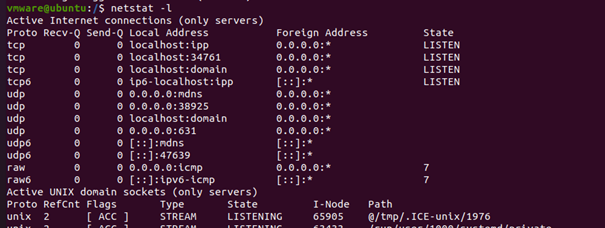

22. Wyświetlenie stanu dockera

> docker ps

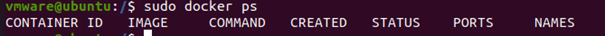

23. Wyświetlenie usług i wdrożeń w minikube dashboard. Widać tutaj poprzednie wdrożenie.

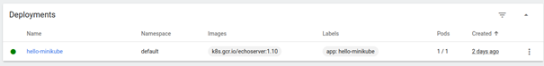

24. Wyświetlenie listy podów w dashboard.

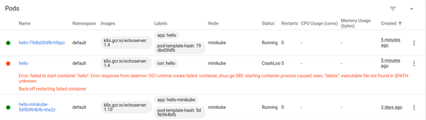

25. Kolejność tutaj jest trochę pomieszana, bo po pierwsze używałem dwóch różnych komputerów, a po drugie wykonywałem to jeszcze raz, tym razem bardziej podążając za treścią zadania.

## Deployment

26. Stworzenie pliku YAML do „deploymentu” k8s

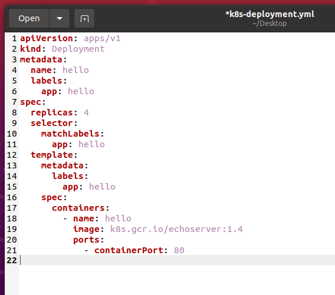

27. W tym deplymencie są 4 repliki. Zaletą takiego rozwiązania jest to, że gdy jedna się zepsuje to dalej mamy w zapasie działające pozostałe trzy. Wadą oczywiście jest większe zużycie zasbów a co za tym idzie większe koszty.

28. Uruchomienie wdrożenia wg stworzonego pliku YAML

> kubectl apply -f k8s-deployment.yml

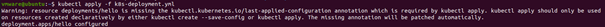

29. W panelu minikube widać wrożenie i cztery pody. Ten jeden pod, który był wcześniej uszkodzony usunąłem.

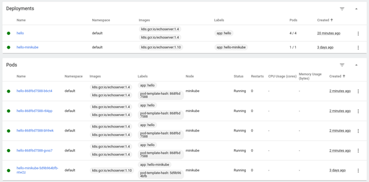
