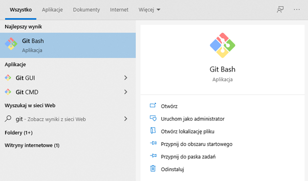
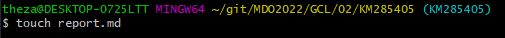

# Metodyki DevOps 2021/2022 NS
Zajęcia 01 - 2021-11-06
---
 
## 1. Instalacja git 

## 2. Sklonowanie repozytorium za pomocą HTTPS

## 3. Sklonowanie repozytorium za pomocą SSH

### Utworzenie 2 kluczy SSH Ed25519 i podpięcie pod github

### Sklonowanie repozytorium z wykorzystaniem SSH

## 4. Przełączenie na gałąż swojej grupy

## 5. Utworzenie gałęzi "inicjały & numer indeksu", w moim przypadku "KM285405"

## 6. Praca na nowej gałęźi

### Utworzenie nowego katalogu "KM285405"

### Dodanie pliku ze sprawozdaniem

### Dodanie zrzutów ekranu i wysłanie zmian

### Próba wyciągnięcia gałęzi do gałęzi grupowej