# Metodyki DevOps 2021/2022 NS
Zajęcia 02 - 2021-11-20
---
# Zestawienie środowiska
## 1. Instalacja Docker
Wykorzystywane środowisko to Debian na WSL2 - wymagało to również zainstalowania Docker Dekstop na windows, zgodnie z instrukcją: 
https://docs.docker.com/desktop/windows/wsl/

Zainstalowany Docker Desktop z integracją na WSL


Instalacja na środowisku linuksowym zgodnie z instrukcją:
https://docs.docker.com/engine/install/debian/


## 2. Rejestracja w Docker Hub


## 3. Pobierz hello-world, busybox, ubuntu

Do pobrania wykorzystuje się komendę: docker image pull, natomiast przy próbie uruchomienia nieistniejącego obrazu, Docke pobierze obraz automatycznie:


## 4. Busybox

Uruchomienie busybox:


Uruchomienie busybox interaktywnie i wywołanie numeru wersji


## 5. "system w kontenerze"

Uruchoemienie ubuntu


PID1 w kontenerze:


Procesy dockera na hoście:


Aktualizacja pakietów i wyjście z systemu:


## 6. Uruchomione kontenery


## 7. Czyszczenie obrazów


# Budowanie programu

## 1. Znajdź projekt umożliwiający łatwe wywołanie testów jednostkowych

Przykładowy projekt JavaScript Unit Testing Examples: https://github.com/MarcL/js-unit-testing-examples

## 2. Przeprowadź budowę/konfigurację środowiska

Projekct wymaga zainstalowania npm, więc należy wykonać:
```
sudo apt install npm
```
nastepnie pobrać repozytorium, zmienić katalog i zainstalować zależności projektu:
```
git clone https://github.com/MarcL/js-unit-testing-examples.git
cd js-unit-testing-framework
npm install
```

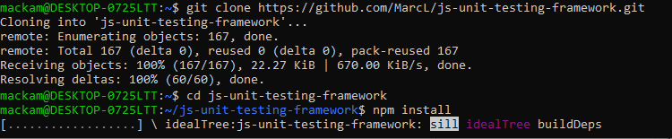

## 3. Uruchom testy
Uruchomienie testów:

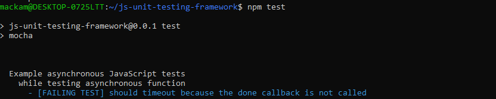

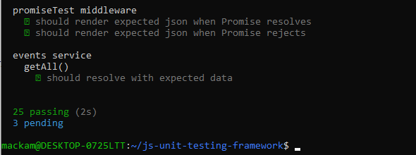

## 4. Ponów ten proces w kontenerze

Do ponowienie tego procesu w kontenerze, należy kolejno wykonać:

```
docker run -it ubuntu
apt update
apt install git
apt install npm

git clone https://github.com/MarcL/js-unit-testing-examples.git

cd js-unit-testing-examples
npm install

npm test
```
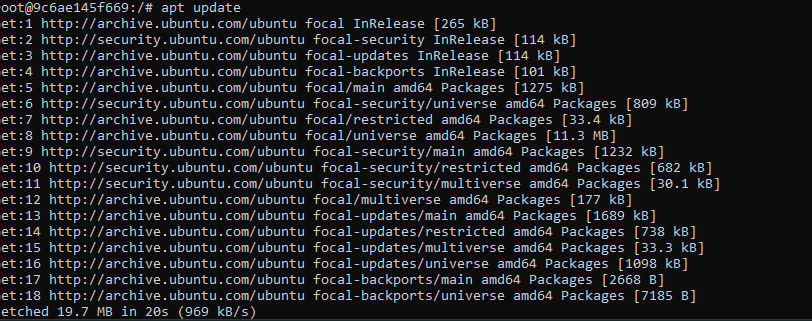

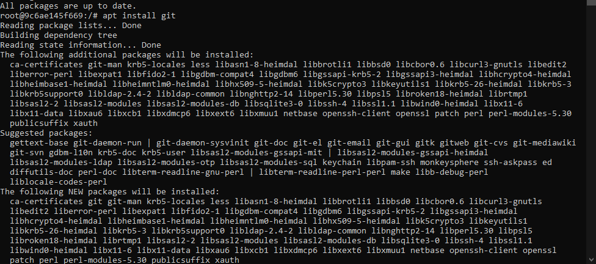

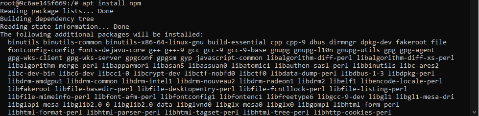

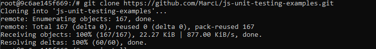

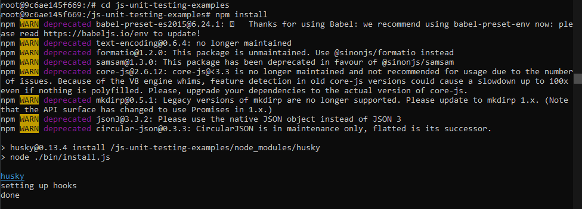

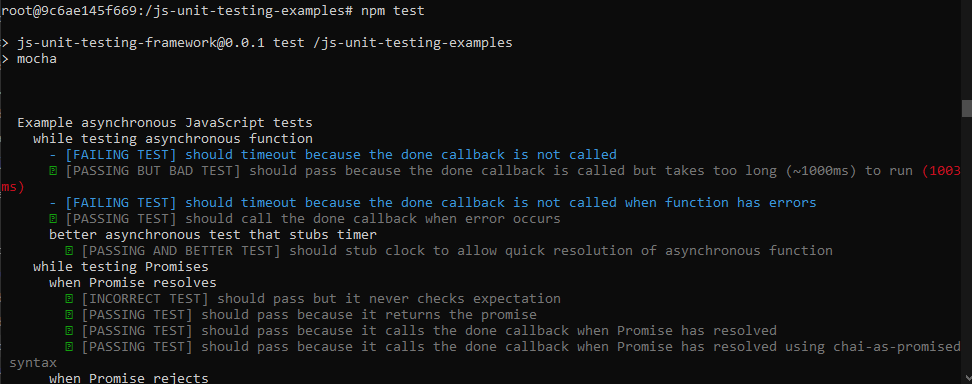

## 5. Stwórz Dockerfile, który ma to osiągnąć

Dockerfile będzie miał dokładnie te same komendy co powyżej, z dodaniem ```RUN``` przed każdą z nich  co spowoduje wywołanie komendy,
dzięki ```ARG DEBIAN_FRONTEND=noninteractive``` system nie będzie pytał o potwierdzenie operacji
```ENV TZ=Europe/Warsaw RUN apt-get install -y tzdata``` - pomijamy pytanie o 'geographic area'

```
FROM ubuntu

RUN apt update

ARG DEBIAN_FRONTEND=noninteractive
ENV TZ=Europe/Warsaw
RUN apt-get install -y tzdata

RUN apt install -y npm
RUN apt install -y git

RUN git clone https://github.com/MarcL/js-unit-testing-examples.git

RUN cd js-unit-testing-examples && npm install
```

## 6. Zaprezentuj Dockerfile i jego zbudowanie

wywołanie przez:
```docker build -t=obraz -f dockerfile .```

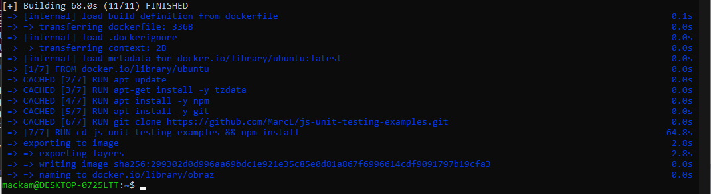


## 7. Na bazie obrazu utworzonego poprzednim dockerfilem stwórz kolejny, który będzie uruchamiał testy

Wystarczy zmodyfikować istniejący dockerfile przez dopisanie ```&& npm test```

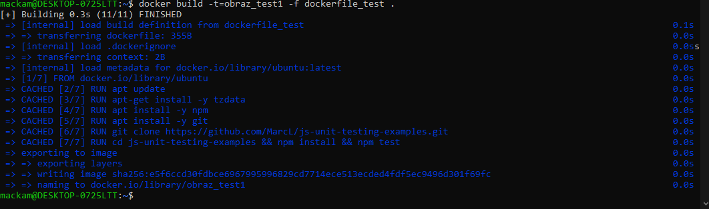
