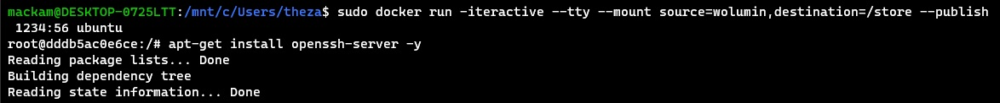
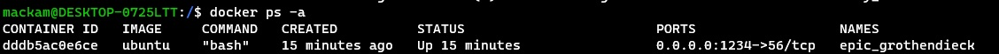

# Metodyki DevOps 2021/2022 NS
Zajęcia 03 - 2021-12-04
---
# Łączność i woluminy na podstawie "złych" praktyk
## Pobierz obraz Ubuntu


## Podłącz wolumin do kontenera


## Utwórz plik w kontenerze, na obszarze woluminu, pokaż na hoście


Utworzony plik powinien znajdować się w 

```/var/lib/docker/volumes/wolumin/_data```


Natomiast wykorzystująć WSL2 - taka lokalizacja nie istnieje, a wszystkie pliki są zapisywane na zasobie sieciowym ze ścieżką:

```\\wsl$\docker-desktop-data\version-pack-data\community\docker\volumes\wolumin\_data```

Żeby się do nich dostać, należy zmapować dysk sieciowy w windows i to samo powtórzyć dla linuksa


Dopiero wtedy mamy pełen dostęp do plików


## Skopiuj plik do katalogu woluminu, pokaż w kontenerze


# "Kiepski pomysł": SSH

## Uruchom, wyeksponuj wybrany port w kontenerze, zainstaluj w kontenerze serwer ssh

```apt-get update```

```apt-get -y install openssh-server ```






## zezwól na logowanie root
## umieść klucz publiczny w woluminie, skopiuj go do pliku zaufanych w kontenerze
## odnajdź adres IP kontenera w wewnętrznej sieci
## uruchom usługę, połącz się z kontenerem
