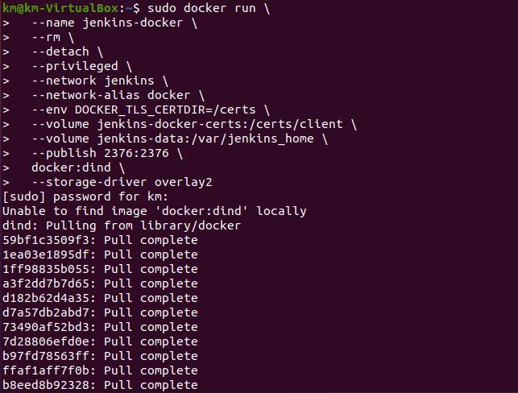
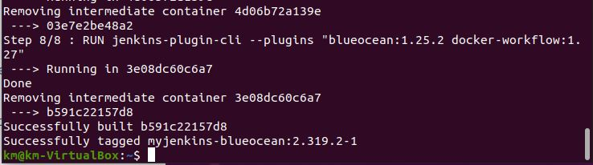

# Metodyki DevOps 2021/2022 NS
Zajęcia 03 - 2021-12-04
---
# Łączność i woluminy na podstawie "złych" praktyk
## Pobierz obraz Ubuntu


## Podłącz wolumin do kontenera


## Utwórz plik w kontenerze, na obszarze woluminu, pokaż na hoście


Utworzony plik powinien znajdować się w 

```/var/lib/docker/volumes/wolumin/_data```


Natomiast wykorzystująć WSL2 - taka lokalizacja nie istnieje, a wszystkie pliki są zapisywane na zasobie sieciowym ze ścieżką:

```\\wsl$\docker-desktop-data\version-pack-data\community\docker\volumes\wolumin\_data```

Żeby się do nich dostać, należy zmapować dysk sieciowy w windows i to samo powtórzyć dla linuksa


Dopiero wtedy mamy pełen dostęp do plików


## Skopiuj plik do katalogu woluminu, pokaż w kontenerze


W tym momencie, niestety musialem zmienić środowisko z WSL2 na VirtualBox

# "Kiepski pomysł": SSH

## Uruchom, wyeksponuj wybrany port w kontenerze, zainstaluj w kontenerze serwer ssh

```sudo docker run --interactive --tty --mount source=wolumin,destination=/store --publish 2048:4000 ubuntu```

następnie:

```apt-get update```

```apt-get -y install openssh-server ```


mkdir /run/sshd

## zezwól na logowanie root i zmień port >1024

Aby zezwolić na logowanie root i zmienić port, należy zmodyfikować plik sshd_config, można do tego wykorzystać np. nano

```apt install nano```

```nano /etc/ssh/sshd_config```


## umieść klucz publiczny w woluminie, skopiuj go do pliku zaufanych w kontenerze

Klucz utworzony i przeniesiony do root/.ssh


## odnajdź adres IP kontenera w wewnętrznej sieci

```apt-get install net-tools```

```ifconfig```


## uruchom usługę, połącz się z kontenerem


# Skonteneryzowany Jenkins stosujący Dockera

## Przygotowanie
* Upewnij się, że Dockerfiles i Docker Compose z poprzednich zajęć są w repozytorium
* Zapoznaj się z instrukcją https://www.jenkins.io/doc/book/installing/docker
  * Uruchom obraz Dockera który eksponuje środowisko zagnieżdżone



  * Przygotuj obraz blueocean na podstawie obrazu jenkinsa - dockerfile z dokumentacji
  

  
```docker build -t myjenkins-blueocean:2.319.2-1 .```

  
  
  
  
  * Uruchom blueocean
  
  
  
  * Zaloguj się i skonfiguruj Jenkins
  
  
  
  
  
  wymagane hasło dostępne przez:
  
  ```docker logs```
  
  
  
  
  
   

#### Mikro-projekt Jenkins
* Utwórz projekt, który wyświetla uname

  
  
  

  
  
  
    
  
  
  
* Utwórz projekt, który zwraca błąd, gdy... godzina jest nieparzysta 

Należy powtórzyć wszystkie kroki, jak w poprzednim 'projekcie', tym razem jako komendę podająć np.:

 
  
  Wynmik dla godziny nieparzystej:
  
  
  
  dla parzystej:
   
  

* Utwórz "prawdziwy" projekt, który:
  * klonuje nasze repozytorium
  * przechodzi na osobistą gałąź
  * buduje obrazy z dockerfiles i/lub komponuje via docker-compose
 Projekt został przygotowany:


Niestety kończy się błędem:


  

