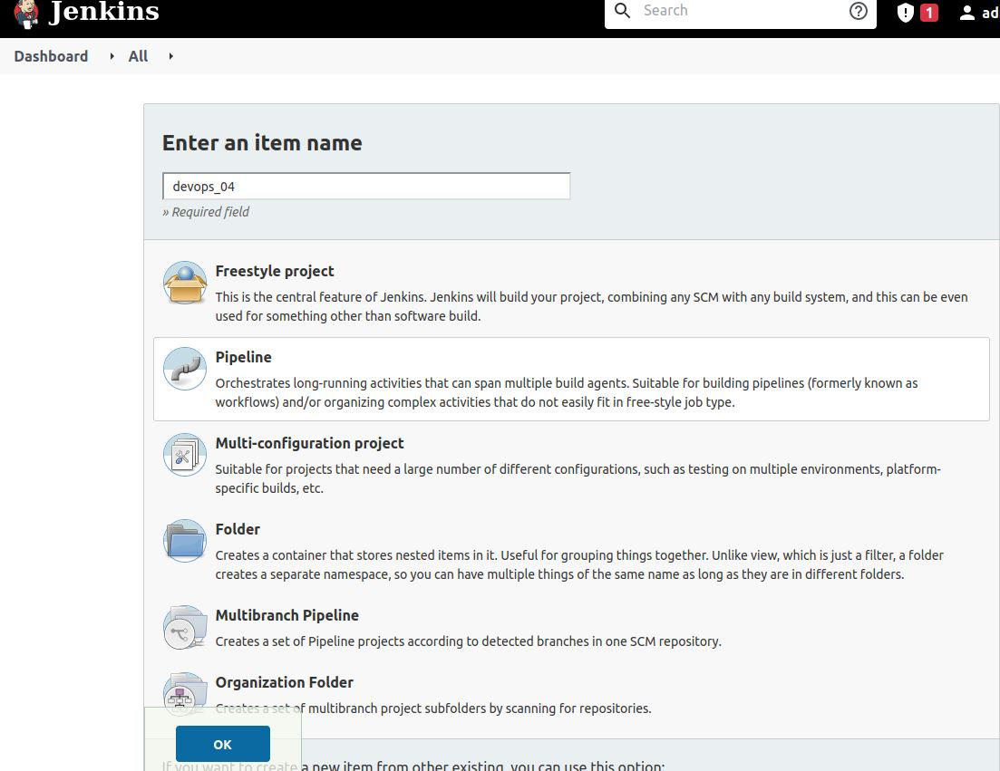
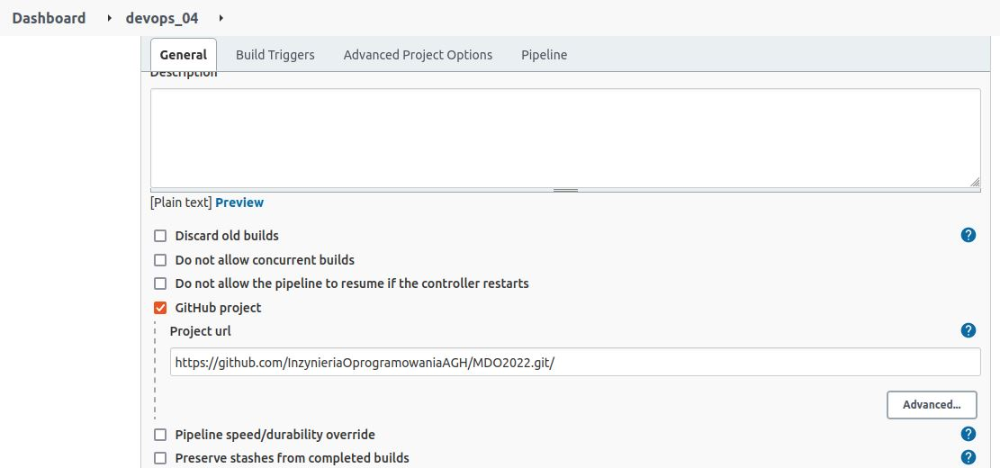
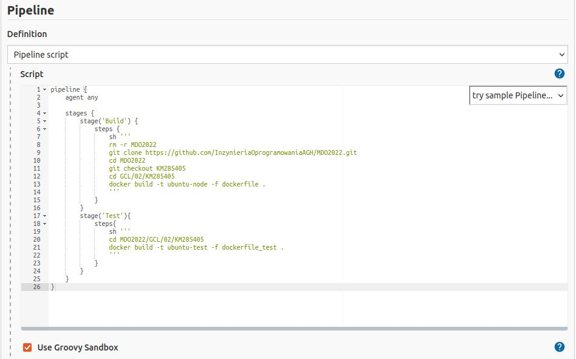
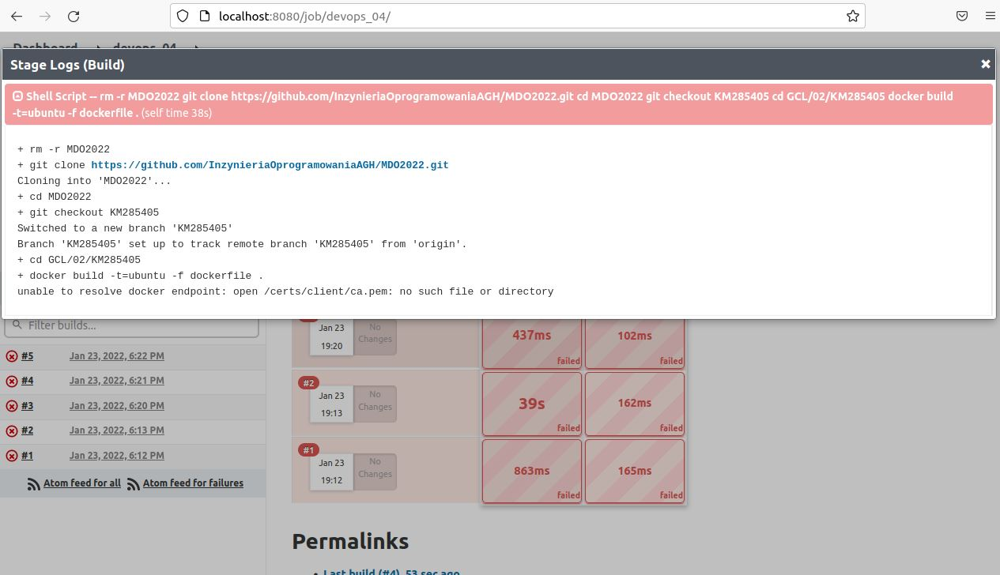

# Metodyki DevOps 2021/2022 NS
Zajęcia 04
---
 
# Stwórz Jenkinsfile: opis
 * Utwórz nowy pipeline budujący wybraną aplikację, oparty o Jenkinsfile
 * Docelowo, ma zawierać etapy "Build" i "Test"
 * Przejściowo, może zawierać jeden etap "Build + Test"

Tworzymy pipeline:

Wykorzystujący dockerfile z repozytorium:

Co niestety kończy się błędem, którego nie udało mi się póki co rozwiązać

