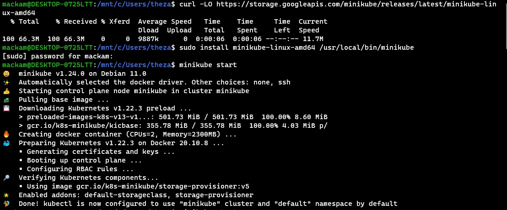
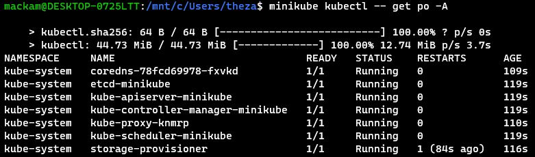
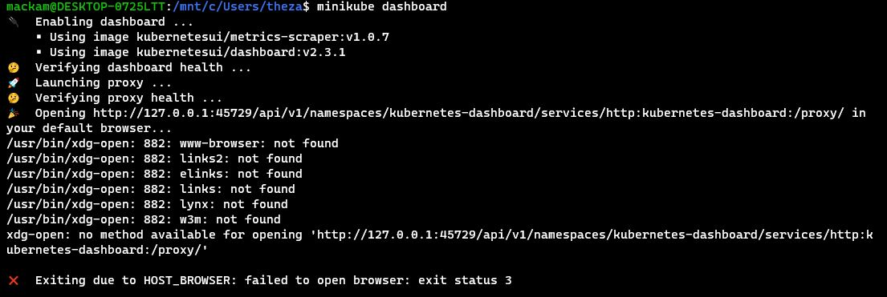
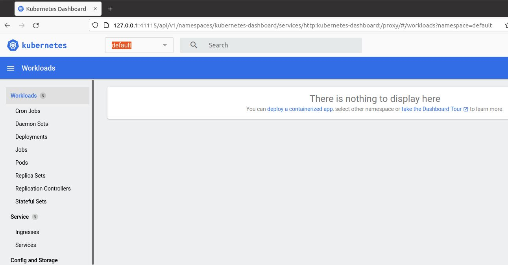

# Metodyki DevOps 2021/2022 NS
Zajęcia 05 - 2021-01-15
---
# Zestawienie platformy Kubernetes
## Zainstaluj minikube i kubectl

Instalacja przebiegła bez problemu, aż do momentu sprawdzenia minikube dashboard - gdzie otrzymujemy:

Praca z WSL2 wymaga dodatkowego przygotowanie środowiska, natmoiast w tym momencie musiałem zmienić środowisko na VirtualBox

Instalacja przebiegła bez problemu, minikube dashboard również działa:

